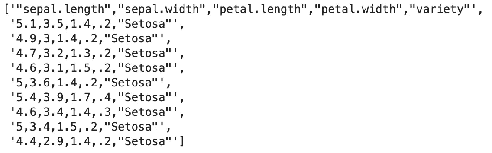
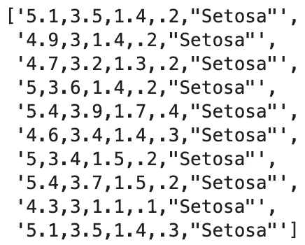
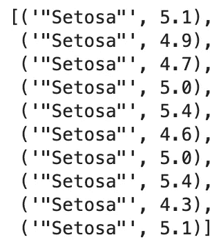
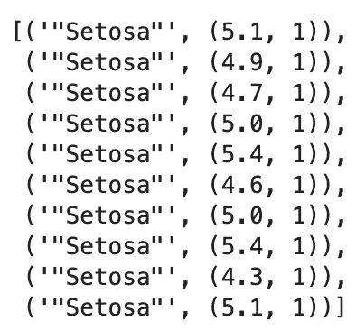
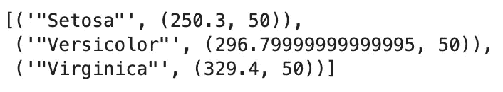
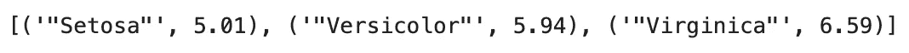
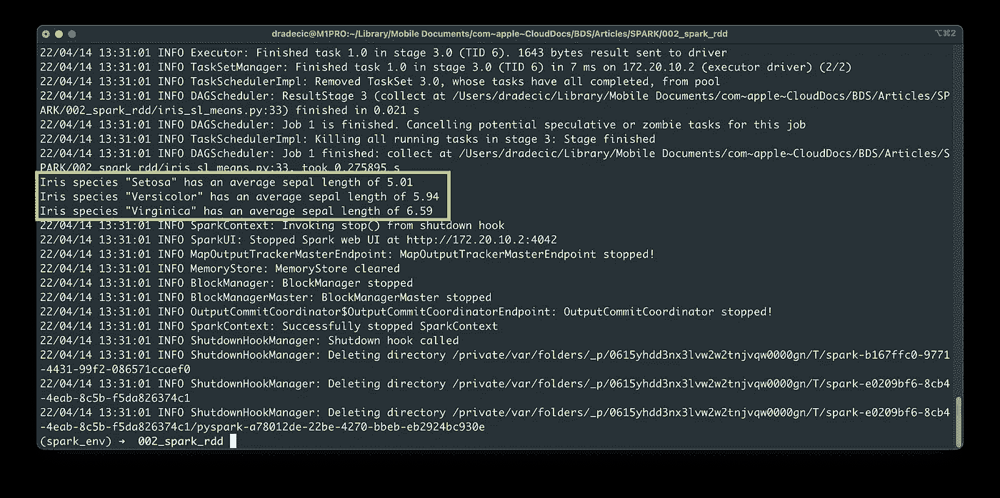

# Apache Spark for Data Science —如何使用 Spark RDDs

> 原文：<https://towardsdatascience.com/apache-spark-for-data-science-how-to-work-with-spark-rdds-ff4172ff01f9>

## **Spark 基于弹性分布式数据集(RDD)——确保你知道如何使用它们**


照片由 [NANDKUMAR PATEL](https://unsplash.com/@kaps3666?utm_source=medium&utm_medium=referral) 在 [Unsplash](https://unsplash.com?utm_source=medium&utm_medium=referral) 上拍摄

rdd，或*弹性分布式数据集*是 Apache Spark 中的核心对象。它们是 Spark 用于快速有效的 MapReduce 操作的主要抽象。顾名思义，这些数据集是弹性的(容错的)和分布式的(可以分布在集群的不同节点上)。

谈到 Spark 中的 rdd，有很多东西需要学习，我今天不打算介绍。如果你对理论和内部工作原理感兴趣，请参考 [XenonStack](https://www.xenonstack.com/blog/rdd-in-spark/) 的这篇介绍性文章。

那么，我们今天要做什么？我们将亲自处理 Spark RDDs。我们将编写一个完整的 Spark 脚本来处理[虹膜数据集](https://gist.githubusercontent.com/netj/8836201/raw/6f9306ad21398ea43cba4f7d537619d0e07d5ae3/iris.csv)的值。更准确地说，我们将计算不同物种的萼片长度属性的平均值。这感觉就像每周去杂货店买一辆赛车，但是在这个过程中你会学到很多东西。

如果您需要在 Python 中安装 Apache Spark 的参考资料，请不要犹豫:

[](/apache-spark-for-data-science-how-to-install-and-get-started-with-pyspark-6367a1ea3de8)  

和往常一样，我以视频格式讲述了相同的主题，如果你喜欢的话:

# 如何读取一个文本文件作为一个火花 RDD

和往常一样，您必须做的第一件事是初始化一个新的 Spark 会话。使用以下代码片段作为本地环境的参考:

```
from pyspark import SparkConf, SparkContextconf = SparkConf().setMaster("local").setAppName("IrisSLMeans")
sc = SparkContext(conf=conf)
```

从这里，使用`textFile()`方法从磁盘中读取一个文本文件。记得把`file://`放在路径前面，否则 Spark 就找不到它了:

```
iris = sc.textFile("file:///Users/dradecic/Desktop/iris.csv")
iris.collect()[:10]
```

`collect()`操作方法用于从 RDD 中获取结果——在本例中，它打印前十行:



图 1 —用 Spark 读取文本文件(图片由作者提供)

**问题** —文本文件包含一个我们不需要的标题行。当只使用 Spark RDDs 时，没有明显的方法来消除它。您可以做的是:

1.  通过调用`iris.first()`提取标题行。
2.  标题行现在是一个普通的 Python 字符串——我们需要将其转换成 Spark RDD。使用`parallelize()`方法将本地 Python 集合分发到 RDD。
3.  使用`subtract()`方法，从数据集中减去标题。

下面是它在代码中的样子:

```
iris_header = iris.first()
iris_header = sc.parallelize([iris_header])
iris = iris.subtract(iris_header)
iris.collect()[:10]
```



图 2 —删除 Spark 中的标题行(图片由作者提供)

这是我们可以解决的问题。Spark 将整行视为一个字符串。本质上，我们有一个包含 150 个字符串的 RDD。接下来让我们看看如何解析这些值。

# 如何用 Spark 解析逗号分隔的值

我们的 RDD 的值由逗号分隔。要获得单个值(就像在 Pandas 中一样)，我们必须在逗号符号上分割线。从那里，我们将提取并返回物种和萼片长度值作为一个元组。

描述的逻辑将存储在一个名为`parse_input()`的 Python 函数中:

```
def parse_input(line: str) -> tuple:
    cols = line.split(",")
    sepal_length = float(cols[0])
    species = str(cols[-1])
    return (species, sepal_length)
```

现在火花的美丽变得可见。我们将调用`map()`方法，并将我们的函数作为参数传递:

```
iris_parsed = iris.map(parse_input)
iris_parsed.collect()[:10]
```



图 3 —在 Spark 中使用自定义 map()函数(图片由作者提供)

RDD 现在看起来有点不同——每个值都是一个元组，包含一个字符串和一个浮点数。这就是我们计算每种花的平均值所需要的。

# Python 中的基本 Spark MapReduce 任务

在 Spark 中，您经常会发现 map 和 reduce 任务被链接在一行代码中。对初学者来说可能会很困惑，所以我就不多说了。

最终目标是将萼片长度值与物种总数相加。例如，我们希望看到`("Setosa", (250.3, 50))`，这意味着 50 朵 Setosa 物种的花的萼片总长度为 250.3。

说起来容易做起来难。

第一步是将`x`转换为`(x, 1)`。这样，我们可以在 reduce 任务中跟踪每个物种的总萼片长度和总花数。使用 Python 的`lambda`函数完成任务:

```
iris_sl_totals = iris_parsed.mapValues(lambda x: (x, 1))
iris_sl_totals.collect()[:10]
```



图 4 —在 Spark 中使用 mapValues()函数(图片由作者提供)

现在到了棘手的部分。减少操作需要将萼片长度测量值和计数相加。为此，使用`reduceByKey()`方法并指定另一个`lambda`函数:

```
iris_sl_totals = iris_parsed.mapValues(lambda x: (x, 1)).reduceByKey(lambda x, y: (x[0] + y[0], x[1] + y[1]))
iris_sl_totals.collect()
```

您可以看到萼片长度和计数的汇总结果:



图 5 — MapReduce 结果(图片由作者提供)

要计算平均值，只需再次调用`mapValues()`并用总萼片长度除以计数。我还将结果四舍五入到小数点后两位:

```
iris_sl_means = iris_sl_totals.mapValues(lambda x: round(x[0] / x[1], 2))
result = iris_sl_means.collect()
result
```



图 6——每个物种的萼片长度平均值(图片由作者提供)

您可以访问这个结果对象来漂亮地打印这些值:

```
for val in result:
    print(f"Iris species {val[0]} has an average sepal length of {val[1]}")
```


图 7——每个物种漂亮印刷的萼片长度平均值(图片由作者提供)

这就是 Spark 和 Python 中基本的 MapReduce 操作。接下来，我们将把整个逻辑封装到一个 Python 脚本中。

# 编写并执行 Spark 脚本

创建一个新的 Python 脚本——我将我的脚本命名为`iris_sl_means.py`,并粘贴上一节中的代码——没有调用`collect()`:

```
from pyspark import SparkConf, SparkContextconf = SparkConf().setMaster("local").setAppName("IrisSLMeans")
sc = SparkContext(conf=conf) def parse_input(line: str) -> tuple:
    cols = line.split(",")
    sepal_length = float(cols[0])
    species = str(cols[-1])
    return (species, sepal_length) if __name__ == "__main__":
    # 1\. Read the text file
    iris = sc.textFile("file:///Users/dradecic/Desktop/iris.csv")

    # 2\. Remove the header row
    iris_header = iris.first()
    iris_header = sc.parallelize([iris_header])
    iris = iris.subtract(iris_header)

    # 3\. Parse the input
    iris_parsed = iris.map(parse_input)

    # 4\. Calculate totals - sum of all sepal_length values per flower species
    iris_sl_totals = iris_parsed.mapValues(lambda x: (x, 1)).reduceByKey(lambda x, y: (x[0] + y[0], x[1] + y[1]))

    # 5\. Calculate means - Divide the total by the number of instances
    iris_sl_means = iris_sl_totals.mapValues(lambda x: round(x[0] / x[1], 2))

    # 6\. Wrap into a result
    result = iris_sl_means.collect()

    # Print
    for val in result:
        print(f"Iris species {val[0]} has an average sepal length of {val[1]}")
```

从终端运行脚本:

```
spark-submit iris_sl_means.py
```



图 8 —从 shell 运行 Spark 脚本(图片由作者提供)

我忘了配置 Spark 现在显示信息日志消息，所以为不必要的详细输出道歉。然而，您可以在笔记本中看到与前面相同的结果。

# Python 中 Spark RDDs 概述

今天，您已经学习了 Spark 和 Python 中 rdd 的基础知识。RDDs 不是一天就能学会的概念。它们背后有很多理论，如果你不习惯在一行中看到这么多 lambda 函数，语法可能会让人不知所措。

幸运的是，你可以在笔记本上摆弄 rdd，随时给`collect()`打电话。通过这样做，您可以看到每次函数调用后发生了什么。希望这足以让你明白其中的逻辑。

在下面的文章中，您将学习如何用 Spark 和 Python 解决经典的字数问题，敬请关注。

*喜欢这篇文章吗？成为* [*中等会员*](https://medium.com/@radecicdario/membership) *继续无限制学习。如果你使用下面的链接，我会收到你的一部分会员费，不需要你额外付费。*

[](https://medium.com/@radecicdario/membership)  

## 推荐阅读

*   [学习数据科学先决条件(数学、统计和编程)的 5 本最佳书籍](https://betterdatascience.com/best-data-science-prerequisite-books/)
*   [2022 年学习数据科学的前 5 本书](https://betterdatascience.com/top-books-to-learn-data-science/)
*   [用 Python 打印列表的 7 种方法](https://betterdatascience.com/python-list-print/)

## 保持联系

*   雇用我作为一名技术作家
*   订阅 [YouTube](https://www.youtube.com/c/BetterDataScience)
*   在 [LinkedIn](https://www.linkedin.com/in/darioradecic/) 上连接

*原载于 2022 年 4 月 14 日*[*【https://betterdatascience.com】*](https://betterdatascience.com/apache-spark-rdd-basics/)*。*