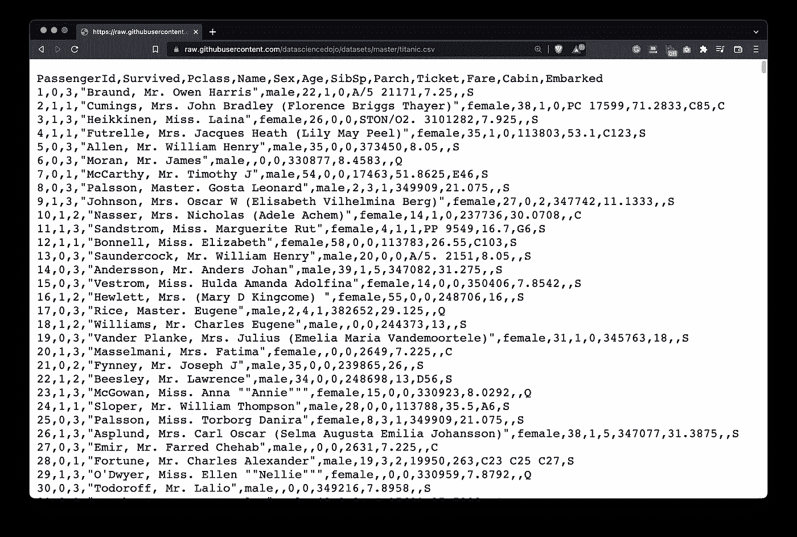
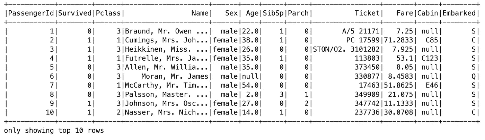
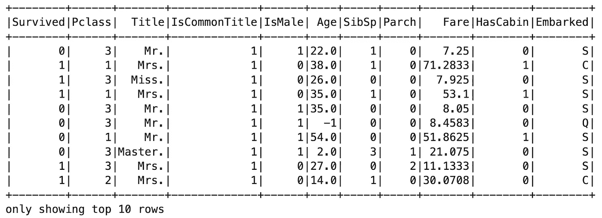
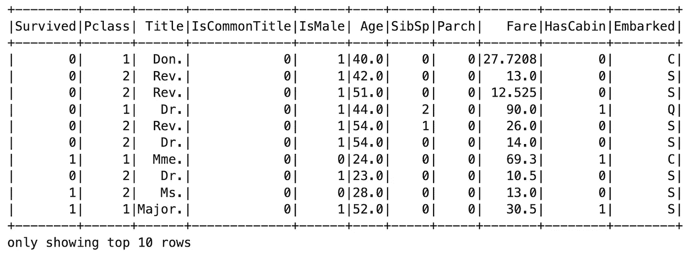

# Apache Spark for Data Science:用户定义函数(UDF)，已解释

> 原文：<https://towardsdatascience.com/apache-spark-for-data-science-user-defined-functions-udf-explained-6c9d913839bb>

## **你觉得 Python 比 SQL 简单？PySpark 中的用户自定义函数可能就是您正在寻找的**


照片由 [SpaceX](https://unsplash.com/@spacex?utm_source=medium&utm_medium=referral) 在 [Unsplash](https://unsplash.com?utm_source=medium&utm_medium=referral) 上拍摄

数据科学家不一定是最好的 SQL 用户。也许你精通 Python，但是你不知道如何将这些知识转化成 SQL。这不应该阻止你利用 Spark 和 PySpark 所提供的一切。

使用用户定义函数(UDF)，您可以用 Python 编写函数，并在编写 Spark SQL 查询时使用它们。今天，我将向您展示如何声明和注册 5 个 Python 函数，并使用它们来清理和重新格式化众所周知的 Titanic 数据集。在文章的最后，您还将学习如何在使用 UDF 之后过滤掉记录。

不想看书？请观看我的视频:

# 使用的数据集和 Spark 会话初始化

为了使事情更加简单，我们将使用泰坦尼克号数据集，在[知识共享许可](https://www.openml.org/search?type=data&sort=runs&id=40945&status=active)下许可。从[这个网址](https://raw.githubusercontent.com/datasciencedojo/datasets/master/titanic.csv)下载并保存在你记得的地方:



图片 1 —泰坦尼克号数据集(图片由作者提供)

该数据集比 Iris 数据集包含更多的功能。这些以后会派上用场的。但首先，让我们看看如何加载它的火花。

如果您在笔记本环境中使用 PySpark，请始终使用此代码片段以获得更好的输出格式。否则，如果一次在屏幕上看到的列太多，数据帧可能会溢出:

```
from IPython.core.display import HTML
display(HTML("<style>pre { white-space: pre !important; }</style>"))
```

解决了这个问题后，我们可以初始化一个新的 Spark 会话:

```
from pyspark.sql import SparkSession spark = SparkSession.builder.appName("spark-sql").getOrCreate()
```

要读取 CSV 文件，只需指定`read`模块的`csv()`函数的路径。每当读取 CSV 文件时，`inferSchema`和`header`参数是强制性的。如果没有它们，Spark 会将所有数据类型转换为 string，并将标题行视为实际数据:

```
titanic = spark.read.csv(
    path="file://<dataset-path>", 
    inferSchema=True, 
    header=True
)
titanic.show(10)
```



图片 2 —泰坦尼克号数据集的前 10 行(图片由作者提供)

现在，让我们来声明我们的第一个用户定义函数。

# 如何在 Spark 和 Python 中声明用户定义函数(UDF)

您可以像声明任何其他 Python 函数一样声明用户定义的函数。当你用 Spark 注册一个 Python 函数时，技巧就来了，但是稍后会详细介绍。

我们的第一个函数将从乘客姓名中提取标题。所有名字的标题从第一个逗号后开始，并在其后包含一个单词。通过链接两个`split()`函数很容易提取它:

```
def extract_title(name):
    return name.split(', ')[-1].split()[0]extract_title("Braund, Mr. Owen Harris")>>> 'Mr.'
```

光是标题就不是机器学习友好的属性。我们需要一个新的二进制属性，如果这个人的头衔很常见(小姐、先生、夫人和主人)，则该属性的值为 1，否则为 0:

```
def is_common_title(title):
    return 1 if title in ["Miss.", "Mr.", "Mrs.", "Master."] else 0is_common_title("Dr.")>>> 0
```

`Sex`列是另一个需要转换的属性。如果`Sex`为“阳性”，则`remap_gender()`函数返回 1，否则返回 0:

```
def remap_gender(gender):
    return 1 if gender == "male" else 0remap_gender("female")>>> 0
```

泰坦尼克号数据集充满了缺失值，属性`Cabin`也不例外。问题是，不是所有的乘客都有专用的客舱，或者他们的客舱号码不知道。我们将声明一个函数，如果乘客有客舱则返回 1，否则返回 0:

```
def has_cabin(cabin):
    return 1 if cabin else 0has_cabin("")>>> 0
```

最后，我们将编写一个输入乘客年龄的函数。与前面的函数不同，这个函数接受两个参数:

*   `age` -来自数据集的传入值，可以是数字或 Null。
*   `value` -我们将把`age`替换为。

逻辑很简单——如果`age`缺失，返回`value`，否则返回`age`:

```
def replace_missing_age(age, value):
    return age if age else valuereplace_missing_age(15, -1)>>> 15
```

这些都是从函数声明端开始的，现在是时候在 Spark 中使用它们了。为此，您必须首先通过`spark.udf.register()`功能注册它们。它接受两个参数:

*   `name` -一个字符串，您将在 SQL 查询中使用的函数名。
*   `f` -包含编程逻辑的 Python 函数。

为两个参数赋予相同的值是一种常见的做法，只是为了避免以后混淆:

```
spark.udf.register("extract_title", extract_title)
spark.udf.register("is_common_title", is_common_title)
spark.udf.register("remap_gender", remap_gender)
spark.udf.register("has_cabin", has_cabin)
spark.udf.register("replace_missing_age", replace_missing_age)
```

就这样——您现在可以在 Spark SQL 中使用这些 Python 用户声明的函数了！

# 如何在 Spark SQL 中使用用户自定义函数

如果您已经阅读了我在 Spark 文章中的[对 SQL 的介绍，您应该知道您首先必须在数据帧上创建一个临时视图。这是通过调用`createOrReplaceTempView()`函数并传入一个视图名(任意一个)来完成的:](https://betterdatascience.com/apache-spark-sql/)

```
titanic.createOrReplaceTempView("titanic")
```

创建后，在对`spark.sql()`的调用中传递任何 SQL 语句。下面的例子使用了我们所有的五个用户定义函数:

```
spark.sql("""
    SELECT
        Survived,
        Pclass,
        extract_title(Name) AS Title,
        is_common_title(extract_title(Name)) AS IsCommonTitle,
        remap_gender(Sex) as IsMale,
        replace_missing_age(Age, -1) as Age,
        SibSp,
        Parch,
        Fare,
        has_cabin(Cabin) as HasCabin,
        Embarked
    FROM titanic
""").show(10)
```



图 3 —在 PySpark 中使用用户定义的函数(图片由作者提供)

如您所见，我们的函数非常好用！我已经将`replace_missing_gender()`设置为用-1 替换任何丢失的值，但是您可以随意更改。你也可以将函数链接在一起，如`is_common_title(extract_title(Name))` call 所示。

**但你知道问题是什么吗？**在幕后，Spark 为 UDF 结果的列任意命名，即使我们已经明确指定了别名。这是一个问题，因为你不能使用`WHERE`关键字根据条件过滤掉记录。

相反，您可以将整个查询包装在另一个查询(子查询)中，然后随心所欲地使用 SQL:

```
spark.sql("""
    SELECT * FROM (
        SELECT
            Survived,
            Pclass,
            extract_title(Name) AS Title,
            is_common_title(extract_title(Name)) AS IsCommonTitle,
            remap_gender(Sex) as IsMale,
            replace_missing_age(Age, -1) as Age,
            SibSp,
            Parch,
            Fare,
            has_cabin(Cabin) as HasCabin,
            Embarked
        FROM titanic
    ) WHERE IsCommonTitle = 0
""").show(10)
```



图 4 —带有附加过滤器的用户定义函数(图片由作者提供)

现在你可以看到，只有不常见的乘客标题记录显示。大部分是年长的男性，这是意料之中的。

# PySpark 中用户定义函数的总结

今天你已经学习了如何在 Python 和 Spark 中使用用户定义的函数(UDF)。如果您每天都在使用 Python，并且不是 SQL 的狂热爱好者，这将是一个巨大的里程碑。当然，这些不能代替足够的 SQL 知识，但是没有人能阻止你使用它们。

有些事情在 Python 中更容易完成，当时间非常重要时，UDF 确保您不会浪费时间去计算 SQL 命令。只需记住使用 UDF 所需的步骤:

1.  声明一个 Python 函数
2.  向 Spark 注册 Python 函数
3.  使用 Spark SQL 语句中的函数

就这么简单！接下来，您将学习如何将机器学习算法应用于该数据集，敬请关注。

*喜欢这篇文章吗？成为* [*中等会员*](https://medium.com/@radecicdario/membership) *继续无限制学习。如果你使用下面的链接，我会收到你的一部分会员费，不需要你额外付费。*

<https://medium.com/@radecicdario/membership>  

## 推荐阅读

*   [学习数据科学先决条件(数学、统计和编程)的 5 本最佳书籍](https://betterdatascience.com/best-data-science-prerequisite-books/)
*   [2022 年学习数据科学的前 5 本书](https://betterdatascience.com/top-books-to-learn-data-science/)
*   [用 Python 打印列表的 7 种方法](https://betterdatascience.com/python-list-print/)

## 保持联系

*   雇用我作为一名技术作家
*   在 [YouTube](https://www.youtube.com/c/BetterDataScience) 上订阅
*   在 [LinkedIn](https://www.linkedin.com/in/darioradecic/) 上连接

*原载于 2022 年 4 月 26 日 https://betterdatascience.com*<https://betterdatascience.com/spark-user-defined-functions/>**。**