# 使用 Jmeter 进行 API 性能测试

> 原文：<https://towardsdatascience.com/api-performance-testing-using-jmeter-d873b99f2d32>

## 通过自动化测试最大限度地提高效率和可靠性


使用稳定扩散创建

API 性能测试在数据科学中的重要性有几个原因。

1.  **速度**:在许多数据科学应用中，API 性能至关重要，因为 API 可能会执行计算开销很大的任务或处理大量数据。糟糕的 API 性能会导致系统运行缓慢或无响应，这会让用户感到沮丧，并对数据科学管道的整体效率产生负面影响。
2.  **可伸缩性** : API 性能测试可以帮助识别瓶颈或其他问题，这些问题可能会阻止 API 扩展以满足不断增长的用户群或更大数据集的需求。
3.  **可靠性**:通过测试 API 的性能，您可以确保它是可靠的，并且能够处理它所设计的工作负载。这在任务关键型应用程序中尤其重要，因为在这些应用程序中，API 停机或缓慢的性能会带来严重的后果。
4.  **调试**:性能测试还有助于识别和排除 API 的问题，比如内存泄漏或其他可能导致性能下降的问题。

JMeter 是一个流行的开源工具，可以用来测试 API 和其他类型的 web 应用程序的性能。它旨在模拟大量用户向服务器发出请求，并可用于测量服务器在负载下的性能。

在这篇文章中，我将向您展示如何为 post 创建测试计划，并以最简单的方式获取 API。

# 装置

要安装和运行 JMeter，请按照下列步骤操作:

1.  从 [Apache JMeter 网站](https://jmeter.apache.org/download_jmeter.cgi)下载 JMeter 的最新版本。
2.  将下载的存档文件解压缩到您计算机上的某个位置。
3.  运行**JMeter . bat**(Windows)或**JMeter**(Unix)文件。这些文件可以在 **bin** 目录下找到。

这将启动 JMeter 图形用户界面。

注意:为了运行 JMeter，您可能需要在系统上安装 Java。如果没有安装 Java，可以从[甲骨文网站](https://www.oracle.com/java/technologies/javase-downloads.html)下载。

如果您使用的是 **MAC OS，**您可以使用运行以下程序的自制软件轻松安装 Jmeter:

```
brew install jmeter
```

然后，您可以通过运行以下命令来打开它:

```
open /opt/homebrew/bin/jmeter
```

或者

```
open /usr/local/bin/jmeter
```

# 为 GET API 创建一个测试计划

对于这个例子，我在本地运行一个 GET API，它位于 **127.0.0.1:8000** 中，返回短语“Hello World”。现在，我们想使用 Jmeter 测试这个 API，所以我们需要创建一个测试计划。

要在 JMeter 中为 GET API 创建一个简单的测试计划，您可以遵循以下步骤:

1.  启动 JMeter 并创建一个新的测试计划，方法是点击左侧树中的“测试计划”节点，然后选择“添加”>“线程(用户)”>“线程组”。

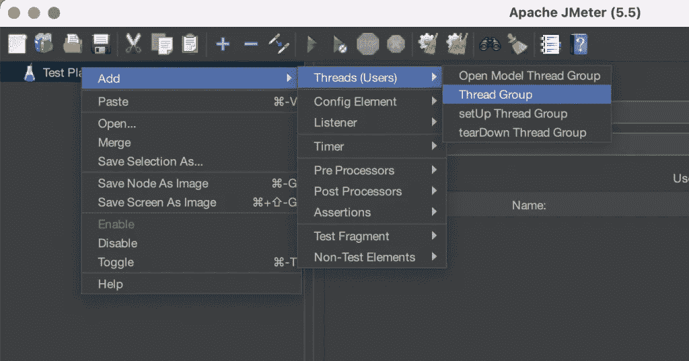

2.通过右键单击左侧树中的“线程组”节点，然后选择“添加”>“采样器”>“HTTP 请求”来添加 HTTP 请求。这是设置 API 信息的地方(URL、端口等。).

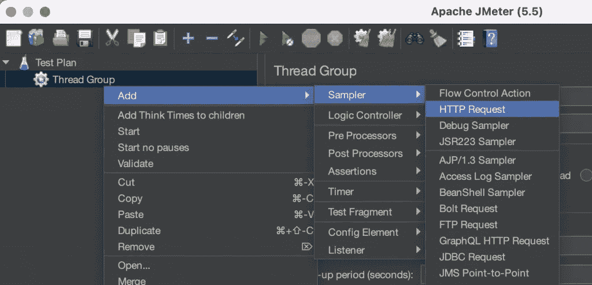

3.通过右键单击“HTTP 请求”节点，然后选择“添加”>“侦听器”>“查看结果树”来添加结果树。这允许您以树的形式查看测试运行的结果。它显示了测试计划中每个采样器(“用户”)的请求和响应数据。

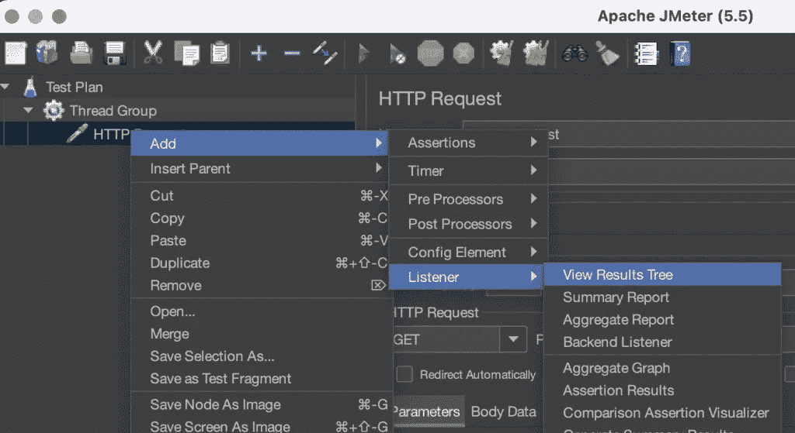

4.通过右键单击“HTTP 请求”节点，然后选择“添加”>“侦听器”>“摘要报告”来添加摘要报告。这提供了测试运行的性能摘要。它显示一系列指标，包括样本数量、平均响应时间、吞吐量和错误百分比。

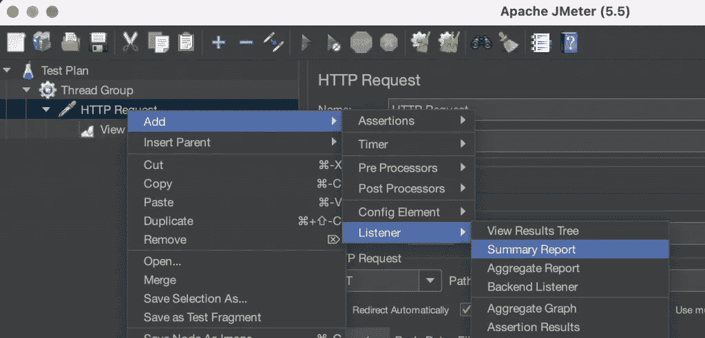

# 设置和运行测试

在 HTTP 请求中，你必须设置 URL 中的“服务器名或 IP”和端口号。另外，您必须设置 HTTP 请求来获取 API。

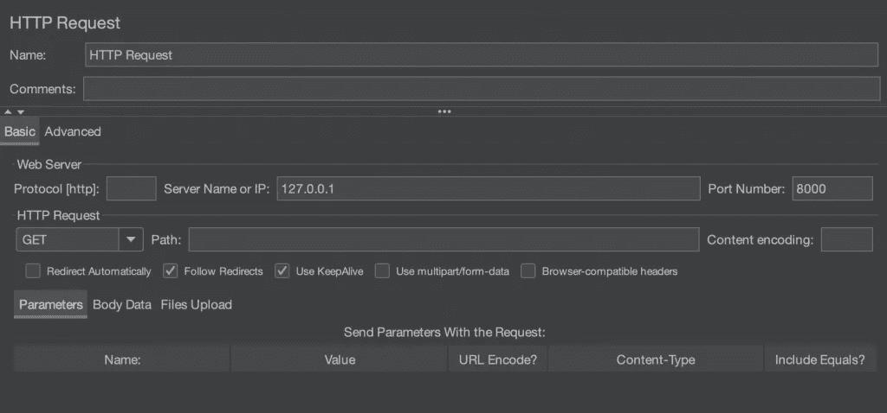

在线程组中，您可以设置线程的数量，这意味着有多少用户将调用 API。上升期是 JMeter 将线程(虚拟用户)数量上升到所需水平所需的时间。它以秒为单位。例如，如果一个线程组的上升周期为 60 秒，线程(用户)数为 10，那么 JMeter 需要 60 秒的时间将线程数从 0 上升到 10。此外，您可以设置循环计数，这是线程组调用 API 的周期数。

对于这个例子，我希望 1 个用户连续调用 API 10 次。这就是为什么我把线程数设为 1，循环数设为 10。

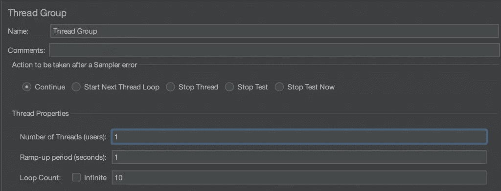

现在我们准备运行测试。点击“运行”>“开始”。让我们看看结果。

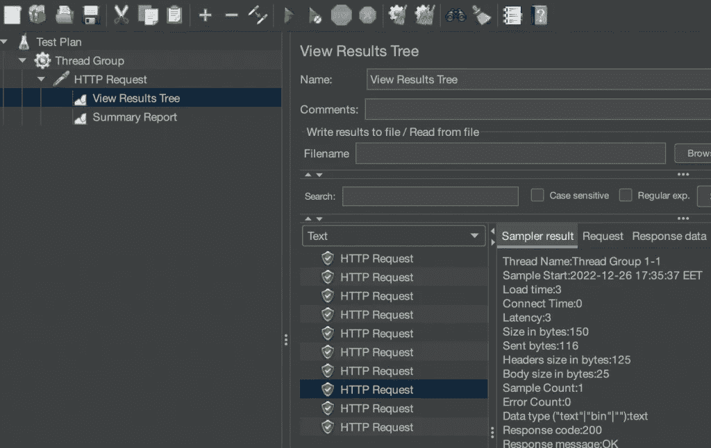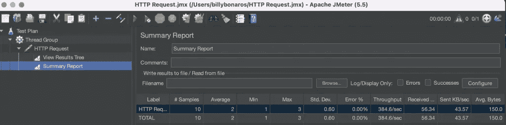

正如您在总结报告中看到的，我们的 API 调用平均花费了 2 毫秒，并且没有任何错误。

# 为发布 API 创建测试计划

本例中的 API 获得 4 个变量的 JSON 输入，并再次返回这些变量。

为了运行 POST API 的测试计划，我们必须添加与 GET API 相同的元素和一个 HTTP 头管理器。

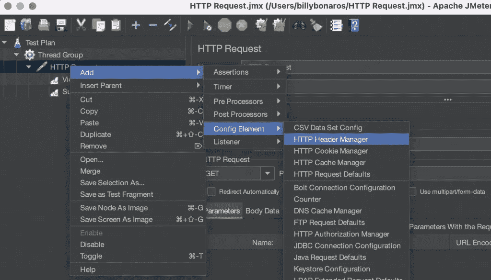

让我们首先设置 HTTP 请求。与 GET API 的不同之处在于，我们需要添加 JSON 输入的主体。同样在这个示例中，API 在/show_data 路径上运行。

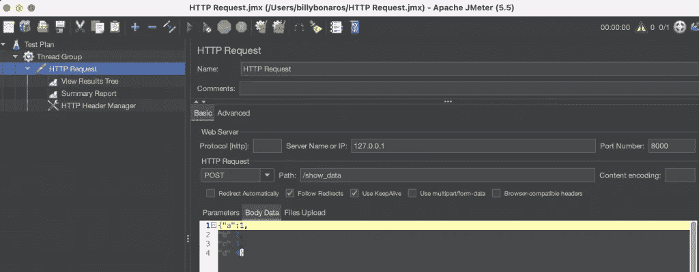

接下来，我们需要在 HTTP 头管理器中设置头。正如您在下面看到的，我添加了内容类型:application/json。

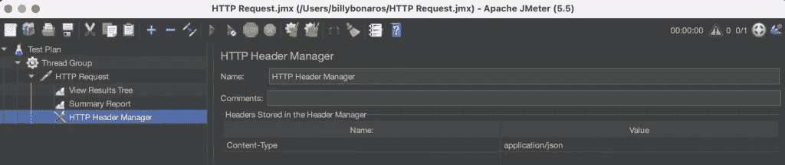

最后，我们准备运行测试。

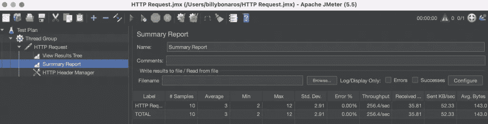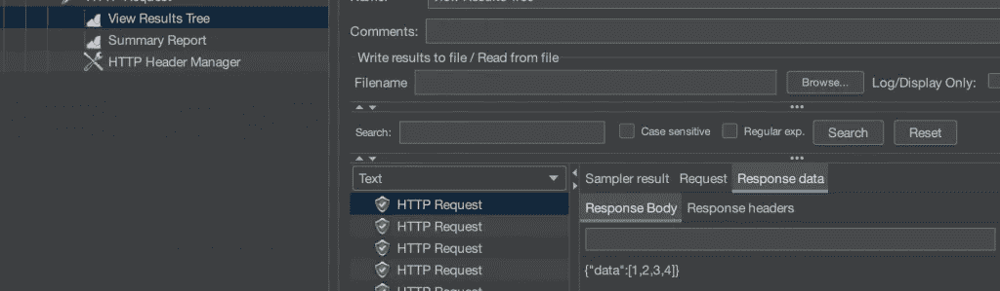

正如你所看到的，这个 API 我们的 API 调用平均花费了 3 毫秒，误差为 0%。此外，您可以在查看结果树中看到对每个呼叫的响应。

Jmeter 的一个很好的特性是您可以保存测试计划，这允许您轻松地重新运行测试。

# 最后的话

总的来说，JMeter 是一个强大而灵活的工具，非常适合测试 API，并且可以成为数据科学家工具箱中有价值的补充。

> 最初发布于[predictivehacks.com](https://predictivehacks.com/api-performance-testing-using-jmeter/)。

# 感谢您的阅读！

*   订阅我的[简讯](https://billybonaros.medium.com/subscribe)
*   在 [Linkedin](https://www.linkedin.com/in/billybonaros/) 上关注我