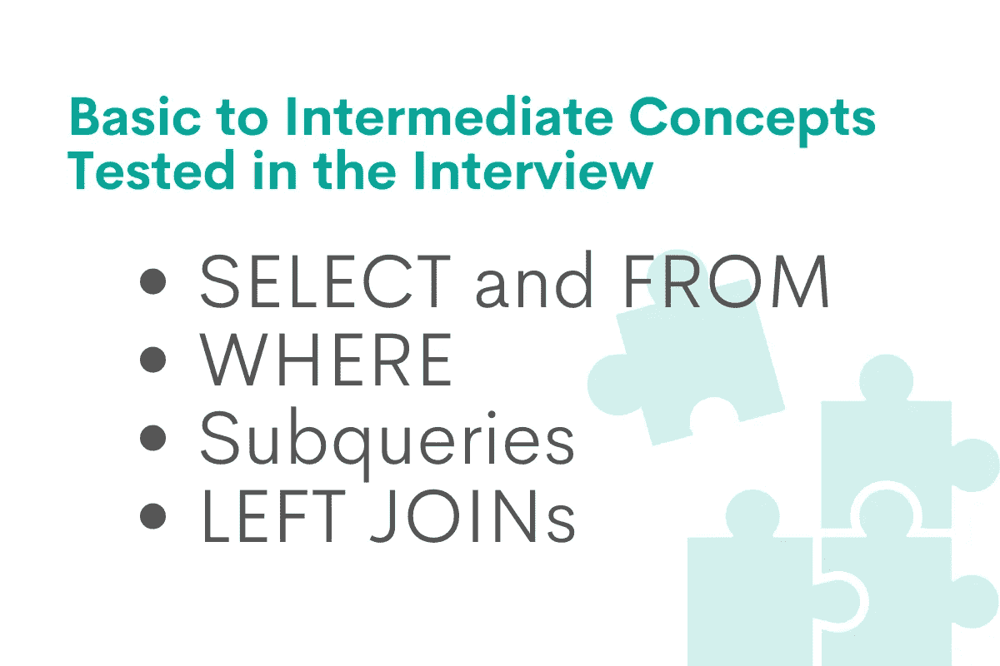
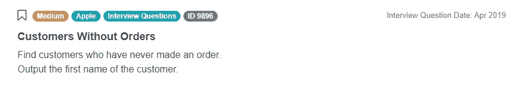
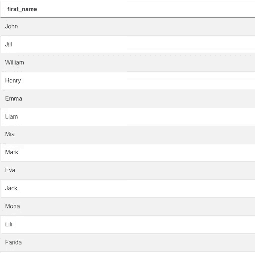
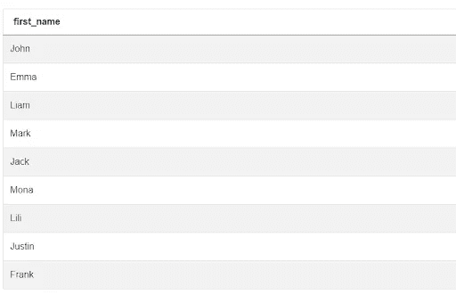

# 苹果数据科学家面试问题

> 原文：<https://towardsdatascience.com/apple-data-scientist-interview-questions-aab8348b1836>

## *练习数据科学家面试问题，在苹果获得你梦想的工作*


作者在 [Canva](https://canva.com/) 上创建的图片

苹果公司是全球最大的计算机软件和硬件制造商之一。苹果最受欢迎的产品有:大名鼎鼎的 iPhone、MacBook、iMac、智能手表甚至高端耳机。该公司每年销售数亿台这样的设备。组织所有的销售数据是一项艰巨的任务，该公司一直在寻找能够胜任这项任务的数据科学家。

苹果有很多部门聘请数据科学家加入他们的行列。你日常工作的细节会根据你所在的部门和资历而有所不同。但是，所有候选人都必须精通 SQL，才能编写优化的查询来组织数据。苹果公司的所有面试官都会在面试中考察应聘者这样做的能力。

作为一名数据科学家，你在面试中的目标是展示你的技能，证明你将为你被分配到的团队增加价值。这甚至适用于初级候选人，但在这种情况下，面试官也会考虑学习的渴望和动机等因素。

# 苹果数据科学家访谈中测试的基础到中级概念

熟练的数据科学家可以将杂乱的销售数据转化为组织良好的数据。了解一些基本、中级甚至高级的概念可以让你灵活地解决手头的任何问题。要回答这个具体的苹果数据科学家采访问题，您需要彻底理解这些 SQL 概念:



作者在 [Canva](https://canva.com/) 上创建的图像

## 选择和从

这两个语句，按照这个顺序，对于组成一个 SQL 查询是必不可少的。这两个陈述是如此的基本，以至于不能使用它们会立刻使你失去获得这份工作的资格。

我们使用 SELECT 语句指定我们想要查看的数据列，而 FROM 语句用于指定源表。您应该知道，只要遵循语法规则，SELECT 允许您查看任意数量的列。不用说，在回答实际问题时，你要理解这些语法规则，并遵循它们。

在面试中，表现出对这个概念的透彻理解是很重要的。例如，记住一次只能使用一个 SELECT 语句是很重要的。此外，您应该能够使用 AS 命令来重命名列。

除了编写实际的查询之外，了解 SELECT 语句的背景知识也很有用。例如，你应该能够解释当你运行它时会发生什么。它会修改原始表中的数据吗？

此外，理解编写 SELECT 语句的格式规则也无妨。有必要将它们资本化吗？为什么在编写列名时使用下划线而不是空格是一个好习惯？

## 在哪里

大多数情况下，使用 WHERE 语句可以很容易地解决涉及行过滤的问题。你应该知道在哪里，什么时候以及如何使用它。一个好的候选人应该知道如何设置条件来过滤行。

正确设置 WHERE 语句的条件比看起来要复杂得多。您必须知道可以使用哪些条件运算符，以及如何设置它们以获得想要的结果。一个好的候选人应该了解不同类型的比较，并选择正确的方法。

比较数字很容易，但是比较日期和文本就有点复杂了。一个有经验的候选人应该能够本能地写出这些条件来成功地过滤数据。还有用于比较不同类型数据的语法规则。

一个好的候选人还应该理解并解释这种说法的基本原则。例如，SQL 中的行是不可分的。当您使用 WHERE 语句时，您不只是筛选出一列中的值，而且如果 WHERE 语句后的条件不满足，整行都将被取消资格。了解这些关键细节是至关重要的，即使对于初级职位也是如此。

## 子查询

作为苹果公司的数据科学家，你必须用 SQL 编写复杂的查询。子查询是一个可以帮助你做到这一点的工具。为了最大化获得工作的机会，您应该了解子查询、它们的语法以及如何将它们与 SQL 语句结合使用。在我们的示例中，我们使用子查询来设置 WHERE 语句的条件。这很常见，所以一个好的候选人也应该知道如何使用子查询来设置条件。

有时编写嵌套子查询很困难。你要花一些时间才能毫不费力地写出它们。如果您是初级候选人，您可能会发现先编写内部查询更容易，然后再编写外部查询。

包含子查询的 SQL 代码可能很难理解，尤其是当子查询嵌套多层时。重要的是要遵循格式规则，比如缩进，以使你的代码更容易阅读。通常的经验是将子查询缩进一到两个空格。

## 左连接

连接不是一个基本的概念，但是它们对于执行许多不同的操作非常有用。有多种类型的连接，它们都可以用于不同的目的。优秀的候选人应该了解所有不同的类型，并解释它们。更重要的是，当面对一项任务时，一个好的候选人应该知道如何使用每种类型的连接来达到预期的结果。

联接有时用于筛选数据。我们使用 LEFT JOIN 语句来回答这个特定的 Apple 数据科学家访谈问题，因为它映射了两个表中的值。当面对这样的问题时，一个好的候选人应该知道左连接的默认行为，以及为什么它们对于查找在另一个表中没有相应值的记录很有用。

如果没有正确编写的 ON 语句，连接通常是没有用的。这包括了解编写实际条件和映射两个表中的值的正确语法规则。

练习使用不同类型的连接编写查询是很重要的，这样当需要时，您会本能地知道需要使用哪一种。在这里找到一些最常见的 [SQL JOIN 面试问题](https://www.stratascratch.com/blog/sql-join-interview-questions/?utm_source=blog&utm_medium=click&utm_campaign=medium)并学习如何回答它们。

# 苹果数据科学家面试问题演练

在这一部分，我们将带您浏览最近向渴望在 Apple 工作的候选人提出的一个 SQL 问题。

**没有订单的客户**

要解决这个 Apple data scientist 面试问题，候选人必须编写一个查询，返回从未下过任何订单的客户的姓名。在苹果这样的大公司，过滤销售数据是一个常见的业务问题。

这个问题被标记为“中等”难度，但是只要您知道如何使用正确的 SQL 语句来查看和过滤值，就可以轻松解决。



截图来自 [StrataScratch](https://platform.stratascratch.com/coding/9896-customers-without-orders?python=&utm_source=blog&utm_medium=click&utm_campaign=medium)

问题链接:[https://platform . stratascratch . com/coding/9896-无订单客户](https://platform.stratascratch.com/coding/9896-customers-without-orders?python=&utm_source=blog&utm_medium=click&utm_campaign=medium)

大型科技制造商的面试官经常会问一些与销售数据相关的问题。即使你没有得到这个确切的问题，本文描述的原则将帮助你解决许多类似类型的数据科学面试问题。

解决这个苹果数据科学家采访问题所需的所有值都包含在两个可用的表中。这个挑战可以分为两个步骤:编写条件来查找满足条件的所有客户，并过滤结果以删除不满足条件的客户。customers 表不包含指示订单值的信息，因此我们必须同时使用这两个表来寻找答案。

两个表都有一个唯一客户标识符列。对于客户表，这是 **id** 列，对于订单表，这是 **cust_id** 列。从逻辑上讲，从未下过订单的客户应该不在 orders 表中。设置一个条件来查找它们，并返回它们对应的名称，这是最符合逻辑的解决问题的方法。

一旦你消化了这个问题，明白了需要做什么，挑战就是执行。您应该使用正确的 SQL 语句和子句来设置条件和过滤结果。这个问题有两个有效的解决方法。我们将演示这两者，并让您决定哪一个更好。

**可用数据集**


截图来自 [StrataScratch](https://platform.stratascratch.com/coding/9896-customers-without-orders?python=&utm_source=blog&utm_medium=click&utm_campaign=medium)

## 数据假设

正确回答像这样的面试问题归结于研究可用的数据。在本例中，我们有两个表，**客户**和**订单**。我们需要使用两者的值来得出最终结果。要做的第一件事是决定我们将使用哪些列，哪些可以安全地忽略。

查看列名及其对应的数据类型可以让您对将要处理的数据有一个大致的了解。如果您能够识别包含相同数据的两个表中的列，那就太好了。例如，要解决手头的问题，候选人必须认识到来自 **customers** 表的 **id** 列可以映射到来自 **orders** 表的 **cust_id** 列。

在这个阶段，您还应该仔细研究这个问题，以确定是否必须将值转换为另一种数据类型，或者以任何方式对它们进行格式化。

预览多行实际数据可以帮助您研究表格，并找到解决问题的正确方法。查看列中的实际值可以帮助您记住它们的类型，以及是否有必要使用它们来解决问题。

当问题描述很具体，没有解释的余地时，这很好，但这种情况很少发生。查看实际数据可以帮助您回答一些关于数据的问题。

例如，我们可以假设，如果顾客没有订购任何东西，她的唯一标识符 **id** 应该从**订单**表中消失。我们还可以假设 **total_order_cost** 描述的是全部成本，而不是每件商品的成本。

面试时，你不应该冒险做出错误的假设。如果你已经尝试了所有的方法:仔细阅读问题，查看数据类型、列名和实际行，但仍然不能下定决心，你可以问面试官。检查假设时，问一些具体的问题，以确保你正确理解了任务。

如果您遵循所有这些步骤，您应该能够[编写一个 SQL 查询](https://www.stratascratch.com/blog/best-practices-to-write-sql-queries-how-to-structure-your-code/?utm_source=blog&utm_medium=click&utm_campaign=medium)来处理边缘情况，并且需要最少的代码。

为了强调查看可用数据的重要性，我们来看看**客户**表中的列:

*   **id** 列很重要，因为我们将使用它来识别用户并检查他们是否在**订单**表的 **cust_id** 列中。
*   **first_name** 列是必不可少的，因为一旦我们找到满足条件的记录，我们必须返回 **first_name** 列中的相应值。
*   我们的解决方案不涉及**姓氏**列中的值，所以我们可以忽略表的这一部分。
*   同样，我们也不必按照客户居住的城市对他们进行筛选或分组，所以我们可以忽略以下几列:**城市**、**地址**、**电话 _ 号码**。

现在，让我们看看**订单**表中的列:

*   我们没有根据订单的 id 来过滤订单，也没有在另一个表中查找订单，所以我们可以放心地忽略这个列。
*   **cust_id** 列可以映射到 **customers** 表的 **id** 列中的值。我们将使用该列来查找没有出现在**订单**表中的客户，因此没有下任何订单。
*   我们不必跟踪订单的总量，按日期排列它们并获得它们的详细信息。所以我们可以忽略 **order_date** 、 **order_details** 和 **total_order_cost** 列。

## 解决方案逻辑


作者在 [Canva](https://canva.com/) 上创建的图像

一旦你熟悉了这个问题和所有可用的数据，你就可以制定你的方法了。这个苹果数据科学家访谈问题的解决方案应该包括三个简单的步骤:

1.  选择您希望在最终结果中查看的列。在这种情况下，我们将从**客户**表的**名字**列中选择值。
2.  设置条件以查找满足标准的行。
3.  使用 WHERE 语句或 LEFT JOINs 筛选出所有其他行。

一旦分解成三个简单的步骤，问题就变得容易解决了。要执行第一步，您需要 SQL 中两个最基本的语句:SELECT 和 FROM。即使是初级数据科学家也应该熟悉这两条语句，以及如何使用它们来构成查询。

下一步是设置条件。为此，您必须首先理解来自 **customers** 表的 **id** 列映射到来自 **orders** 表的 **cust_id** 列。如果使用第二种方法，包括左连接，您将不得不使用 ON 语句来映射列。

最后一步是使用 WHERE 语句过滤结果。您可以检查来自 **id** 列的唯一客户标识符是否出现在**订单**表的 **cust_id** 列中。

一个额外的步骤可以使您的查询更加有效。您可以添加 DISTINCT 语句，以便只保留唯一的 cust_id 值。

## 解决方法

**获取最终输出值**

如果您查看问题描述，预期的输出应该是没有下订单的客户的名字。

```
SELECT first_name
FROM customers
```

该查询将返回**客户**表中的所有**名字**值。让我们来看看输出:



截图来自 [StrataScratch](https://platform.stratascratch.com/coding/9896-customers-without-orders?python=&utm_source=blog&utm_medium=click&utm_campaign=medium)

到目前为止，一切都在按计划进行。现在到了第二步。

**设置条件和过滤结果**

现在我们已经编写了一个返回所有客户名字的查询，我们要做的就是检查这些客户中哪些没有出现在 orders 表中，并保留他们的名字。我们将使用 id 列中的值作为唯一标识符。

```
SELECT first_name
FROM customers
WHERE id NOT IN
    (SELECT cust_id
     FROM orders)
```

我们使用 **id** 作为标识符，检查每个客户是否出现在**订单**表中。

我们使用 SELECT 语句查看来自**订单**表的所有 **cust_id** 值，并检查每个客户的 **id** 是否出现在列表中。我们使用 WHERE 语句和 NOT IN 条件来删除那些其 **id** 值出现在子查询输出中的客户。

这是最后的结果。如果我们运行该代码，我们将会看到没有出现在**订单**表中的客户的名字值列表:



截图来自 [StrataScratch](https://platform.stratascratch.com/coding/9896-customers-without-orders?python=&utm_source=blog&utm_medium=click&utm_campaign=medium)

**使用 DISTINCT 子句删除重复项**

尽管最后一步回答了问题，但它提取的 **cust_id** 值有时会重复。这是不必要的，也不是最优的，所以我们可以使用 DISTINCT 子句只保留来自 **orders** 表的唯一的 **cust_id** 值。

```
SELECT first_name
FROM customers
WHERE id NOT IN
    (SELECT DISTINCT cust_id
     FROM orders)
```

最终输出将与之前相同，但是我们将必须有条件地检查来自**订单**表的一个更小的唯一 **cust_id** 值列表。

# 另一个正确的解决方案

上面讨论的解决方案相当简单，但这不是解决苹果数据科学家面试问题的唯一正确方法。左连接对于解决涉及检查一个表中的特定值是否出现在另一个表中的问题也很有用。

要编写这个解决方案，您应该非常熟悉左连接及其默认行为。在这种情况下，使用左连接将产生以下效果:对于客户中的每个 **id** ，我们检查在 **orders** 表的 **cust_id** 列中是否有匹配值。如果有，这些表将与它们各自在列中的值连接起来。如果两个 **id** 列中的值无法映射，所有列值将被分配一个空值。

一旦表被连接，我们可以检查 total_cost 列中哪些记录具有空值(除了 **id** 表之外的任何其他记录都可以),并识别原始**订单**表中没有的客户。然后，我们再次使用 WHERE 语句过滤初始列表，以获得最终结果。

```
SELECT first_name
FROM customers a
LEFT JOIN orders b ON a.id = b.cust_id
WHERE b.order_date IS NULL
```

如果您对左连接这个概念非常熟悉，那么这种方法可能比上面描述的方法更简单。采取这种方法不会损害你获得数据科学工作的机会。然而，这仍然是一个事实，它涉及到编写更多的代码。

**2022 更新**:可用数据不再包含“ **order_quantity** ”值，所以我们必须稍微改变视频中提到的解决方案。在更新的解决方案中，我们根据' **order_date** '列的值有条件地过滤结果。

## 最后的话

处理销售数据是苹果公司数据科学家的一项常见任务。这个问题，以及类似的候选人必须过滤、整理或处理数据的问题，是衡量候选人是否准备好工作的一个很好的方式。这个特定的问题是好的，因为它给你多种方法的自由，只要你得到正确的答案。

*最初发表于*[*https://www.stratascratch.com*](https://www.stratascratch.com/blog/apple-data-scientist-interview-questions/?utm_source=blog&utm_medium=click&utm_campaign=medium)*。*