# 机器学习算法在结肠直肠癌诊断和治疗中模拟微生物组作用的应用:第二部分

> 原文：<https://towardsdatascience.com/application-of-machine-learning-algorithms-in-modeling-the-role-of-the-microbiome-in-the-colorectal-c0c4f41d860b>

## 生物信息学框架设计和方法学——结直肠癌耐药机制的机器学习建模结果

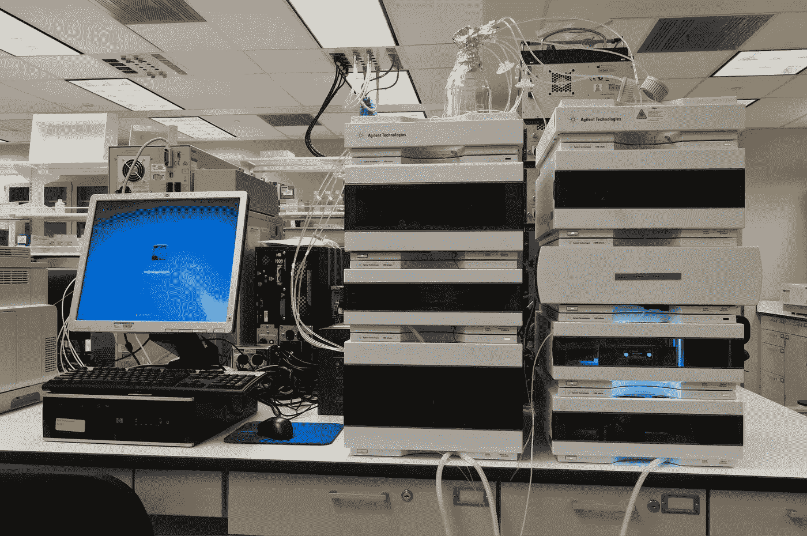

[国家癌症研究所](https://unsplash.com/@nci?utm_source=unsplash&utm_medium=referral&utm_content=creditCopyText)在 [Unsplash](https://unsplash.com/photos/bX8azpGeNrY?utm_source=unsplash&utm_medium=referral&utm_content=creditCopyText) 上拍摄的照片

本文是引言部分的[后续，在引言部分，我介绍了观察结直肠癌耐药机制和癌变的研究方法和生物信息学框架设计。**主要的科学目标是设计和开发一个全面的生物信息学框架和两阶段方法的机器学习管道，用于模拟和解释关键的生物标志物，这些生物标志物在了解被诊断患有结肠直肠癌的患者的治疗耐药机制和致癌作用方面发挥着重要作用**。考虑到我已经介绍了数据集的人口统计学和数据相关的处理和转换操作，在这里我将继续阐述耐药性案例研究的**结果。该组包括来自**新发腺瘤(NDA)** 患者的 21 个样本，与耐药性相关，而来自**清洁肠道(CIT)** 患者的其余 26 个代表，相应地与非耐药性相关。**](https://medium.com/towards-data-science/application-of-machine-learning-algorithms-in-modeling-the-role-of-the-microbiome-in-the-colorectal-4426d5e19c2b)

在方法学的设计之后，我将呈现并详细阐述在我执行了所实现的框架的每一个构建块之后检索到的 ML 建模和统计分析结果。

# ML 建模筛选阶段结果

标记为**“算法基准分析”**的建模筛选阶段非常重要，因为没有黄金标准可用于处理和呈现关于微生物组数据的生物信息学分析的可靠结果。在这个阶段，我使用了著名的 Scikit learn 的监督学习分类器并制作了原型。因此，数据被随机打乱并分成两个单独的数据集用于训练(70%)和测试(30%)。此外，在创建一些模型之前，我还尝试了 k-fold 交叉验证方法。

下表总结了筛选建模阶段的结果:

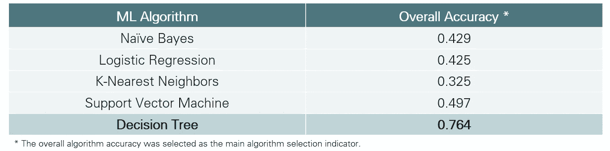

按作者分类的图像- ML 筛选阶段(算法基准分析)

由于筛选阶段背后的想法是探索和提供由最大化精度指标确定的最有希望的方法，我得出结论，最有希望的洞察是使用**决策树方法**，实现初步的总体精度值 0.764。使用决策树(*“基尼”属性选择测量与“最佳”分裂器相关作为分裂策略方法*)提供了额外的好处，因为决策树的有利特征是它们的可理解性。虽然它有一个简单的可视化表示，但这种方法是有益的，因为它通过一些特征丰度分布来强制分割根。考虑到研究的性质，这是非常重要的，我们需要基于模型行为本身的适当的生物学解释。在这方面，我继续利用基于树的**随机森林算法**进行建模，假设性能指标将通过利用树相关的多数表决得到额外的改善。

# ML 建模结果

考虑到生物信息学的工作环境是不规范的，我认为有必要在不同的环境和不同的初始状态下测试和探索随机森林算法。因此，我利用来自两个不同实验环境的随机森林分类器实现应用了实际的 ML 建模，**基于 Python 的 Scikit-learn** 和 **KNIME** 。因此，我尝试了不同的数据标准化和缩放技术、分割比率和分类器参数，以提供和最大化模型的性能指标。我按照两阶段策略设计了流程，使用第一阶段最重要的特性作为第二阶段缩小的输入范围。这一概念的主要思想是确定和观察第二阶段产生的最重要的特征。

在对数据进行归一化和缩放后，我分别计算了**克朗巴赫的阿尔法**和**科恩的卡帕系数**。克朗巴赫的阿尔法系数值阈值可以根据以下阶段来解释:研究的早期阶段(0.5 或 0.6/0.7)；应用研究 0.8；做重要决定时 0.9。通常，Cronbach 的α值> 0.75 被认为是微生物组相关研究可以接受的。另一方面，Cohen`s kappa 系数由以下几个阶段决定:< 0.4 视为较差；0.4–0.75 被认为是中等至良好；0.75 代表极好的数据一致性。这些计算的结果如下表所示:

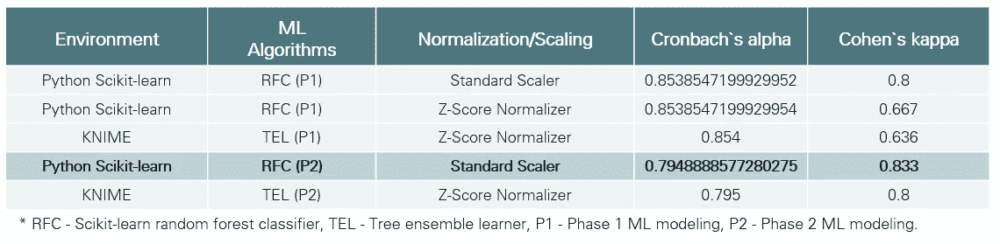

图片由作者提供-耐药和非耐药结直肠癌术后个体组的 Cronbach`s 和 Cohen`s 系数

耐药和非耐药 CRC 术后个体组的一般 ML 建模性能指标如下表所示。除了**准确性**之外，我还计算了模型`**敏感性**和**特异性**作为模型行为和预测性的重要指标。这些研究通常会考虑这些指标，因为高准确性并不总是意味着模型是准确的(没有偏差或过度拟合)。

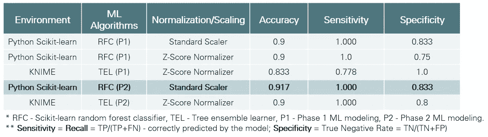

图片由作者提供-耐药和非耐药 CRC 术后个体组的一般 ML 建模性能指标

值得强调的是，对于第一个建模阶段，我使用了以下算法参数值: **n_estimators = 55** ， **max_depth = 5** ， **max_features = 3** ，通过额外引入的**‘resistance’目标特征**，使用分层抽样，交叉验证值为 25%的测试数据。相反，对于第二阶段，我配置了 **n_estimators = 25** ， **max_depth = 4** ， **max_features = 3** ，交叉验证值为 25%的测试数据。

此外，我计算了**曲线下面积(AUC)** 值，该值通常代表二元分类器在所有可能阈值(合理区分的分类能力)上的性能的综合度量。

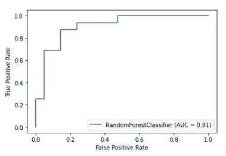

按作者分类的图像-耐药和非耐药 CRC 术后个体组的 AUC 值

我还决定分别计算两个子组的**精度**、**召回**和**F1-得分**(替代的机器学习评估指标，通过详细说明模型的分类性能而不是精度完成的整体性能来评估模型的预测技能)。结果显示在下表中:

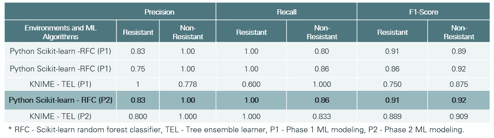

图片由作者提供-耐药和非耐药 CRC 术后个体组的详细 ML 建模性能指标

就此而言，我还尝试了 **XGBoost** 和 **AdaBoost** 算法，结果与上面描述的基于森林的方法相比没有显著的改进。因此，我将**第二阶段基于 Python 的随机森林分类器确定为性能最高的**，并选择由此产生的最重要的特征作为进一步统计分析的参考集。

# 统计分析结果

对原始数据的分类分析，假设由于细菌参考不断变化而提高了分类精度，导致检测到 **3603 个不同的细菌分类单位**。因此，肠道微生物群由 **20 个独特的门**、 **35 个纲**、 **72 个目**、 **119 个科**和 **259 个独特的属**组成，并探索了额外的属水平数据。1506 个细菌的属级分类不可用(3603/1506；41.7%).从剩余的细菌(2097；58.2%)，抗性样品中最显著的属属于统计计算的 Benjamini-Hochberg p 值区间 0.009-0.024。

因此，在抗性组中，我发现*类杆菌(0.009)* 和*Lachnoclostridium(0.017)*为生物学上感兴趣的属，用于进一步分析和解释。因此，非抗性样品中最重要的属属于 Benjamini-Hochberg p 值区间为 0.001-0.047。在非耐药组中，我发现了*乳球菌(0.002)* 、 *Lachnospiraceae FCS020 组(0.019)* 、*脱硫弧菌(0.012)* 和*狭义梭菌 1 (0.016)* 。

我完成了 general insights 图片，提供了耐药和非耐药群体中的属丰度的统计分析结果，如下图所示:

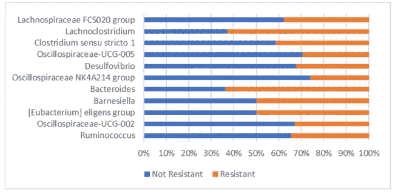

按作者分类的图片-抗性和非抗性组中最重要的属的中值丰度

# 高度贡献的功能

对抗性组和非抗性组样品的比较共呈现出 **86 个独特属**。随后，通过 ML 算法从这些属中分离出 **28 个作为最重要的特征(32.6%)，在组间统计计算的 Benjamini-Hochberg p 值的区间中从 0.002 到 0.049 排序。我观察到以下几个属中抗性和非抗性类群的差异最大:*乳球菌*、*示波螺菌科-UCG-002* 、*真杆菌属精英类群*、*巴尔内氏菌属*、*拟杆菌属*、*示波螺菌科类群*、*脱硫弧菌属、示波螺菌科-UCG-005* 、**

# *聚合特征贡献分析结果*

*这种新方法的主要目的是探索哪些属最常见于一起，以及它们如何共同构成抗性类。根据算法的随机性质，考虑到所有生成的模型遵循与参考模型相同的性能度量，聚集贡献分析可以进行多次。提议的综合分析的好处支持了**论点，即耐药性不仅仅是由于患者微生物群中的特定病原属，而是共生的几个细菌属**。正如预期的那样，总贡献低于单个贡献，但揭示了关于沿算法预测路径的整个轨迹构成的额外数据见解。*

*下表列出了支持抗性行为(对抗性等级预测的贡献)的详细聚合特征显著性:*

*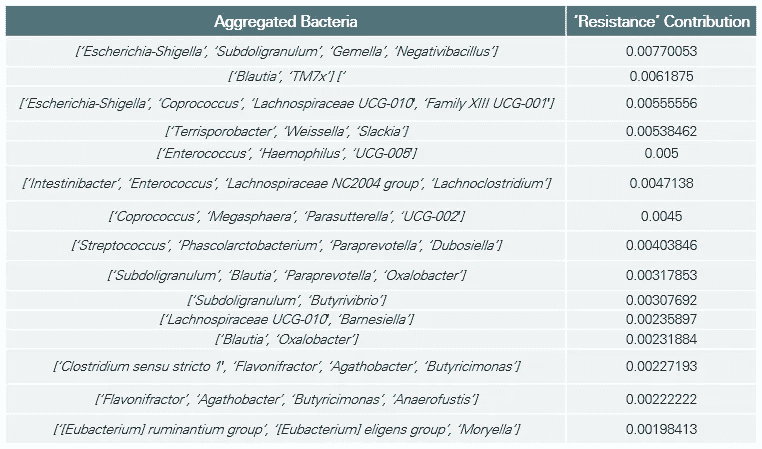*

*作者图片-聚合细菌对耐药类的重要贡献*

*因此，支持非抗性行为(对非抗性类别预测的贡献)的详细汇总显著性如下表所示:*

*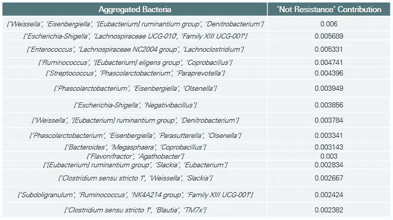*

*作者图片-聚合细菌对非耐药类的重要贡献*

*总体贡献关系为更深入的未来科学研究奠定了基础。*

***完整的观察和发现可在原始出版物中找到。**

# *细菌丰度结果*

*我使用最初生成的 OTU 表，通过 **iVikodak 工作流程**创建了一个潜在的代谢组学分析。虽然这种类型的推断应该从元转录组学数据集进行，但它们仍然可以让我们深入了解它们在特定 KEGG 途径中的潜在作用。根据物种丰度水平，我们可以假设细菌产生的代谢产物的影响以及它们对细胞机制的影响。*

*分析中涵盖的丰度频率模式根据诊断组和对照组进行了区分，如下图所示:*

*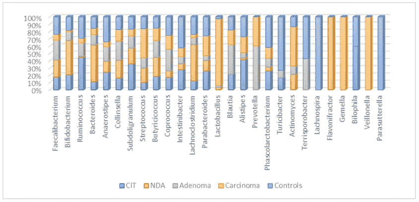*

*按作者分类的图像-按诊断组和对照组分类的属丰度频率模式*

*除了已经提到的特定于抗性或非抗性代表的属之外，观察到的丰度表明一些细菌仅存在于特定的组中，例如仅在对照组中发现的 *Parasutterella* 和 *Lachnospira* 。因此，已知上述细菌参与人类结肠中的日常蛋白质分解代谢。*

*考虑到细菌丰度，非抗性样品中的细菌丰度趋势总结在下表中，其中 p 值使用 Benjamini-Hochberg 统计法计算。*

*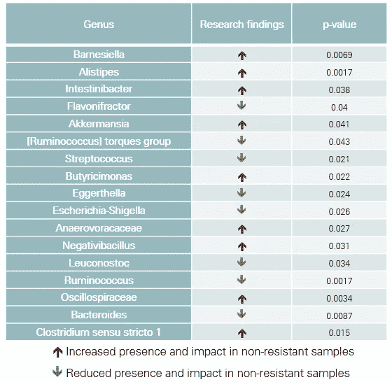*

*按作者分类的图像-非耐药样本中的细菌丰度趋势*

# *生物分析和解释*

*我们用我们的算法分析的微生物组样本中最常见的属，*类杆菌*，已经在几项与人类结直肠癌发展显著相关的研究中发表。该属已被确定为模型的一个重要特征，我们用于比较抗性/非抗性，以利于抗性组(p = 0.003，平均丰度 28)。产肠毒素的*类杆菌*细菌对结直肠癌的发展和增殖有着至关重要的影响，考虑到它们的生物被膜的产生导致了一系列的炎症反应，这些反应会加剧慢性肠道炎症和组织损伤。此外，对小鼠的功能研究证实产肠毒素的*类杆菌*能直接促进肠癌发生。*

*在这种情况下， *Alistipes* 细菌(在非耐药组中显著增加)与*类杆菌*物种共生，因为两者都对万古霉素、卡那霉素和粘菌素具有耐药性。这两个物种具有相似的支持结肠炎症和腺瘤发展的氨基酸发酵途径。*

*此外，具有最高 p 值的最引人注目的属是*乳球菌*。此属有利于非耐药患者。这项研究强调了肠道微生物群在癌症发展和进展以及化疗结果中的基本作用。可以理解的是， *Barnesiella* 种与非耐药组具有高度相关性，因为其代谢物表明肿瘤组织中有产生γ干扰素的γδT 细胞的浸润。此外，已表明该物种可干扰抗癌剂和免疫调节剂的作用，并阻止癌症治疗。*

*下表总结并详细讨论了本研究中形成的耐药机制细菌功能表:*

*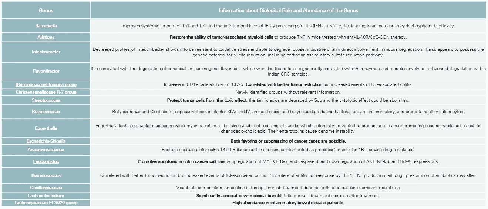*

*图片由作者提供-细菌功能的抗性机制概述*

*这里值得强调的是，尽管我们熟悉患者微生物组中一个属的单一影响，但我们仍然远远没有回答为什么几个属经常一起出现，以及耐药性是基于一个属的存在还是几个属一起存在。*

*感谢您对阅读本文如此感兴趣。下一个将遵循相同的原则，但对于第二个病例研究，涉及共享管状腺瘤的相同组织学信息的样本。*

## *[第 1 部分-介绍性文章-生物信息学框架设计和方法概述](https://medium.com/@cekikjmiodrag/application-of-machine-learning-algorithms-in-modeling-the-role-of-the-microbiome-in-the-colorectal-4426d5e19c2b)*

## *[第 3 部分——生物信息学框架设计和方法——用于理解结肠直肠癌致癌作用的机器学习建模结果](https://medium.com/@cekikjmiodrag/application-of-machine-learning-algorithms-in-modeling-the-role-of-the-microbiome-in-the-colorectal-2c222ea6ba0)*

*【https://www.linkedin.com】最初发表于**。***