# 纳什均衡的应用

> 原文：<https://towardsdatascience.com/applications-of-the-nash-equilibrium-5538be8dd443>

帕斯卡尔·斯威尔在 [Unsplash](https://unsplash.com?utm_source=medium&utm_medium=referral) 上的照片

# 伯特兰、古诺和霍特林

本文假设您熟悉博弈论，或者已经阅读过我以前关于这个主题的文章。为了方便起见，可以在本文的底部找到早期文章的列表。

我们已经谈到了博弈论对数据科学的重要性，并引用了被过度使用的短语“博弈论是有激励的概率”。我们将通过看一些著名的例子来继续我们对博弈论的探索。这里我提出纳什均衡的四个应用，具体来说:

*   伯川德竞争，企业在价格上竞争。
*   古诺竞争，企业在数量上竞争。
*   霍特林定律，企业在位置上竞争。
*   旅行者困境。

值得注意的是，所有这些例子都让人觉得有些做作，事实也的确如此。然而，在这一点上，它们是很好的例子，因为它们符合我们早期的条件或假设:完整的信息、一次性交互和同时决策。

在现实应用中，正如我们之前所讨论的，这些条件通常是不现实的:

*   博弈很少以完全信息为特征
*   决策很少同时做出，
*   玩家很少有相同的成本函数，而且
*   玩家通常有一定程度的差异
*   市场很少是完全清晰的:总需求很少等于总供给，至少在短期内是如此。
*   战略互动很少是一次性的

然而，我们正处于探索博弈论的早期阶段，这些假设使我们最初的学习更容易掌握。

## 关于图像的说明:

我使用了公开可用的图片，并相应地进行了认证。然而，我也使用了 deol dify(【https://deoldify.ai/】T4)，这是一个很好的深度学习工具，用于着色和恢复旧照片以增强图像。

# 贝特朗竞争

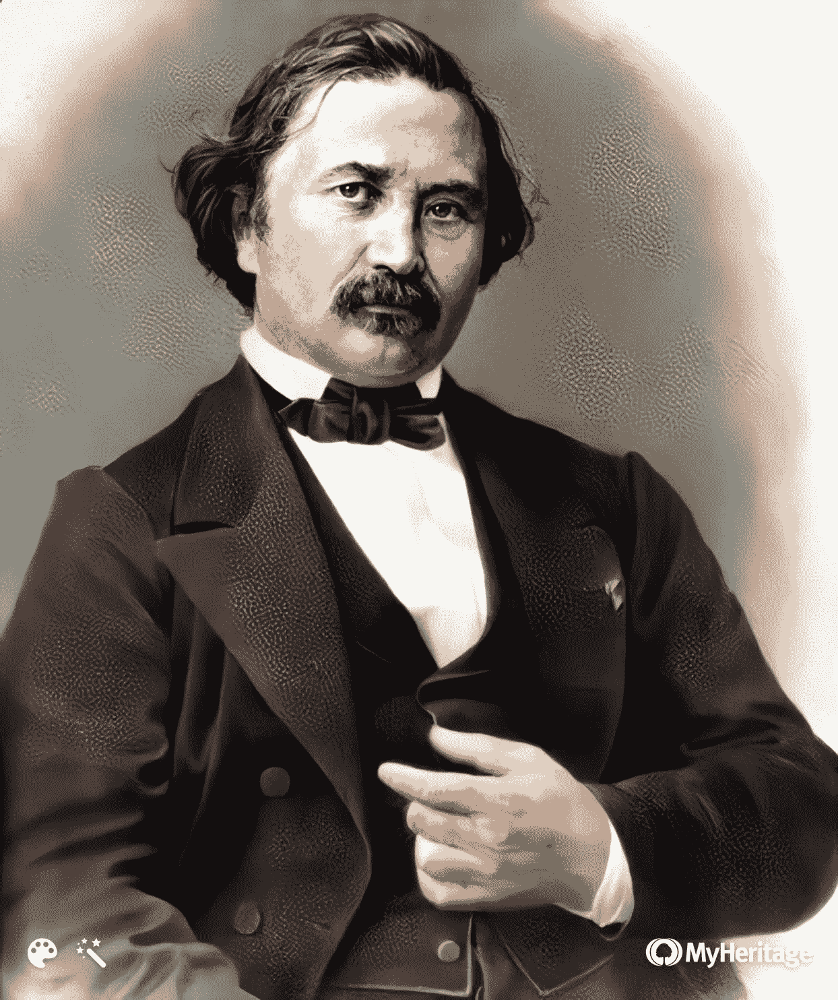

作者不详—[http://scienceworld.wolfram.com/biography/Bertrand.html](http://scienceworld.wolfram.com/biography/Bertrand.html)，公共领域，[https://commons.wikimedia.org/w/index.php?curid=2818814](https://commons.wikimedia.org/w/index.php?curid=2818814)

以下是一个关于双头垄断背景下**价格竞争**的故事。

1.  两家公司是销售相同苹果的竞争对手。
2.  他们共同拥有一个由 100 个潜在苹果买家组成的市场，每个买家都会从出价最低的供应商那里购买一个苹果。
3.  如果两者价格相同，他们平分市场(每人卖 50 个苹果)
4.  每个苹果的生产成本是 5 美元。利润由以下各项给出:

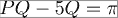

生产成本

如果公司同时决定价格，他们会选择什么价格？

谁有偏离的动机？

我们将在这个博弈中寻找纳什均衡。然而，这里的动作空间是*连续的*而不是*离散的*。每个玩家可以选择任何正实数作为他选择设定的价格。无限策略不可能用收益矩阵来表示。开始寻找纳什均衡的一个方法是猜测和检查:选择一个策略配置文件并问:这是纳什均衡吗？如果没有，为什么没有？谁有偏离的动力，往什么“方向”偏离？假设两家公司都设定 P₁ = P₂ = 100。两者的利润都是:

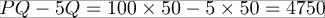

*   任何一家公司都有偏离的动机吗？
*   这是纳什均衡吗？

这两个问题的答案都是**不**！公司 1 可以设定 P₁ = 99 并占领整个市场，获得的利润为:

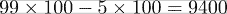

P₁ = 99 和 P₂ = 100 是纳什均衡吗？

在这种情况下，公司 2 利润为零，而公司 1 利润为 9400 英镑。这听起来像纳什均衡吗？不，公司 2 的利润为零，通过进一步向 P₂=98.削价，公司可以做得更好

因此，竞争性降价的循环仍在继续…

唯一一个没有公司有动力单方面改变价格的价格组合是 P₁ = P₂ = 5。在这一点上，两家公司的利润都是零，也就是说，他们在经济盈亏平衡点出售产品。

*   如果公司 1 提高价格，它仍然没有利润(公司 2 也一样)。
*   如果公司 1 降低价格，它会亏损，这是不理性的(公司 2 也一样)。

因此纳什均衡是:

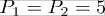

对消费者来说是好事，但对两家公司来说都相当糟糕！如果你觉得这个答案不令人满意，你并不孤单。在现实世界中，没有一家公司能在任何时间内保持零利润，我们之前已经说过这是不理性的。因此，这个结果(正确地说)令人不满意。

然而，考虑到这些条件是从一开始就强加的，这在理论上是正确的。因此，重要的警告是，真实世界的竞争不会有这些条件约束。

*   公司会有不同的成本函数。
*   企业会在其他方面(除了成本)产生差异。
*   短期内，市场不会完全自我清算。
*   消费者不仅会根据最低价格做出决定

诸如此类。我认为强调最重要的部分是时间(或者更确切地说是没有时间)是很重要的。这些都是一次性的互动，永远不会重复。一次性条件下的行为不同于重复交互。

# 古诺竞争:

作者不详——19 世纪照片，公共领域，[https://commons.wikimedia.org/w/index.php?curid=33954360](https://commons.wikimedia.org/w/index.php?curid=33954360)

以下是一个关于双寡头背景下**数量竞争**的故事:

*   逆向需求市场中的两家公司

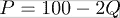

*   公司在数量上竞争——公司 1 选择 q₁，公司 2 选择 q₂.决策是同时做出的。
*   烦恼公司知道市场价格不仅取决于他们的数量选择，还取决于他们的竞争对手的数量选择，因为:

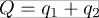

因此，两家公司的利润取决于他们的数量选择和他们的竞争者的数量选择。

*   公司 1 的总成本是:

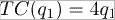

*   公司 2 的总成本是:

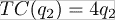

如果公司同时决定数量，他们会选择什么数量？

我们将在这个博弈中寻找一个纳什均衡，然而，这里的行动空间是连续的而不是离散的。每个玩家可以选择任何正实数作为他选择设定的价格。无限策略不可能用收益矩阵来表示。寻找纳什均衡的一个方法是看看我们是否能写出两个参与者的收益函数。让我们从公司 1 开始。

公司 1 将利润最大化，由下式给出:

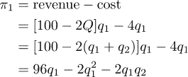

公司 1 的收益(等于它在这个博弈中的利润)不仅取决于它自己的选择(q₁)，还取决于它的竞争对手(q₂)。但是公司 1 不能选择 q₂，它只能对它认为的 q₂做出最佳反应。因此**它会选择一个 q** ₁ **最大化π** ₁ **，保持 q** ₂ **固定。**

对 q₁求微分并设置导数函数的斜率= 0，得到:

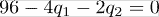

重新排列这些术语给出了公司 1 的最佳反应函数

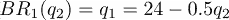

这个函数将博弈中所有其他参与人的策略作为自变量(在这个博弈中只有公司 2，所以自变量是 q₂)，并产生参与人(这里是公司 1)的收益最大化策略作为输出。换句话说，这个函数表明 q₁公司 1 应该为其竞争对手预期的任何可能的 q₂生产。

我们可以对公司 2 重复上面的过程(因为在这个例子中，成本是相同的，所以博弈是对称的，所以变得更容易)得到:

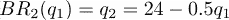

根据定义，在纳什均衡中，每个参与者都对其他参与者做出最佳反应。在这个游戏中，这意味着找到一个 q₁*和 q₂*，满足:

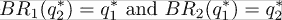

这意味着求解由下式给出的方程组:

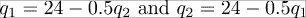

这给了我们:

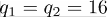

我们也可以用图表来看:

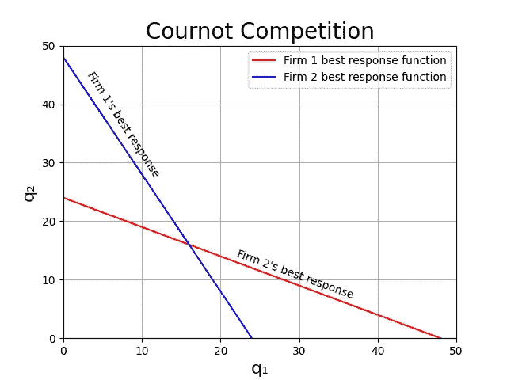

来源:作者

下面是创建它的代码(只是为了好玩)

对于任何依赖于公司 1 的最佳反应函数而不是公司 2 的(q₁,q₂),公司 1 通过选择 q₁来响应 q₂来最大化其利润，但是公司 2 通过选择 q₂来响应 q₁来最大化其利润，所以它有偏离的动机。

对于任何依赖于公司 2 的最佳反应函数而不是公司 1 的最佳反应函数的(q₁,q₂)，公司 2 通过选择 q₂来响应 q₁来最大化其利润，但是公司 1 通过选择 q₁来响应 q₂来最大化其利润，所以它有偏离的动机。

位于两个最佳响应函数上的所有(q₁,q₂)组合在平衡时仅相交一次:

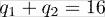

# 霍特林模型

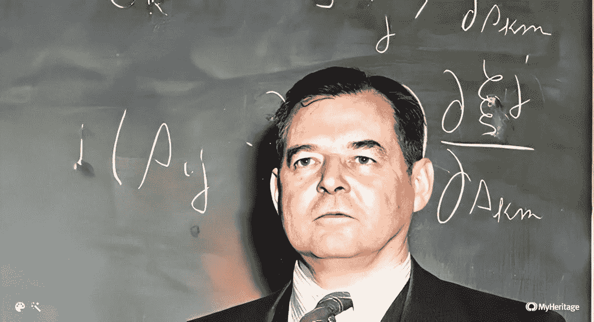

由[http://digital.ncdcr.gov/cgi-bin/showfile.exe?ciso root =/p 249901 coll 22&ciso ptr = 39955 # page = 9](http://digital.ncdcr.gov/cgi-bin/showfile.exe?CISOROOT=/p249901coll22&CISOPTR=39955#page=9)，合理使用，【https://en.wikipedia.org/w/index.php?curid=31259836】T2

前两个应用与双头垄断竞争有关，在这种竞争中，企业战略性地选择**价格**或**数量**。在下面的模型中，企业选择**地点**。

## 霍特林模型的基础

霍特林模型背后的基本故事如下。有一条一公里长的海滩，日光浴者按一定的分布散布在海滩上。每个日光浴者都想恰好买一个冰淇淋，并想走最短的距离去买冰淇淋。如果两个供应商与消费者的距离相等，消费者将通过抛硬币来决定把生意交给谁。有两辆冰淇淋车(我们称之为红色车和蓝色车)通过同时选择海滩长度上的位置来争夺日光浴者的生意。每辆车选择它的位置都知道

1.  每个日光浴者都会从离他或她最近的手推车上买一个冰淇淋。和
2.  另一辆车也在做同样的事情。

我们将在这个游戏中寻找一个纳什均衡，其中两辆车都是参与者，一个策略配置文件将沿着海滩的长度指定两个位置，每辆车一个位置。

# 日光浴者的分布

我们不需要指定一公里长的海滩上的游客以任何特定的方式分布。分布可以是向左向右倾斜的、对称的、钟形的或均匀的。为了便于举例，我们将假设大多数海滩游客都在海滩的左侧。我们将使用一些方便的 python 库来生成随机合成数据，以创建带有峰度的偏斜正态分布。

来源:作者

下面是创建它的代码

来源:作者

## 注意

*这段代码显然使用了随机生成的数据，所以如果您复制并运行它，您的分布将与这里显示的略有不同，并且它将在您每次运行代码时发生变化。也就是说，不管分布的随机性如何，下面的逻辑仍然成立。*

无论分布情况如何，在一公里的范围内，都会有一个位置与日光浴者的位置相对应。这个位置被定义为正好一半的日光浴者在它的左边，另一半在右边。请注意，这不一定与海滩的地理中心位置相同。此外，在这种向左倾斜的分布的情况下，中间值和中位数是不同的。

# 寻找纳什均衡

我们将应用猜测和检查法来寻找这个博弈中的纳什均衡，方法是选择一个策略并问:这是纳什均衡吗？如果没有，为什么没有？谁有偏离的动机，偏离的方向是什么？我们将从这个策略概要开始:每辆车位于海滩的两端。注意红色和蓝色的点

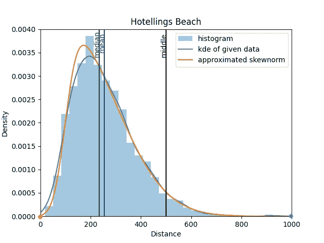

来源:作者

这是纳什均衡吗？在这种位置选择下，海滩中间左边的每个消费者会去红色手推车，中间右边的每个消费者会去蓝色手推车。

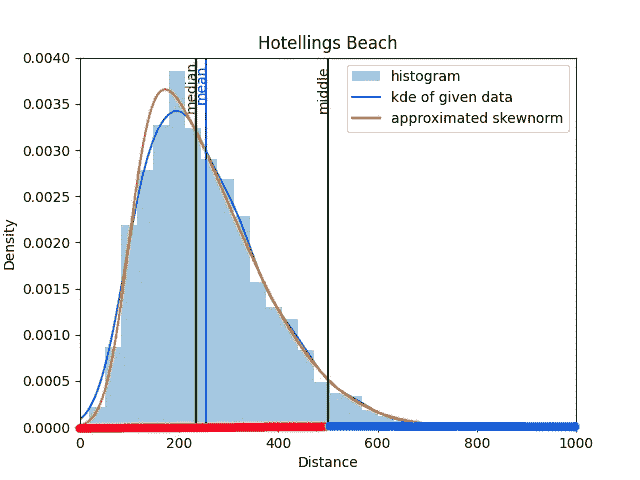

来源:作者

因为分布向左倾斜，这使得红色购物车的销售额比蓝色购物车高得多。但是红车能做得更好吗？假设红色小车稍微向右移动。红色购物车新位置左侧的消费者仍会去红色购物车购买冰淇淋。但通过这一举措，红车也将从蓝车那里“偷走”一些中间客户。因此，红车有向右移动的动机，使得这个策略轮廓，不是纳什均衡。当然，蓝车也是如此。它也有向左偏离的动机。

到目前为止，最佳对策似乎是两辆车在海滩中央汇合。让我们测试一下潜在的纳什均衡:

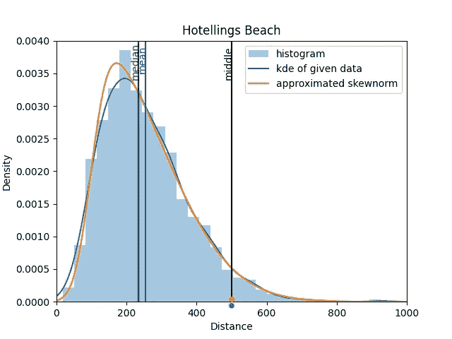

来源:作者

这是纳什均衡吗？当两辆车停在同一个位置时，每个日光浴者与两辆车的距离相等。所以每个日光浴者抛硬币来决定是去红色手推车还是蓝色手推车买冰淇淋。平均而言，这给每辆购物车带来了总销售额的 50%。

哪辆车能做得更好？让我们再一次站在红色手推车的立场上。假设它向左移动了一点:

来源:作者

现在，每个在红色手推车新位置左边的日光浴者都更靠近红色手推车，所以(而不是抛硬币)肯定会选择从红色手推车购买。然而，蓝车的每个消费者权利现在严格地偏好蓝车(而不是抛硬币)。总的来说，考虑到这两种影响，红车在搬迁后会更好吗？

答案是**是的**因为中间日光浴者的位置。由于日光浴者的中间值在 red cart 的新位置的左侧，在转换后，它得到了超过 50%的日光浴者。

换句话说，**考虑到日光浴者的这种分布，两辆车都把自己放在沙滩中间并不是一个纳什均衡。**

这个博弈有唯一的纳什均衡。现在我们已经看到了两个非纳什均衡的策略，你认为唯一的纳什均衡是什么？

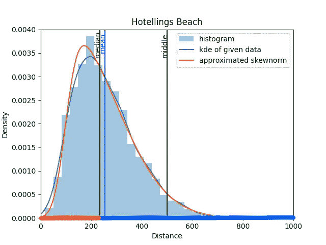

来源:作者

这个游戏的独特纳什均衡是两辆车都把自己定位在中间日光浴者的位置。在这种情况下，两辆车平分市场，任何一方都没有动力单方面偏离这一选择。

## **最后一个问题:**

为了总结这一节，给你一个问题:**如果我们改变这个游戏，在同一片海滩上有 3 辆冰淇淋车，那么沿着海滩的平衡点在哪里？**你可以在文末找到答案

# 霍特林模型的应用

霍特林模型在现实世界中有它自己的一些应用。

*   **聚类**:经常观察到企业位置彼此靠近(如同一十字路口的加油站)。在许多情况下，如果他们不这样做，而是位于一个更分散的地方，对消费者来说会更好:交通会更少，普通消费者也不必走太远就能买到他需要的东西。那么，企业为什么会集群呢？霍特林模型提供了一个可能的答案:由于竞争，它们最终聚集在一起，这促使它们都试图定位于潜在客户群的“中间”。
*   **政治竞争**:霍特林模型也被用来解释为什么在只有两个政党的政治体系中(例如美国)，每个政党都比投票给该党的普通人更倾向于中间立场。例如，在没有社会党或绿党的情况下，大型左翼政党知道，即使它采取更加中间派的立场，极左翼选民也会支持它。但通过采取更为中间的立场，它希望赢得一些中间派人士。在极端情况下，如果两个主要政党都这样推理，每个政党都会提出一个中间选民更喜欢的政纲。这个结果被称为**中间选民定理。**

# 持续策略

## 当策略变得连续和无限时，寻找找到纳什均衡的可能性

当每个玩家的策略数量相当少时，表示和求解博弈的最简单的方法就是通过收益矩阵。然而，**当策略的数量变得足够大时，创建收益矩阵变得太单调乏味和耗时，以至于没有用处**。当可用策略的集合变得无限时，用收益矩阵表示就变得不可能了。

当策略变得连续和无限时，纳什存在定理不能保证我们会找到纳什均衡。然而，我们仍然需要知道如何寻找一个！前面研究的两个应用给出了一些连续策略博弈的例子。特别值得注意的是观察到**寻找纳什均衡的最有效方法可能因游戏**而异。在一些游戏中，猜测和检查会很快引导我们找到答案。

然而，越来越多的时候，我们会发现在游戏中**寻找均衡的最快方法包括推导玩家的最佳反应函数**。由于这个原因，数学，尤其是微积分和线性代数，成为我们解决这些问题的最有价值的工具。然而，以类似的方式，连续的高维度问题空间使得使用矩阵求解这些游戏变得困难，在连续的高维度问题空间中导出游戏的最佳响应函数对于手动执行的数学解也很快变得困难。

幸运的是，我们有计算机，这使得连续的、高维度的问题空间成为一个相对微不足道的问题。

没有一种方法永远是最好的，但无论你使用哪种方法，记住纳什均衡的定义不会改变:所有这些方法，**目标是找到一个策略轮廓，没有参与者有动力单方面偏离它。**

# 补偿游戏(又名“旅行者困境”)

照片由 [Natali Quijano](https://unsplash.com/@natallmighty?utm_source=medium&utm_medium=referral) 在 [Unsplash](https://unsplash.com?utm_source=medium&utm_medium=referral) 上拍摄

这又是一个经典的博弈论游戏。它会出现在每一门博弈论的课程中。场景是这样的:你和你的伴侣都从国外旅行回来，乘坐天空航空公司的航班。在旅行中，你们都获得了相同的纪念品。

天空航空公司通知您，他们已经丢失了您的两个纪念品。他们愿意赔偿你们两人 5 到 20 美元(他们的最高赔偿额)。

不用和对方说话，你要填写一张表格，说明你丢失的纪念品的价值。如果你们的价值观相符，天空航空公司会给你们每人一份书面价值。

如果您的值不匹配，Sky airways 将为您提供较低的书面值。写下较低数值的人也会因为他们的“诚实”获得额外的 5 美元奖励。

这似乎是一个机会，可以玩一个你在学习 Python 中的 if/elif/else 子句时学到的小游戏。您必须将它粘贴到您的首选 IDE 中才能运行它。

试一试吧！

来源:作者

你玩了多少次才意识到有一种策略支配了所有其他策略？

再一次，纳什均衡是每个参与者都压低他们的补偿值，遵循的逻辑几乎和我们在古诺和伯特兰看到的一样。因此，唯一的纳什均衡是双方都写下 5 美元。显然，在我编写的非常简单的游戏中，计算机不知道这一点，所以一旦你意识到这一点，每次出价 5 美元就会赢，我保证！

# **结论:**

你可能已经注意到，所有这些例子都描绘了一种均衡，这种均衡可以被描述为“向下竞争”。均衡的结果对双方都不好。虽然很明显是人为的，但这并非偶然。它是游戏条件的一个函数，这在文章的开头已经说明了:

*   这个游戏的特点是完全信息。
*   游戏中的决定是同时做出的。没有一个玩家有机会先行动，或者有机会后行动并观察其竞争对手的行为。
*   竞争者是无差别的。两者成本函数相同，产品无差别。因此，双方都没有战略优势。
*   市场是自我清算的，这意味着总需求等于总供给，即两个竞争者的产出之和。
*   这个游戏是一次性游戏。每个玩家进行一次互动，然后就再也不互动了。

一开始，我们注意到这些条件不是很现实，现实世界的战略互动很少符合这些条件。事实上，正是这些条件的强加创造了一种竞争态势，实际上是一场逐底竞争。我们在游戏研究的早期阶段强加这些条件，是为了让基本概念更容易理解。

以一种非常真实的方式，这种强加违反了理性的条件:没有一家公司可以长期不盈利。选择在这样的条件下*运行任意长的时间*都是不理智的。请记住，这些是一次性的，同时进行的游戏。时间不是一个变量。因此，我们巧妙地回避了这个问题。这看起来像是“戏法”，在某种程度上的确如此。

说了这么多，我们现在已经到了探索博弈论的第一部分的结尾，我们已经涵盖了基础知识。从现在开始，我们将逐步放松这些条件，让我们的游戏更接近真实世界的情况。

## PS:关于霍特林海滩的问题的答案，有 3 辆手推车:

一公里上有 3 辆车时，*不可能有均衡。不管手推车自身定位在哪个点，总是有动力偏离并向左或向右移动一点，以获得更大的市场份额。这是一个简单而有力的例子，说明了改变一个变量可以极大地改变游戏的动态。*

# ***早期文章:***

*可能有助于刷新您对术语和概念的记忆。*

*</game-theory-666abe63215e>  </dominated-strategies-58504fe12106>  </the-nash-equilibrium-c9872e079232> *