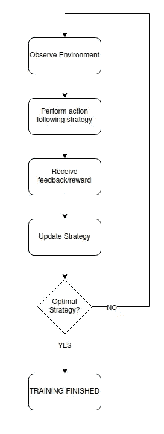
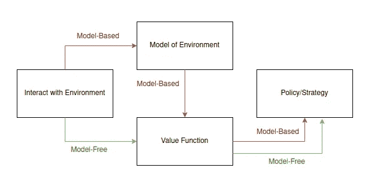
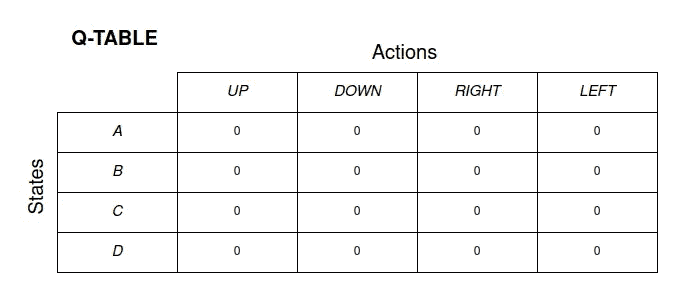
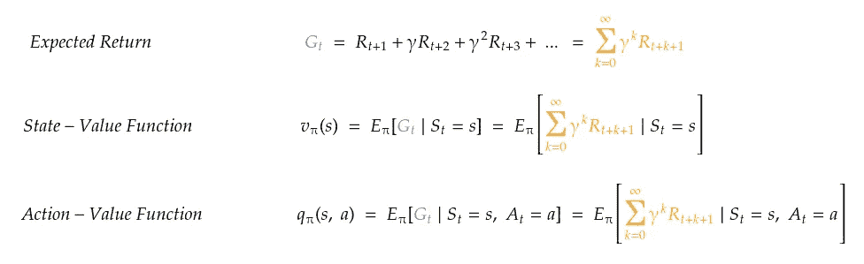
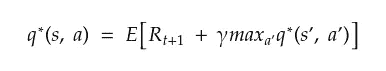
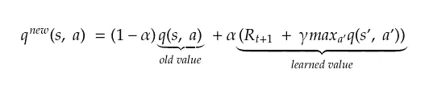
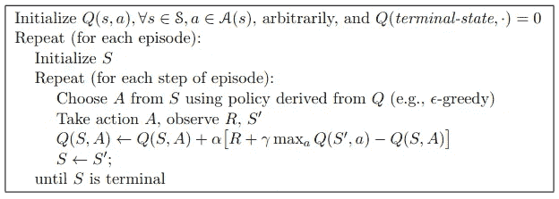

# 应用强化学习 I:Q-学习

> 原文：<https://towardsdatascience.com/applied-reinforcement-learning-i-q-learning-d6086c1f437>

## 逐步理解 Q 学习算法，以及任何基于 RL 的系统的主要组件

照片由 [DeepMind](https://unsplash.com/@deepmind?utm_source=medium&utm_medium=referral) 在 [Unsplash](https://unsplash.com?utm_source=medium&utm_medium=referral) 上拍摄

我们都经历过这样的情况，我们做了错事，为此受到惩罚，这让我们不会再犯。同样的，很多时候好的行为会得到回报，鼓励我们在更多的场合重复这些行为。遵循这种并行性，强化学习代理将遵循策略/政策采取某些行动，并根据所采取的行动是否有益来接收正面或负面的反馈。这个奖励然后被用来更新策略，整个过程被重复，直到达到一个最优策略，如图*图 1* 所示。

在心理学中，有一种学习程序叫做*工具性或操作性条件反射***【1】**，它是基于给定行为发生的概率取决于预期的后果。这个学科的主要目标是增加或减少一个行为被重复的概率，这与强化学习的方法完全相同！

> 强化学习代理的目标是通过代理与动态环境的连续交互，优化所采取的行动，以获得尽可能高的回报。

因此，可以看出，强化学习的主要前提是如何基于生物学习过程的，以及这些过程如何在整个人类历史中被证明是有效的，这使其成为机器学习最令人兴奋和有趣的分支之一。

图一。强化学习流程。作者图片

## 无模型和基于模型的 RL 算法

在继续解释和实现 Q 学习算法之前，重要的是要注意 RL 算法分为两大类:**基于模型的**算法和**无模型的**算法。

前者旨在通过与环境的交互来学习环境模型，这样代理就能够在采取给定行动之前预测该行动的回报(通过拥有环境模型，它可以预见每个行动之后会发生什么)，从而允许进行行动规划。另一方面，无模型算法必须采取一个行动，以便观察其后果，然后从中学习(见*图 2* )。需要注意的是，‘*模型’*这个词并不是指机器学习模型，而是指环境本身的一个模型。为了更深入地解释这两个群体之间的差异，看看这篇文章**【2】**。

正如后面将要看到的，Q-Learning 是一种无模型算法，因为它的学习包括采取行动、接受奖励以及从采取这些行动的结果中学习。

图二。作者图片

# q 学习

Q 学习算法利用包含状态-动作对的 **Q 表** (2D 矩阵)，使得表/矩阵中的每个值 **Q(S，A)** 对应于在状态 **A** 中采取动作 **S** 的 **Q 值**估计值(Q 值将在后面介绍)。当代理与环境交互时，Q 表的 Q 值将收敛到它们的最优值，直到找到最优策略。

一开始理解所有这些术语很复杂，出现许多问题是正常的:什么是 Q 值？Q 表是如何构造的？Q 值是如何更新的？

理解算法流程所需的所有概念，以及上面的问题，都在下面解释。

## q 表结构

如前所述，Q 表是一个矩阵，其中每个元素对应一个状态-动作对。因此，Q 表将是一个 **m** x **n** 矩阵，其中 **m** 是可能状态的数量，而 **n** 是可能动作的数量。Q 表的 Q 值必须有一个初始值，因此该表将被初始化，所有值都被设置为零。

***举例:***

为了简单起见，环境将是一个有 4 种可能状态(A、B、C、D)的房间，如图所示。此外，代理将能够执行 4 个可能的动作:向上、向下、向左和向右。

示例环境。作者图片

考虑到上面提到的代理和环境，Q 表将是 4x4 矩阵，4 行对应于 4 种可能的状态，4 列对应于 4 种可能的动作。从下面可以看出，所有的值都被初始化为零。

初始化 Q 表。作者图片

## q 值

一旦 Q 表被初始化，代理可以开始与环境交互，并更新 Q 值以实现最优策略。但是，Q 值是如何更新的？

首先，重要的是介绍一下**值函数的概念，**更早的出现在*图 2* 中。价值函数是对代理处于给定状态或给定状态-动作对的益处的度量。

价值函数有两种:**状态-价值函数**， **v(S)** ，决定在遵循某一政策的同时处于某一特定状态的利益；以及**行动-价值函数**， **q(S，A)** ，其确定在遵循某一政策的同时从特定状态采取特定行动的收益。更具体地说，这些函数返回从一个状态(对于状态-值函数)或一个状态-动作对(对于动作-值函数)开始并遵循给定策略的预期收益。

下面显示了这两种功能，以及一篇深入解释它们的重要性和存在理由的文章的链接。

期望回报、状态价值和行动价值函数的方程式。作者图片

<https://www.analyticsvidhya.com/blog/2021/02/understanding-the-bellman-optimality-equation-in-reinforcement-learning/>  

动作值函数的结果称为 Q 值，如前所述，它是构成 Q 表的每个像元。因此，Q 表为我们提供了从某个状态采取某个动作的预期好处，代理将使用该信息在环境中最优地移动。因此，代理的目标将是找到**最优动作值函数**， **q*(S，A)** ，(最优 Q 值)，使得它遵循任何策略从任何状态-动作对返回最高可能的回报。

## q 值更新

最优动作值函数 q*(S，A)的一个性质是它满足贝尔曼最优性方程，如下所示。知道了这一点，贝尔曼方程就可以用来迭代地推断出最优的行动值函数，这是代理人的主要目标。

贝尔曼最优方程。作者图片

在 Q 学习的情况下，图 3 中*所示的贝尔曼最优方程的修改用于迭代更新 Q 表的 Q 值。该等式用于在每次迭代中将当前 Q 值与最佳值进行比较，以减少误差，并寻求使两者相等。*

q 值更新方程。作者图片

注意，Q 值更新方程利用了一个被称为**学习率**的 **α** 参数，该参数表示新 Q 值在每次更新/迭代中的权重。学习率为 0 将导致代理从不更新其动作值函数，而学习率为 1 将导致仅考虑新学习的 Q 值。通过反复试验找到该参数的理想值是常见的。

## 算法流程

现在已经解释了算法的所有组件和步骤，是时候将它们放在一起并让代理学习了。下面是算法的伪代码，它将在 Q-Learning 的实现过程中用作参考。

q-学习伪代码。摘自萨顿和巴尔托:《强化学习:
导论**【3】**

## 1.初始化 Q 表

如前所述，用依赖于可能的状态和动作的数量的形状来初始化 Q 表，并且将其所有值设置为零。

## 2.**开始第一集**

每集都将运行，直到代理达到终端/目标状态。代理从随机状态开始剧集，对于剧集中的每个时间步长，它将:

**1)** 根据策略采取行动(该算法最常用的是 **ɛ-greedy 策略)。**

> ɛ-greedy 策略试图在随机探索环境以学习和通过根据 q 值选择最佳行动来利用环境之间取得平衡。政策对环境的勘探或开发的倾向由ε**ɛ**参数给出，允许政策从勘探行为开始，并动态地将其改变为开发行为。有关此政策的更多信息，请参见**【4】**。

**2)** 根据前面提到的 Q 值更新公式，根据达到的新状态和获得的奖励计算新的 Q 值。

从达到的新状态开始下一个时间步。

所有剧集完成后，训练将会结束。在这一点上，Q 表的 Q 值将是最优的(只要训练有效)，这意味着如果代理人选择具有最高 Q 值的行动 A，他将在每个状态 S 中获得最大回报。

最后，为了在非训练环境中使用受过训练的代理，只需要使它在每个时间步中选择具有最高 Q 值的动作，因为 Q 表已经在训练期间被优化。

# 密码

为了便于理解和学习，Q-Learning 算法的完整实现，以及受过训练的代理的可视化和评估，可以在我的 GitHub 存储库中找到，作为一个 Jupyter 笔记本。

<https://github.com/JavierMtz5/ArtificialIntelligence>  

然而，我不得不提到，这篇文章仅涉及算法的理论和介绍性概念，并不关注它在代码中的实现。这是因为这个月我将发表另一篇文章，专门关注该算法的实现及其在一个已知的 OpenAI 健身房环境中的实际应用。如果你有兴趣，请跟我来，这样你就不会错过了！

# 参考

**【1】**施塔顿，约翰·尔；丹尼尔·t·塞鲁蒂《操作性条件反射》。*《心理学年刊》*，2003 年，第 54 卷，第 115 页

**【2】**基于模型和无模型的强化学习[https://Neptune . ai/blog/Model-Based-and-Model-Free-Reinforcement-Learning-py tennis-case-study](https://neptune.ai/blog/model-based-and-model-free-reinforcement-learning-pytennis-case-study)

**【3】**萨顿，理查德·s；强化学习:介绍。麻省理工学院出版社，2018

**【4】**Epsilon-Greedy 算法在强化学习中的应用[https://www . geeks forgeeks . org/Epsilon-Greedy-Algorithm-in-Reinforcement-Learning/](https://www.geeksforgeeks.org/epsilon-greedy-algorithm-in-reinforcement-learning/)