# 使用 map()、Apply()、applymap()和 pipe()将函数应用到 Pandas 数据帧

> 原文：<https://towardsdatascience.com/apply-functions-to-pandas-dataframe-using-map-apply-applymap-and-pipe-9571b1f1cb18>

## 什么是熊猫地图，应用，应用地图和管道？


照片由 [Sid Balachandran](https://unsplash.com/@itookthose?utm_source=medium&utm_medium=referral) 在 [Unsplash](https://unsplash.com?utm_source=medium&utm_medium=referral) 上拍摄

# 介绍

`apply`、`applymap`、`map`和`pipe`可能会令人困惑，特别是如果你对熊猫不熟悉的话，因为它们看起来都很相似，并且能够接受功能作为输入。这里有一个不同方法的快速比较。

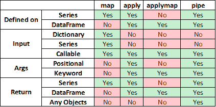

作者图片

我们将使用下面的样本数据来详细研究它们。

```
# python version 3.9
# pandas version 1.4.1import pandas as pddf = pd.DataFrame({'name':['John Doe', 'Mary Re', 'Harley Me'],
                   'gender':[1,2,0],
                   'age':[80, 38, 12],
                   'height': [161.0, 173.5, 180.5],
                   'weight': [62.3, 55.7, 80.0]
                   })
```


作者图片

*   `gender` : 0，1，2 分别表示“未知”、“男性”和“女性”
*   `height`:厘米
*   `weight`:单位为千克

# 熊猫`map()`是什么？

> `*pandas.series.map*` *根据输入映射函数映射系列的值。用于将一个数列中的每一个值替换为另一个值，该值可以是从一个函数、一个字典或一个数列中导出的。*

**参数**

*   `arg`:映射对应关系
*   `na_action` : { '无'，'忽略' }。默认无。如果“ignore ”,则传播 NaN 值，而不将它们传递给映射对应。

**退货**

*   `Series`

**要点**

1.  仅适用于熊猫系列
2.  元素式操作
3.  主要用于替换值
4.  `arg`参数接受旧值和新值之间的映射，可以是(a)字典、(b)系列和(c)函数的形式。

**字典**

目标是将编码的性别(0，1，2)替换为它们的实际值(未知，男性，女性)。

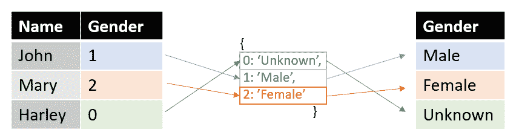

作者图片

首先，我们以下面的形式`{previous_value_1: new_value_1, previous_value_2:new_value_2..}`定义编码值和实际值之间的映射字典，然后我们将`.map()`应用到`gender`列。`.map()`在映射字典中查找对应于编码性别的关键字，并用字典值替换它。

```
gender_map = {0: 'Unknown', 1:'Male', 2:'Female'}
df['gender'] = df['gender'].map(gender_map)
```

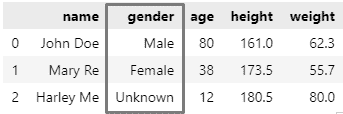

作者图片

如果在映射字典中没有找到键值对，输出将是`Nan`。`{0: 'Unknown'}`的映射被删除，这是输出的样子。

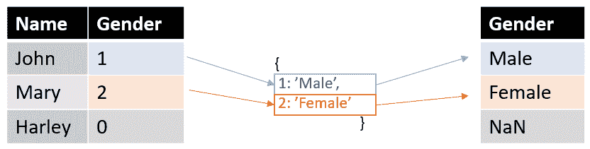

作者图片

```
gender_map = {1:'Male', 2:'Female'}
df['gender'] = df['gender'].map(gender_map)
```

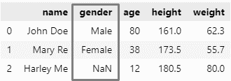

作者图片

**系列**

我们不使用映射字典，而是使用映射序列。`.map()` looks 在序列中查找对应于编码性别的相应索引，并用序列中的值替换它。

映射系列的`index`包含编码的性别，而`gender`列包含性别的实际值。

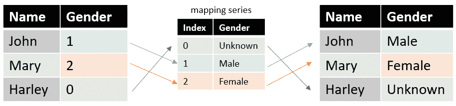

作者图片

```
gender_map = {0: 'Unknown', 1:'Male', 2:'Female'}
s = pd.Series(gender_map) # mapping series
df['gender'] = df['gender'].map(s)
```

如果在系列中找不到映射，输出将是`NaN`。

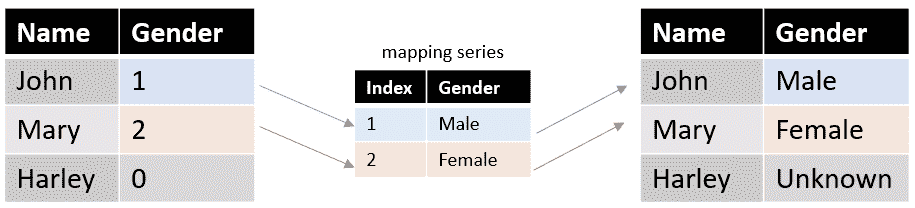

作者图片

```
gender_map = {1:'Male', 2:'Female'}
s = pd.Series(gender_map) # mapping series
df['gender'] = df['gender'].map(s)
```

**功能**

我们也可以使用一个函数(或 lambda)作为`.map()`中的`arg`参数。让我们尝试使用 lambda 函数给每个人分配一个`age_group`类别(成人或儿童)。

```
df['age_group'] = df['age'].map(lambda x: 'Adult' if x >= 21 else 'Child')
```

或者，我们可以做以下事情。

```
def get_age_group(age): threshold = 21 if age >= threshold:
        age_group = 'Adult'
    else:
        age_group = 'Child' return age_groupdf['age_group'] = df['age'].map(get_age_group)
```

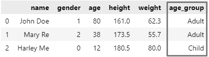

作者图片

注意，年龄阈值在`get_age_group`函数中是硬编码的，因为`.map()`不允许向函数传递参数。

# 什么是熊猫`apply()`？

`.apply()`适用于熊猫数据框和系列。当应用于数据帧时，`.apply()`可以按行或列操作。

## `Series.apply()`

> *对系列的值调用函数。可以是 ufunc(适用于整个系列的 NumPy 函数)或只对单个值起作用的 Python 函数。*

**参数**

*   `func`:功能
*   `convert_dtype`:布尔值，默认为真。尝试为 elementwise 函数结果找到更好的数据类型。如果为 False，则保留为 dtype=object。注意，对于某些扩展数组 dtype，比如 Categorical，总是保留 dtype。
*   `args`:元组。序列值后传递给`func`的位置参数。
*   `**kwargs`:传递给`func`的附加关键字参数。

**返回**

*   `Series`或`DataFrame`
*   如果`func`返回一个系列对象，结果将是一个数据帧。

**要点**

*   适用于熊猫系列
*   接受一个函数
*   能够将位置或关键字参数传递给函数
*   可以返回序列或数据帧

从前面的例子中，我们看到`.map()`不允许参数被传递到函数中。另一方面,`.apply()`允许传递位置或关键字参数..让我们参数化这个函数来接受一个`thershold`参数。

```
def get_age_group(age, threshold): if age >= int(threshold):
        age_group = 'Adult'
    else:
        age_group = 'Child' return age_group
```

将`threshold`作为关键字参数传递

```
# keyword argument
df['age_group'] = df['age'].apply(get_age_group, threshold = 21)
```

传`threhsold`作为立场论点

```
# positional argument
df['age_group'] = df['age'].apply(get_age_group, args = (21,))
```

**多重论证**

`.apply()`也可以接受多个位置或关键字参数。让我们根据年龄下限和上限将`age`分成 3 个`age_group`(儿童、成人和老年人)。

```
def get_age_group(age, lower_threshold, upper_threshold): if age >= int(upper_threshold):
        age_group = 'Senior'
    elif age <= int(lower_threshold):
        age_group = 'Child'
    else:
        age_group = 'Adult' return age_group
```

将`lower_threshold`和`upper_threshold`作为关键字参数传递

```
df['age_group'] = df['age'].apply(get_age_group, lower_threshold = 20, upper_threshold = 65)
```

将`lower_threshold`和`upper_threshold`作为位置参数传递

```
df['age_group'] = df['age'].apply(get_age_group, args = (20,65))
```

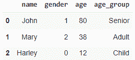

作者图片

**应用数字功能**

除了应用 python 函数(或 Lamdba)，`.apply()`还允许 numpy 函数。例如，我们可以应用 numpy `.ceil()`将每个人的`height`四舍五入到最接近的整数。

```
df['height'] = df['height'].apply(np.ceil)
```

**返回一个系列**

`.apply()`如果函数返回单个值，则返回一个序列。让我们写一个函数来查找一个人的姓。

```
def get_last_name(x): return x.split(' ')[-1]type(df['name'].apply(get_last_name))>> pandas.core.series.Series
```

**返回一个数据帧**

`.apply()`当函数返回一个序列时，返回一个数据帧。

```
def get_last_name(x): return pd.Series(x.split(' ')[-1]) # function returns a Seriestype(df['name'].apply(get_last_name))>> pandas.core.frame.DataFrame
```

## `DataFrame.apply()`

> *沿数据帧的轴应用一个函数。*

**参数**

*   `func`:应用于各列或各行的函数
*   `axis`:沿其应用函数的轴。`axis=0` -对每列应用函数。`axis=1` -将函数应用于每一行。
*   `raw`:确定行或列是作为序列还是 ndarray 对象传递:False——将每行或每列作为序列传递给函数。True -将 ndarray 对象传递给函数。
*   `result_type` :这些只有在`axis=1`(列):
    --【展开】:列表式的结果会变成列。
    --“减少”:尽可能返回一个序列，而不是展开列表式结果。这是“扩展”的反义词。
    --“广播”:结果将被广播到数据帧的原始形状，原始索引和列将被保留。
*   `args`:元组。在序列值之后传递给 func 的位置参数。
*   `**kwargs`:传递给 func 的附加关键字参数。

**回报**

*   `Series`或`DataFrame`

**要点**

*   函数可以按列(`axis = 0`)或行(`axis = 1`)应用
*   能够将数据作为序列或数字数组传递给函数
*   能够将位置或关键字参数传递给函数

**按列应用 numpy 函数**

将身高和体重四舍五入到最接近的整数。函数按照`axis = 0`的定义按列应用。当按列使用时，`pd.DataFrame.apply()`可以一次应用于多个列。

```
df[['height', 'weight']].apply(np.round, axis = 0)
```

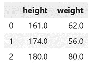

**逐行应用 Lambda 函数**

通过应用由`axis = 1`定义的`split`函数按行将姓名分为名和姓。

```
df.apply(lambda x: x['name'].split(' '), axis = 1)
```

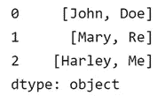

通过将`result_type`参数定义为`expand`，我们可以将列表分解为多列，每列一个元素。

```
df.apply(lambda x: x['name'].split(' '), axis = 1, result_type = 'expand')
```

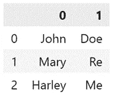

**按行应用函数**

让我们找出每个人的体重指数(身体质量指数)。身体质量指数被定义为以千克为单位的重量除以以米为单位的高度的平方。我们创建一个用于计算身体质量指数的 UDF，并以逐行方式将 UDF 应用于数据帧。按行使用时，`pd.DataFrame.apply()`可以通过根据列名选择列来利用不同列中的值。

```
def calculate_bmi(x):

    bmi = x['weight'] / (x['height']/100)**2

    return bmi

df.apply(calculate_bmi, axis = 1)
```

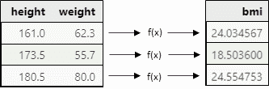

作者图片

# 什么是熊猫`applymap()`？

> *按元素将函数应用于数据帧。该方法将接受和返回标量的函数应用于 DataFrame 的每个元素。*

**参数**

*   `func` : Python 函数，从单个值返回单个值。
*   `na_action` : { '无'，'忽略' }。默认无。如果“ignore ”,则传播 NaN 值，而不将它们传递给映射对应。
*   `**kwargs`:传递给`func`的附加关键字参数。

**返回**

*   `DataFrame`

**要点**

*   适用于熊猫数据框
*   接受一个函数
*   能够将关键字参数传递给函数
*   元素式操作

在下面的例子中，我们对两列数值进行了简单的运算。

```
def some_math(x, multiplier, add): return x * multiplier + adddf = pd.DataFrame({'A':[1,2,3], 'B':[10,20,30]})
df.applymap(some_math, multiplier = 2, add = 1)
```

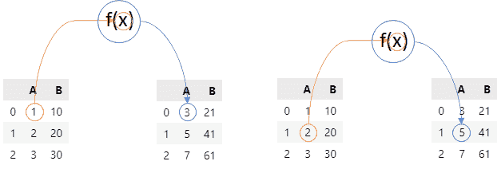

`.applymap()`获取原始数据帧中的每个值，将其作为`x`传递给`some_math`函数，执行运算并返回单个值。`.applymap()`也接受关键字参数，但不接受位置参数。

# 熊猫`.pipe()`是什么？

> *应用期望序列或数据帧的可链接函数。*

**参数**

*   `func`:应用于系列/数据帧的功能
*   `args`:传递给`func`的位置参数
*   `kwargs`:传递给`func`的关键字参数

**退货**

*   `object`:返回类型`func`

**要点**

*   适用于熊猫系列和数据框
*   接受一个函数
*   能够传递参数作为位置或关键字参数
*   返回与`func`相同的对象

**`**pipe**`**如何工作？****

**`.pipe()`通常用于将多个功能链接在一起。例如，我们有 3 个对数据帧进行操作的函数，`f1`、`f2`和`f3`，每个函数都需要一个数据帧作为输入，并返回一个转换后的数据帧。**

```
def f1(df, arg1):
	# do something return # a dataframedef f2(df, arg2):
	# do something return # a dataframedef f3(df, arg3):
	# do something return # a dataframedf = pd.DataFrame(..) # some dataframe
```

**如果不使用`.pipe()`，我们会以嵌套的方式应用函数，如果有多个函数的话，这可能看起来很难理解。为了遵循函数执行的顺序，必须从“由内向外”阅读。首先执行最内部的功能`f3`，然后执行`f2`，最后执行`f1`。**

```
f1(f2(f3(df, arg3 = arg3), arg2 = arg2), arg1 = arg1)
```

**`.pipe()`避免嵌套，允许使用点符号(`.`)链接函数，使其更具可读性。`.pipe()`还允许传递位置参数和关键字参数，并假设函数的第一个参数引用输入数据帧/序列。**

```
df.pipe(f3, arg3 = arg3).pipe(f2, arg2 = arg2).pipe(f1, arg1 = arg1)
```

**跟随与`.pipe()`链接在一起的功能的执行顺序更直观；我们只是从左向右读。**

**`apply`、`map`和`applymap`被约束为返回 Series、DataFrame 或两者。然而`pipe`可以返回任何对象，不一定是 Series 或 DataFrame。让我们看一些使用相同样本数据集的例子。**

**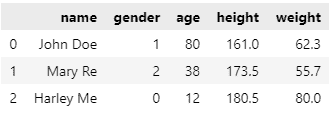**

**下面的函数返回一个浮点值。**

```
def find_average_weight(df): return df['weight'].mean()df.pipe(find_average_weight)>> 66.0
```

**下面的函数返回一个字符串。**

```
def report_average_weight(df): avg_weight = df['weight'].mean() return f'The average weight is {avg_weight}'df.pipe(report_average_weight)>> 'The average weight is 66.0'
```

# **摘要**

**在本文中，我们研究了`map`、`apply`和`applymap`、`pipe`之间的区别，以及如何使用这些方法来转换我们的数据。虽然我们没有详细讨论`map`、`apply`和`applymap`的执行速度，但请注意，这些方法是伪装的循环，只有在没有等效的矢量化运算时才应使用。一般来说，矢量化操作比循环更快，并且随着数据集大小的增加，执行时间的差异变得更加显著。**

*   **[加入 Medium](https://medium.com/@edwin.tan/membership) 阅读更多这样的故事**
*   **[关注我](https://medium.com/@edwin.tan)获取更多类似的帖子**