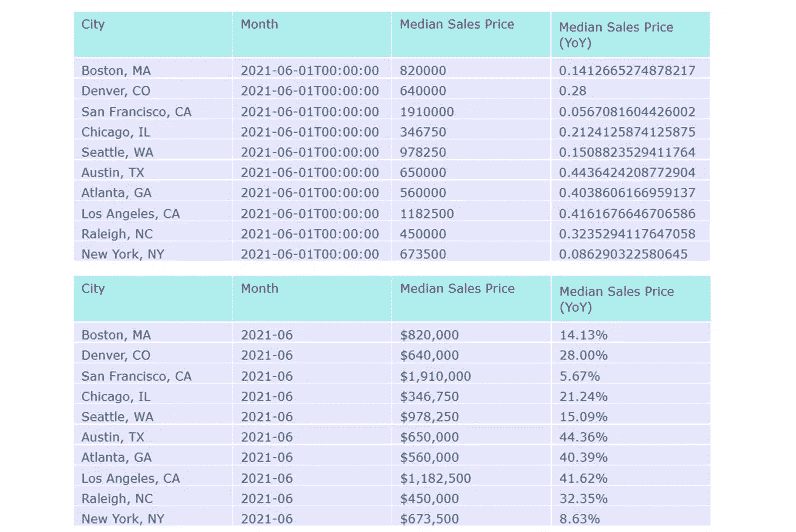
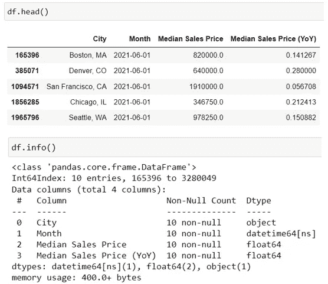
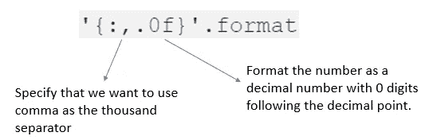
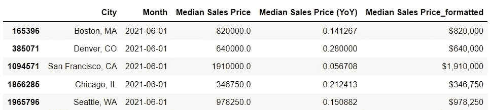
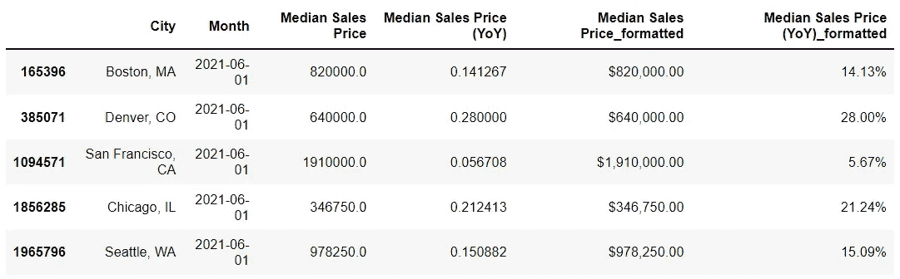
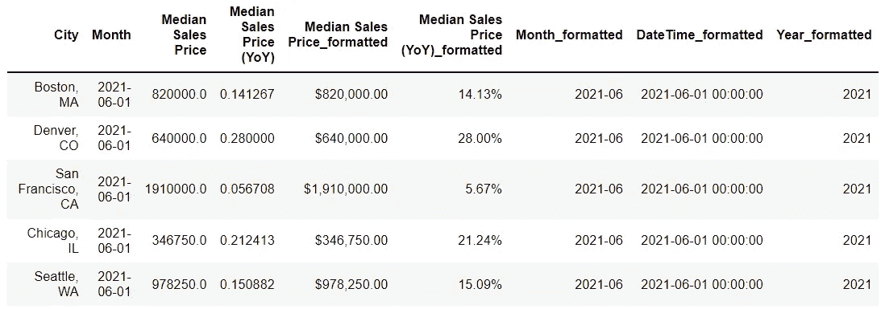
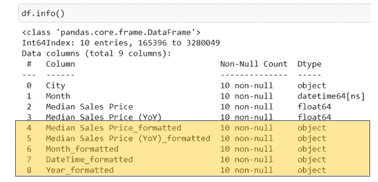

# 对熊猫数据帧应用千位分隔符(和其他格式)

> 原文：<https://towardsdatascience.com/apply-thousand-separator-and-other-formatting-to-pandas-dataframe-45f2f4c7ab01>

## 通过学习这些有用的熊猫格式技巧，为自己节省一些谷歌搜索时间


图片由 [Pixabay](https://pixabay.com/vectors/panda-animal-bamboo-wood-6084417/)

# 介绍

在 pandas 数据框架中格式化数据是一项非常常见的数据科学任务，尤其是为了报告或数据可视化的目的。原始数据通常以各种类型或格式出现，这些类型或格式可能总是适合于分析或可视化。格式化数据有助于我们以一种对读者更友好的方式呈现数据和信息。

看看下面这个例子:哪个报表/表格更容易阅读？如果我们要在图表中可视化这些数据，您更愿意在工具提示中显示顶部还是底部表格中的信息？



作者图片

在这篇文章中，我将与你分享一些熊猫格式技巧，来解决这些常见的格式问题:

*   在数字中插入千位逗号分隔符
*   将数字格式化为百分比
*   将日期/时间列更改为所需的格式

# 抽样资料

我们将使用上面显示的例子来说明如何在 Pandas 数据帧中进行这些格式更改。本教程中使用的样本数据可以从 [Redfin](http://redfin’s data center) 的开放数据中心下载。下面是样本数据的快速概述:



作者图片

# 添加千位逗号分隔符

让我们从“中间销售价格”列开始，看看如何通过在前面添加千个逗号分隔符和一个美元符号来格式化它。下面是实现这一功能的代码:

```
df.loc[:, "Median Sales Price_formatted"] ='$'+ df["Median Sales Price"].map('{:,.0f}'.format)
```



作者图片

我们使用 python 字符串格式语法`'{:,.0f}'.format`为数字添加一千个逗号分隔符。然后，我们使用 python 的`map()`函数进行迭代，并将格式应用于“中间销售价格”列中的所有行。



作者图片

将语法改为`'{:,.2f}'.format`将得到两位小数。

```
df.loc[:, "Median Sales Price_formatted"] ='$'+ df["Median Sales Price"].map('{:,.2f}'.format)
```


作者图片

如果“销售价格中位数”列是整数类型，那么您也可以使用以下代码添加千位逗号分隔符:

```
df.loc[:, "Median Sales Price_formatted"] ='$'+ df["Median Sales Price"].map('{:,d}'.format)
```

# 将数字格式化为百分比

使用相同的字符串格式语法，稍加修改，我们可以轻松地将“销售价格中值同比”列格式化为百分比:

```
df.loc[:, "Median Sales Price (YoY)_formatted"] =df["Median Sales Price (YoY)"].map('{:.2%}'.format)
```



作者图片

# 将日期/时间列格式化为年月

使用相同的技术，我们还可以将“月”列格式化为“年-月”或我们想要的任何格式:

```
df.loc[:, "Month_formatted"] =df["Month"].map('{:%Y-%m}'.format)
df.loc[:, "DateTime_formatted"] =df["Month"].map('{:%Y-%m-%d %H:%M:%S}'.format)
df.loc[:, "Year_formatted"] =df["Month"].map('{:%Y}'.format)
```



作者图片

# 最终想法

我想指出的重要一点是，使用这些格式化技术，格式化的列将变成字符串/对象类型(如下图所示)。最佳做法是，始终将格式化的列保存为新列，不要覆盖原始列。

这是为什么呢？这是因为很多时候，您需要使用具有适当数据类型的原始列进行数据分析，而使用格式化的新列进行报告或可视化。

例如，在我们的用例中，如果“中值销售价格”或“中值销售价格(YoY)”是字符串，您将无法对它们进行适当的数据分析。设置这些列的格式主要是为了使它们在报告或可视化时更易于阅读。



感谢阅读！我希望您喜欢这个关于 Pandas 格式化技巧的简短教程，并且能够很快将这些技巧应用到您的数据科学任务中。你可以阅读我的其他文章来了解更多熊猫的技巧和技术:

</why-and-how-to-reshape-a-pandas-dataframe-from-wide-to-long-ca90c89156b9>  <https://medium.com/codex/how-to-batch-rename-columns-in-pandas-based-on-patterns-7d2382b5fc9a>  

# **参考文献和数据来源**

1.  Python 的常用字符串操作文档:【https://docs.python.org/3/library/string.html#formatstrings 
2.  数据来源:Redfin 月度住房市场数据——城市一级。这是一个由 [Redfin](https://www.redfin.com/news/data-center/) ，提供的开放数据集，你可以免费下载，并注明出处。

你可以通过这个[推荐链接](https://medium.com/@insightsbees/membership)注册 Medium 会员(每月 5 美元)来获得我的作品和 Medium 的其他内容。通过这个链接注册，我将收到你的一部分会员费，不需要你额外付费。谢谢大家！