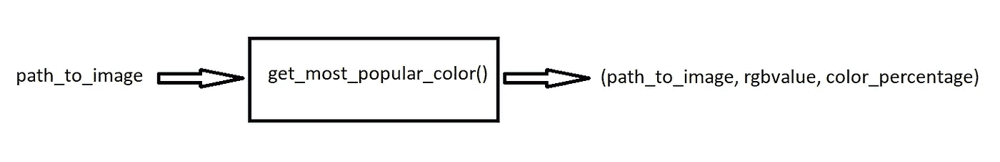

# 在两行代码中应用 Python 多重处理

> 原文：<https://towardsdatascience.com/applying-python-multiprocessing-in-2-lines-of-code-3ced521bac8f>

## 何时以及如何使用多个内核来加快执行速度


多个引擎同时执行(图片由[彼得·普里哈尔斯基](https://unsplash.com/@meteorphoto)在 [Unsplash](https://unsplash.com/photos/oapXDz7x_YE) 上拍摄)

在本文中，我们将在**中多进程处理一个函数，只有两行代码**。在我们的例子中，这将导致代码的**显著加速**。首先，我们将了解何时多处理是一个好主意，然后我们将了解如何应用 3 种类型的多处理，并讨论何时应用哪一种。我们来编码吧！

# 但是首先..

在我们深入探讨如何应用多处理之前，我们需要准备一些东西。首先，我们将讨论一些术语，并确定何时应该采用多重处理。

然后，我们将创建一个示例函数，我们可以在本文中将其用作演示。

## 并发与并行——线程与多处理

Python 中有两种“同时做事情”的方式:线程化和多处理。在本文中，我们将关注后者。一个简短的区别:

*   **线程**并发运行代码**:我们有**一个活动的 CPU** ，它可以在多个线程之间快速切换(查看下面的文章)**
*   ****多重处理**以**并行**方式运行代码:我们有**多个活动的 CPU**，它们各自运行自己的代码**

**[](/thread-your-python-program-with-two-lines-of-code-3b474407dbb8) [## 用两行代码线程化您的 Python 程序

### 通过同时做多件事来加速你的程序

towardsdatascience.com](/thread-your-python-program-with-two-lines-of-code-3b474407dbb8) 

因此，在本文中，我们将演示如何并行运行代码。如果您对线程和多处理之间的区别以及何时应用哪个感兴趣；查看下面的文章，获得更深入的解释。

一般来说，如果你的代码涉及大量的计算，并且每个进程或多或少都是独立的(因此进程不必互相等待/需要另一个进程的输出),那么多处理是正确的想法。

[](/multi-tasking-in-python-speed-up-your-program-10x-by-executing-things-simultaneously-4b4fc7ee71e) [## Python 中的多任务处理:通过同时执行，将程序速度提高 10 倍

### 应用线程和进程加速代码的分步指南

towardsdatascience.com](/multi-tasking-in-python-speed-up-your-program-10x-by-executing-things-simultaneously-4b4fc7ee71e) 

# 为本文创建一个示例

在这篇文章中，我们将假设有一家公司做图像分析。客户可以给我们发送一个或多个图像，我们分析后发回。

目前我们只有一个功能:`get_most_popular_color()`；它接收图像路径，加载图像并计算最常见的颜色。它返回图像的路径、颜色的 rgb 值以及具有该颜色的像素的百分比。点击 查看源代码 [**。**](https://gist.github.com/mike-huls/896ab6bb00c390d1038c0c1220ac0bab)



我们的目标函数(图片由作者提供)

这个函数适合 MP，因为它要计算很多；它必须遍历图像中的每个像素。

[](/image-analysis-for-beginners-destroying-duck-hunt-with-opencv-e19a27fd8b6) [## 用 OpenCV 破坏猎鸭——初学者的图像分析

### 编写代码，将击败每一个鸭子狩猎高分

towardsdatascience.com](/image-analysis-for-beginners-destroying-duck-hunt-with-opencv-e19a27fd8b6) 

# 代码部分:正常应用我们的函数并使用 MP

我们从客户那里收到了 12 张图片；都在 0.2 到 2 MB 之间。我将所有图片的路径存储在一个字符串数组中，如下所示。在我们将多重处理应用到我们的函数之前，我们将正常运行`get_most_popular_color()`函数，这样我们就有东西可以比较了。

```
image_paths = [
    'images/puppy_1.png',
    'images/puppy_2.png',
    'images/puppy_3.png',
    'images/puppy_4_small.png',
    'images/puppy_5.png',
    'images/puppy_6.png',
    'images/puppy_7.png',
    'images/puppy_8.png',
    'images/puppy_9.png',
    'images/puppy_10.png',
    'images/puppy_11.png',
    'images/puppy_12.png',
]
```

## 1.正常方式:连续运行

处理这 12 幅图像最明显的方法是循环遍历它们，一幅接一幅地处理它们:

这里没什么特别的。我们只是为 image_paths 数组中的每个图像调用函数。在添加一些打印内容来告诉我们更多关于执行时间的信息后，我们得到以下输出:

正如你所看到的，我们一个接一个地处理并打印出每个图像的结果。总的来说，这个过程需要**比**多一点的时间。

**什么时候用这个？如果你的时间不重要，并且你想让你的结果一个接一个地按顺序排列，这种方法是合适的。一旦 image1 准备就绪，我们就可以将结果发送回客户端。**

[](/why-is-python-so-slow-and-how-to-speed-it-up-485b5a84154e) [## Python 为什么这么慢，如何加速

### 看看 Python 的瓶颈在哪里

towardsdatascience.com](/why-is-python-so-slow-and-how-to-speed-it-up-485b5a84154e) 

## 2.正常方式:使用地图

运行该函数的另一种方式是应用 Python 的`map`函数。主要区别在于，它会一直阻塞到所有函数都执行完，这意味着我们只能在图像 12 被处理后才能访问结果。这看起来像是降级，但它有助于我们更好地理解本文的下一部分:

在下面的输出中，您将看到我们只能在每个函数完成后访问结果，换句话说:在函数上使用`map`会阻塞结果。您可以在输出中看到其结果:

8.324 秒打印所有行；与整批花费的时间相同。这证明在我们可以访问结果之前，所有的函数都必须完成。

**什么时候用这个？** 当单个客户发送一批图像时，我们希望对它们进行处理，并发回一条包含所有结果的消息。我们不会针对每个结果向客户发送电子邮件。

[](/cython-for-absolute-beginners-30x-faster-code-in-two-simple-steps-bbb6c10d06ad) [## 面向绝对初学者的 Cython:通过简单的两步将代码速度提高 30 倍

### 为速度惊人的应用程序轻松编译 Python 代码

towardsdatascience.com](/cython-for-absolute-beginners-30x-faster-code-in-two-simple-steps-bbb6c10d06ad) 

## 3.多重处理:映射

我们不想等 8 秒钟，那太久了！在这一部分，我们将从`multiprocessing`库中应用一个`Pool`对象。这个简单而安全的解决方案非常容易应用，只需增加 **2 行代码**:

我们将采用前一部分的代码，添加一个进程池，并使用进程池的`map`函数，而不是像前一部分那样使用 Python 的默认函数:

仅仅用两行额外的代码就可以并行运行我们的函数，这难道不令人惊奇吗？查看以下结果:

`Pool.map`函数做的事情与 Python 的默认 map 函数完全相同:它执行所有函数，只有这样您才能访问结果。你可以从所有结果都打印在 1.873 秒的事实中看出这一点。最大的不同是它并行运行函数:它同时执行 12 个函数调用，**将执行时间从 4 倍减少到 2 秒以下！**

**什么时候用这个？** 与方法 2 一样，结果被锁定(不可访问)，直到所有功能完成。由于它们都是并行运行的，现在我们只需等待 2 秒钟，而不是 8 秒钟。我们仍然不能像#1 那样真正地循环结果，所以这种方法适合处理像#2 那样的批处理。

[](/virtual-environments-for-absolute-beginners-what-is-it-and-how-to-create-one-examples-a48da8982d4b) [## 绝对初学者的虚拟环境——什么是虚拟环境，如何创建虚拟环境(+例子)

### 深入探究 Python 虚拟环境、pip 和避免纠缠依赖

towardsdatascience.com](/virtual-environments-for-absolute-beginners-what-is-it-and-how-to-create-one-examples-a48da8982d4b) 

## 4.用迭代器进行多重处理

在前一部分中，我们使用了`map`函数，但是还有其他的选择。在这一部分，我们将检查`imap`。这个函数的功能大致相同，但它不是在所有函数调用完成之前一直阻塞，而是返回一个迭代器，一个调用完成就可以访问这个迭代器:

正如你所看到的，代码与前一部分几乎完全相同，除了我们将`map`改为`imap`。然而，添加这一个字母对结果有一些影响:

请注意，现在有些函数比其他函数完成得早。

差别很小，但是很明显:像上一部分一样，每个函数调用完成的时间是不一样的。`imap` 函数并行启动每个调用；为每一个人设计一个程序。然后，一旦准备好，它就按顺序返回每个结果*。这就是为什么一些电话一个接一个地结束，而另一些电话需要更长时间的原因。从这个意义上说，`imap`类似于执行函数的“正常”Python 方式，如#1。*

***什么时候用这个？** 当多个客户端各自发送一张我们需要处理的图片时，我们现在可以使用`imap`功能并行处理。把这个函数想象成#1 的平行版本；这是一个普通的循环，但是要快得多。*

*[](/docker-for-absolute-beginners-what-is-docker-and-how-to-use-it-examples-3d3b11efd830) [## 面向绝对初学者的 Docker——什么是 Docker 以及如何使用它(+示例)

### 像管理应用程序一样管理您的基础架构

towardsdatascience.com](/docker-for-absolute-beginners-what-is-docker-and-how-to-use-it-examples-3d3b11efd830)* 

## *5.用忽略输入顺序的迭代器进行多重处理*

*最后一种方法是`imap_unordered`。叫声几乎一模一样:*

*这个调用与前一部分非常相似；唯一的区别是，它一准备好就返回每个结果:*

*注意到图像的顺序已经改变了吗？有些图像已经在 0.6 秒后返回！*

*我们仍然在 2 秒内完成，但是完成的顺序有很大的不同。请注意，`images/puppy_4_small.png`首先被返回。这并不奇怪，因为这个图像要小得多。它不必等待其他碰巧较慢的函数调用。分析这个输出，你可能会注意到我偷懒复制了我们的输入图像。*

***什么时候用这个？** 这个函数是#1 和#4 的升级版:它类似于普通的 for 循环，但是它以并行方式执行所有的函数，并且一旦任何函数准备就绪，就可以访问结果。有了这个功能，拥有小图像的客户端不必等到大图像完成后才能收到结果。*

*[](/image-analysis-for-beginners-creating-a-motion-detector-with-opencv-4ca6faba4b42) [## 用 OpenCV 检测运动——适合初学者的图像分析

### 如何用 OpenCV 检测和分析运动物体

towardsdatascience.com](/image-analysis-for-beginners-creating-a-motion-detector-with-opencv-4ca6faba4b42)* 

# *限制进程/内核的数量*

*限制池在任何给定时间允许的最大进程/核心/CPU 数量非常容易:只需在实例化池时添加 processes 参数，如下所示:*

```
*with Pool(processes=2) as mp_pool:
    ... rest of the code*
```

# *结论*

*添加多个进程使我们的代码并行运行并不困难；挑战在于知道何时应用哪种技术。总之:多处理库的池对象提供了三个函数。`map``是 Python 内置`map`的并行版本。`imap`函数返回一个有序迭代器，访问结果被阻塞。`imap_unordered`函数返回一个无序迭代器；使它可以在完成后立即访问每一个结果，而不需要等待另一个函数的开始。*

*我希望这篇文章像我希望的那样清楚，但如果不是这样，请让我知道我能做些什么来进一步澄清。同时，看看我的[关于各种编程相关话题的其他文章](https://mikehuls.com/articles?tags=python)，比如:*

*   *绝对初学者的 Git:借助视频游戏理解 Git*
*   *[创建并发布自己的 Python 包](https://mikehuls.medium.com/create-and-publish-your-own-python-package-ea45bee41cdc)*
*   *[用 FastAPI 用 5 行代码创建一个快速自动记录、可维护且易于使用的 Python API](https://mikehuls.medium.com/create-a-fast-auto-documented-maintainable-and-easy-to-use-python-api-in-5-lines-of-code-with-4e574c00f70e)*

*编码快乐！*

*—迈克*

*附注:喜欢我正在做的事吗？ [*跟我来！*](https://mikehuls.medium.com/membership)*

*[](https://mikehuls.medium.com/membership) [## 通过我的推荐链接加入媒体-迈克·赫斯

### 阅读迈克·赫斯(以及媒体上成千上万的其他作家)的每一个故事。你的会员费直接支持麦克…

mikehuls.medium.com](https://mikehuls.medium.com/membership)***