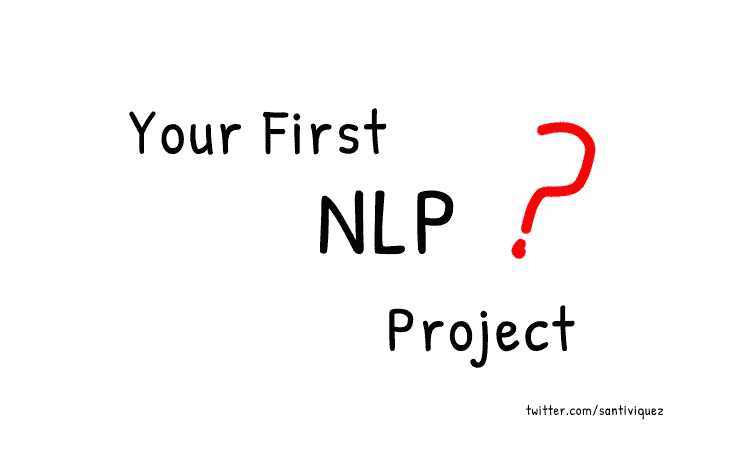
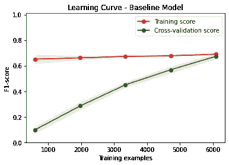
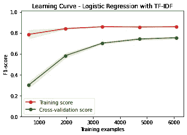
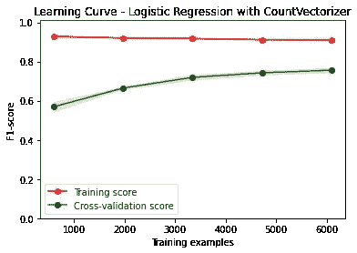
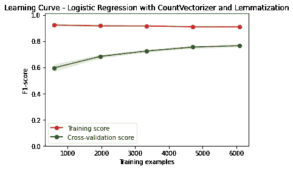
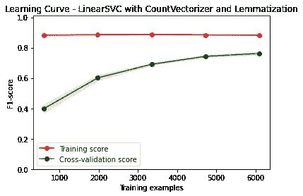
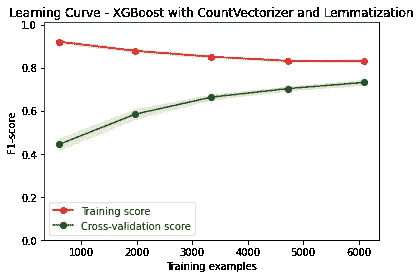

# 接近你的第一个 NLP 项目

> 原文：<https://towardsdatascience.com/approaching-your-first-nlp-project-7f3df530d350>

第一次处理文本数据是最难的。您错过了一个“简单”的表格数据集，在这里您可以轻松地过滤和连接表。

这篇文章将帮助你完成你的第一个 NLP 项目，并以良好的结果结束它。我们将处理来自[灾难推特数据集](https://www.kaggle.com/vstepanenko/disaster-tweets)的推特数据。

作者图片

# 本次挑战的目的

我们都知道 Twitter 是一个重要的沟通渠道。成千上万的人每天使用它来分享东西，从随机的想法、模因、科学线索到关于世界上某个地方实时发生的灾难和紧急情况的消息。

能够将这些紧急推文从噪音中分离出来将是我们的主要目标。我们将处理包含 7613 条标签推文的数据集。(标注为灾难或非灾难)。

我们将探索多种机器学习模型和标记化/矢量化策略，以找到表现最好的一种。我们目前最好的方法在测试集上显示了 0.80723 的 **F1 值。**

# 数据集描述

训练数据集由 7613 个带标签的示例组成。和 5 列:

*   **id:** 每条推文的唯一标识符。
*   文本:推文的文本。
*   **位置:**发送推文的位置(可能为空)。
*   **关键词:**来自 tweet 的特定关键词(可能为空)。
*   **target:** 表示一条推文是关于真实的灾难(1)还是不是(0)。
*   在所有的实验中，我们将主要使用文本和关键字列。

# 快速查看数据

在全押并随机将你的训练数据插入 sklearn 函数之前，让我们看看我们的数据，看看是否有任何需要清理的地方。

# 标签的分发

需要注意的一件重要事情是，目标列不是 100%平衡的。正如我们所见，数据集略有不平衡。这是我们在设计验证策略时会考虑的因素。

# 检查 NaN 值

关键字功能似乎很有用。它包含一些 NaN 值，但没有那么多要估算的，它仍然可以为模型添加一些值。(我们将实验混合文本和关键字数据的模型)。

# 数据清理

数据集中包含的推文似乎是原始的。这意味着它们包含可能误导我们的机器学习模型的“杂质”。

因此，我们的下一步应该是通过以下方式清理数据:

*   **删除网址:**有些推文有分析不感兴趣的外部链接或图片。
*   **移除标签:**电脑会把单词#danger 和 danger 解释为不同的单词。但是对一个人类来说，意义是一样的。
*   **删除多个空格:**有些推文有几个空格。我决定删除这些空白，因为它们不会给文本的含义增加任何有用的信息。

# 预处理

在接下来的实验中。我们将探索不同的预处理技术。并将最好的用于最终模型。

*   标记化:我们将使用 [NLTK](https://www.nltk.org/api/nltk.tokenize.html) 单词标记化方法将字符串分割成单词列表。
*   引理化:在一些实验中，我们会看到使用引理化有助于减少样本空间。这特别有用，因为我们的模型更容易推广。
*   TF-IDF 和计数向量化:我们将尝试使用 TF-IDF 和计数向量化技术来构建一个单词包。
*   One-hot-encoding:在一些实验中，我们将使用文本和关键字列来训练模型。因此，为了能够使用关键字列，我们必须通过使用一键编码将其转换为“计算机友好的输入”。

# 方法

我们将遵循四个一般部分的方法来解决这个问题。

*   建立强有力的验证策略。
*   专注于优化一个错误指标(F1 分)。
*   探索不同的预处理技术/模型架构。
*   用最好的模型建立了一个集合模型。

构建健壮的机器学习模型的最重要的部分之一是拥有健壮的验证策略。为此，我们将使用[分层文件夹](https://scikit-learn.org/stable/modules/generated/sklearn.model_selection.StratifiedKFold.html)将数据分成五组。这将允许我们**在每个折叠中保持目标的原始分布**。

另一个重要的细节是使用相同的折叠来训练和验证所有的实验。这样，实验之间的每个结果都可以相互比较。

# 实验

这是有趣的部分开始。我们将探索 7 个不同的实验。每个人都试图获得比前一个更好的 F1 确认分数。

最后，我们将选出三位表现最好的模特，并进行合奏。

## 虚拟基线

在试验复杂的架构和繁重的前置处理之前，让我们只使用数据集中出现的关键字**列(这里没有文本数据)来构建一个基本的机器学习模型。**

我们必须对关键字列中的值进行一次性编码，然后将它们插入到逻辑回归模型中。

本实验的目的是使用简单快速的解决方案建立基线误差度量。因此，所有其他更复杂的算法都应该在这个基准之上执行。

对于只使用一个特性的模型，我发现结果相当不错。**F1 得分为 0.667** ，这很好，因为比随机得分要好。这将是下一次实验要超越的新基准。

**注:** Medium 并不是分享编码教程的最佳平台。这对我来说很难，在这里向你们展示，复制这个分析所需的所有代码。但是下面的代码片段应该让你知道我在每个实验中做了什么。我也在这个[笔记本](https://www.kaggle.com/santiviquez/nlp-disasters-tweets-lb-0-80723)里分享了**所有的代码**。

作者图片

## 逻辑回归和 TD-IDF

对于第二个实验，我们将只使用文本数据。我们将应用单词标记器方法将句子转换成单词列表，然后应用 TF-IDF 矢量化方法。得到句子中单词相关性的数字表示。在预处理之后，我们将拟合逻辑回归模型。

这个实验背后的直觉是，某些单词比其他单词更相关。这些词在句子中的出现可能会告诉我们这条推文是否是关于一场灾难。然后使用逻辑回归模型假设每个单词和最终目标之间存在线性关系。

在运行这个实验之后，我得到了一个不错的结果。平均 **F1 分 0.753** 。更重要的是对我们的虚拟基线模型的改进。

作者图片

## 逻辑回归和计数矢量器

CountVectorizer 会将文本数据转换成数字特征。推文中的每个单词都将被转换成一个数字。这个数字就是这个词在一条推文中出现的次数。

使用这个简单的方法，我们假设每条推文中包含的单词是一个很好的指标，表明这条推文是否是关于灾难的。

在应用 L2 正则化并使用正则化参数后。我找到了一个新的基准。交叉验证的平均 **F1 分为 0.755** 。

作者图片

## 逻辑回归和预处理

到目前为止，在过去的 3 个实验中，我们只使用了文本数据。在这个实验中，让我们测试一下向文本数据添加关键字特性和一些词汇化是否会有帮助。

的确很有帮助！我们找到了新的基准。我们从平均 F1: 0.755 上升到平均 F1 分数 0.764

作者图片

我们将在下面的实验中使用相同的前置管道。唯一的区别是我们将尝试不同的模型架构。

## 线性 SVC 和预处理

让我们从逻辑回归开始，尝试使用具有相同预处理管道的线性支持向量分类器。

我的表现没有任何提高。然而，这个模型在我们的最后一个实验中是有用的，当我们开始堆叠分类器的时候。

作者图片

## XGBoost &预处理

这次让我们使用 XGBoost 分类器。XGBoost 在机器学习社区中非常流行和广泛使用。

但是正如你在下面代码的注释中看到的，逻辑回归仍然表现得更好。尽管如此，我们还是会看到，将 XGBoost 模型添加到系综中会给我们带来很好的结果。

作者图片

## 堆叠分类器

对于最后一个实验，让我们用最后三个模型中的分类器建立一个集成模型。

这种方法将允许我们通过使用最终估计量(另一个逻辑回归量)的输入来使用每个估计量的强度。

让我们记住当前的基准是 0.764。目标是找到一个比这更好的交叉验证 F1 分数。我们做到了。使用集成模型，我们能够找到一个稍微好一点的分类器，其 **F1 分数为 0.7653**

# 最终预测

我使用上次实验中的堆叠模型对隐藏测试集进行了预测，并发现了很好的结果。测试集上的 **F1 分数为 0.80723** 。甚至比我们在验证折叠上得到的结果还要好。

这就是拥有一个好的验证策略的好处！代码和最终结果可以在 [Kaggle 笔记本](https://www.kaggle.com/santiviquez/nlp-disasters-tweets-lb-0-80723)中找到

作者图片

我经常在推特<https://twitter.com/santiviquez>**上分享关于数据科学和机器学习的东西。想加入我的话就关注我，继续在公共场合学习:)**