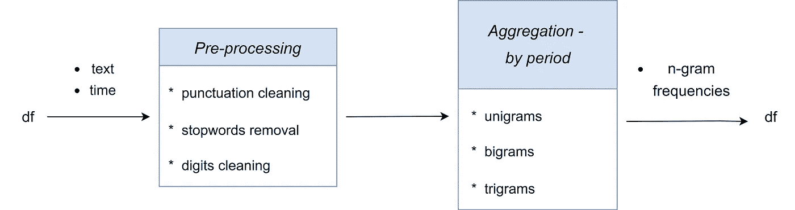
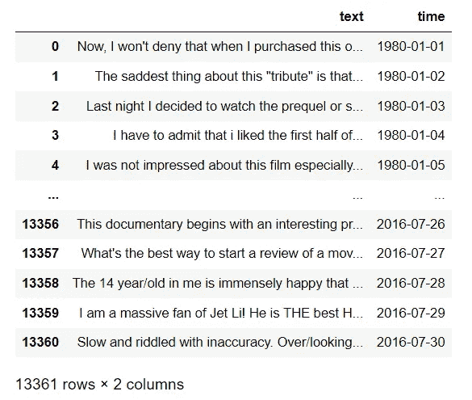
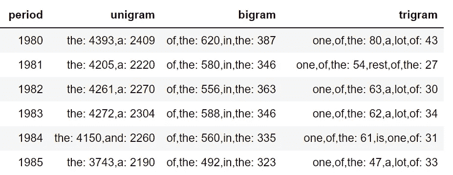
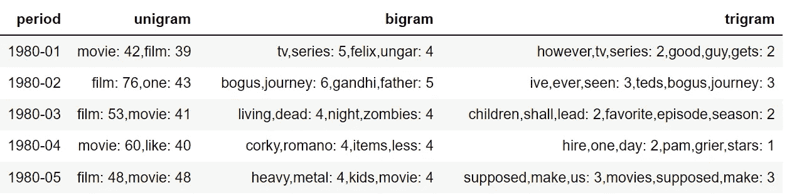

# Arabica:用于文本数据探索性分析的 Python 包

> 原文：<https://towardsdatascience.com/arabica-a-python-package-for-exploratory-analysis-of-text-data-3bb8d7379bd7>

## Arabica 在一行代码中提供了一段时间内的单字、双字和三字频率。在本教程中了解更多信息。

图片由 [Artem Sapegin](https://unsplash.com/@sapegin?utm_source=medium&utm_medium=referral) 在 [Unsplash](https://unsplash.com?utm_source=medium&utm_medium=referral) 拍摄

文本数据通常被记录为随时间变化很大的时间序列。时间序列文本数据的一些例子包括 Twitter 推文、产品评论和报纸标题。对此类数据集的探索性分析是一项重要的编码任务。 **Arabica** 用一行 python 代码让它变得简单。

[Arabica](https://pypi.org/project/arabica/) 将文本数据的数据帧作为输入，启用标准清理操作(数字、标点符号和停用词删除)，并在一个月或一年的时间内提供 unigram(例如*、dog* )、bigram(例如 *dog、goes* )和 trigram(例如 *dog、goes、home* )频率。

图 1:**arabica _ freq**方法方案

它使用 [***cleantext、***](https://pypi.org/project/cleantext/#description) 一个优秀的 python 库进行标点清理，使用[***ntlk***](https://www.nltk.org/install.html)停用词语料库进行预处理。停用词的可用语言列表打印如下:

# 示例使用案例

让我们以 [IMDb 50K 电影评论](https://www.tensorflow.org/datasets/catalog/imdb_reviews)为例来说明 Arabica 的编码(参见[数据许可](https://creativecommons.org/licenses/by/4.0/))。要添加时间维度，`time`列包含“*yyyy-mm-DD”*格式的合成日期。下面是数据子集的样子:

图 2: IMDb 50K 电影评论数据子集

## 1.先看数据

让我们先来看看每年的原始数据，以了解更多关于电影评论者的叙述。我们将读取数据:

然后我们调用`arabica_freq,`指定每年的聚合，保持`numbers`和`punct`为*假，*和`stopwords`为*无，*查看原始数据，包括停用词、数字和特殊字符。`max_words`设置为 2，以便输出表易于阅读。

***编辑 2023 年 1 月*** *:阿拉比卡已更新。查看* [***当前版本***](https://pypi.org/project/arabica/) *获取完整的参数列表。*

这是前六年 n-gram 频率的汇总表:

图 3: **arabica_freq** 输出，每年 n-gram 频率

我们可以看到数据中包含了大量不必要的介词和其他应该删除的停用词。

## 2.对干净数据进行更详细的检查

接下来，我们将删除数字、标点符号和英语停用词，并显示每月 n-gram 频率，以深入挖掘干净的数据。

我们可以看到文本数据随时间的显著变化(注意，我们使用的是一个合成的示例数据集)。表格的前五行是:

图 4: **arabica_freq** 输出，每月 n-gram 频率

照片由 [River Fx](https://unsplash.com/@musicfox?utm_source=medium&utm_medium=referral) 在 [Unsplash](https://unsplash.com?utm_source=medium&utm_medium=referral) 上拍摄

# 结论

这个包美化了世界上最好的饮料，希望它能为您节省一些对文本数据进行探索性分析的时间。阿拉比卡咖啡的主要优点是:

*   **编码效率**-EDA 在一行代码中完成
*   **清理实现** -不需要预先的文本数据预处理
*   **稳定的性能** -即使处理成千上万行的数据集也能快速运行。

阿拉比卡咖啡可从 [PyPI](https://pypi.org/project/arabica/) 购得。对于源文件，去我的 [GitHub，](https://github.com/PetrKorab/Arabica)也阅读[文档](https://arabica.readthedocs.io/en/latest/index.html)。享受它，并请让我知道它如何在您的项目上工作！

***编辑:*** *阿拉比卡现在有一个* ***可视化*** *模块将文本显示为一个* ***热图*** *，* ***字云*** *，***和一个* ***情绪和更多阅读这些教程:****

*   *[***Arabica 中的可视化模块加速了文本数据的探索***](https://medium.com/towards-data-science/visualization-module-in-arabica-speeds-up-text-data-exploration-47114ad646ce)*
*   *[***时序文本数据中的情感分析和结构突变***](/sentiment-analysis-and-structural-breaks-in-time-series-text-data-8109c712ca2)*
*   *[***文本作为时间序列:Arabica 1.0 为探索性文本数据分析带来新功能***](https://medium.com/towards-data-science/text-as-time-series-arabica-1-0-brings-new-features-for-exploratory-text-data-analysis-88eaabb84deb)*

**PS:你可以订阅我的* [*邮件列表*](https://medium.com/subscribe/@petrkorab) *在我每次写新文章的时候得到通知。而如果你还不是中等会员，可以在这里* *加入* [*。*](https://medium.com/@petrkorab/membership)*