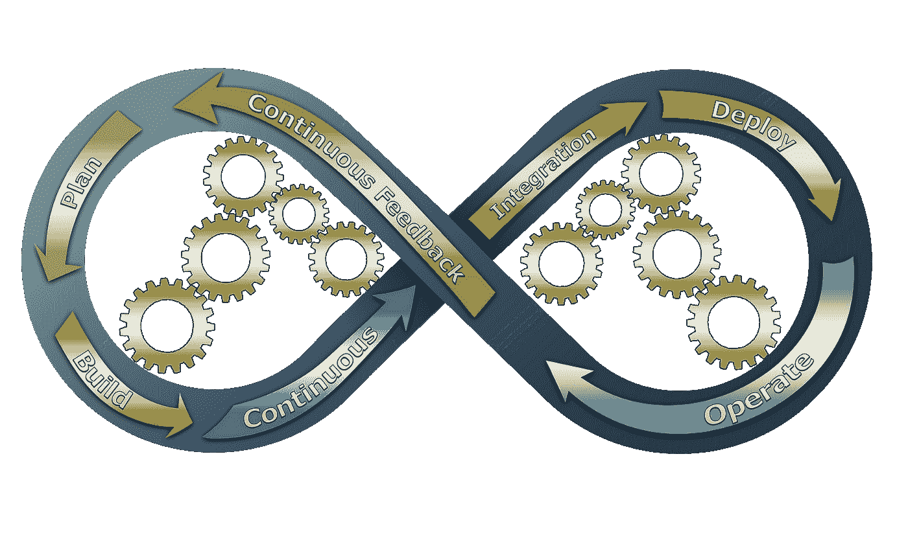
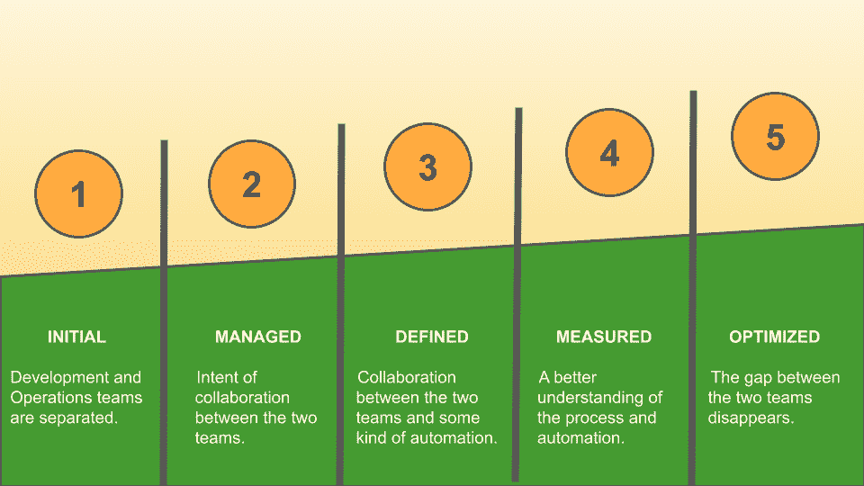
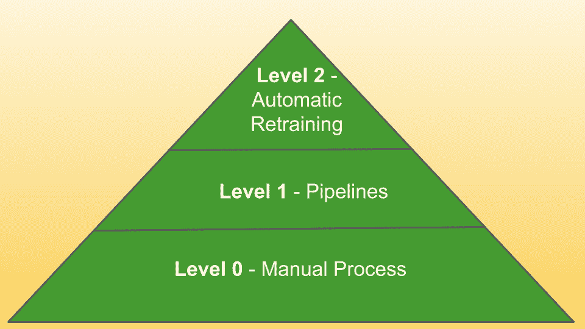

# DevOps 和 MLOps 是一回事吗？

> 原文：<https://towardsdatascience.com/are-devops-and-mlops-the-same-thing-c21961a43a56>

## 德沃普斯

## 概述 DevOps 和 MLOps 的共同点以及它们的区别(如果有)

[粘土银行](https://unsplash.com/@claybanks?utm_source=medium&utm_medium=referral)在 [Unsplash](https://unsplash.com?utm_source=medium&utm_medium=referral) 拍摄的照片

大约十年前，社区意识到交付和运营团队之间存在障碍。一方面，有**开发团队，负责编写和测试代码**。另一方面，**运营团队应该让代码在产品中运行**。生产字面上的意思是软件可以公开使用。

将软件从开发阶段转移到生产阶段是一个需要大量时间的手动过程。为了减少这种差距并节省部署软件的时间，一种新的文化开始传播:DevOps 文化，旨在让人们一起协作。

**DevOps(开发和运营)是一套尝试在开发和运营团队之间建立协作的最佳实践，目的是尽可能自动化软件部署流程。**

在过去十年中，DevOps 领域取得了很大进展，达到了相当高的成熟度。诞生了很多工具和平台。要说最著名的平台，你可以记住 Docker 和 Kubernetes。

最近，一种新的观念正在传播。就是 MLOps，意思是机器学习操作。MLOps 是一套最佳实践，帮助人们在生产中**交付**和**维护**机器学习模型。有趣的方面是，在 MLOps 中，你不仅应该能够交付机器学习模型，还应该能够维护它们。

起初，人们可能会认为 MLOps 只是 DevOps 的一个新术语，特别关注机器学习。但实际上，事情并不像看起来那么微不足道。

在这篇文章中，我们试图给那些想知道 DevOps 和 MLOps 是不是一回事的人一个答案。

文章组织如下:

*   DevOps 和 MLOps 工作流
*   DevOps 和 MLOps 监控
*   DevOps 和 MLOps 团队
*   DevOps 和 MLOps 中的成熟度。

# DevOps 和 MLOps 工作流

典型的 DevOps 工作流程包括三个主要步骤:

*   构建软件
*   测试软件
*   交付软件。

这个想法是将第三阶段与第一阶段联系起来，使这个过程尽可能自动化。传统的 DevOps 工作流通过无穷大的符号来表示，如下图所示:

图片来自拥有 Pixabay 许可证的 [Pixabay](https://pixabay.com/it/illustrations/devops-attivit%c3%a0-commerciale-3148393/) 。

无穷大符号表示所有步骤都应该无休止地运行。

DevOps 工作流中的主要工件是软件，通常在容器中提供。软件是**静态的**，也就是说它不会随着时间的推移而退化。但是，您可能会在代码中发现一些错误，因此您应该按照 DevOps 工作流程更新它。

在 MLOps 工作流中，您不仅仅拥有作为工件的软件。**你也有模型和数据。**不幸的是，你的数据不会像模型一样永久保存。您的模型可能会在数据漂移和概念漂移方面出现退化:

*   **数据漂移**意味着用来训练你的模型的数据不适合代表现实，因为它们太老了。换句话说，实际数据和用于训练模型的数据具有不同的分布。
*   **概念漂移**意味着你的模型的输出变量和输入变量之间的关系不再有效，因此你的模型中存在概念错误。

数据漂移和概念漂移都应该产生**模型再训练**。

这意味着 MLOps 工作流程也应考虑这一方面。DevOps 工作流的构建步骤应该扩展到包括模型培训/模型再培训。

MLOps 工作流的挑战是最终的工件，包括软件、模型和数据，不是静态的，而是随着时间的推移而变化(退化)。因此，您应该定义一个策略来监控它，并在需要时触发再培训过程。

MLOps 工作流程应考虑**模型维护**，包括之前描述的步骤。因此，组织应该从数据驱动的解决方案转向模型驱动的解决方案。

# DevOps 和 MLOps 监控

DevOps 空间的监测非常重要。但是在 MLOps 中更重要，因为它应该能够触发再训练动作。

在 DevOps 监控中，您应该有日志、系统指标和特定于业务的指标。监控 DevOps 工作流程最流行的工具是 [Prometheus](https://prometheus.io/docs/introduction/overview/) 和 [Grafana](https://grafana.com/grafana/?plcmt=footer) 。

在 MLOps 中，您将继续监控已经为 DevOps 定义的经典指标。但是您还应该监控其他指标，包括数据和概念漂移、模型准确性、对您的模型的敌对攻击、公平性检测等等。作为一个监控工具，您可以继续使用 Prometheus，但是您应该为特定的任务添加新的组件。

作为额外的(或特定的监控工具)，您可以使用一些实验平台，这些平台允许您跟踪、监控和比较您的实验，以及选择最佳模型发送到生产。这个领域最流行的一些工具包括[彗星](https://comet.ml/)、 [MLflow](https://mlflow.org/) 和[海王星](https://neptune.ai/)。

监控 DevOps 和 MLOps 应有助于识别需要采取行动的异常情况。**在理想情况下，所有动作都应该自动执行。**

# DevOps 和 MLOps 团队

DevOps 中有三种不同的角色:

*   使管道工作的**生产操作员**
*   **业务经理**，他定义了需求和度量标准，以及
*   实现代码的**开发人员**。

他们一起工作来解决同一个问题，即通过保证持续集成和持续交付，使软件在生产中工作。

在 MLOps 中，你同样有三个角色，但开发者是一个更具体的人物，名为**机器学习工程**，他负责构建模型。

# DevOps 和 MLOps 中的成熟度

DevOps 和 MLOps 的成熟度衡量软件发布和更新过程中的人工干预在多大程度上被完全自动化所取代。

您可以查看您的组织处于哪个级别的 DevOps 和 MLOps。DevOps 没有定义任何具体的成熟度级别。然而，大体上，我们可以在 DevOps 中定义以下成熟度级别，如下图所示:

作者图片

这些级别是:

*   **初始** —开发和运营团队分开。
*   **管理** —两个团队之间的合作意向，但是只有在运营团队中，才存在某种自动化。
*   **已定义的**——两个团队之间有协作，也有某种自动化。
*   **测量** —对流程和自动化有了更好的理解。
*   **优化** —两队差距消失。

在 MLOps 中，谷歌和微软都定义了一些成熟度级别:

*   谷歌的 3 个成熟度等级
*   微软的 5 个级别

这两个模型很相似。在这篇文章中，我们描述了谷歌的，如下图所示:

作者图片

这些级别是:

*   **level 0** —您没有 MLOps，您有一个手动流程来部署和监控模型。例如，你在 Jupyter 笔记本上写代码。
*   **第 1 级** —你开始引入一些自动化。你介绍一个**管道**。您的组件正在验证您所期望的数据。您有评估模块，它控制您设置的标准。团队合作。机器学习工程师维持培训工作。Jupyter 笔记本转移到脚本。你产生指标，你有**按钮来触发再培训**。
*   **第 2 级** —再培训过程是自动的。您不仅监控系统指标，还监控质量指标。为了检测模型是否降级，您应该拥有触发管道执行的**触发器**。

这个触发问题还在讨论中。触发事件有两种可能的方式:

*   **定期** —这是调度程序的情况，它定期检查是否有变化，如果有变化，它触发一个特定的事件。
*   **当数据改变时** —没有任何调度程序。这一方面仍在研究中，并在未来几年仍是一个公开的挑战。

# 结论

DevOps 和 MLOps 有很多共同点，但也有很多不同点。

**所以对于 DevOps 和 MLOps 是一样的这个问题，我们可以回答:不，它们不是一样的，尽管它们在开发和运营团队之间的协作原则是一样的。**

在 DevOps 和 MLOps 中，理念是相同的，都基于尽可能自动化所有流程的原则，以便将**从人员转移到技术**。

这篇文章的灵感来自对 Theofilos Papapanagiotou 和 Alexey Grigorev 的采访，标题为《MLOps 的崛起》，可在[数据讲座中获得。俱乐部](https://datatalks.club/podcast/s02e04-mlops.html)网站作为播客。

如果你已经读到这里，也许你会对数据说话感兴趣。俱乐部正在开办一个关于 MLOps 的免费课程。你可以在这里找到更多关于它的信息！

*原贴于* [*DataTalks。俱乐部*](https://datatalks.club/blog/devops-and-mlops-same-thing.html) *。*

# 相关文章

</how-to-run-a-data-science-project-in-a-docker-container-2ab1a3baa889>  </model-evaluation-in-scikit-learn-abce32ee4a99>  </using-versatile-data-kit-to-ingest-and-process-data-from-rest-api-6e3e0660b791> 