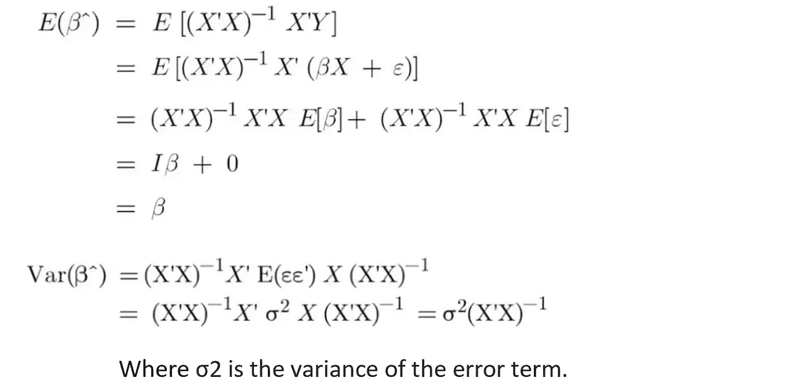
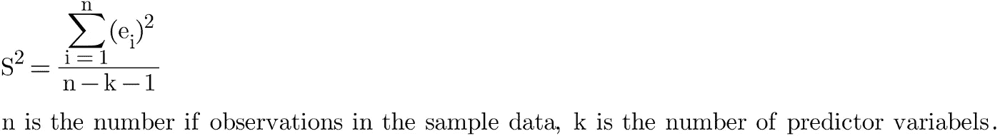
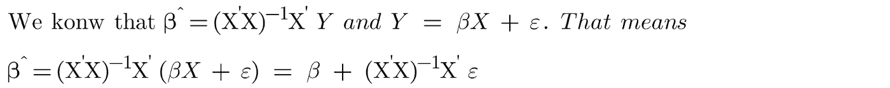
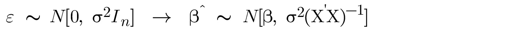
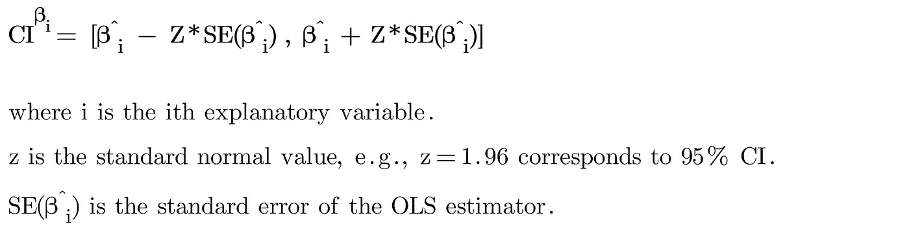
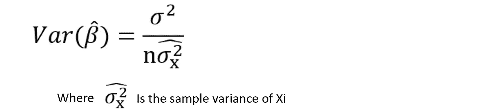

# 在线性回归模型中，OLS 估计量是正态分布的吗？

> 原文：<https://towardsdatascience.com/are-ols-estimators-normally-distributed-in-a-linear-regression-model-89b688fa8dc3>

## OLS 估计量的分布是什么？

马丁·桑切斯在 [Unsplash](https://unsplash.com/?utm_source=medium&utm_medium=referral) 上的照片

我们都知道，在线性回归模型中，正态假设对于计算无偏估计是可选的。在本帖中，我们将讨论线性回归模型中的 OLS 估计量是否是正态分布的，以及需要什么样的假设才能得出结论。

## 线性回归模型中的 OLS 估计量是什么？

OLS 估计量(β^)是根据样本计算的，用于估计线性回归模型中的总体参数(β)。

作者图片

OLS 估值器是具有概率分布的**随机变量**(即，OLS 估值器的**采样分布**)。抽样分布描述了**个可能值**，OLS 估计器可以在不同的样本中采用这些值。

我们知道，对于给定的样本，OLS 估计量可以用封闭形式的解来求解。

作者图片

> 我们可以这样想，很可能 Y 在不同的样本中取不同的值。因此，OLS 估计量(β^)随着响应值(y)而变化。

借助一点数学知识，我们可以计算 OLS 估计量的均值和方差。

作者图片

[**此外，我们期望 OLS 估计量具有以下性质**，](/linear-regression-with-ols-unbiased-consistent-blue-best-efficient-estimator-359a859f757e)

*   OLS 估计量是**无偏的**:OLS 估计量的期望值等于真实的总体参数值。
*   OLS 估计量是**一致的:**随着样本量的增加，OLS 估计量**收敛**到真实的总体参数值。
*   OLS 估计量是蓝色的(所有线性无偏估计量中方差最小的)。因此，它们是**最佳** ( **高效**)估计器。

## 如何估计线性回归模型中 OLS 估计量的方差？

在 OLS 估计量的方差公式中， **σ2 是误差项**的方差，它是总体模型中的一个**未知**参数。我们通常使用样本数据中的**残差**来估计这个值。

S2(又名均方差、MSE 或剩余方差)是误差(σ2)方差的**无偏估计量**。S2 可以用下面的公式计算。

作者图片

> 因此，如果我们建立一个更精确的线性回归模型，残差往往更接近于 0，MSE (S2)往往更小，OLS 估计量的抽样分布的方差也更小，那么我们最终会有更精确的 OLS 估计量(即，更紧密的置信区间)。

## 假设 OLS 估计量在线性回归模型中呈正态分布的动机是什么？

此时，我们还没有在线性回归模型中做任何正态性假设。我们只知道 OLS 估计量是随机变量，以及如何计算它们的均值和方差。

我们也知道正态假设是**而不是**计算**无偏、一致、蓝 OLS 估计量**所必需的。那我们为什么要假设 OLS 估计量在线性回归模型中是正态分布的呢？

答案很简单。我们永远无法从样本数据中估计出真正的流行参数。我们的估计永远不会准确。OLS 估计量的正态假设允许我们计算假设检验的 p 值并构造可靠的置信区间。

## 为什么在线性回归模型中假设 OLS 估计量呈正态分布是合理的？

我们通常假设线性回归模型中的误差项是正态分布的。那么它意味着 OLS 估计量也是正态分布的。我们很容易证明这一点。

作者图片

在上面的方程中，我们已经表明 OLS 估计量是误差项的线性组合。因此，正态性假设(即误差是正态分布的)意味着 OLS 估计量是正态分布的。

作者图片

> 如果样本量足够大，我们不需要假设误差项是正态分布的。因为当**样本量足够大**时，**中心极限定理**开始起作用，并证明 OLS 估值器由多元正态分布**很好地逼近，而不管误差项的分布**。

## 如何计算线性回归模型中 OLS 估计量的置信区间？

从样本数据中，我们可以用 OLS 估计量来估计总体参数(β),用残差来估计 OLS 估计量的抽样分布的标准差(也称为标准误差)。如果我们假设 OLS 估计量是正态分布的，那么我们可以计算置信区间

作者图片

例如，95%置信区间表示我们 95%确信 CI 包含总体参数(βi)的真实值。换句话说，如果我们对许多不同的样本重复这个过程，95%的时间 CI 包含真实值。

## 影响 OLS 估计量分布的因素是什么？

首先，让我们用下面的格式重写 OLS 估计量的方差。你可以在这里找到它的推导[。](https://medium.com/analytics-vidhya/expectation-variance-of-ols-estimates-9acd2b48a635)

作者图片

显然，样本大小在 OLS 估计量的分布中起着巨大的作用。随着样本量的增加，OLS 估计量的抽样分布将更接近正态分布，OLS 估计量的方差将更小，这意味着我们有更精确的 OLS 估计量。

> 换句话说，样本中的数据点越多，模型捕捉 X 和 Y 之间关系的能力就越强，OLS 估计值就越精确。

此外，随着 Xi 的方差增加，相应的 OLS 估计量的方差将减少。

> 换句话说，解释可以提供的信息越多(即方差越大)，我们就可以更精确地估计参数的真实值。

## 结论

如果我们假设误差是正态分布的，或者样本量足够大，OLS 估计量的抽样分布将接近正态分布。

随着样本量的增加，我们期望 OLS 估计量的分布具有更小的方差。

此外，随着 Xi 方差的增加，相应的 OLS 估计量的方差将趋于减少。

如果你想探索更多与**统计**相关的帖子，请查看我的文章:

*   [**7 关于中心极限定理的最常见问题**](/7-most-asked-questions-on-central-limit-theorem-82e95eb7d964)
*   [**标准差 vs 标准误:有什么区别？**](/standard-deviation-vs-standard-error-whats-the-difference-ae969f48adef)
*   [**3 种最常见的曲解:假设检验、置信区间、P 值**](/the-most-common-misinterpretations-hypothesis-testing-confidence-interval-p-value-4548a10a5b72)
*   [**线性回归模型中误差项是否呈正态分布？**](/are-the-error-terms-normally-distributed-in-a-linear-regression-model-15e6882298a4)
*   线性回归模型中的 OLS 估计量是否正态分布？
*   [**什么是正则化:偏差-方差权衡**](/machine-learning-bias-variance-tradeoff-and-regularization-94846f945131)
*   [**方差 vs 协方差 vs 相关性:有什么区别？**](https://medium.com/geekculture/variance-vs-covariance-vs-correlation-what-is-the-difference-95adff96d542)
*   [**置信区间 vs 预测区间:有什么区别？**](/confidence-interval-vs-prediction-interval-what-is-the-difference-64c45146d47d)
*   I 型和 II 型错误哪个更糟糕？

# 感谢您的阅读！！！

如果你喜欢这篇文章，并且想**请我喝杯咖啡，**请[点击这里](https://ko-fi.com/aaronzhu)。

您可以注册一个 [**会员**](https://aaron-zhu.medium.com/membership) 来解锁我的文章的全部访问权限，并且可以无限制访问介质上的所有内容。如果你想在我发表新文章时收到电子邮件通知，请订阅。