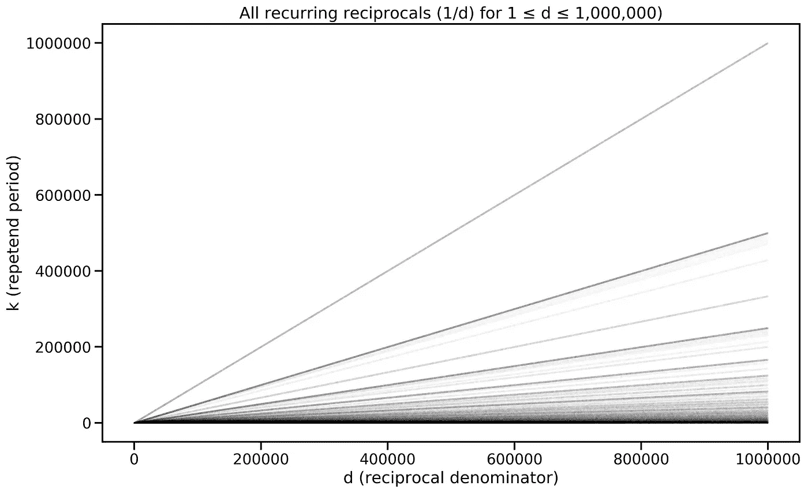
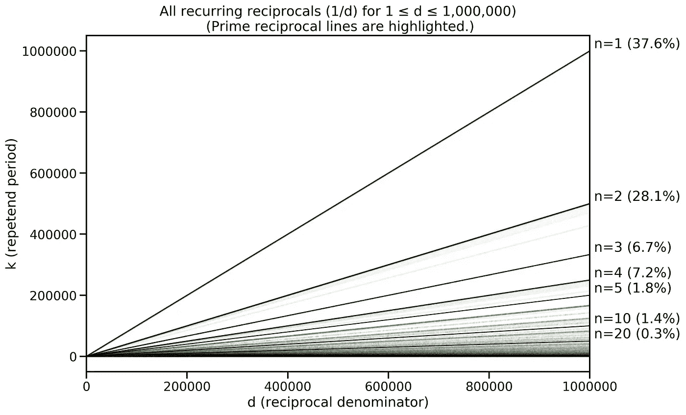
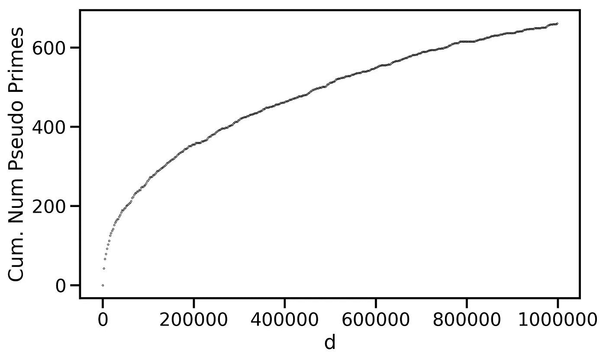

# 伪素数隐藏在复合倒数之中吗？

> 原文：<https://towardsdatascience.com/are-pseudoprimes-hiding-out-among-the-composite-reciprocals-c8952cfe1ab4>

## 使用数据科学的工具和技术探索数论


照片由 [Unsplash](https://unsplash.com/s/photos/hide-and-seek?utm_source=unsplash&utm_medium=referral&utm_content=creditCopyText) 上的 [Dmitry Ratushny](https://unsplash.com/@ratushny?utm_source=unsplash&utm_medium=referral&utm_content=creditCopyText) 拍摄

> ”“数学是科学女王，而**数论**是数学女王。"–卡尔·弗里德里希·高斯

棕色理论是纯数学的一个迷人分支。它关注整数的性质和它们之间的关系。数论的历史上充满了一些有史以来最著名的数学家——[欧几里德](https://en.wikipedia.org/wiki/Euclid)、[卡尔·弗里德里希·高斯](https://en.wikipedia.org/wiki/Carl_Friedrich_Gauss)、[皮耶·德·费玛](https://en.wikipedia.org/wiki/Pierre_de_Fermat)、[莱昂哈德·欧拉](https://en.wikipedia.org/wiki/Leonhard_Euler)、[约瑟夫·路易斯·拉格朗日](https://en.wikipedia.org/wiki/Joseph-Louis_Lagrange)、 [G.H .哈代](https://en.wikipedia.org/wiki/G._H._Hardy)、[约翰·利特伍德](https://en.wikipedia.org/wiki/John_Edensor_Littlewood)、[斯里尼瓦瑟·拉马努金](https://en.wikipedia.org/wiki/Srinivasa_Ramanujan)，当然还有[波恩哈德·黎曼](https://en.wikipedia.org/wiki/Bernhard_Riemann)——以及许多现代数学巨星，例如 [、](https://www.math.ucla.edu/~tao/)、[、](http://people.math.harvard.edu/~mazur/)、[张、](https://en.wikipedia.org/wiki/Yitang_Zhang)[梅纳德](https://en.wikipedia.org/wiki/James_Maynard_(mathematician))不一而足。 数论也包括一些最著名的数学定理和问题，从[费马大定理](https://en.wikipedia.org/wiki/Fermat's_Last_Theorem)和 t [温素数猜想](https://en.wikipedia.org/wiki/Twin_prime#Twin_prime_conjecture)到[哥德巴赫猜想](https://en.wikipedia.org/wiki/Goldbach%27s_conjecture)以及它们的鼻祖[黎曼假设](https://en.wikipedia.org/wiki/Riemann_hypothesis)。

数论者的普遍做法是粉笔灰和黑板，定理和证明，这似乎是一个远离数据科学更多经验探索的世界。然而，随着计算机辅助证明变得越来越普遍，数据和计算在纯数学中扮演着越来越重要的角色。例如，f [我们的颜色定理](https://en.wikipedia.org/wiki/Four_color_theorem)，[开普勒猜想](https://en.wikipedia.org/wiki/Kepler_conjecture)，或者由 [DeepMind 的](https://www.nature.com/articles/s41586-021-04086-x)先进人工智能技术辅助的更多最新发现。

长期以来，我一直对数论的许多方面着迷——尤其是质数——但我绝对没有数学专业知识，除了惊叹于其中一些更容易获得的宝石之外，我做不了什么。然而，作为一名数据科学家，我确实有一种几乎无法满足的欲望，那就是收集和分析数据，寻找隐藏的模式，并根据这些模式做出预测。既然模式在数学中扮演着如此重要的角色，为什么不利用数学数据，以便使用数据科学的工具来探索数论等主题呢？毕竟，可以很容易地生成非常大的数据集(例如，素数、因式分解、分数等的数据集)。)甚至使用一台基本的笔记本电脑；从数据科学的角度来看，这尤其具有吸引力，因为数据可用性和收集通常是进步的主要瓶颈之一。

所以，最近，我开始[生成](/discovering-the-shape-of-fractions-e9034ab0085c)和[分析](/prime-fractions-cyclic-reciprocals-b1074f6ebc3b)各种类型的数学数据集。在这篇文章中，我将描述对倒数——1/d 形式的分数——的一条特殊研究路线，以及它们的小数展开式的一些有趣性质。

我应该说，我并不期望在数论领域取得重大进展——“*别开玩笑了！”你说*——但我确实相信数据科学方法可以为数论的某些方面带来有用的视角。正如我将要讨论的，我的数据探索已经向我揭示了一些我可能会错过或误解的见解和概念。事实上，在这篇文章发表后不久，下面讨论的结果之一——从我的分析中出现的伪素数产生的一个新的整数序列——已经作为一个新条目( [A351396](https://oeis.org/A351396) )被接受在[在线整数序列百科全书](https://oeis.org/draft/A351396) (OEIS)中，这是一个意外但非常令人满意的结果。

R 倒数是形式为 *1/d，*的分数，其中 *d* 是正整数；例如 1/2、1/3、1/10 都是倒数。每个倒数都有相应的十进制展开。例如，1/2 的十进制展开是 0.5，对于 1/3 是 0.333……倒数 1/2 有一个*固定的*十进制展开——它*终止*——因为它没有重复元素。相比之下，1/3 有一个*循环*或*重复*十进制展开——它是*非终止*——因为数字 3 无限重复。1/7 还有一个循环小数展开式，0.142857…数字 142857 重复到无穷大；事实上，1/7 本身有点特别，正如我在其他地方讨论过的。

本文重点介绍这些*循环往复式，*是大多数往复式的自然类型。例如，在一个生成的 100 万个倒数的数据集中——也就是说，对于 1 到 1，000，000 之间的 *d* 的值，所有形式为 *1/d* 的倒数——只有 100 个不是递归的。规则是，如果 *d* 的质因数包含 2 或 5 以外的数字，那么 *1/d* 将循环出现。

*1/d* 的重复位数称为其*重复数*，重复数的长度为倒数的*周期*，通常称为 *k* 。因此，1/3 的周期为 1，对于 1/7， *k = 6* 。下图显示了 *1 ≤ d ≤ 1，000，000* 的循环往复周期；它包含 999，900 个点(每个循环倒数一个点)，基于它们的 *d* 和 *k* 值定位。注意这些点中有多少排成了明显的直线。这是怎么回事？这个结构应该存在什么？



图片作者。

这种*条带*效应是由于*素数的倒数的一个重要性质——*即形式为 *1/p* 的倒数，其中 *p* 是一个素数(只能被自身或 1 整除)——这表明 *nk = p-1。*换句话说，素数倒数的周期( *k* )总是被平均分成 *p-1。*这个导致质数的倒数在上图中形成明显的直线，每条直线的斜率由 *k/p-1* 定义。我们可以在下面更清楚地看到这一点，因为许多互易质数线已经被突出显示，并标有它们相应的值 *n* (即*n = p-1/k*)；括号中的百分比表示落在给定线上的素数的分数。



图片作者。

也许最有特色的一行是 *n=1* 的那一行，它对应于周期正好等于 *p-1* 的所有质数的倒数。事实上，这些是一类特殊的素数，被称为[**重复素数*或*长素数**](https://en.wikipedia.org/wiki/Full_reptend_prime) *，超过 37%的素数(高达 100 万)是这种类型。之后，我们可以看到更小的素数倒数分组，其中 p-1 是 *k 的不同整数倍；n=2，3，4，5，10，20* 全部高亮显示。*

*这解释了质数倒数中的模式，但是所有其他的循环倒数呢，形式为 *1/d* 的那些，其中 *d* 是合成的(不是质数)？这些倒数也出现在图中，尽管它们没有质数倒数表现得好。你可以把它们看成是灰点的“雾”,倾向于落在较低的倒易线之间。这是因为复合倒数很少服从*NK = d-1；有些人会，但绝大多数人不会。**

> *顺便说一句，对于复合倒数，我们必须使用更一般化的形式 nk=d-1，它表示 nk = ɸ(d)，其中*【ɸ(d】是[欧拉的全等函数](https://en.wikipedia.org/wiki/Euler%27s_totient_function)，它计算直到 d 的正整数，这些正整数是质数( [*互质*](https://en.wikipedia.org/wiki/Coprime_integers) )到 d*；*即与 d 的最大公约数为 1 的数。比如ɸ(9) = 6 因为 1、2、4、5、7、8 与 10 互素。顺便说一下，如果 d 是质数，那么ɸ(d) = d-1 *，*因此给出了质数倒数的特例。**

**然而，有趣的是，有一些复合倒数的*行为与素数*相似，因为它们的周期满足 *nk = d-1。*事实上，在我们的 100 万倒易数据集的 921，404 个复合倒易中，有 662 个这样的倒易。这里是前几个的 *d* 值(更多术语见下文)…**

```
**33, 55, 91, 99, 148, 165, 175, 246, 259, 275, 325, 370, 385,...**
```

**因此，第一个这样的复合倒数是 1/33，它有一个十进制扩展 0.030303…，所以它的重复数是 03，它的周期是 2，2 被 33–1 整除。再比如 1/148，展开为 0.00675675…重复次数为 675，周期为 3，3 被 148–1 整除。最后，一个更大的例子是序列的第 644 个元素，它是 1/925000 或 0.00000108108…重复长度为 108，周期为 3，3 再一次被 925000–1 整除。**

**像这样的数有一个特殊的名字，不是素数但共享素数的某些性质( *nk = d-1* )的数在合数中很少见:这样的数叫做 [*伪素数*](https://en.wikipedia.org/wiki/Pseudoprime) *。*根据它们共有的素数属性，有许多不同类型的伪素数，例如[费马伪素数](https://en.wikipedia.org/wiki/Fermat_pseudoprime)、[卢卡斯伪素数](https://en.wikipedia.org/wiki/Lucas_pseudoprime)等。—所以，我在这里的主张是，这些特殊的复合倒数，那些恰好满足 *nk = d-1，*的是 a (new？)伪素数序列。**

**这些*伪素数的倒数*有无限多个吗？我不知道，但下面的图表显示，这种倒数的累积数量随着 *d* 增加，尽管速度缓慢，并以递增的速度减少。当然，这些伪素数比真素数要罕见得多。在最初的一百万个倒数中只有大约 600 个，而真正的素数有 78000 多个。**

****

**图片作者。**

> **“合数 d 使得 1/d 的十进制展开的周期 k 除以 d-1”——[a 351396](https://oeis.org/A351396)([OEIS](https://oeis.org/draft/A351396))**

**这是新的，以前未知的序列吗？当我写这篇文章的时候，我并不确定。我注意到它似乎没有在[在线整数序列百科全书](https://oeis.org/draft/A351396) (OEIS)中注册，这是记录这类事情的数据库。所以我把它提交给 OEIS 考虑，在经过 OEIS 的审查后，我很高兴地说，它现在已经被接受为一个新的整数序列， [A351396](https://oeis.org/A351396) 。令人满意的是，对倒数数据的这种探索有助于揭示一个新的序列。**

**H 这里有一个更长的列表，列出了从 *d* 到 1，000，000(即 1/1 … 1/1000，000 的倒数)的这些*伪素数倒数的序列。***

```
**33, 55, 91, 99, 148, 165, 175, 246, 259, 275, 325, 370, 385, 451, 481, 495, 496, 505, 561, 592, 656, 657, 703, 715, 825, 909, 925, 1035, 1045, 1105, 1233, 1375, 1476, 1480, 1626, 1729, 1825, 1912, 2035, 2120, 2275, 2368, 2409, 2465, 2475, 2525, 2556, 2752, 2821, 2981, 3160, 3333, 3367, 3425, 3585, 3700, 3825, 3936, 4005, 4125, 4141, 4187, 4336, 4375, 4521, 4545, 5005, 5461, 5920, 6175, 6364, 6475, 6525, 6533, 6541, 6565, 6601, 6700, 6875, 7107, 7471, 7632, 7777, 7936, 8125, 8149, 8401, 8604, 8625, 8695, 8905, 8911, 9250, 9472, 9625, 9756, 10001, 10496, 10585, 10625, 11111, 11169, 11376, 11649, 11950, 12025, 12136, 12375, 12403, 12625, 12801, 13366, 13695, 13833, 13981, 14245, 14645, 14701, 14800, 14817, 14911, 15211, 15296, 15841, 15900, 16425, 16665, 17120, 17200, 17466, 17875, 18336, 18685, 19201, 19345, 19503, 19900, 20625, 20961, 21153, 21931, 22321, 22725, 22945, 23125, 23616, 23661, 23680, 23700, 23904, 24013, 24661, 25345, 25360, 25425, 26016, 26235, 26455, 27613, 28105, 28680, 29185, 29341, 30745, 30825, 31025, 33125, 34113, 34133, 34375, 34441, 35113, 35425, 36865, 37000, 37192, 37345, 37888, 38503, 38625, 38665, 39105, 39700, 39775, 40704, 41041, 41125, 41635, 41665, 45527, 45625, 46497, 46657, 47125, 48433, 49375, 50851, 50875, 50881, 51291, 52633, 52975, 53775, 54913, 56875, 57181, 58225, 59200, 60225, 60672, 61875, 61975, 62745, 62752, 62976, 63125, 63139, 63225, 63393, 63973, 64620, 65311, 66666, 66991, 67861, 68101, 68608, 68832, 69185, 69376, 69735, 69921, 71875, 73645, 74305, 75361, 77265, 78625, 79003, 79425, 82216, 82513, 83119, 83125, 83325, 84175, 84800, 85625, 89312, 90009, 90805, 91585, 92500, 94139, 94720, 95095, 95161, 95600, 95730, 95875, 96657, 97273, 97681, 98125, 99297, 100001, 101025, 101101, 101491, 102025, 102173, 103125, 103965, 107500, 108691, 109306, 109375, 109737, 113025, 113201, 113625, 114960, 115627, 115921, 117475, 118301, 118957, 119250, 122221, 122368, 123712, 125125, 126217, 126400, 126976, 128713, 130351, 131821, 132800, 134416, 134821, 134863, 137137, 137149, 138481, 139231, 139329, 140455, 141905, 144225, 145181, 147001, 147201, 148000, 148417, 151425, 151552, 152551, 156096, 156456, 156865, 156928, 158497, 159400, 161875, 162345, 162401, 164125, 164305, 164761, 166499, 167364, 167480, 167936, 170017, 171875, 172081, 176128, 177025, 177750, 177776, 179250, 179700, 179881, 184185, 185185, 185361, 188191, 188269, 188461, 188501, 194176, 194425, 195625, 196651, 201917, 203115, 203125, 203841, 214625, 216001, 216931, 217088, 220585, 222625, 225589, 226273, 228475, 229440, 229585, 229633, 231250, 231337, 232450, 234421, 236800, 237169, 237817, 238465, 240625, 242905, 245491, 246025, 247525, 247753, 248677, 250025, 250717, 251251, 252601, 253099, 256059, 257601, 258840, 259788, 261625, 269011, 269569, 274231, 274275, 274821, 278125, 278545, 281821, 282976, 286084, 286825, 286903, 287749, 287809, 290816, 291201, 294409, 296065, 296875, 297536, 298033, 300625, 301081, 302177, 304057, 305280, 307396, 309375, 314821, 315625, 317025, 320050, 321201, 323584, 325625, 330033, 331785, 334153, 339021, 339625, 340561, 341503, 346473, 346801, 348875, 350625, 351616, 351809, 354528, 356125, 357641, 358203, 364277, 366337, 370000, 372731, 376216, 377856, 378625, 378880, 385003, 388375, 390313, 391141, 395055, 399001, 399996, 401401, 405105, 407296, 410041, 410625, 413339, 416256, 416625, 420343, 425205, 425425, 428275, 429976, 430200, 437251, 438295, 442705, 446875, 448878, 449065, 451091, 451905, 453125, 455040, 455470, 455971, 456625, 458641, 459616, 460251, 463241, 463489, 467125, 468235, 474175, 475641, 481601, 482250, 488881, 489997, 491063, 491536, 492101, 493040, 496224, 497377, 497503, 497927, 502890, 505363, 507529, 509545, 509971, 511525, 511969, 512461, 513850, 515625, 520801, 522349, 527725, 530881, 532065, 532171, 536875, 543975, 545920, 546535, 550656, 552721, 554625, 557880, 561536, 567721, 568125, 570351, 578125, 581625, 585631, 586993, 588193, 589537, 592000, 595231, 597500, 597871, 601657, 602928, 603961, 606208, 607321, 610930, 622665, 626705, 632641, 633375, 633625, 634351, 634624, 636000, 638800, 642001, 644225, 650065, 654805, 655216, 656601, 658801, 661375, 662976, 665401, 670000, 670033, 671875, 674584, 676929, 678425, 679861, 686169, 690625, 692000, 693568, 697425, 699392, 700525, 702625, 710533, 713125, 715825, 717025, 721801, 732005, 734085, 736291, 741751, 748657, 749521, 754369, 757000, 758440, 760761, 761025, 764491, 764800, 765703, 767625, 770625, 773200, 780625, 780750, 784225, 784785, 818560, 819425, 821680, 825265, 827281, 834025, 838125, 838201, 841585, 841633, 847693, 850575, 852841, 853381, 859375, 868001, 873145, 873181, 877825, 880237, 886033, 903169, 906193, 907240, 909709, 915981, 921625, 924001, 925000, 927081, 929633, 936573, 947200, 948000, 963857, 974205, 974611, 976165, 976873, 977185, 978944, 980500, 981317, 989017, 997633, 997981, 999001** 
```

**需要注意的一点是，它包含具有相同重复的值 *d* 。例如，148 在序列中，因为 1/148 的重复数是 675(因此 k=3 是它的周期，3 除 148–1)，1，480 也在序列中，因为 1/1480 的重复数也是 675(k = 3 也除 1，480–1)。在本例中，发生这种情况是因为 1，480 是 148 的幂或 10，这意味着它们具有相同的重复长度，但不是序列成员的每个 10 的幂都在序列中。例如，33 在序列中，因为它的重复数是 03，因此它的周期 2 会被 33–1 整除，但是 1/330 不在序列中，因为尽管它也有这个重复数，2 不会被 329 整除。给定一些重复重复的存在，上述的有效变化可以是根据以下修改的定义仅包括唯一重复:值 *d > 1* 在修改的序列 iff 中:**

1.  ***1/d 的周期平均分为 d-1。***
2.  ***d 是给定重复次数下 d 的最小值；也就是说，序列的每个重复都是唯一的。***

**因此， [A351396](https://oeis.org/A351396) 的下列值将被排除在本次修改的序列之外，因为它们是原 [A351396](https://oeis.org/A351396) 序列中 *d* 的较小值的 10 的幂，因此有重复:**

```
**1480, 3700, 5920, 9250, 14800, 23125, 23680, 37000, 59200, 92500, 94720, 148000, 231250, 236800, 370000, 378880, 592000, 670000, 925000, 947200**
```

**新修改的序列(*具有唯一重复*的伪素数倒数)包括以下项，对于 *d* 的值高达 1，000，000:**

```
**33, 55, 91, 99, 148, 165, 175, 246, 259, 275, 325, 370, 385, 451, 481, 495, 496, 505, 561, 592, 656, 657, 703, 715, 825, 909, 925, 1035, 1045, 1105, 1233, 1375, 1476, 1626, 1729, 1825, 1912, 2035, 2120, 2275, 2368, 2409, 2465, 2475, 2525, 2556, 2752, 2821, 2981, 3160, 3333, 3367, 3425, 3585, 3825, 3936, 4005, 4125, 4141, 4187, 4336, 4375, 4521, 4545, 5005, 5461, 6175, 6364, 6475, 6525, 6533, 6541, 6565, 6601, 6700, 6875, 7107, 7471, 7632, 7777, 7936, 8125, 8149, 8401, 8604, 8625, 8695, 8905, 8911, 9472, 9625, 9756, 10001, 10496, 10585, 10625, 11111, 11169, 11376, 11649, 11950, 12025, 12136, 12375, 12403, 12625, 12801, 13366, 13695, 13833, 13981, 14245, 14645, 14701, 14817, 14911, 15211, 15296, 15841, 15900, 16425, 16665, 17120, 17200, 17466, 17875, 18336, 18685, 19201, 19345, 19503, 19900, 20625, 20961, 21153, 21931, 22321, 22725, 22945, 23616, 23661, 23700, 23904, 24013, 24661, 25345, 25360, 25425, 26016, 26235, 26455, 27613, 28105, 28680, 29185, 29341, 30745, 30825, 31025, 33125, 34113, 34133, 34375, 34441, 35113, 35425, 36865, 37192, 37345, 37888, 38503, 38625, 38665, 39105, 39700, 39775, 40704, 41041, 41125, 41635, 41665, 45527, 45625, 46497, 46657, 47125, 48433, 49375, 50851, 50875, 50881, 51291, 52633, 52975, 53775, 54913, 56875, 57181, 58225, 60225, 60672, 61875, 61975, 62745, 62752, 62976, 63125, 63139, 63225, 63393, 63973, 64620, 65311, 66666, 66991, 67861, 68101, 68608, 68832, 69185, 69376, 69735, 69921, 71875, 73645, 74305, 75361, 77265, 78625, 79003, 79425, 82216, 82513, 83119, 83125, 83325, 84175, 84800, 85625, 89312, 90009, 90805, 91585, 94139, 95095, 95161, 95600, 95730, 95875, 96657, 97273, 97681, 98125, 99297, 100001, 101025, 101101, 101491, 102025, 102173, 103125, 103965, 107500, 108691, 109306, 109375, 109737, 113025, 113201, 113625, 114960, 115627, 115921, 117475, 118301, 118957, 119250, 122221, 122368, 123712, 125125, 126217, 126400, 126976, 128713, 130351, 131821, 132800, 134416, 134821, 134863, 137137, 137149, 138481, 139231, 139329, 140455, 141905, 144225, 145181, 147001, 147201, 148417, 151425, 151552, 152551, 156096, 156456, 156865, 156928, 158497, 159400, 161875, 162345, 162401, 164125, 164305, 164761, 166499, 167364, 167480, 167936, 170017, 171875, 172081, 176128, 177025, 177750, 177776, 179250, 179700, 179881, 184185, 185185, 185361, 188191, 188269, 188461, 188501, 194176, 194425, 195625, 196651, 201917, 203115, 203125, 203841, 214625, 216001, 216931, 217088, 220585, 222625, 225589, 226273, 228475, 229440, 229585, 229633, 231337, 232450, 234421, 237169, 237817, 238465, 240625, 242905, 245491, 246025, 247525, 247753, 248677, 250025, 250717, 251251, 252601, 253099, 256059, 257601, 258840, 259788, 261625, 269011, 269569, 274231, 274275, 274821, 278125, 278545, 281821, 282976, 286084, 286825, 286903, 287749, 287809, 290816, 291201, 294409, 296065, 296875, 297536, 298033, 300625, 301081, 302177, 304057, 305280, 307396, 309375, 314821, 315625, 317025, 320050, 321201, 323584, 325625, 330033, 331785, 334153, 339021, 339625, 340561, 341503, 346473, 346801, 348875, 350625, 351616, 351809, 354528, 356125, 357641, 358203, 364277, 366337, 372731, 376216, 377856, 378625, 385003, 388375, 390313, 391141, 395055, 399001, 399996, 401401, 405105, 407296, 410041, 410625, 413339, 416256, 416625, 420343, 425205, 425425, 428275, 429976, 430200, 437251, 438295, 442705, 446875, 448878, 449065, 451091, 451905, 453125, 455040, 455470, 455971, 456625, 458641, 459616, 460251, 463241, 463489, 467125, 468235, 474175, 475641, 481601, 482250, 488881, 489997, 491063, 491536, 492101, 493040, 496224, 497377, 497503, 497927, 502890, 505363, 507529, 509545, 509971, 511525, 511969, 512461, 513850, 515625, 520801, 522349, 527725, 530881, 532065, 532171, 536875, 543975, 545920, 546535, 550656, 552721, 554625, 557880, 561536, 567721, 568125, 570351, 578125, 581625, 585631, 586993, 588193, 589537, 595231, 597500, 597871, 601657, 602928, 603961, 606208, 607321, 610930, 622665, 626705, 632641, 633375, 633625, 634351, 634624, 636000, 638800, 642001, 644225, 650065, 654805, 655216, 656601, 658801, 661375, 662976, 665401, 670033, 671875, 674584, 676929, 678425, 679861, 686169, 690625, 692000, 693568, 697425, 699392, 700525, 702625, 710533, 713125, 715825, 717025, 721801, 732005, 734085, 736291, 741751, 748657, 749521, 754369, 757000, 758440, 760761, 761025, 764491, 764800, 765703, 767625, 770625, 773200, 780625, 780750, 784225, 784785, 818560, 819425, 821680, 825265, 827281, 834025, 838125, 838201, 841585, 841633, 847693, 850575, 852841, 853381, 859375, 868001, 873145, 873181, 877825, 880237, 886033, 903169, 906193, 907240, 909709, 915981, 921625, 924001, 927081, 929633, 936573, 948000, 963857, 974205, 974611, 976165, 976873, 977185, 978944, 980500, 981317, 989017, 997633, 997981, 999001**
```

**当然，我们可以更进一步，仅包括具有*唯一重复周期*的 *d* 的值，因此:当且仅当以下情况时，值 *d > 1* 在修改后的序列中:**

1.  ***1/d 的周期平均分为 d-1。***
2.  ***d 是给定周期内 d 的最小值；也就是说，序列的每个周期都是唯一的。***

**本次修改不包括 [A351396](https://oeis.org/A351396) 的额外成员(也不包括之前修改的成员)。例如，55、99、165、175、259…被排除在外，因为它们的周期与较小的 *d 值相关联。*这个具有唯一周期的*伪素数倒数的新序列包括以下项(对于最高达 1，000，000 的 *d* 值):***

```
**33, 91, 148, 246, 451, 496, 505, 561, 657, 703, 1035, 1105, 1912, 2120, 2465, 2556, 2752, 2821, 4005, 4141, 5461, 6525, 6533, 6565, 6601, 6700, 7107, 8695, 8905, 8911, 10585, 11649, 12403, 12801, 13366, 13695, 13833, 14701, 15211, 15841, 17120, 18336, 19345, 19503, 19900, 22945, 23661, 23904, 24013, 25360, 26235, 27613, 34113, 34133, 35425, 38625, 41635, 47125, 50881, 51291,...**
```

**T 本文的目的是展示如何使用数据科学的工具和技术来探索数学中的各种概念，这仍然是数据科学的一个相对新颖的应用领域。事实上，作为数据科学的一个领域，数学非常有吸引力，因为它可以提供对大型数据集的便捷访问，并为有趣的研究问题提供丰富的资源。虽然一些数学领域可能需要深厚的数学知识才能入门，但其他领域的门槛要低得多。数论就是这样一个领域，部分原因是它对正整数和质数的关注相对容易上手；尽管不可否认事情会很快失控。**

**当然，根据我目前有限的经验，在数论领域工作是锻炼我数据科学肌肉的一个很好的方式。它提供了对大型数据集的直接访问，并提供了大量有趣和具有挑战性的问题。我的探索还帮助我对许多数论概念有了更深入的理解，因为这些数据帮助我更深入地研究这个领域，这是我通过传统途径无法做到的。**

**此外，我的分析帮助我发现了一个新的伪素数序列——至少基于 OEIS 反应——看起来至少是最低限度的新颖。也许它不会被证明是特别重要的，但至少它有助于让我相信我正在进行一次有趣的旅程，谁知道它会通向哪里，或者它会如何帮助其他人在他们自己的探索中到达新的目的地。**

**如果你有兴趣阅读我对这个和类似主题的进一步探索，你可以在下面找到更多:**

*   **[素数&循环倒数](/prime-fractions-cyclic-reciprocals-b1074f6ebc3b)**
*   **[发现分数的形状](/discovering-the-shape-of-fractions-e9034ab0085c)**