# 线性回归模型中的误差项是正态分布的吗？

> 原文：<https://towardsdatascience.com/are-the-error-terms-normally-distributed-in-a-linear-regression-model-15e6882298a4>

## 正态假设的证明

马丁·桑切斯在 [Unsplash](https://unsplash.com/?utm_source=medium&utm_medium=referral) 上的照片

在线性回归模型中，计算**无偏**估计不需要**正态假设**(即误差项正态分布)。在本帖中，我们将讨论在什么情况下我们需要这种正态假设，为什么做出这样的假设是合理的，以及如何检查误差是否正态分布。

## 线性回归模型中的误差项是什么？

下面是一个典型的线性回归模型在总体中的样子。

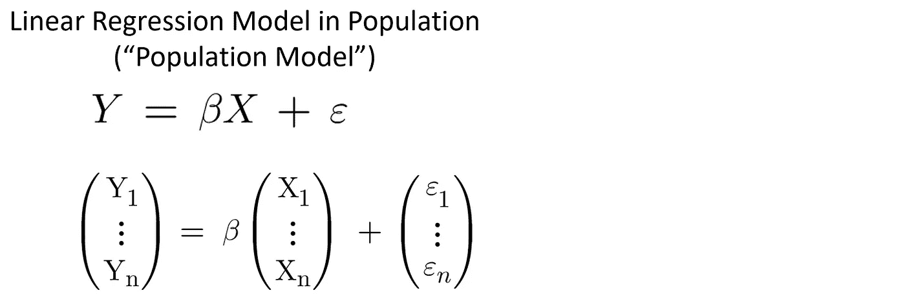

作者图片

*   响应变量(Y)可以写成解释变量(X)的线性组合
*   **β** 是未知的**总体参数** ( **固定值**)，我们将从样本数据中进行估计。
*   **ε** 是误差项，表示真值(用 **βX** 表示)与总体中观察到的响应值之差。我们假设对于总体中给定的 X 值，可能有许多不同的响应值(Y)。换句话说，**以 X** 为条件，Y 和ε可以取不同的值。因此，**响应变量和误差项都是随机变量。**

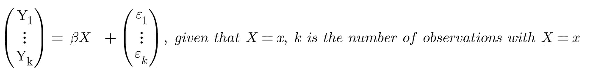

作者图片

> 如果样本中只有一个 X= x 的响应值(Y ),我们仍然假设对于总体中给定的 X 值，有许多**未观察到的**不同响应值(Y)。

在给定的观测值中， **εi** 是一个随机变量。基于经典线性回归模型的假设，我们假设

*   误差项(即ε1、ε2、…、εn)的均值为零。

E( **εi** ) = 0，i = 1，2，…，n

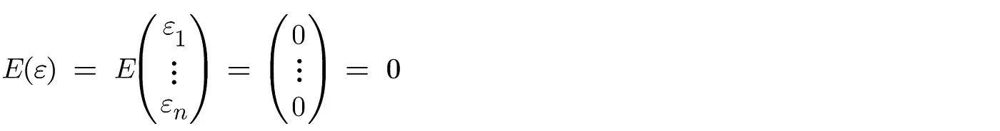

作者图片

*   误差项具有**恒定方差** (𝜎2)，并且它们彼此不相关。

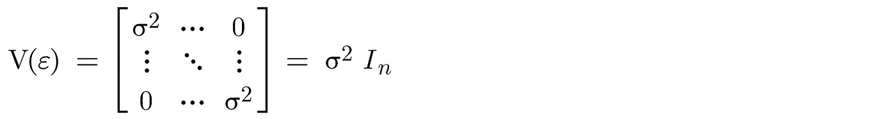

作者图片

## 如何估计线性回归模型中误差项的方差？

σ2 是误差项的方差。σ是误差的标准差。这是人口模型中的一个**未知**参数。我们通常使用样本数据中的**残差** **来估计这个值。残差 e 定义为**

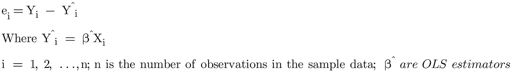

作者图片

s(又名残差标准差、残差标准差或回归的标准差)是误差标准差的**无偏估计量**。

S2(又名残差方差、均方误差或 MSE)是误差方差的**无偏估计量**。

S2 可以计算为剩余平方和除以自由度的数量。

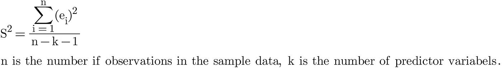

作者图片

## 假设误差在线性回归模型中呈正态分布的动机是什么？

此时，我们知道误差是一个均值为零、方差为σ2 的随机变量。我们可以用 S2 估算σ2。我们尚未假设误差项的任何分布(如正态分布)。

> 我们知道，OLS 不需要正态假设(例如，误差项遵循正态分布)来产生具有最小方差(又名， [**、蓝色**](/linear-regression-with-ols-unbiased-consistent-blue-best-efficient-estimator-359a859f757e) )的**无偏估计。然后**

**为什么我们要假设误差项是正态分布的？**

线性回归模型的目标之一是使用 **β^** (OLS 估计器)估计总体参数 **β** ，它是从样本数据中计算出来的。β^本身是一个随机变量，因为它在不同的样本数据中变化。因此，了解β^的**抽样分布**允许我们计算显著性检验的 p 值，并为 OLS 估计量生成可靠的置信区间。

> 利用一点数学知识，我们可以证明，如果我们假设误差在线性回归模型中呈正态分布，那么 OLS 估计量也将呈正态分布。

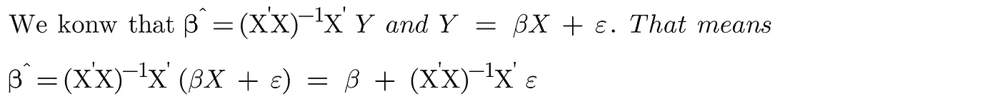

作者图片

> 上式中， **β** 为定值。以 x 为条件，OLS 估计量中， **β^只是一个线性函数的误差项。**通过假设误差项具有多元正态分布，我们也暗示 OLS 估计量具有多元正态分布。

作者图片

## 为什么假设误差在线性回归模型中呈正态分布是合理的？

正态性假设(即误差呈正态分布)并不像看起来那么强，基于**中心极限定理**它通常是合理的。

“**和的中心极限定理**陈述了许多独立变量的和近似于一个**正态分布**，即使每个独立变量遵循不同的分布。

你可以将这个定理应用于线性回归模型。我们知道，如果我们重复抽取大小为 n 的不同样本(即**重复样本**)，重新运行线性回归模型，并计算相同 X 的误差值，我们很可能会有不同的误差值。如果我们把这些误差值放在一起画一个直方图。分布应该看起来像正态分布。

我们可以这样想。以 X=Xi 为条件，我们可以将εi(一个变量)视为**许多其他因省略重要变量或纯随机性而产生的独立误差**的总和。这些其他独立误差中的每一个都遵循未知的分布。

> 因此，基于和的中心极限定理，个体误差项( **εi** )的**采样分布**是正态分布。误差项(即ε1，ε2，…，εn)遵循“多元正态分布”,平均值为零，方差为𝜎2.常数
> 
> 在线性回归模型中，误差项的正态假设是**而不是**与**样本量**相关。这仅仅是由于影响单个观察的许多其他独立误差的来源。

## 我们如何检验线性回归模型中的误差是否呈正态分布？

我们可以实现**图形残差分析**来测试线性回归模型是否适合数据，以及误差是否呈正态分布。下图是常用工具。

残差的**散点图**相对于包含的解释变量以及相对于其他潜在解释变量(不包含在模型中)将允许我们访问线性回归模型的**充分性**。如果模型与数据吻合良好，散点图将由随机点组成，不显示任何**系统结构**(如趋势和非恒定变化)。否则，任何系统结构都可能表明现有模型可以在某些方面得到改进。

残差与预测响应变量的**散点图**还允许我们检测线性回归模型中的非线性、不等误差方差和异常值。

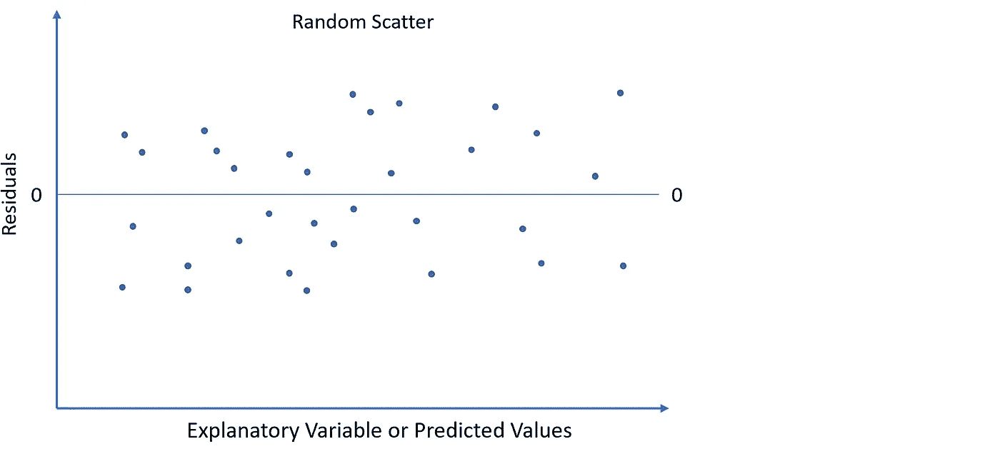

作者图片

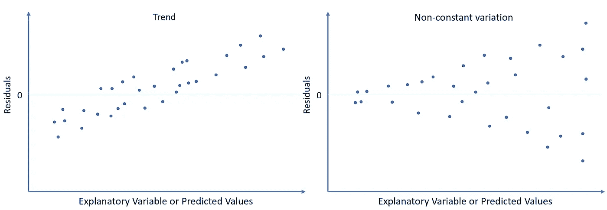

作者图片

残差的**直方图**和**正态概率图**通常用于检查假设误差具有正态分布和检测异常值是否合理。

该直方图最常用于显示残差的频率分布。如果误差具有正态分布，我们应该期望它或多或少是**钟形**。

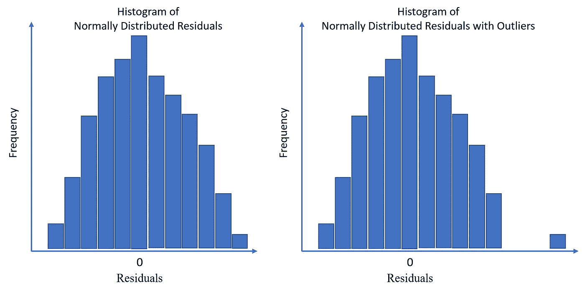

作者图片

正态概率图也有助于检查变量的正态性。它是通过将残差的排序值与标准正态分布的相应理论值进行对比来构建的。**如果误差呈正态分布，则绘制的点应靠近 45 度角的直线。**远离直线的点可能是异常值。

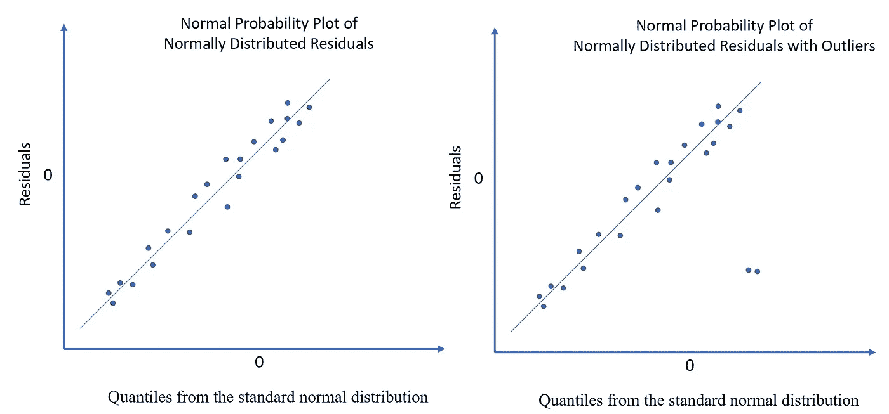

作者图片

让我们用一个例子来研究这个话题。在这个例子中，我们想研究“高中 GPA”(X，即 1.0，2.0，3.0，4.0)和“高考成绩”(Y)之间的关系。我们可以在线性回归模型中将它们的关系写成

通过应用线性最小二乘法，我们求解 OLS 估计量， **β^** 。然后，我们可以预测每个 X 的拟合值，以构建拟合线。

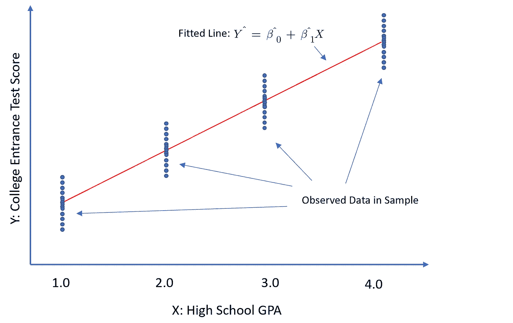

作者图片

如果线性回归模型恰当地捕捉到这种关系，我们预计残差与 GPA 的散点图具有随机模式，例如，大致相同的中心点和 GPA 之间的恒定变化。以 X 为条件(即，对于每个 X)，残差直方图应指示正态分布。

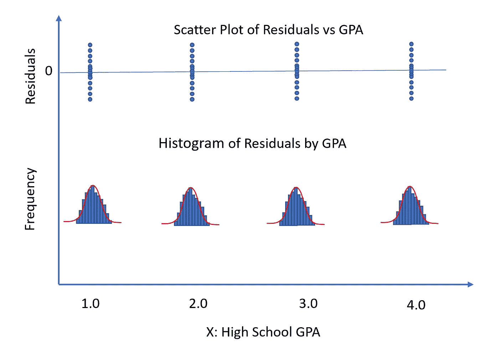

作者图片

理想情况下，我们希望检查每个**组**中残差的正态性(具有相同 X 值的观察值，或以 X 为条件的观察值)。实际上，通常没有足够的观察来绘制每组有意义的直方图。在这种情况下，我们可以将所有组间的残差集合起来检验正态性。总直方图也应该给我们许多关于误差正态性的信息。

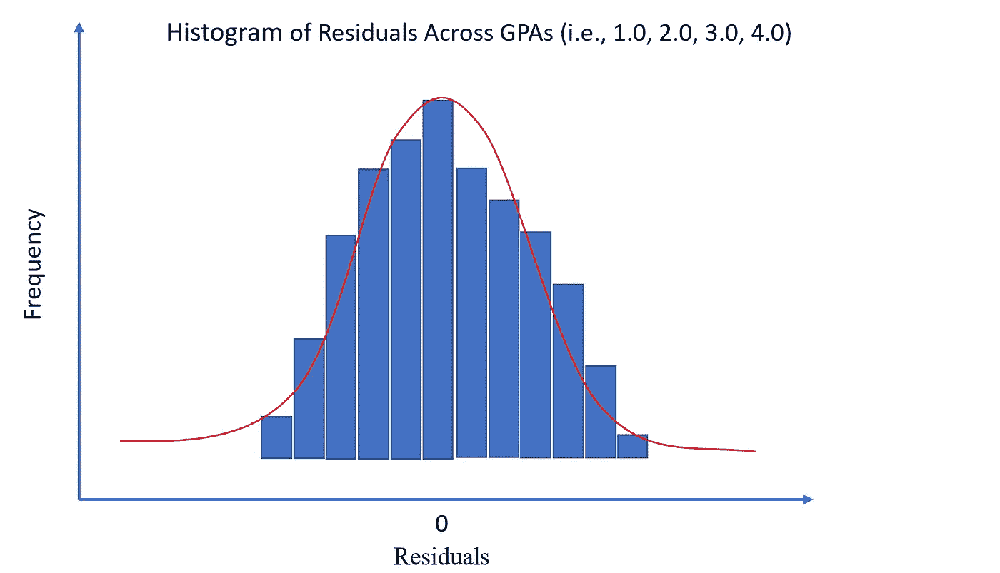

作者图片

## 结论

虽然正态性假设对于计算线性回归模型中的 OLS 估计是可选的，但是当我们假设误差是正态分布时，我们可以更好地了解来自样本数据的估计的珍贵性。

利用残差来估计误差，进行残差分析，可以帮助我们确定正态性假设，保证模型的适当性。

如果你想探索更多与**统计**相关的帖子，请查看我的文章:

*   [**7 关于中心极限定理的最常见问题**](/7-most-asked-questions-on-central-limit-theorem-82e95eb7d964)
*   [**标准差 vs 标准误:有什么区别？**](/standard-deviation-vs-standard-error-whats-the-difference-ae969f48adef)
*   [**3 种最常见的曲解:假设检验、置信区间、P 值**](/the-most-common-misinterpretations-hypothesis-testing-confidence-interval-p-value-4548a10a5b72)
*   [**线性回归模型中误差项是否呈正态分布？**](/are-the-error-terms-normally-distributed-in-a-linear-regression-model-15e6882298a4)
*   [**线性回归模型中的 OLS 估计量是正态分布吗？**](/are-ols-estimators-normally-distributed-in-a-linear-regression-model-89b688fa8dc3)
*   [**什么是正则化:偏差-方差权衡**](/machine-learning-bias-variance-tradeoff-and-regularization-94846f945131)
*   [**方差 vs 协方差 vs 相关性:有什么区别？**](https://medium.com/geekculture/variance-vs-covariance-vs-correlation-what-is-the-difference-95adff96d542)
*   [**置信区间 vs 预测区间:有什么区别？**](/confidence-interval-vs-prediction-interval-what-is-the-difference-64c45146d47d)
*   [**I 型和 II 型错误哪个更糟糕？**](https://medium.com/geekculture/which-is-worse-type-i-or-type-ii-errors-f40a0f040fcc)

# 感谢您的阅读！！！

如果你喜欢这篇文章，并且想**请我喝杯咖啡，请[点击这里](https://ko-fi.com/aaronzhu)。**

您可以注册一个 [**会员**](https://aaron-zhu.medium.com/membership) 来解锁我的文章的全部访问权限，并且可以无限制访问介质上的所有内容。如果你想在我发表新文章时收到电子邮件通知，请订阅。