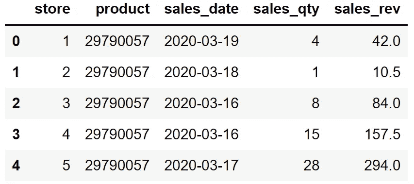
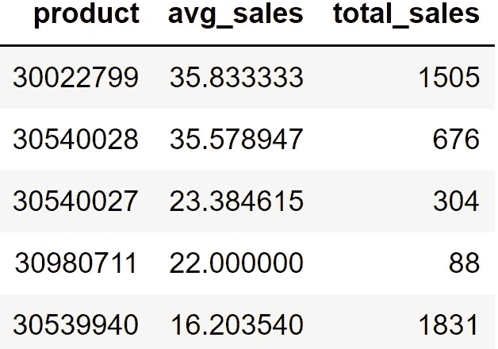

# 你是对 R 进行数据分析很好奇的熊猫用户吗？这是一个快速的开始

> 原文：<https://towardsdatascience.com/are-you-a-pandas-user-who-is-curious-about-r-for-data-analysis-here-is-a-quick-start-1f88bb5d7001>

## 熊猫是伟大的，但它不是游戏中的唯一。


张秀坤·范·奥登博施在 [Unsplash](https://unsplash.com/s/photos/curious?utm_source=unsplash&utm_medium=referral&utm_content=creditCopyText) 上拍摄的照片

谈到数据分析，Pandas 在数据科学生态系统中占据主导地位。其可爱的 Python 语法和高度实用的功能在熊猫的受欢迎程度上发挥了关键作用。

数据分析游戏第二好的玩家是 r，我最喜欢的是[数据表](https://cran.r-project.org/web/packages/data.table/vignettes/datatable-intro.html)但是 [tidyverse](https://www.tidyverse.org/) 里的包也很受欢迎。

我在工作中使用熊猫和数据表。我真的不能说一个优于另一个。他们都有一些优点和缺点。使用哪一个是您的偏好、您的团队或您的公司的问题。

在本文中，我们将讨论 Pandas 和数据表版本的常见数据操作和分析任务。如果你计划从一个过渡到另一个或者两个都用，这些例子肯定会有帮助。

当然，我们需要一个数据集来处理。我准备了一个销售数据集样本，你可以从我的 GitHub [页面](https://github.com/SonerYldrm/datasets)下载。我们将使用名为“sample-sales-data.csv”的文件。

我还想提一下我更喜欢用哪些 ide 来处理这些库。我在用

*   [R 工作室](https://www.rstudio.com/)为 R
*   用于 Python 的 [PyCharm](https://www.jetbrains.com/pycharm/) 和 [Jupyter 笔记本](https://jupyter.org/)。

让我们从读取数据集开始。

(图片由作者提供)



销售(作者图片)

数据集包含一些产品和商店的每日销售信息。

我们通常从根据行数和列数检查数据集的大小开始。

(图片由作者提供)

数据集由 224229 行和 5 列组成。

常见的操作是检查列中值的分布。对于分类列，我们可以计算每个不同值出现的次数。

在 Pandas 中，这个操作有一个特定的函数，就是 value_counts。在数据表中，我们可以使用 group by 语法。让我们在商店列上做一个例子。

(图片由作者提供)

在数据表中，我们根据 store 列中的不同值对行进行分组，并计算属于每个组的行数。这基本上就是 value_counts 函数所做的事情。

我们刚刚看到了如何计算每组中数据点的数量，这意味着按组计数。我们可以执行许多其他聚合来比较不同的组，如平均值、最小值、最大值、唯一值的数量等。

我们可以计算每个商店的总销售量，如下所示:

(图片由作者提供)

熊猫用的是 groupby 函数。另一方面，我们不需要在数据表中使用特定的函数进行分组。它具有特殊的语法结构，如下所示:

```
dt[filtering or sorting, aggregations, grouping]
```

这两个库都允许按多个列分组并计算多个聚合。

这里有一个更复杂的例子。我们将找到每个产品的平均和总销售额，然后根据平均销售额选择前 5 个产品。

(图片由作者提供)

sort_values 和 order 函数分别用于对 Pandas 和数据表中的值进行排序。默认情况下，这两个函数都按升序排序。要改变这种行为并按降序排序，我们可以在 Pandas 中将 ascending 参数设置为 false。在数据表中，我们可以在列名前面加一个减号。

上面熊猫代码的输出是:



(图片由作者提供)

在两个库中添加新列非常简单。例如，我们可以从日期中提取月份信息，并将其保存在名为 month 的列中。

(图片由作者提供)

需要注意的是，要使这些操作正常工作，日期列的数据类型应该是适当的。

数据分析和处理的另一个常见任务是过滤。我们基于一个条件或一组条件过滤观察值(即行)。

下面几行代码选择商店 2 的第一个月(即一月)销售额。

(图片由作者提供)

在 Pandas 中，列名需要与数据帧的名称一起写入，而我们只需在数据表中写入列名。

在处理现实生活中的数据集时，我们通常会处理缺失值，这是一个两步任务。第一步是找到丢失的值，第二步是用合适的值替换它们。

假设销售数量列中有一些缺失值，我们想用 0 替换它们。我们是这样完成这项任务的:

(图片由作者提供)

Pandas 和 data table 都是用于数据分析和操作任务的高效实用的库。我们已经看到了一些典型的任务是如何用它们完成的。这两个库都能够完成更复杂的任务。我希望这篇文章可以作为一个基本的比较，并激励你尝试两者。

*别忘了* [*订阅*](https://sonery.medium.com/subscribe) *如果你想在我发表新文章时收到电子邮件。*

*你可以成为* [*媒介会员*](https://sonery.medium.com/membership) *解锁我的全部写作权限，外加其余媒介。如果您使用以下链接，我将收取您的一部分会员费，无需您支付额外费用。*

<https://sonery.medium.com/membership>  

感谢您的阅读。如果您有任何反馈，请告诉我。