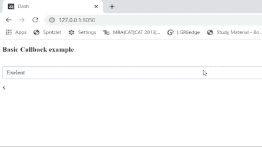
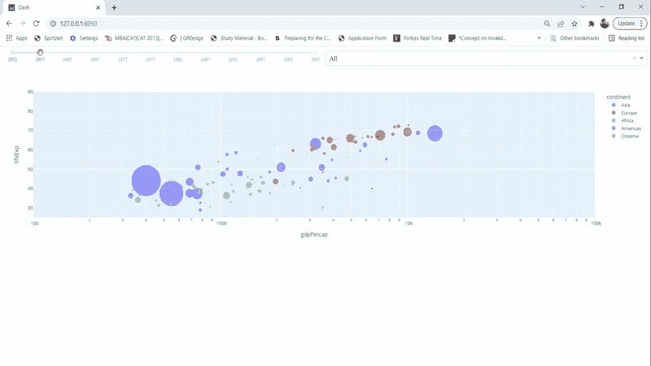

# Plotly 回调:创建令人兴奋的互动情节

> 原文：<https://towardsdatascience.com/are-you-still-creating-boring-static-plots-its-time-to-move-on-384f49b60d16>

## 在 Plotly Dash 中开始回调

Pic 鸣谢:Jason Coudriet (Unsplash)

假设您想展示不同级别(地区、州、国家、年份)的零售商销售额。你会怎么做？您会创建 4-5 个不同的静态图，还是希望创建一个可以通过交互式绘图完成所有这些工作的静态图？如果你想选择第二种选择，那么这篇博客会对你有所帮助。

## **可能与 Plotly 破折号！**

我们可以使用 Plotly dash 在 python 中轻松创建交互式绘图。使用 Plotly Dash，我们不必学习 Javascript 来为我们的情节添加交互性，我们可以使用 python 来完成。Dash 是开源的，使用该框架构建的应用程序可以在 web 浏览器上查看。

## 增加互动性！

向图中添加交互性需要两步:

1.  创建布局，您将在其中添加下拉列表、绘图、按钮、滑块等元素。
2.  创建回调，将下拉菜单、滑块等连接到您的绘图。回调增加了情节的互动性。

让我们通过几个例子来理解这一点:

# **例 1:基本回调**

在这个例子中，我们将看看基本的回调功能。我们将创建一个包含课程评级(优秀、一般、低于一般)的下拉列表，并在下拉列表下方打印与评级(5、3、1)相对应的数值。当我们改变下拉列表中的选择时，打印的值将根据选择进行更新(如下所示)。

作者照片

**1.1 安装&导入包**

让我们从安装所需的包开始。我们需要 dash 包来初始化应用程序和设置回调，dash-html-组件创建布局，dash-core-组件创建下拉菜单，图表等。您可以使用 Anaconda Spyder，一个 python 开发环境**、**来运行代码。

安装所需的软件包

在下面的代码中，我们将导入已安装的软件包。输入和输出将用于创建我们的回调。

**1.2 创建布局**

在布局中，我们可以定义想要展示的所有元素。在本例中，我们希望在布局中显示一个标题、一个下拉列表和一个文本输出(使用 div 组件)。

布局是使用 html 创建的。Div 组件，它是一种包装布局元素的包装器。Div 组件有两个参数:

1.  id:div 组件的唯一标识符。
2.  children:用于设置布局组件的参数。在这个参数中，我们设置了布局的标题、下拉菜单和文本输出。

在 dropdown 函数中，我们将唯一标识符“id”设置为“dropdown”，“options”设置为与这些标签对应的标签和值的列表，“value”设置为 5，这是下拉菜单的默认选择。

在下拉列表下面，我们设置 Div 组件，它将返回与下拉列表的选择相对应的值。下面我们来详细了解一下回调的情况。

**1.3 创建回调**

在本节中，我们将了解输出如何根据下拉列表的选择而变化。

回调是使用@app.callback()初始化的，后面跟着一个函数，该函数在下拉列表(输入组件)的选择发生变化时被触发。破折号回调具有以下参数:

1.  Output: Output 函数指向布局中的组件，该组件被回调函数(basic_callback())返回的对象调用/更新。

output 函数有两个参数——1)component _ id:它定义了我们希望用函数 basic_callback 更新的组件的 id。我们希望使用 Div 组件更新文本，因此我们将组件 id 设置为 Div 组件的 id ' output-text '。2) component_property 定义组件的属性，该属性将根据 basic_callback()返回的对象进行更新。在本例中，html 的 children 属性。Div(我们布局的一部分)将用对应于下拉选择的值进行更新。

2.输入:这用于定义组件，其值的变化将触发回调。输入函数也将 component_id 和 component_property 作为参数。我们希望回调基于 dropdown 值的变化而被触发，所以我们将 component_property 设置为 dropdown 的' value '属性。请注意，输入是在列表中定义的。

输入函数的 component 属性被设置为下拉列表的“value ”,作为函数 basic_callback 中的一个参数。basic_callback 函数将下拉列表值返回给 html 的 children 属性。使用回调的输出函数。

> 如果你想了解更多关于 Plotly dash 的知识，那么你可以看看这个课程，它将带你从基础到高级:【https://bit.ly/311k37f 

# **示例 2:基于图形的回调**

在这个例子中，我们将学习如何将一个滑块和一个下拉菜单连接到一个图表/绘图。该图将显示世界不同国家的人均国内生产总值和预期寿命多年来的变化情况。图表将根据滑块(年份)和下拉列表(洲)的选择变化进行更新，如下所示。

作者照片

## 2.1 创建布局

我们在下面的代码中创建了一个带有滑块、下拉菜单和图形组件的布局。我们回调函数的输出将被返回给 graph 组件。

## **2.2 创建回调**

在这一步中，我们创建了一个回调函数，它有两个对应于滑块和下拉菜单的输入组件和一个对应于图形的输出组件。

在回调中，我们根据滑块和下拉菜单的输入过滤数据集，并更新散点图。plot 对象(fig)返回到图形(dcc.graph)的 figure 属性。

如果你觉得这个故事有用，那么你可以通过分享掌声和评论来表达你的喜欢。想了解数据科学领域的发展动态可以关注我。

你可以通过下面的故事了解更多关于 Dash 的知识:

 