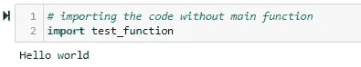
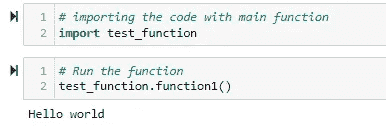
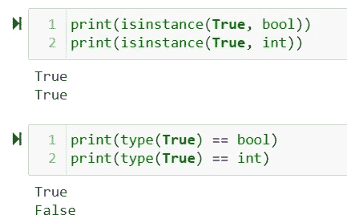
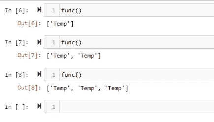
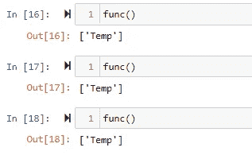

# 2022 年你还在犯这些 Python 错误吗？

> 原文：<https://towardsdatascience.com/are-you-still-making-these-python-mistakes-in-2022-2414af2375b0>


照片由[纳丁·沙巴纳](https://unsplash.com/@nadineshaabana?utm_source=unsplash&utm_medium=referral&utm_content=creditCopyText)在 [Unsplash](https://unsplash.com/s/photos/stop?utm_source=unsplash&utm_medium=referral&utm_content=creditCopyText) 拍摄

## 成为更好的程序员需要改正的 6 个 Python 错误

不可否认，Python 可能是最容易学习和使用的语言之一。它是一种高级的、多用途的编程语言。这使得它非常受欢迎，并且在最近几年有了很大的发展，尤其是随着数据科学的出现。

然而，不管一门语言多么容易使用，要写出好的代码仍然需要时间和练习。编写可工作的代码和优秀的代码是有区别的，我想强调几个可能让你成为更好的程序员的实践。

在我写 Python 代码的 5 年多时间里，我不断学习新的东西和实践，随着时间的推移，这使我成为一名更好的程序员。我从很多错误中吸取了教训，我想在这里分享其中的一些，我希望我能早点改正。这些错误不会导致语法错误，但最终会导致逻辑错误或糟糕的代码。我不回避承认我对过去的每一个错误都是有罪的，我的旧代码就是一个证明，但是一个人必须尽快了解这些事情。那么，开始吧！

## 1.使用导入*

您刚刚开始了一个数据科学项目，并且非常希望在项目中应用所有新的 Python 技巧和工具。对于您的模型准确性，您编写`**from sklearn.metrics import ***`来表示该库提供的所有很酷的评估指标。你刚刚犯了第一个错误！

这可能是我看到的 Python 程序员犯的最常见的错误，它可以告诉我是一个编写代码的新手还是有经验的人。虽然这看起来很方便，但是这样做是一种非常糟糕的做法，原因是:

*   您正在污染您的名称空间，因为它将所有内容从模块导入到名称空间。这会占用内存，并可能导致您没有意识到的覆盖。因此，您自己的命名空间中的函数和类可能会与您定义的或来自其他库中的函数和类冲突，从而导致不可预见的逻辑错误。
*   这会影响代码的可读性，因为现在代码中的某些函数和变量无法追溯到它们的来源。这意味着你代码中的随机`sqrt()`函数可能来自`numpy`、`math`，甚至是你不知道的自定义函数。这也增加了调试的难度。

**解决方案—** 确保您总是指定从哪里导入什么。下面是一个例子。

```
**import secrets
import string
import re
from wsgiref.util import request_uri 
from http.client import responses
from rest_framework import viewsets, status
from rest_framework.response import Response
from rest_framework.permissions import AllowAny, IsAuthenticated
from rest_framework.decorators import permission_classes**
```

**2。使用 pip 冻结存储需求**

`pip freeze`是 python 中最流行的需求管理命令之一。它通常用于将项目的需求存储到文本文件中。许多初级 Python 程序员使用它来管理他们的虚拟环境。然而，它带来了一系列的问题，包括循环依赖和版本控制。

我写了一篇关于使用`pip freeze`的问题和你可以使用的可能解决方案的非常详细的文章。

[](/stop-using-pip-freeze-for-your-python-projects-9c37181730f9)  

我个人的建议是这一期改用`[pipreqs](https://pypi.org/project/pipreqs/)`。

## 3.不使用 Main 编写 Python 脚本

由于 Python 是一种脚本语言，你可以在*读取-评估-打印循环(REPL)* 模式下编写和执行它。例如:

```
**# test_function.py****def function1(): 
    print("Hello world") 
function1()**
```

这段代码将在使用`python test_function.py`命令从 CLI 调用时执行该函数。然而，现在如果你想在一个不同的文件中导入相同的函数作为一个模块，比如说一个`jupyter notebook`，这就是将要发生的事情。



导入没有主函数的模块(图片由作者提供)

基本上，函数内部的代码是在函数导入时自动运行的。在上面描述的简单函数的情况下，这可能是可以的，但是如果代码包含计算开销很大的任务，那么代码甚至会在导入时继续运行。这就是为什么编写`__main__`对 Python 脚本很重要。

```
**# test_function.py****def function1(): 
    print("Hello world") 
function1()** **# Define the __main__ script
if __name__ == '__main__': 

    # execute only if run as a script
    function1()**
```

上面的代码确保了与 CLI 相同的功能，但不会作为模块在导入时运行，除非专门运行。(如下图所示)



函数作为脚本运行(图片由作者提供)

## 4.使用`assert`语句作为保护条件

`assert`关键字是检查条件和失败执行最流行的方法之一。它对于调试代码非常有用，因为它允许您测试代码中的条件是否返回 True，如果不是，程序将引发 AssertionError。

然而，有一个很大的警告——当使用`-O` (optimize)标志调用 Python 解释器时，会从字节码中删除`assert`语句。因此，如果`assert`语句用于产品代码中的验证，那么它们根本不会被执行。这可能导致很大范围的逻辑错误和安全漏洞。因此，我们应该只在测试中使用`assert` 语句。在生产中，我们可以改用`AssertionError.`

```
**Incorrect:** assert *condition, message* **Correct method:** 
if not *condition*: 
    raise AssertionError
```

## 5.使用`*isinstance()*`和`type() correctly`

在我们的 Python 代码中，有很多地方需要检查数据类型或对象的类。这方面的常用方法是`type()`和`isinstance()`。这两者都被广泛使用，确保我们理解在哪里使用什么以及注意事项是很重要的。

这两种方法都可以用来检查 Python 中对象的类型。然而，他们检查的内容有很大的不同。`isinstance`也检查继承，而`type`不检查。这在您检查派生类时变得很重要。看看下面的例子:



类型与实例(图片由作者提供)

在上面的例子中，当我们使用`type`时，`int`和`bool`被视为不同的数据类型，但当我们使用`isinstance`时，它们被视为相同，因为`bool`实际上是从 Python 中的`int`继承而来的。

因此，理解您正在测试/检查什么并相应地使用正确的类型检查器是很重要的。你可以在这里阅读更多关于这两种方法的区别[。](https://switowski.com/blog/type-vs-isinstance)

## 6.**错误地使用函数默认参数**

一个常见的误解(最近我也消除了)是，每次调用函数时，传递给函数的默认参数将被重置为指定的默认值。看看这个例子。

```
**def func(list1=[]):      # here l1 is a default argument set to []
    list1.append("Temp") 
    return list1**
```

让我们看看多次调用`func`会发生什么。



多次调用该函数时的输出。(图片由作者提供)

上述结果可能会让你感到震惊，但这是一个非常合乎逻辑的结果。**在 python 中，一个函数的默认值只在函数被定义时评估一次**。函数调用的每个其他实例将使用默认参数的原始定义。因此，`list1`首先被评估为`[]`,然后每次对原始列表进行追加操作。

可变数据类型会遇到这个问题，解决这个问题的方法是使用`none` 语句，并对函数中的列表求值，如下所示。

```
**def func(l1=None):      
    if l1 is None: 
        l1 = []
    l1.append("Temp") 
    return l1**
```



带有新函数定义的输出(图片由作者提供)

# 结论

这些是我遇到的一些错误，我想与你分享。希望其中一些对你来说是有见地的和新的。如果你认为我错过了一些重要的东西，请随意分享，这样我和我的读者可以从中学习。

你也可以看看我写的其他东西。

[](/7-must-read-books-for-data-scientists-in-2022-aa87c0f9bffb)  [](https://levelup.gitconnected.com/5-new-features-in-python-3-11-that-makes-it-the-coolest-new-release-in-2022-c9df658ef813)  [](/a-novel-approach-to-feature-importance-shapley-additive-explanations-d18af30fc21b) 