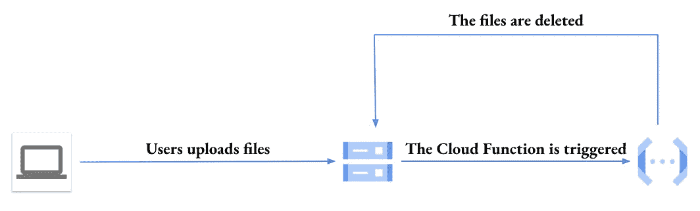
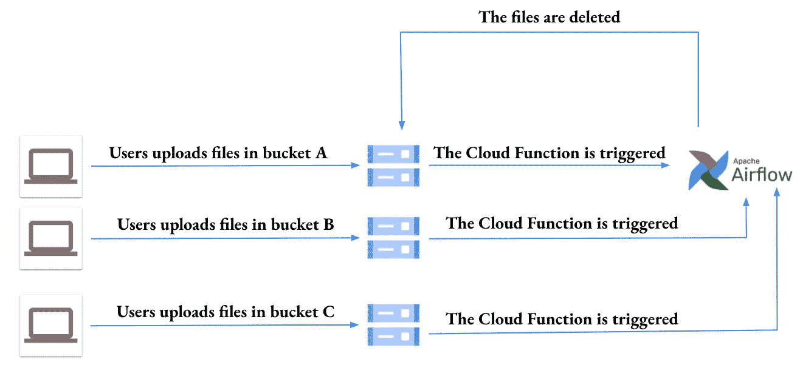
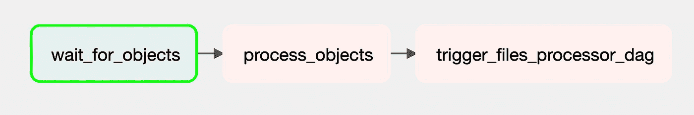

# 您是否使用云函数进行基于事件的处理？

> 原文：<https://towardsdatascience.com/are-you-using-cloud-functions-for-event-based-processing-adb3ef35aba6>

## 阿帕奇气流的强大替代变化

贾斯汀·威尔肯斯在 [Unsplash](https://unsplash.com?utm_source=medium&utm_medium=referral) 上的照片

作为一名数据或软件工程师，我们经常需要在事件发生时触发一些代码的运行。这被称为基于**事件的处理**。一个非常常见的事件是在数据库中插入一些数据。另一个流行的事件是文件到达服务器或存储服务。

这篇文章主要是为了展示为什么我认为 Apache Airflow 是在[谷歌云平台](https://cloud.google.com/) (GCP)中基于事件处理的最佳工具。

## **任务:在文件到达时删除它们**

假设我们有一个[云存储桶](https://cloud.google.com/storage)，合作伙伴或客户在其中上传文件。我们的任务是近乎实时地处理这些文件，即尽可能快地处理。为了简单起见，这里的处理只是删除文件。

在 GCP，传统的做法是使用云功能(后台功能)

## **使用云功能删除到达的文件**

云函数(在撰写本文时只有第一代函数)本身支持观察一个定义的桶，并在文件上传时触发。

当文件到达桶中时删除它们，按作者排列图像

我曾经大量使用这个特性，如果用例符合以下 4 个约束，它会工作得很好。实际上:

*   **约束 1** :不能看一个以上的桶。你将不得不定义许多函数，也就是你想观察的每个桶的一个函数。
*   **约束二**:不能只看一个桶里面的文件夹。对于 bucket 的每个文件夹中的每个文件上载，该函数必然会触发。
*   **约束 3** : 你不能看一个位于不同 GCP 项目的桶，而不是一个拥有云功能的桶。
*   约束 4 :你的处理过程不应该超过几分钟(写这篇文章的时候是 9 分钟)。

## **Apache Airflow 是云功能的强大替代方案**

Apache Airflow 是一个复杂的开源作业调度器和协调器，在 GCP 通过 T2 的 Cloud Composer 提供。它提供了一种特殊类型的工作，称为传感器，能够监视服务器、数据库、队列等，等待某个事件发生。

对于我们的特定场景，即监控文件上传的云存储桶，我们需要一个传感器作业，它会不时地检查这个桶，然后在有文件上传时发出警报。气流 2 中有两个传感器可以完成这一任务:

1.  [gcsobjectexistencesisensor](https://github.com/apache/airflow/blob/main/airflow/providers/google/cloud/sensors/gcs.py#L34):它监视一个云存储桶进行文件上传。如果你说云功能也可以做到这一点，你几乎是对的。实际上，云函数也可以做同样的事情，只要桶和云函数位于同一个 GCP 项目中(约束 3)。
2.  [gcsobjectswithprefixexintensesensor](https://github.com/apache/airflow/blob/4ffd4f09532fceb67675fce4c1f5cd383eff992e/airflow/providers/google/cloud/sensors/gcs.py#L165):它监视一个云存储文件夹进行文件上传(约束 2)。在这里，我们可以开始看到 Apache Airflow 的威力，因为它允许您做您无法使用云功能做的事情。

气流真正赢得这场战斗(也赢得这场战争)的地方在于，它赋予我们轻松构建自己的定制传感器的能力。例如，我们可以编写一个能够监控许多桶的传感器(约束 1)。

删除文件，因为他们到达许多桶，由作者图像

**构建多个云存储桶传感器**

我说过，编写我们自己的策划传感器很容易，这不是谎言。这里我只需要创建一个继承自[基本传感器类](https://github.com/apache/airflow/blob/main/airflow/sensors/base.py#L76)的类，并覆盖 2 个方法:

*   *戳*:这是你告诉 Airflow 你想监控一个文件上传的云存储桶列表的地方。注意该方法返回一个布尔值，表明传感器正在监视的事件是否已经发生。

覆盖基本传感器的戳方法，图片由作者提供

*   *执行*:我们覆盖了基础传感器的执行方法，通过[气流 xcoms](https://airflow.apache.org/docs/apache-airflow/stable/concepts/xcoms.html) 将上传的文件传递给传感器任务下游的任务。

覆盖基本传感器的执行方法，由作者生成图像

**构建 Dag 以在文件到达时删除文件**

一旦我们的自定义传感器创建完成，我们就将其用作从多个存储桶中实时删除文件的[气流 DAG](https://airflow.apache.org/docs/apache-airflow/stable/concepts/dags.html) 的第一步。这对应于下面代码片段中的对象 *wait_for_objects_task* 。

当文件到达时，按作者删除图像的 Dag

然后我们将文件删除代码嵌入到一个 [Python 操作符](https://github.com/apache/airflow/blob/main/airflow/operators/python.py#L77)(*process _ objects _ task*)中。最后，我们使用一个 [Trigger Dag 运行操作符](https://github.com/apache/airflow/blob/main/airflow/operators/trigger_dagrun.py#L64)(*Trigger _ files _ processor _ Dag*)在上传的文件被删除后再次启动传感器。通过这种方式，我们能够持续监控新文件上传的云存储空间。

运行 dag，在文件到达时按作者删除图像

请注意，我们的传感器(所有气流传感器都是如此)并不真正提供实时容量。而是每分钟列出桶的内容，看看里面是否有文件。它戳桶的频率由参数 *poke_interval* 控制。虽然您应该避免非常频繁的戳，但是如果您需要实时处理，您应该将该参数设置为一个较低的值。

**结束注释**

为了给它应有的荣誉，让我确认一下，除了前面提到的 4 个限制，我认为云函数是基于事件处理的一个有吸引力的解决方案，因为它们通常可以快速构建并且具有成本效益。

此外，尽管我一直在说气流传感器的优点，但它们有一个重要的缺点:它们可以运行很长时间，这意味着在气流装置中运行许多传感器会导致资源匮乏。[为了解决这个问题，Airflow 2.2 中引入了可推迟操作符](https://airflow.apache.org/docs/apache-airflow/stable/concepts/deferring.html)。

现在，你同意我的观点，气流传感器是云功能的强大而灵活的替代品吗？

非常感谢你的时间。请在这里找到完整的代码。直到下一次写作，拜拜。