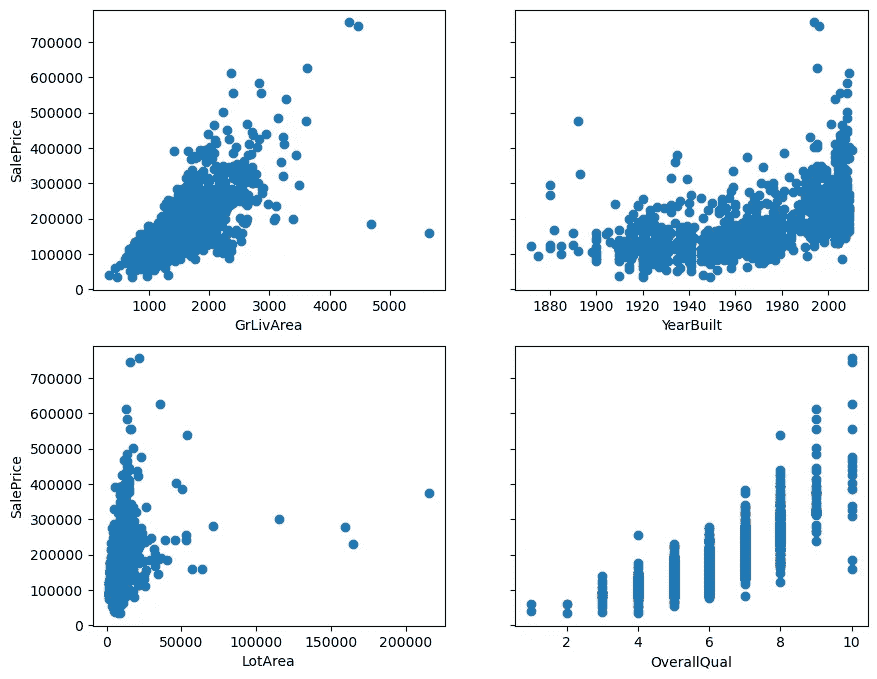
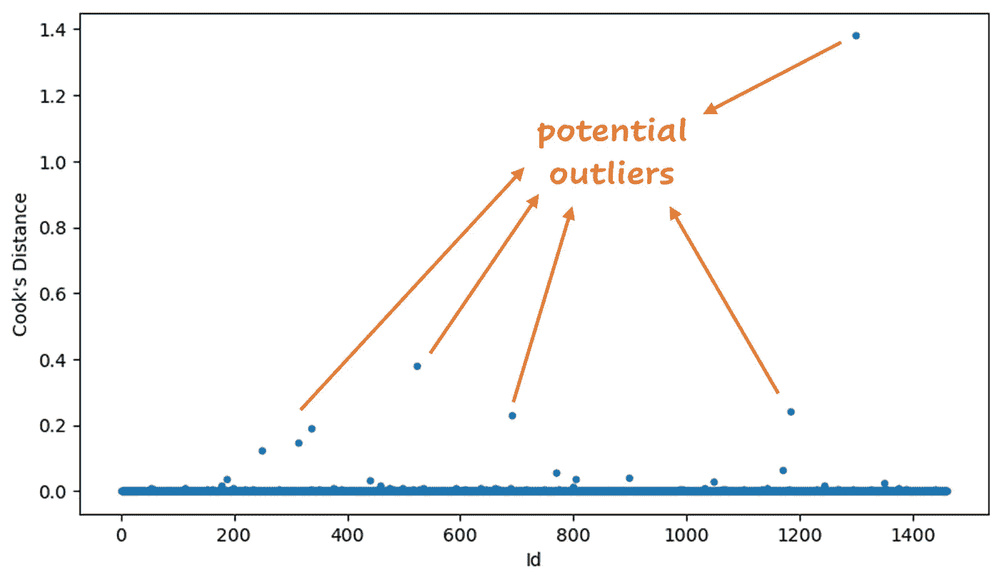
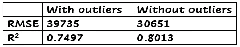
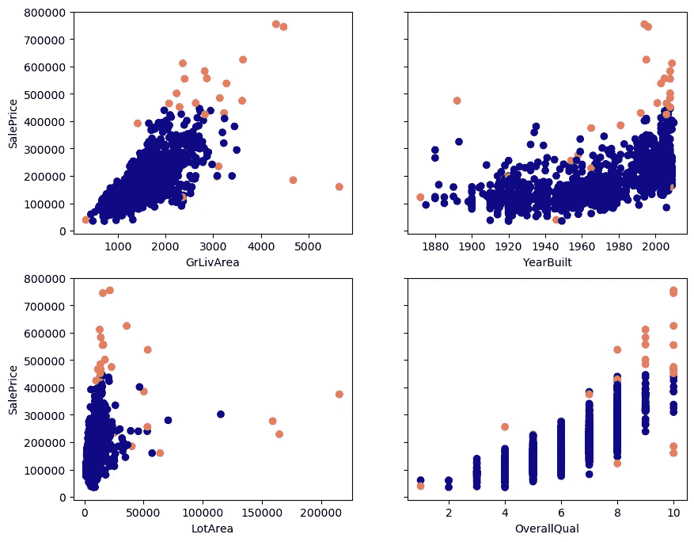
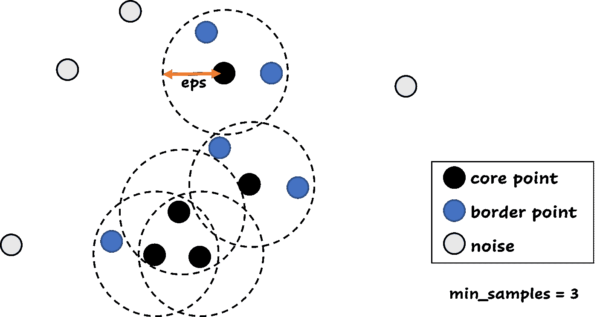
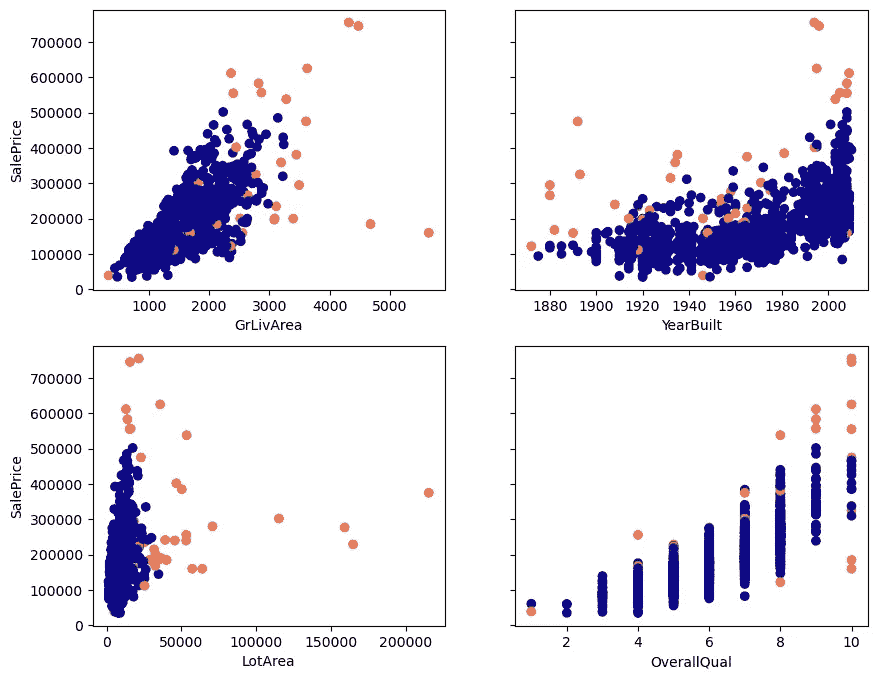
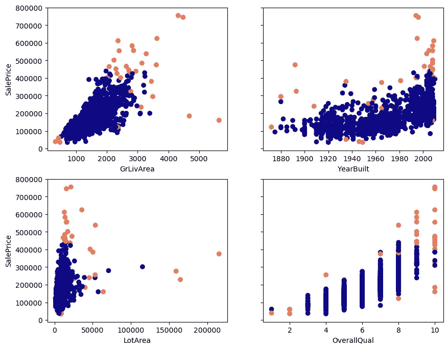
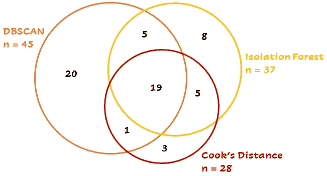

# 您是否使用特征分布来检测异常值？

> 原文：<https://towardsdatascience.com/are-you-using-feature-distributions-to-detect-outliers-48e2ae3309>

威尔·梅尔斯在 [Unsplash](https://unsplash.com?utm_source=medium&utm_medium=referral) 上拍照

## 这里有三种更好的方法。

**作为数据科学家，你可能遇到过这种情况:数据点不合适，对你的模型的性能有不良影响。你如何发现它们？你看了盒子或者散点图了吗？在检测之后，您是丢弃异常值还是使用其他方法来提高数据质量？在本文中，我将解释三种检测异常值的方法。**

# 定义和数据

离群值被定义为与其他观察值显著不同的数据点。但重要的是什么？如果一个数据点的单独特征看起来正常，但特征值的组合很少或不太可能，您应该怎么办？在大多数项目中，数据将包含多个维度，这使得肉眼很难发现异常值。或者用箱线图。

下面，你可以看到我将在本文中使用的数据的散点图。它[存放来自 OpenML](https://www.openml.org/search?type=data&sort=runs&id=41211&status=active) (知识共享许可)的数据。这些图表和数据使解释检测技术变得更加容易。我将只使用四个特性(GrLivArea、YearBuilt、LotArea、OverallQual)和目标销售价格。该数据包含 1460 个观察值。

与销售价格(目标)相比的特性图。图片作者。

根据这些图，您预计哪些点会被检测为异常值？🤓

加载数据并绘制异常值的代码:

# 检测方法

让我们开始吧！我将讨论的三种检测方法是库克距离、DBSCAN 和隔离森林。随意跳过你熟悉的部分。

## **1。库克的距离**

介绍 Cook 距离[1]的原文章标题为:*线性回归中有影响观测值的检测*。这正是库克距离所做的:它衡量一个数据点对回归模型的影响有多大。该方法通过测量移除数据点时模型中拟合值的变化来计算数据点的库克距离。

**数据点的库克距离越高，该点对确定模型中的拟合值的影响越大。**如果一个数据点与其他库克距离相比具有较高的库克距离，则该数据点更有可能是异常值。

在 Python 中，很容易计算厨师的距离值。建立回归模型后，您可以立即计算距离。下面你可以看到库克的距离值的 Id 图:

每个数据点 Id 的厨师距离值。高库克距离意味着该数据点更有可能是异常值。图片作者。

有不同的方法来确定要将哪些点标记为异常值。任何高于 4/ *n* 的值都值得研究，其中 *n* 是样本大小(本例中为 1460)。另一种方法是计算厨师距离的平均值，并去除大于 3* 的值。我使用最后一种方法来确定异常值。用这种方法有 28 个异常值。我在没有他们的情况下重新训练了模型。下面你看到的结果，很好的改善，对不对？当心！在删除异常值之前，您必须对其进行调查！稍后将详细介绍这一点。

剔除异常值前后的结果。图片作者。

根据库克距离的异常值以橙色表示:

库克距离的橙色异常值。图片作者。

计算库克距离并显示异常值的代码:

## 2.基于密度的噪声应用空间聚类

您可能知道 DBSCAN(带噪声的应用程序的基于密度的空间聚类)是一种聚类技术。给定一个数据集， **DBSCAN 查找高密度的岩心样本，并使用这些样本创建聚类** [2]。您不必指定聚类的数量(与 K-Means 一样)，这是 DBSCAN 的一个很好的优势。

使用 DBSCAN，您必须指定两个参数:epsilon *(eps)* 和最小样本数 *(min_samples)。*ε是距离度量，也是最重要的参数:它是两个样本之间的最大距离，其中一个样本被认为与另一个样本相邻。最小样本是一个点的邻域中被认为是核心点的样本数。这包括点本身，因此如果 *min_samples* 等于 1，则每个点都是一个聚类。

DBSCAN 对于检测异常值非常有用。DBSCAN 将数据点分为三组:一组是具有**核心**数据点的组，这些数据点在距离它们小于 *eps* 的距离内至少有 *min_samples* 。比有**边界**点，这些点至少有一个核心点在距离它们小于 *eps* 的距离内。最后一组包含不是核心点或边界点的点。这些点是**噪声**点，或者潜在的异常值。核心点和边界点接收它们的聚类号，而噪声点接收 cluster -1。

最小样本量为三的核心、边界和噪声点。图片作者。

在使用 DBSCAN 进行异常值检测之前，可能有必要对数据进行缩放。在这个例子中，我使用了一个 [StandardScaler](https://scikit-learn.org/stable/modules/generated/sklearn.preprocessing.StandardScaler.html) ，因为数据特征具有非常不同的比例(总体质量值从 1 到 10，年构建值从 1860 到 2020，LotArea 从 0 到 250000)。

如何找到 *eps* 和 *min_samples* 的正确值？对于 *min_samples* ，可以使用经验法则 D+1，其中 D 等于数据集中的维数。在本例中，我们将使用 *min_samples =* 6 *。*参数 *eps* 有点难，可以用 K-distance 图找到正确的值。你看到手肘了吗？ *eps* 的值在 1 左右，我最后一次运行用的是 1.1。

图片作者。

下面你可以看到正常点和异常点的曲线图。当我们使用 1.1 的ε和 6 的最小样本时，根据 DBSCAN，橙色点是异常值。

DBSCAN 检测到橙色中的异常值。图片作者。

代码 DBSCAN:

## 3.隔离森林

作为异常检测模型，隔离森林非常好。它是如何工作的？

孤立森林由树木组成，就像普通的随机森林一样。在每棵树中，随机特征被选择，并且在该特征的最大值和最小值之间随机分割值。对于每个样本**，**，您可以计算出分离该样本所需的树分裂数。到样本的平均路径长度越短，越有可能是异常值(或异常值)。这有道理吧？**如果您需要更少的分割来获得一个数据点，它与其他数据点不同，因为该点更容易隔离**:

孤立森林中的一棵树。通过一次分割，一个点与其他点分离。这一点得到高异常分数。图片作者。

由于树的灵活性，您还可以将这种技术应用于分类数据。

隔离林的参数呢？一些参数与正常随机森林中的参数相同:您可以选择树的数量( *n_estimators* )、每棵树的最大样本数量( *max_samples* )以及用于训练的特征数量( *max_features* ) *)。还有一个重要的参数:污染度。您可以将污染视为数据集中异常值的比例。它用于确定阈值，以决定哪些点是异常值。如果您想要对数据点及其异常分数进行排序，您可以使用 scikit learn 中的 decision_function。并对数值进行升序排序:分数越高，该点越正常。*

隔离森林有一个缺点。正常的边缘点也容易隔离。这些点有可能被归类为异常值，尽管它们是正常的。使用这种技术时，请记住这一点。

隔离林发现异常值(橙色):

橙色的异常值。图片作者。

使用隔离林查找离群值的代码:

# 技术比较

但是等等…三种异常值检测技术中没有一种能找到与另一种完全相同的异常值！很奇怪，不是吗？19 个点由所有三种技术检测，而另外 42 个点由两种或仅一种技术检测:

比较每种方法的异常值数量以及它们之间的关系。图片作者。

这部分取决于参数和方法之间的差异。一个简短的总结:库克的距离使用一个经过训练的模型来计算每个点的影响，DBSCAN 使用点之间的距离，隔离森林计算点到点的平均路径长度。根据具体情况，您可以选择最佳技术。

# 下一步是什么？

检测到异常值后，您应该如何处理它们？我希望你不要把它们扔掉，就像它们从未存在过一样！它们进入了数据集，所以如果你不做任何事情来阻止它，它就有可能再次发生。

您可以在下面的文章中找到关于处理异常值的提示:

 [## 不要扔掉你的离群值！

### 在你尝试这些技术之前。

hennie-de-harder.medium.com](https://hennie-de-harder.medium.com/dont-throw-away-your-outliers-c37e1ab0ce19) 

# 参考

[1]库克博士(1977 年)。线性回归中影响观测值的检测。技术计量学，19(1)，15–18。多伊:10.1080/0040176767686

[2] Ester，m .，H. P. Kriegel，J. Sander，和 X. Xu，“一种在带有噪声的大型空间数据库中发现聚类的基于密度的算法”。摘自:第二届知识发现和数据挖掘国际会议论文集，俄勒冈州波特兰市，AAAI 出版社，第 226–231 页。1996