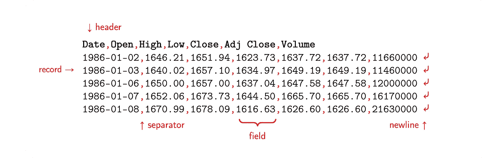
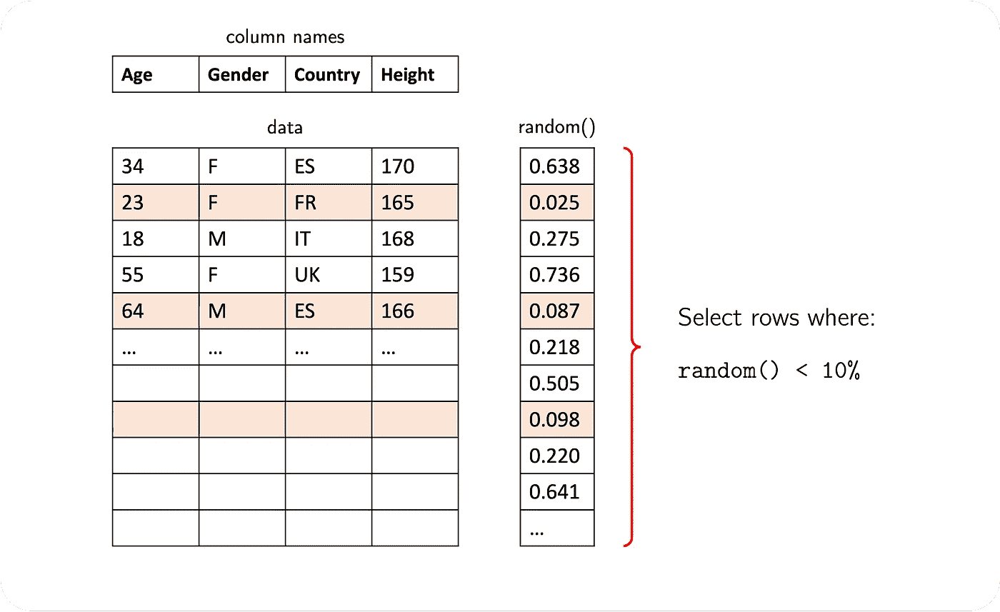
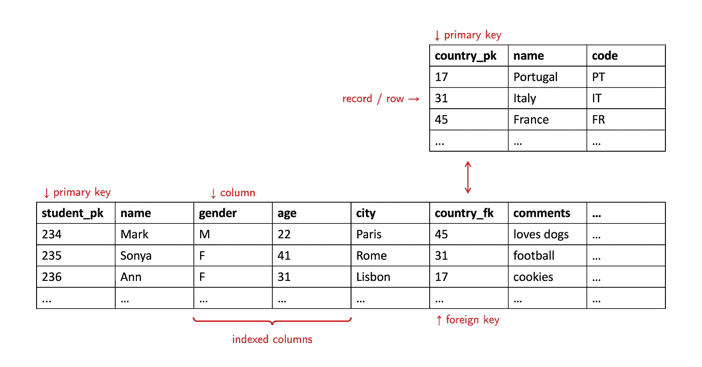
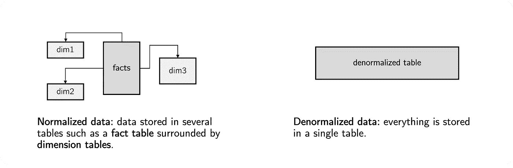

# 你的数据太大了吗？取样

> 原文：<https://towardsdatascience.com/are-your-data-too-big-take-a-sample-98ae54e4c49c>

## Python 和 SQL 中表格数据采样介绍

照片由[实体模型图形](https://unsplash.com/@mockupgraphics?utm_source=unsplash&utm_medium=referral&utm_content=creditCopyText)在 [Unsplash](https://unsplash.com/s/photos/slice?utm_source=unsplash&utm_medium=referral&utm_content=creditCopyText) 上拍摄

学术界和商业从业者投入了相当大的努力来利用今天可用的大量数据。自 20 世纪 90 年代问世以来，术语**大数据**已经引起了广泛关注。然而,“大”的实际含义仍然难以捉摸，因为随着存储和处理能力随着每一次技术进步而提高，划分**大数据**和**小数据**的阈值也在演变。

然而，在任何数据科学项目的早期阶段，都不太可能需要如此大量的数据。那时，重点应该放在探索性分析上，由常见的描述性统计数据支持，同时通过测试一些小模型来选择适当的技术。

此外，您可能会发现在笔记本电脑或其他资源有限的计算机上执行这些任务很方便。当您证明一切都按预期运行时，有足够的时间在高端服务器上部署您的成熟模型。

因此，每个数据科学家都应该精通从大型数据集中提取样本。该程序应**快捷**并保留原始数据的**统计属性**。后者通常通过随机选择要保留的记录来确保。关于速度和效率，我们的选择取决于数据格式和我们可以使用的工具。

数据集通常以各种形式呈现，或者是**结构化**(例如系列、表格、面板)或者是**非结构化**(例如文本、图像)。这篇文章涵盖了对存储在文件或数据库中的表格数据进行采样的技巧。

## 采样“逗号分隔值”(CSV)文件

尽管 **CSV 文件**相当古老(起源于 1972 年左右)，但这是一种在长格式或宽格式表格中存储结构化数据的流行方式。一个 CSV 文件由多个以换行符结束的**记录**(行)组成，每个记录包含由**分隔符**(通常为`,`)分隔的各种**字段**(列)。此外，第一行通常是为标题**保留的，其语法与任何给定的行相同。**

包含财务信息的 CSV 文件示例。图片作者。

这种形式的主要**优势**是:

*   纯文本，可读性强，易于理解。
*   不是专有的。
*   大小没有限制(只有可用的存储空间)。

相反，也有一些**限制**:

*   没有标准。然而，RFC 4180 非常接近。
*   这些文件只能按顺序处理。
*   文本字段通常要求*转义*特殊字符，如换行符或逗号，以防止干扰解析。因此，文本字段通常用引号括起来。
*   在某些国家，逗号(`,`)起到小数点的作用(如`3,141592`)。这种一致性通常需要选择完全不同的分隔符，比如分号(`;`)、竖线(`|`)或制表符。
*   CSV 文件没有明确说明字符编码，所以在读写它们的时候必须小心。
*   此格式不支持元数据。例如，您应该预先知道字段类型或自动检测它们。除非打开文件并进行检查，否则无法确定文件头是否存在。

抛开这些障碍，CSV 文件非常受欢迎。根据具体情况，它们可能会变得太大而无法在有限的硬件上有效处理。如果您曾经遇到过这个问题，不要担心:在 Python 中获取样本相对简单。

上面的代码加载大约 10%的 CSV 文件内容，随机选择要读取的行。这种方法足以保持样本的统计特性。请注意，这种方法更可取，因为**在您阅读**时进行采样，而不是将整个文件加载到内存中(这可能不可行)然后再选取样本。

它调用包**熊猫**中的`read_csv(...)`函数。具体来说，它将一个 callable 传递给参数`skiprows`，该参数根据 0 和 1 之间的均匀分布的随机变量动态地决定要处理哪些行。因此，为了保留大约 10%的内容，必须丢弃每一个结果大于 0.1 的行。

随机样本。图片作者。

## 随机性和可重复样本

那`seed(...)`呢？抽样本质上是随机的，所以你每次做都会得到不同的结果。在某些情况下，您可能需要选择是可重复的，因此无论您采样多少次或由谁采样，结果都保持不变。在这些情况下，修复随机数生成器的种子是明智的。你可能已经注意到，在互联网上，42 是随机种子的一个普遍选择:这个解释是为了纪念道格拉斯·亚当斯的名著《银河系漫游指南》。

## 采样数据库表

**关系数据库**(与非关系数据库相对)是以表格形式存储和组织数据的软件包。**数据库表**由记录和列组成。它们通常通过**主键/外键**关系链接在一起，以减少冗余并提高完整性。这种设计技术被称为**规范化**。

关系数据库中两个表的示例。图片作者。

维护数据库的原因之一是能够查询表中特定的可用数据子集。为此，大多数供应商支持一种叫做*结构化查询语言*的标准语言，简称为 **SQL** 。

识别哪些列最有可能被查询并在其上建立索引是很好的做法。**数据库索引**是一种内部数据结构，它以消耗额外的存储空间为代价来加速查询。像书籍索引一样，它允许快速定位表中的数据，而不需要完全从上到下阅读。

编写高效的查询在数据科学中至关重要。最后，我们通常需要将数据排列在一个大表中来训练和测试模型。有时数据本身已经非规范化，这降低了查询的复杂性，因为不需要将表连接在一起。在其他不太有利的情况下，我们需要编写查询来组合所有相关的表，并适当地返回所需的数据。虽然反规范化提高了性能，但它也是以更高的存储要求为代价的。

规范化与非规范化数据。图片作者。

回到我们的主题，从一个大的**数据库表**甚至从一个长的**查询结果**中检索一个样本是很容易的。一些 SQL 特性是特定于供应商的，因此下面的例子是为两个最著名的开源数据库编写的: **PostgreSQL** 和 **MariaDB** (mySQL)。

这三个示例检索了 10%的样本。这个想法与 CSV 文件非常相似。对于结果中的每条记录，我们以 0 到 1 之间的概率形式计算一个随机数。如果这样的概率低于某个阈值，则记录被处理。否则，它将被丢弃。

或者，您可以使用下面的代码来检索一个具有**特定大小**(例如，100 行)的样本。可惜比较慢。

## Python 和 SQL 协同工作

下面的代码显示了一个完整的示例:

1.  建立与 postgreSQL 数据库的连接。
2.  执行 SQL 并随机选择大约 10%的结果行。
3.  将结果存储在熊猫`DataFrame`中。

## 结论

在任何分析的早期阶段采集样本，都有可能快速发现数据中的一般趋势和模式。这将指导后续的决策，例如实现哪些模型。

样本应该有多大？有很多因素需要考虑，从统计意义到记忆限制。它应该足够小，可以放入你的计算机的内存中，并且易于管理，所以初步的结果不会花太多时间。但有一个问题:如果太微弱，一个小样本可能会错过你试图检测的效果。

希望这篇文章对你有价值。编码快乐！

## 参考

*   [逗号分隔值](https://en.wikipedia.org/wiki/Comma-separated_values)。
*   [RFC 4180](https://datatracker.ietf.org/doc/html/rfc4180) 。
*   熊猫包: [read_csv()](https://pandas.pydata.org/pandas-docs/stable/reference/api/pandas.read_csv.html) 。
*   随机包: [random()](https://docs.python.org/3/library/random.html#random.random) ， [seed()](https://docs.python.org/3/library/random.html#random.seed) 。
*   《银河系漫游指南》(道格拉斯·亚当斯，1979)。
*   [结构化查询语言(SQL)](https://en.wikipedia.org/wiki/SQL) 。
*   [数据库索引](https://en.wikipedia.org/wiki/Database_index)。
*   [数据库规范化](https://en.wikipedia.org/wiki/Database_normalization)。
*   [PostgreSQL](https://www.postgresql.org/) : [选择表样本](https://www.postgresql.org/docs/14/sql-select.html)， [random()](https://www.postgresql.org/docs/current/functions-math.html) 。
*   [MariaDB](https://mariadb.org/) : [rand()](https://mariadb.com/kb/en/rand/) 。
*   [从表中获取随机行](https://mariadb.com/kb/en/data-sampling-techniques-for-efficiently-finding-a-random-row/)(高级)。