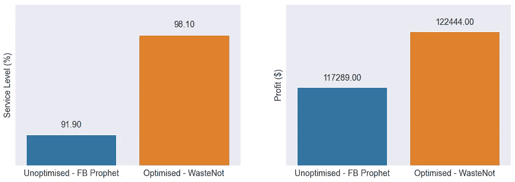
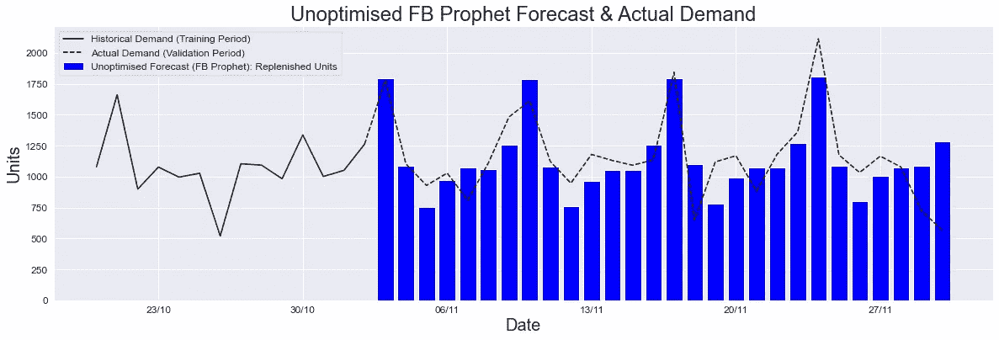
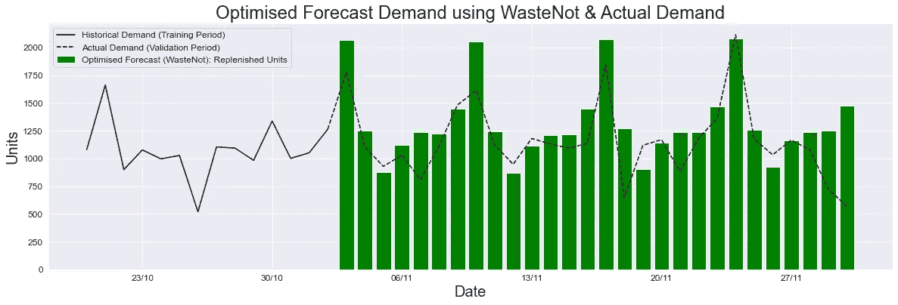
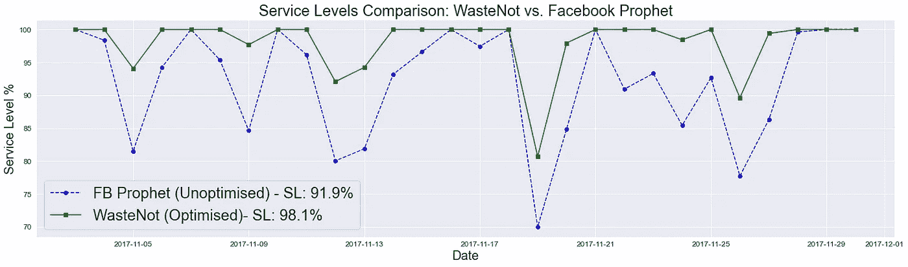
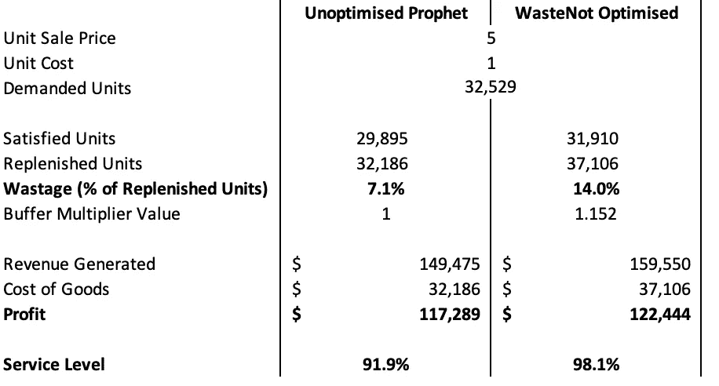
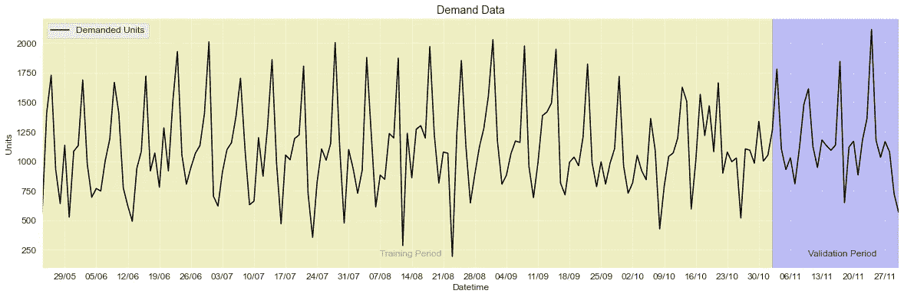

# 您的需求预测是否会损害利润和服务水平？

> 原文：<https://towardsdatascience.com/are-your-demand-forecasts-hurting-profits-and-service-levels-f61af7c5ff>

## 易腐商品的优化预测如何实现高服务水平、利润最大化和浪费最小化

服务水平和利润——按浪费进行的优化预测在服务水平上不超过 FB Prophet 的统计预测 6%,在利润上不超过 5000 美元——图片由作者提供

# 介绍

**需求预测**主要使用统计技术生成，利用过去的需求来预测未来的价值。 [**脸书先知**](https://facebook.github.io/prophet/) 是一个流行的工具，可以使用时间序列数据进行统计预测，而不必从头开始编写自己的模型。

对于**保质期有限的易腐商品**，传统的统计预测技术通常会导致**缺货/低服务水平**(由于产品可用性低而无法满足需求)或**浪费**(供过于求，产品过期)。

蓝点思维的 [**WasteNot API 服务**](http://www.bluedotthinking.com) 改进了统计预测，通过利用 Prophet、产品属性&优化例程:

*   **提高服务水平&最大限度减少缺货**
*   **最大限度减少浪费**
*   **利润最大化**

我们希望这能为您节省时间和金钱。前往 [**WasteNot**](http://www.bluedotthinking.com) 现在尝试一下，阅读 GitHub 上的[文档，或者留下来了解更多关于它是如何工作的——还有一个](https://bluedotthinking.github.io/wastenot-documentation/) [GitHub 资源库，其中有来自本文的工作示例](https://github.com/bluedotthinking/wastenot-documentation/tree/master/code_examples)。

# 统计预测经常低估需求

为了了解统计方法在哪些方面表现不佳，我们采用了一种具有可变需求特征(完整时间序列请参见附录)的易腐物品(汉堡店的汉堡肉饼)，并使用 Prophet 预测了 28 天内的需求(2017 年 11 月 3 日至 2017 年 11 月 30 日，每周预测一次，为未来一周)——该预测需求是我们每天将向餐厅补充的数量。然后，我们将其与该期间每天的实际需求进行比较，以计算服务水平、利润和浪费。

该项目具有以下属性:

*   1 天保质期，每天补充
*   单位成本为 1 美元，售价为 5 美元
*   平均每天售出约 1160 件，但一周中的每一天都有很大差异

每日历史需求，未优化的 Prophet 补充单位和验证期间的实际需求-图片由作者提供

从结果来看，很明显先知的预测过于保守；很少有几天需求能得到完全满足——因此产生的浪费很少，但利润会因为错过销售而受损。

# 优化的预测提高了服务水平和利润

验证期间的每日历史需求、优化浪费、未补充单位和实际需求—图片由作者提供

使用 WasteNot，我们在 Prophet 的统计预测的基础上，还包括价格/成本、历史可变性、保质期和库存水平的信息，以计算最佳“缓冲乘数”值，该值应用于统计预测的每个预测值，从而提高每天的补货量。

这类似于人类操作员决定他们应该比统计预测多订购 15%,因为统计预测经常低估需求。

比较 28 天内的服务水平， **WasteNot 在所有时间内都优于未经优化的 Prophet 预测**:

WasteNot (98.1%)和 FB Prophet (91.9%)在 28 个模拟日内的服务水平预测—图片由作者提供

从结果来看，很明显，有了优化的统计预测，缺货的天数就会少得多——利润显著增加，但浪费却略有增加。

服务水平和利润——waste 的优化预测在服务水平上比未优化的 FB prophet 高出 6%,在利润上高出 5000 美元——图片由作者提供

通过使用 WasteNot 的优化预测，该公司将会看到:

*   **服务水平的提高(98.1%对 91.9%)——**随着更多设备得到补充，可用性提高
*   由于更高的服务级别，增加了**5，000 美元的利润(12.2 万美元对 11.7 万美元)，**产生了更多收入
*   **浪费略有增加(14%对 7%)** ，因为交付了更多单位，导致商品成本上升

KPI s-waste not 优化预测与 FB Prophet 未优化统计预测对比-作者图片

虽然任何不必要的浪费都是不可取的，但该系统在追求最大利润的过程中最大限度地减少了浪费。

# 浪费不是对现有补充方法的补充

在需求预测和库存管理中，有许多用于确定再订购点的技术，包括:

*   安全库存
*   再订购点公式
*   定期自动更换

浪费未优化预测通过为每个再订购点提供**最佳再订购数量**来补充这些方法，例如，一旦一个项目的库存低于票面水平，浪费未优化预测就会生成一个优化的订单数量，以确保高服务水平&最大利润。

# 附录—培训/验证数据和 Jupyter 笔记本

培训和验证数据的完整时间序列如下(也可通过 [CSV 格式](https://raw.githubusercontent.com/bluedotthinking/wastenot-documentation/master/example_data/bdt_example_input.csv)获得):

项目的需求单位，分为培训和验证期-按作者分类的图片

[生成本文结果的示例笔记本](https://github.com/bluedotthinking/wastenot-documentation/tree/master/code_examples)可以在我们的[文档 Github 库](https://github.com/bluedotthinking/wastenot-documentation)中找到——它需要一个 API 密匙来运行，可以从免费的 WasteNot 层获得。