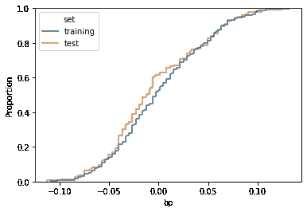
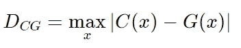
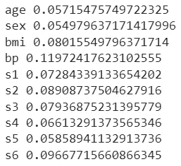
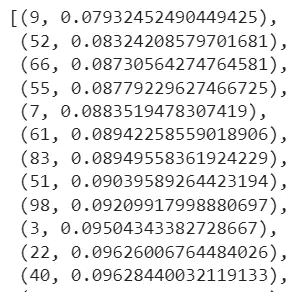
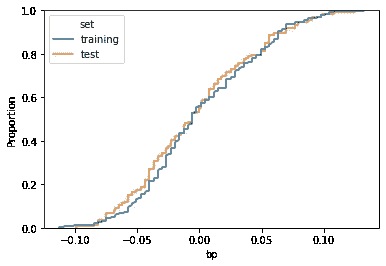

# 你的训练集和测试集有可比性吗？

> 原文：<https://towardsdatascience.com/are-your-training-and-test-sets-comparable-fc29b0e0b167>

## 关于如何创建可比较的训练和测试数据集的简短指南


作者图片

数据科学家通常将数据集分为训练集和测试集。他们的模型是在前者上训练的，然后在后者上检查其性能。但是，如果这些集合被错误地采样，模型性能可能会受到偏差的影响。

# 训练集和测试集应该相似吗？

从我职业生涯的开始，每个人都习惯于随机统一地将数据集分成训练集和测试集。这是一种常见的、被普遍接受的方法，我大体上同意这种方法。但是，如果训练测试在统计上不同于训练集，则训练的模型可能会受到偏差的影响，并且可能无法在看不见的数据上正常工作。

把完整的数据集想象成橘子和苹果的混合体。如果我们在橙子上训练我们的模型，并在苹果上测试它，它可能不会正常工作。相反，如果我们创建一个混合了橙子和苹果的训练数据集，在这样的数据集上训练的模型将在由橙子和苹果组成的测试集上正常工作。

因此，在训练我们的模型之前，我们必须确保训练和测试数据集在统计上是相似的。

# 如何计算统计相似度

在本文中，我将展示如何从单变量方法开始计算训练和测试数据集之间的统计相似性。

这个想法是计算每个特征的累积分布函数。然后，我们将训练数据集中特征的这种函数与测试数据集中相同特征的相同函数进行比较。

让我们从 sklearn 的糖尿病数据集开始看一个例子。让我们导入并拆分它:

```
from sklearn.datasets import load_diabetes from sklearn.model_selection import train_test_split dataset = load_diabetes(as_frame=True) X,y = dataset['data'],dataset['target'] X_train, X_test, y_train, y_test = train_test_split(X, y, test_size=0.33, random_state=0)
```

现在让我们使用 seaborn 为训练和测试数据集绘制“bp”特征的累积分布函数:

```
feature_name = 'bp' df = pd.DataFrame({ feature_name:np.concatenate((X_train.loc[:,feature_name],X_test.loc[:,feature_name])), 'set':['training']*X_train.shape[0] + ['test']*X_test.shape[0] })sns.ecdfplot(data=df,x=feature_name,hue='set')
```



作者图片

正如我们所看到的，两条曲线是相似的，但在中间有一个明显的区别。这意味着，在两个数据集之间，由于采样过程，要素的分布被扭曲了。

为了用单个数字量化两个分布的差异，我们可以使用 Kolmogorov-Smirnov 距离。给定 *C(x)* 特征 *x* 在训练数据集中的累积分布和 *G(x)* 相同特征在测试数据集中的累积分布，距离被定义为这些曲线之间的最大距离。



距离越小，训练数据集和测试数据集之间的特征分布就越相似。

计算这个度量的一个简单方法是使用 scipy 和 K-S 检验。

那么，距离是:

```
ks_2samp(X_train.loc[:,feature_name],X_test.loc[:,feature_name]).statistic # 0.11972417623102555
```

我们可以将两个数据集之间的距离计算为它们的要素之间的最大距离。

```
distances = list(map(lambda i : ks_2samp(X_train.iloc[:,i],X_test.iloc[:,i]).statistic,range(X_train.shape[1])))
```

这些是每个要素的距离:

```
for i in range(X_train.shape[1]):
    print(X_train.columns[i],distances[i])
```



我们可以看到，偏向性较低的特征是‘性别’，而最差的是‘BP’。数据集之间的距离是最差距离，因此为 0.1197。

如果我们使用 R 平方分数在这样的数据集上训练并测试线性模型，我们得到:

```
lr = LinearRegression() 
lr.fit(X_train,y_train) 
r2_score(y_test,lr.predict(X_test)) 
# 0.4033025232246107
```

# 如何正确选择训练集和测试集

想法是生成几对训练/测试数据集，并选择最小化距离的对。创建不同分割的最简单方法是使用随机状态。

因此，我们可以遍历随机状态的几个值，计算距离，然后选择使其最小化的随机状态。

让我们尝试 100 个可能的样本:

```
n_features = X.shape[1] n_tries = 100 result = [] for random_state in range(n_tries): 
    X_train, X_test, y_train, y_test = train_test_split(X, y, test_size=0.3, random_state=random_state)     distances = list(map(lambda i : ks_2samp(X_train.iloc[:,i],X_test.iloc[:,i]).statistic,range(n_features)))     result.append((random_state,max(distances))) result.sort(key = lambda x : x[1])
```

根据随机状态得出的距离，按升序排序为:



所以，给我们最低距离的随机状态是 9。

让我们看看用这种随机状态构建的训练/测试数据集的“bp”特性。

```
idx = 0 random_state = result[idx][0] feature = 'bp' X_train, X_test, y_train, y_test = train_test_split(X, y, test_size=0.3, random_state=random_state) df = pd.DataFrame({ feature:np.concatenate((X_train.loc[:,feature],X_test.loc[:,feature])), 'set':['training']*X_train.shape[0] + ['test']*X_test.shape[0] }) sns.ecdfplot(data=df,x=feature,hue='set')
```



作者图片

现在曲线比以前重叠得多。

那么，距离是:

```
ks_2samp(X_train.loc[:,feature],X_test.loc[:,feature]).statistic # 0.07849721390855781
```

我们可以看到，它比原来的低。

如果我们现在在这些新的训练和测试数据集上训练模型，结果会显著改善:

```
lr = LinearRegression() lr.fit(X_train,y_train) r2_score(y_test,lr.predict(X_test)) # 0.5900352656383732
```

我们从 40%上升到 59%。一个很大的进步。

# 结论

当我们必须训练我们的模型时，检查训练/测试分割是否被正确执行是至关重要的。本文中建议的过程基于 Kolmogorov-Smirnov 距离，并逐个考虑特征(避免相关性)。通过这个简单的过程，您可以创建统计上相似的数据集，从而提高模型的训练能力。

*原载于 2022 年 5 月 2 日*[*【https://www.yourdatateacher.com】*](https://www.yourdatateacher.com/2022/05/02/are-your-training-and-test-sets-comparable/)*。*