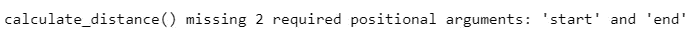
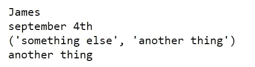
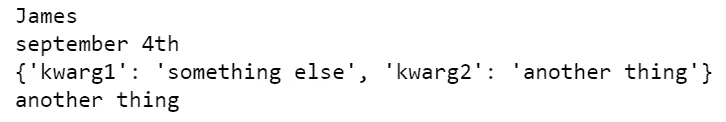

# *args，**kwargs &如何正确指定参数

> 原文：<https://towardsdatascience.com/args-kwargs-how-to-specify-arguments-correctly-ed995f3f3c05>

## 您是否正确地指定了 Python 函数参数？


沙哈达特·拉赫曼在 [Unsplash](https://unsplash.com?utm_source=medium&utm_medium=referral) 上拍摄的照片

Python 中的参数可以用四种不同的方式指定。

它们可以指定为:

*   **立场论点**
*   **关键字参数**
*   **任意参数列表**
*   **任意关键字论证词典**

以下是正确使用它们的方法。

## 位置参数

显然，位置参数是由它们的位置指定的参数。

它们是**强制的**并且没有**默认值。**

将参数指定为位置参数是设置函数参数最常用也是最简单的方法。

最好将这些函数与具有*清晰自然顺序*的简单函数一起使用，如下所示:

```
def calculate_distance(start, end):
     distance = end - start
     return(distance)
```

如果您随后调用此函数而不包括位置参数，您将收到一个错误。



当然，这是因为您在函数中需要两个位置参数，但是在调用它时没有提供任何位置参数。

从技术上讲，您可以通过使用参数名称来颠倒位置参数的顺序。从技术上讲，你可以这样写:

```
def calculate_distance(end = 10, start = 5:
     distance = end - start
     return(distance)
```

这是可行的。但是这是冗长的，没有意义的，而且有点愚蠢。所以，不要这样。

## 关键字参数

当一个函数有多个必需的参数时，最好使用关键字参数。关键字参数也需要默认值，这非常有用。您可以使用这些来指定可选的关键字，如下例所示。

```
def calculate_distance(start, end, units = km):
     distance = end - start
     return(str(distance) + units)
```

例如，如果我们仍然想计算行进的距离，我们可能还想包括测量单位。我们可能经常以公里为单位工作，但偶尔也会以其他指标工作。因此，我们可以指定“km”作为默认的关键字参数，如果需要，可以替换它。因此，

```
calculate_distance(5,10)
#returns '5km'calculate_distance(5,10, units = "m")
#returns '5m'
```

如上所述，我们可以按顺序指定参数。我们也可以指定不同顺序的参数，只要我们引用它们。然而，这些都是不好的做法。我们应该以指定函数的方式调用它。在这种情况下是:

```
calculate_distance(5,10, units = "m")
```

关于关键字参数的最后一点要注意的是，删除一个已经添加的可选参数比在将来添加它更难。所以，只有当你认为关键词是必要的时候，才使用它们。

## 任意参数列表

您可以使用*args 构造添加可扩展数量的位置参数。在函数中，args 将是所有剩余位置参数的元组。

```
def example(name, birthday, *args):
    print(name)
    print(birthday)
    print(args)
    print(args[1])
    returnexample("James", "september 4th", "something else", "another thing")
```

因此，如果您使用所示的参数定义并调用上面的函数，您将得到下面的输出。



如前所述,“args”是所需的所有其他位置参数的元组。您可以通过位置索引从此元组中提取。这里，我们指定了两个位置参数，因此由于 Pythons 零索引，args[1]等于元组中的第二个参数。

但是，如果您传递的所有参数都是相同的，那么最好进行练习，传递一个列表也更简单。

## 任意关键字参数字典

正如位置参数与关键字参数相关一样，*args 在**kwargs 中有一个对应项。它实际上做了与*args 相同的事情，但是它们不是位置参数，而是命名参数。因此，如果我们运行下面的函数:

```
def testing_function_two(name, birthday, **kwargs):
    print(name)
    print(birthday)
    print(kwargs)
    print(kwargs['kwarg2'])returntesting_function_two("James", "september 4th", kwarg1 = "something else", kwarg2 = "another thing")
```

我们得到以下输出:



正如我们所看到的，**kwargs 是一个所有传递的命名参数的字典，没有被其他关键字参数捕获。

与它的对应物*args 相似，它应该谨慎使用，并且只在必要的时候使用。

## 摘要

如果可以，坚持位置和关键字参数。当没有自然顺序时，使用关键字参数。*args 和**kwargs 是很好的工具，但是要谨慎使用，并且只在需要的时候使用。

其他程序员会更喜欢简单，所以不要在冗长的时候使用*args 和**kwargs。

争吵愉快。

谢谢你的阅读，我希望这对你有所帮助。

```
If I’ve inspired you to join medium I would be really grateful if you did it through this [link](https://jamesasher4994.medium.com/membership) — it will help to support me to write better content in the future.If you want to learn more about data science, become a certified data scientist, or land a job in data science, then checkout [365 data science](https://365datascience.pxf.io/c/3458822/791349/11148) through my [affiliate link.](https://365datascience.pxf.io/c/3458822/791349/11148)
```

以下是我写的其他一些东西:

[](/econometrics-is-the-original-data-science-6725d3f0d843)  [](/how-to-easily-show-your-matplotlib-plots-and-pandas-dataframes-dynamically-on-your-website-a9613eff7ae3)  [](/how-to-easily-run-python-scripts-on-website-inputs-d5167bd4eb4b) 