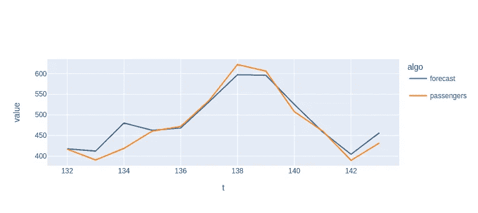

# 傅立叶级数 ARIMAX

> 原文：<https://towardsdatascience.com/arimax-with-fourier-series-1d92a976f45f>

# 傅立叶级数 ARIMAX

## 预测非整数季节性时间序列


不是这种系列。科技日报在 [Unsplash](https://unsplash.com?utm_source=medium&utm_medium=referral) 上拍摄的

您可能已经使用 SARIMAX 对具有周期性的时间序列数据进行建模。例如，您可能有每小时一次的数据，其模式每 12 小时重复一次。但是你所拥有的，比如说，每周的数据，以及每年的季节性。你不能用`n_periods=52`，因为一年的周数在 52 到 53 之间。那你是做什么的？

# 输入傅立叶级数

幸运的是，ARIMAX 允许您轻松地指定额外的回归变量。那是我们传递傅立叶特征的地方。我们需要确定的是:

*   我们数据的频率是多少
*   什么时期了
*   我们要构造什么阶的傅立叶级数

然后，我们可以构建如下特征

```
np.sin(2 * np.pi * order * t / period)
```

和

```
np.cos(2 * np.pi * order * t / period)
```

# 我们能举个例子吗？

当然可以。经典的时间序列示例是`flights`数据集，我们在其中获得每月数据。这里，周期正好是`12`，但是即使周期是`12.25`，这种技术也可以工作。

在展示代码之前，请注意以下几点:

*   该数据集的季节性是倍增的，因此我将对目标的日志建模，而不是对目标本身建模
*   为了选择傅立叶级数的阶数，我们只需尝试在`1`和`9`之间的所有阶数，然后选择具有最佳`AICc`分数的阶数



测试集结果，使用在训练集上选择的最佳傅立叶阶。作者图片

结果表明，该模型确实能够提取季节模式。

# 结论

我们学习了如何使用傅立叶级数和 ARIMAX 来模拟季节性。如果季节周期不是整数，这很有用。这种方法确实需要您为傅立叶级数选择一个阶数，我们已经看到了如何使用`AICc`进行选择。现在出去建模一些季节性数据！