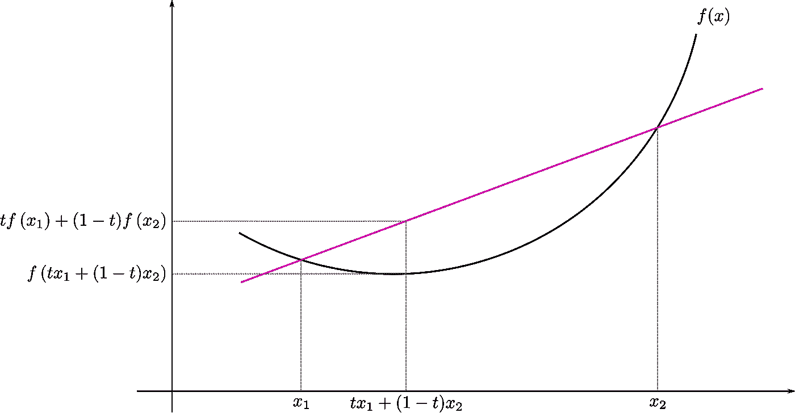

# 算术平均数、几何平均数及其与詹森不等式的关系

> 原文：<https://towardsdatascience.com/arithmetic-mean-geometric-mean-and-their-relation-using-jansens-inequality-73894415beeb>

## 利用对数函数的 Jensen 不等式证明算术平均值与几何平均值的关系

# 数据科学中的方法

*Mean* 是数据科学中最基本的概念之一。数据科学建立在*即*之上。*算术平均值*与*预期*有关系。 *F1-score* ，处理不平衡数据时最重要的指标之一，是两个指标的调和平均值——*精度*和*召回*。线性回归的贝叶斯观点说，预测是后验分布的**均值**。因此，从头开始掌握均值的概念并能够直观地解释它是很重要的。

摘要:本文讨论了两种类型的平均值，用直观的例子解释了它们，介绍了凸函数和 Jensen 不等式，并用它们建立了算术平均值和几何平均值之间的关系。

# 平均的

平均水平是我们生活的核心。我们一直在使用它。不管是询问什么，学习什么，还是询问什么，我们都会用到它。平均也叫均值。在本文中，我们将讨论两种类型的平均值——算术平均值和几何平均值。意义不仅在我们日常生活中很重要，在学术和科学研究中也很有用。COVID 疫苗的功效被解释为平均值。某些 COVID 疫苗 96%的效力意味着 100 个*人当中有 96 个*被预防感染，否则这些人就会被感染。当阅读关于全球变暖的内容时，我们看到气温上升的平均速度被提到了很多。在显示网络流量和货币化信息的分析仪表板中，我们看到平均指标，如平均点击率或平均点击率一直被提及。

贾斯汀·摩根在 [Unsplash](https://unsplash.com?utm_source=medium&utm_medium=referral) 上拍摄的照片

这是我前阵子和我亲戚的对话。

> “你每月挣多少钱？”我的亲戚问道。“取决于我那个月工作了多少小时。”，我回答。
> (满脸困惑...)“我是说你平均挣多少钱？”这位亲戚坚持问这个问题。

由 [Kate Bezzubets](https://unsplash.com/@k8_bzz?utm_source=medium&utm_medium=referral) 在 [Unsplash](https://unsplash.com?utm_source=medium&utm_medium=referral) 上拍摄的照片

# 等差中项

在 5 场 ODI 系列赛中，史蒂夫·史密斯的得分分别是 45，55，103，10 和 15。如果我们想知道史蒂夫·史密斯每场比赛得了多少分，我们可以通过计算他得分的算术平均值来知道。一些值数组的算术平均值是通过将所有值相加，然后将总和除以值的个数来计算的。在这里，史密斯所有分数的总和是:
45 + 55 + 103 + 10 + 15 = 228。有五个值。所以，平均值是 228 / 5 = 45.6。所以，算术平均值是 45.6。他每场比赛得大约 46 分。这个度量可以是一个描述性的度量，用来比较系列赛中球员的表现。

# 几何平均值

假设尼泊尔首都加德满都过去三年的人口年增长率为 *10%* ， *15%* ， *20%* 。我们可能很乐意记住这三个间隔均匀的数字，但是如果我们有过去十年的数据呢？有没有办法用某个平均值来描述最近 *n* 年的人口增长率？是的，有，这就是*几何平均*的来源。

如果值是 *a1，a2，a3，…，an，*那么这些数的几何平均数就是所有数的乘积的第*n 个*根。
所以， *GM = (a1*a2*…*an)^(1/n)*

在我们的人口增长例子中，几何平均数是 *14.42%* (四舍五入到小数点后两位)。由于增长率是均匀分布的，算术平均值是中间值，即 *15%* 。我们看到几何平均数小于算术平均数。好奇的人可能会怀疑这种关系是否总是正确的。非常好的观察。我们稍后会弄清楚是否存在这种关系。

# 凸函数和詹森不等式

这里我来介绍一个数学概念——凸函数*。我们将用这个概念和*詹森不等式*来建立算术平均值和几何平均值之间的关系。凸函数在最优化中起着非常重要的作用。凸函数在函数优化方面具有方便的性质。开集上的严格凸函数只有一个极小值。因此，机器学习中的凸损失函数不会面临局部极小问题。*

## **但是凸函数是什么呢？**

*如果用曲线上任意两点画出的线段不低于两点之间的曲线，则称函数是凸的。所以，如果 *X* 是实向量空间的凸子集并且 *f : X → ℝ* ，那么 *f* 称为凸的如果以下条件成立:
*对于所有 0 ≤ t ≤ 1 且 x1，x2 ∈ X，f(tx1+(1-t)x2)≤TF(x1)+(1-t)f(x2)。**

**

*作者伊莱·奥舍罗维奇——自己的作品，CC BY-SA 3.0，[https://commons.wikimedia.org/w/index.php?curid=10764763](https://commons.wikimedia.org/w/index.php?curid=10764763)*

*像二次函数 *(y = x )* 、指数函数 *(y = e^x)* 、负对数函数 *(y = -logx)* 等函数都是凸函数。*

## *詹森不等式*

**詹森不等式*推广了我们给出的关于凸函数的线段定义。如果 *f(x)* 是凸函数， *λ_i ≥ 0* 且*σλ_ I = 1*，则对于任意点集 *{x_i}* 以下不等式满足:
*f(λ_ 1 * x _ 1+λ_ 2 * x _ 2+…+λ_ m * x _ m)≤λ_ 1 * f(x _ 1)+λ_ 2 * f(t**

# *算术平均和几何平均的关系*

*现在，让我们看看一组数字的算术平均值和几何平均值之间有什么关系。*

*若 *a_1，a_2，a_3，…，a_n* 为数列，算术平均和几何平均定义为:
*am =(a _ 1+a _ 2+…+a _ n)/n…*(I) *GM =(a _ 1 * a _ 2 *…* a _ n)^(1/n)…*(ii)*

**f(x) = -logx* 是凸函数。所以，我们可以利用负对数函数和数列 *(a_1，…，a_n)* 的詹森不等式。*

*让我们将 *λs* 的所有值设为 *1 / n* 。*

*所以， *λ_1 = λ_2 = … = λ_n = 1 / n.**

*于是，詹森不等式变成:
-*log(a _ 1/n+a _ 2/n+…+a _ m/n)≤-log(a _ 1)/n+-log(a _ 2)/n+…+-log(a _ n)/n**

*不等式两边都乘以-1 会反转不等式的符号。*

**log(a _ 1/n+a _ 2/n+…+a _ m/n)≥log(a _ 1)/n+log(a _ 2)/n+…+log(a _ n)/n**

*简化和利用对数的性质，*

**log((a _ 1+a _ 2+…+a _ m)/n)≥log(a_1^(1/n)+log(a_2^(1/n)+…+log(a_n^(1/n))* *log((a _ 1+a _ 2+…+a _ m)/n)≥log(a_1^(1/n)* *…* a_2^(1/n))*…* a_n^(1/n)* *log((a _ 1+a _ 2+…+a _ m)/n)≥log((a _ 1 * a _ 2 *…* n)**

*使用定义(I)和(II)，*

**log(AM)≥log(GM)**

*由于对数函数是单调递增函数，*

****AM ≥ GM。****

*因此，一组数字的算术平均值大于或等于一组数字的几何平均值。*

# *因此*

*我们讨论了这两种类型的平均值，用例子解释了它们，涉及了凸函数和詹森不等式，并用詹森不等式建立了这两种类型的平均值之间的关系。我们在本文中接触/讨论的所有概念都是数据科学的基础。任何数据科学专业人士或数据科学爱好者都会偶尔发现这些概念。*