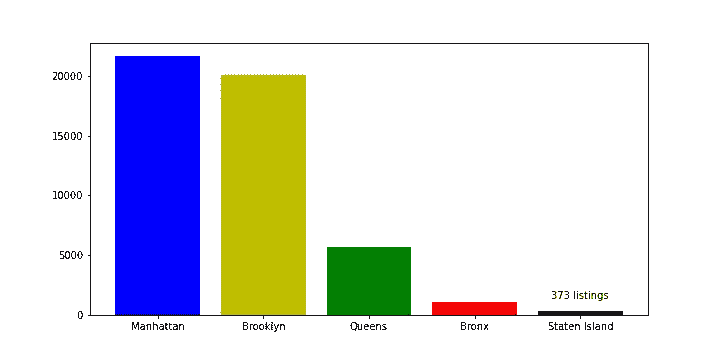
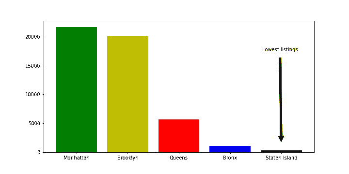
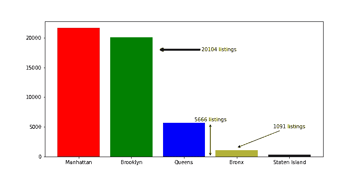
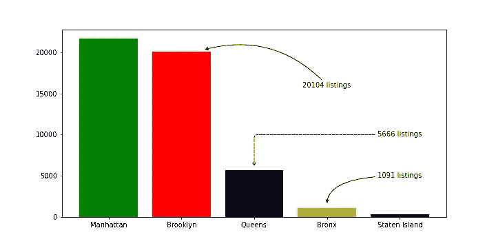

# Python 图中的箭头

> 原文：<https://towardsdatascience.com/arrows-in-python-plots-51fb27d3077b>

## matplotlib 图中箭头和文本注释的介绍


由[卡莱布·塔普](https://unsplash.com/@kalebtapp?utm_source=unsplash&utm_medium=referral&utm_content=creditCopyText)在 [Unsplash](https://unsplash.com/s/photos/arrow?utm_source=unsplash&utm_medium=referral&utm_content=creditCopyText) 拍摄的照片

不幸的是(或者说，幸运的是)，数据科学已经发展到不仅仅是构建 ML 模型。哈佛商业评论最近发表了一篇关于领先的数据科学家做什么的文章。令人惊讶的是，关键技能是*沟通*，而不是统计模型的经验。

如果你是一名数据科学家，你现在应该知道讲故事是你的谋生之道。每一双利益相关者的眼睛都在关注你能把故事卖得多好。你得到了他们关注的短暂窗口，如果你失去了这个窗口，你就失去了机会。相信我，要打动观众并不容易，尤其是你是计算机科学出身的。但好的一面是，讲故事的艺术是可以逐渐学会的。

> 也许故事只是有灵魂的数据。— [布琳·布朗](https://www.goodreads.com/quotes/556598-maybe-stories-are-just-data-with-a-soul)

如果你想擅长与听众交流你的分析，那么第一步就是学会如何尽可能直观地展示你的数据。最近的研究发现，一张图片比一堆冗长的文字要长得多。

> 一幅画最大的价值是当它迫使我们注意到我们从未期望看到的东西。约翰·图基

像注释图表这样简单的方法可以创造奇迹。本文尝试在一个情节中引入箭头和文本注释。所以，事不宜迟，我们来学习吧。

以下代码读取 2019 年 NYC 列表，并打印街区及其在数据集中找到的相应列表计数。

```
# Read data
df = pd.read_csv(‘/kaggle/input/new-york-city-airbnb-open-data/AB_NYC_2019.csv’)# Get the count of the listings by neighbourhood.
nbr_freq = df.neighbourhood_group.value_counts()
print(nbr_freq)
```

我们可以得出结论:**曼哈顿**的房源数量最多(21661)，而**斯塔滕岛**的房源数量最少(373)。

```
Manhattan        21661
Brooklyn         20104
Queens            5666
Bronx             1091
Staten Island      373
Name: neighbourhood_group, dtype: int64
```

让我们看看如何用 Staten Island 中的列表数来注释 Staten Island 对应的栏。我们已经使用了`annotate`函数将文本添加到图表中。函数中使用的参数有:

*   `xy`-要标注的点(在图中)的 XY 坐标
*   `xycoords`—`xy`参数的坐标系
*   `horizontalalignment`—`xy`位置的文本水平对齐。

目前我们已经将`xycoords`设置为`data`。它的意思是`xy`将使用数据的轴作为它的坐标系。因此，在这种情况下，`x`被设置为**斯塔滕岛**和`y`为 2000。你可以在这里了解其他坐标系[。](https://matplotlib.org/stable/tutorials/text/annotations.html#sphx-glr-tutorials-text-annotations-py)

```
import matplotlib.pyplot as plt
import random# Define figure size
plt.figure(figsize=(10,5))# Random colors for each plot bar
my_colors = [‘r’, ‘g’, ‘b’, ‘k’, ‘y’] #red, green, blue, black, etc.
random.shuffle(my_colors)# Plot the histogram
plt.bar(nbr_freq.index, nbr_freq.values, color=my_colors)# Get current axis
ax = plt.gcf().gca()ax.annotate(‘373 listings’, xy=(“Staten Island”, 2000),
 verticalalignment=’top’, horizontalalignment=’center’)
```



作者图片

## 添加简单箭头

现在我们明白了如何在情节中放置文本，让我们给它添加更多的噱头。我们可以给情节添加一些形状(比如箭头),让它更吸引人。以下脚本添加了三个新参数来实现这一点。

*   `xytext` —放置文本的 XY 坐标。
*   `textcoords`—`xytext`的坐标系
*   `arrowprops` —用于在`xy`和`xytext`之间绘制箭头的属性(dict)

对于下图，将`textcoords`设置为`axes fraction`。这意味着`xytext`的位置是图左下方轴的分数。你可以在这里阅读关于`textcoords` [的不同坐标系。`xytext`元组值(0.94，0.8)通过计算轴在两个方向上的分数来放置文本。`](https://matplotlib.org/stable/api/_as_gen/matplotlib.pyplot.annotate.html)

`arrowprops` dict 包含许多预定义的键来创建定制形状的箭头。这里使用的一个这样的键是`shrink`，它定义了从两端收缩的箭头长度的分数。

```
ax.annotate(‘Lowest listings’, 
            xy=(“Staten Island”, 1000),
            xycoords=’data’,
            xytext=(0.94, 0.8), 
            textcoords=’axes fraction’,
            arrowprops=dict(facecolor=’black’, shrink=0.05),
            horizontalalignment=’right’,
            verticalalignment=’top’)
```



作者图片

## 添加花式箭头

**使用**`**FancyArrowPatch**`**——**如果你需要添加一个更复杂的箭头，那么你需要使用`FancyArrowPatch`。要使用`FancyArrowPatch`，你必须在`arrowprops`字典中定义`arrowstyle` 键。`arrowstyle`键决定箭头的形状。您可以添加其他键值来自定义箭头的颜色和宽度。`lw`就是一个用来调整箭头宽度的例子。您可以在官方文档中探索更多选项。

```
ax.annotate(‘1091 listings’,
            xy=(“Bronx”, 1500),
            xytext=(“Staten Island”, 5000), 
            va=’center’,
            ha=’center’,
            arrowprops={‘arrowstyle’: ‘-|>’})ax.annotate(‘20104 listings’,
            xy=(1.5, 18000),
            xytext=(“Bronx”, 18000), 
            va=’center’,
            ha=’right’,
            arrowprops={‘arrowstyle’: ‘-|>’, ‘lw’: 4})ax.annotate(‘5666 listings’,
            xy=(2.5, 0),
            xytext=(2.5, 6200),
            va=’center’,
            ha=’center’,
            arrowprops={‘arrowstyle’: ‘<->’})
```



作者图片

## 定义`*ConnectionStyle*`

我们可以通过在`arrowprops`中定义`ConnectionStyle` param 来控制箭头的形状。`connectionstyle`可以是三个`angle/angle3`、`arc`或`bar`中的任何一个。在下面三个示例的第一个中，`connectionstyle`是`angle3`。简单来说，`angle3`用于在`xy`和`xytext`之间创建一条简单的[二次贝塞尔曲线](https://en.wikipedia.org/wiki/B%C3%A9zier_curve#Quadratic_B%C3%A9zier_curves)。起点和终点的斜率分别为`angleA`和`angleB`。另一种有趣的连接方式是弧线，在下面的第三个例子中使用。你可以在这里玩不同的`conntectionStyle`。

```
# angleA = 0 
# angleB = 90
ax.annotate('1091 listings', xy=("Bronx", 1500),
            xytext=("Staten Island", 5000), 
            va='center', 
            ha='center',
            arrowprops={'arrowstyle': '-|>', 'connectionstyle': 'angle3,angleA=0,angleB=90'})# angleA = 0 
# angleB = 90
# rad = 5
ax.annotate('5666 listings', xy=("Queens", 6000),
            xytext=("Staten Island", 10000), 
            va='center', 
            ha='center',
            arrowprops={'arrowstyle': '->', 'ls':'dashed', 'connectionstyle': 'angle,angleA=0,angleB=90,rad=5'})# angleA = 0 
# angleB = 90
# rad = 0.3
ax.annotate('20104 listings', xy=(1.3, 20300),
            xytext=("Bronx", 16000), 
            va='center', 
            ha='center',
            arrowprops={'arrowstyle': '-|>', 'connectionstyle': 'arc3,rad=0.3'})
```



作者图片

看吧！向图表添加箭头是多么容易。我计划很快再写一篇关于互动情节的文章。敬请期待！

**参考文献** 【1】:*数据科学家到底做什么，据 35 数据科学家*-**[https://HBR . org/2018/08/What-Data-Scientists-Really-Do-据-35-data-scientists](https://hbr.org/2018/08/what-data-scientists-really-do-according-to-35-data-scientists)**

**[2]: *纽约市 Airbnb 开放数据* ( [CCO:公共领域](https://creativecommons.org/publicdomain/zero/1.0/))[https://www . ka ggle . com/dgomonov/New-York-City-Airbnb-Open-Data](https://www.kaggle.com/dgomonov/new-york-city-airbnb-open-data)**

**你可以在这里找到上面例子的 python 脚本**

**如果你真的喜欢这篇文章，你可以在这里阅读另一篇关于**决策树**的文章。和平！**