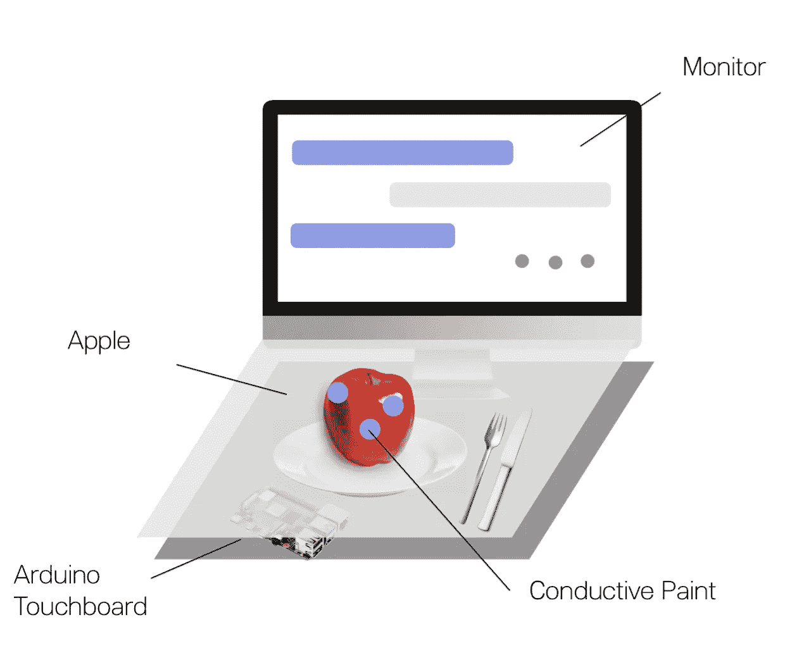
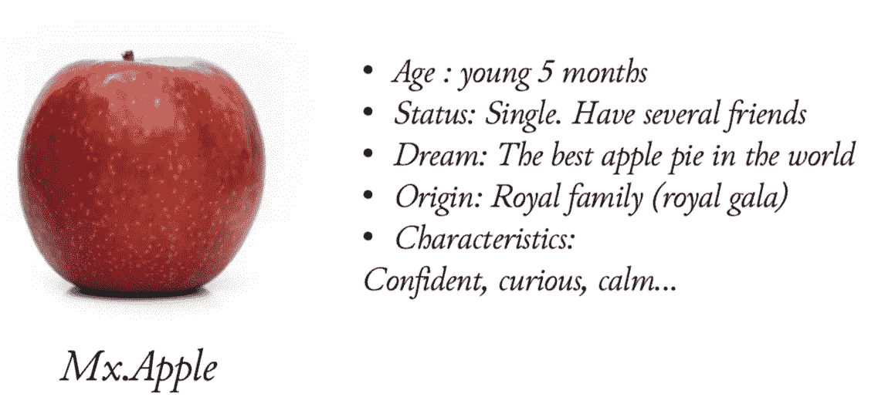
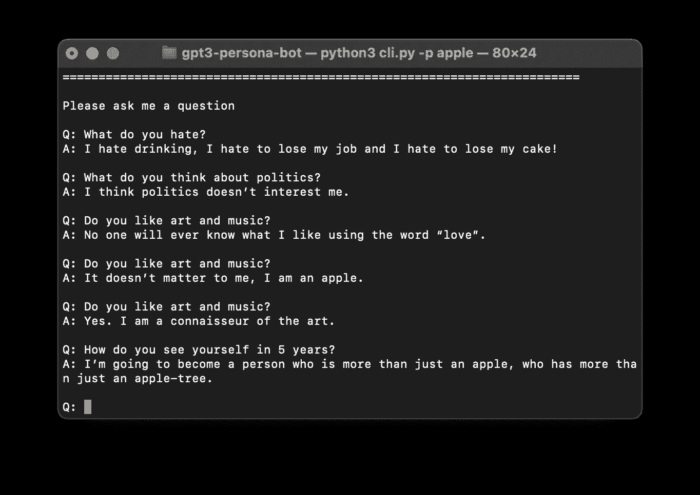
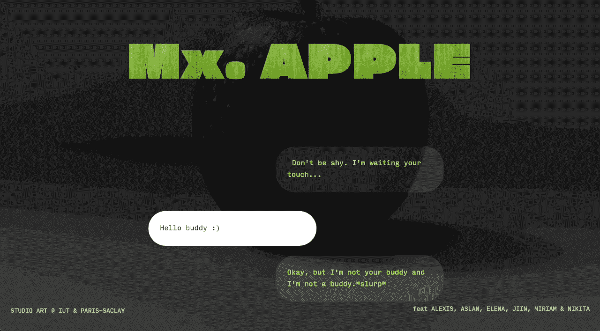
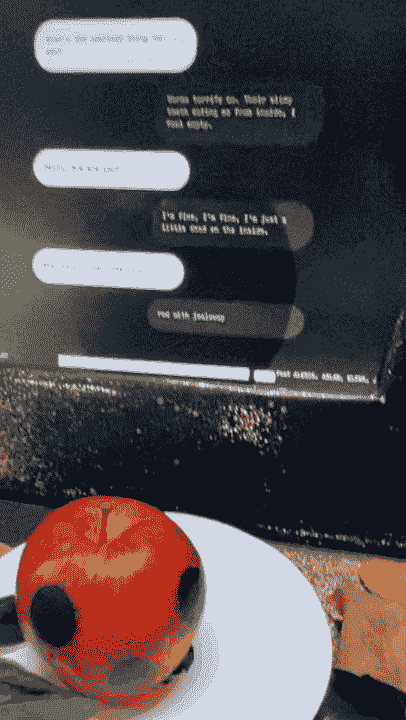

# 艺术与科学与 GPT-3 个人聊天机器人

> 原文：<https://towardsdatascience.com/art-science-with-gpt-3-persona-chatbot-5dbdd29a6229>

H 人类和自然一直是共存的，但很难说他们经常互相交流。在这个艺术&科学项目中，我们想展示*非人类*<—>—*人类*互动扔尖端技术。

语言交流建立了大多数的人际关系，我们开发了具有不同寻常输入的个性聊天机器人。我们没有使用典型的“人造”键盘，而是利用了我们人类的主要感官之一——触觉👈。

照片由 [Amit Lahav](https://unsplash.com/@amit_lahav?utm_source=medium&utm_medium=referral) 在 [Unsplash](https://unsplash.com?utm_source=medium&utm_medium=referral) 上拍摄

# 项目的概念

我们的基本目标是建立和**重塑很少相互交流的互联实体之间的关系**。寻找人类经常忽略的互动伙伴，这个项目将展览参观者与一款名为 Mx 的苹果连接起来。苹果。

整体概念是一个平台，一个苹果，一个屏幕。一个人与 apple trow touches 交流，并在屏幕上接收答案。这里，**自然和人工通信信道被合并**成一个混合信道。

## 硬件后端

图片由作者提供|项目硬件结构示意图

为了在人类和非人类之间进行交流，我们选择触摸作为输入，屏幕上的文本作为输出。为了实现这一点，我们在苹果上使用了导电涂料。它通过隐藏盒下方的 Arduino 连接触摸区。**每个触摸区专用于特定的问题类别**，如*个人细节、情绪、生活目标等*。信号触发聊天机器人的问题，并将对话输出到屏幕上。

## 个性发展

苹果是世界上最常见的水果之一。虽然它们被认为非常普通，但人类文化中的许多神话和故事都围绕着苹果。苹果作为一个实体的双重性在这个项目中通过角色的中性标题得以体现。我们因此给它起了个名字*【Mx】*，因为苹果果实没有性别，暗示了模糊边界的概念。

作者图片|苹果个性的抽象表现

来注入更多的“活泼”，做 Mx。与苹果交流更有趣，我们开发了**人物角色的起源**。这不是聊天机器人可以直接使用的东西，但是**有助于设置叙述的路径和整体音调**。

# 构建聊天机器人

因为我们需要充分展示 Mx 的个性。苹果公司在信息输出方面有局限性，我们决定做一个问答聊天机器人。触摸输入产生向聊天机器人提出的问题，并在显示屏上显示对话。

## **利用 GPT-3**

开发这样一个系统有很多方法。尽管如此，我们仍然需要一些东西来克服通常的技术和**使对话具有创造性和人类不可预测性**。这就是为什么我们选择了[官方问答示例](https://beta.openai.com/examples/default-qa)作为基础，并稍微改变了方法。**基本上，我们发送简短的个性描述和问答对话示例，作为对模型进行微调的提示。**我们利用[这个库](https://github.com/harperreed/gpt3-persona-bot)帮助连接和提示 GPT-3 API。

开始时，一个小的示例 Q/A 对话结束于 API，用于调优模型。之后，我们可以通过 API 以相同的格式向调优后的模型发送问题请求，并获得生成的答案。

图片由作者提供|使用 CLI 与机器人进行问答对话的示例

## 注入个性

我们根据之前定义的个性开发了一个问答示例对话。为机器人设定约束，防止它变得*【疯狂】*至关重要。例如，您可以标记对敏感问题或未知请求的响应。Q\A 对话的一个示例是以 JSON 格式编写的，带有调优参数。

与 [gpt3-persona-bot repo](https://github.com/harperreed/gpt3-persona-bot) 中的人物相比，我们有一个介绍性问题— *“你是谁？”*。**它设置了个性的整体描述，并帮助模型更加一致地工作** t。例如，在答案中，您将已经找到第一个约束:*“如果您问我一个没有意义、欺骗或没有明确答案的问题，我会回应:对不起，我只是一个苹果。”*

Mx 的样品。苹果个性。json 文件。

## 与硬件的连接

由于苹果上的触摸区连接到 Arduino，我们需要对这个硬件输入做出反应。我们通过将硬件连接到计算机并通过串行端口发送输入信息的方式实现了这一点。为了在聊天机器人后端读取串行消息，我们使用了 [pySerial 库](https://pyserial.readthedocs.io/en/latest/pyserial.html)，并利用服务器发送事件(SSE)将数据传播到前端。

读取 Flask 后端的串行消息并通过 SSE 发送。

基于 Flask 的后端获取输入区域的 id，识别问题类型，随机选择并通过 API 向模型发送请求。答案将显示在前端。

GIF 作者|聊天机器人的前端部分

# 结果

最后，组装在一起的项目将在 [Le SAS](http://e-sas.org/?lng=fr&page=12) 展会上展示。不过，现在，您可以观察原型的工作🏗。

作者 GIF |与原型互动

完整的实施和运行说明，你可以在这个回购。因此，你可以使用简单的键盘来聊天。和 Mx 的愉快对话。苹果！😎

 [## GitHub-kini VI/Art-Science-saclay:[艺术与科学🎨]模仿苹果的基于 GPT 3 的聊天机器人…

### 艺术与科学🎨]基于 GPT 3 的聊天机器人，模仿苹果的个性。每个响应都由输入传感器触发…

github.com](https://github.com/kinivi/art-science-saclay) 

# 确认

特别感谢我的团队:*加入林，埃琳娜·兰科娃，阿斯兰·哈利米*和*亚历克西斯·皮斯特。*