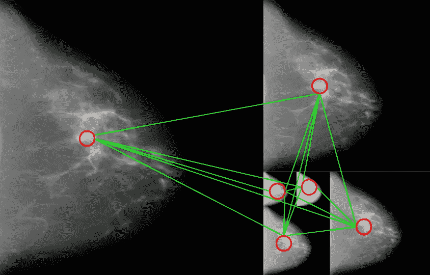
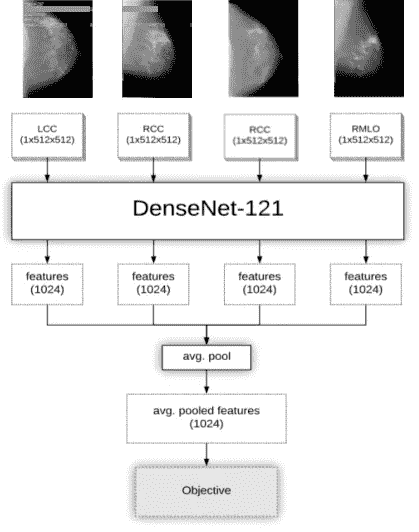
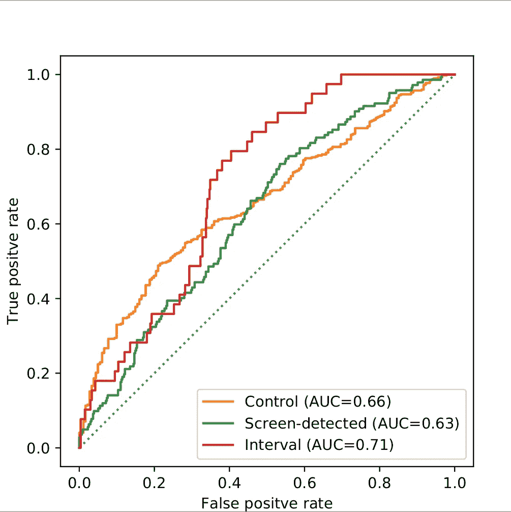
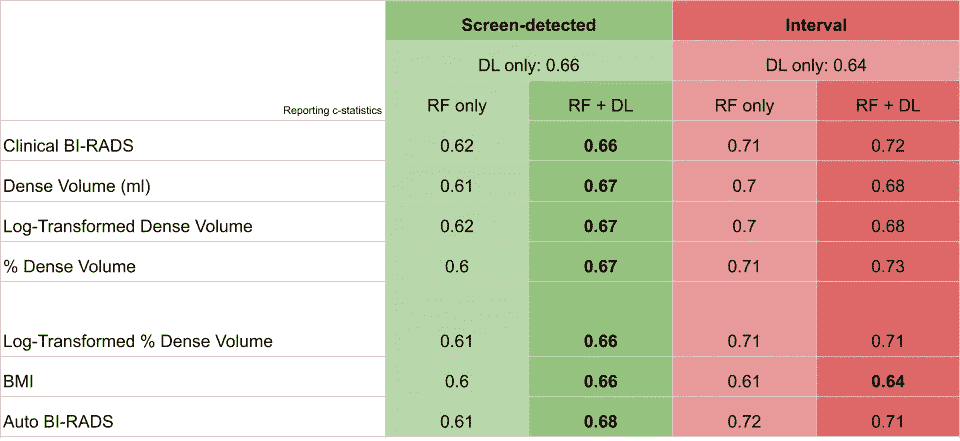

# 人工智能可以在乳腺癌发生前发现它

> 原文：<https://towardsdatascience.com/artificial-intelligence-can-see-breast-cancer-before-it-happens-4f93e1638539>

## 乳腺癌研究中的人工智能

## 深度学习预测筛查乳房 x 光片中的间隔和筛查检测到的癌症:6369 名女性的病例-病例对照研究

作者图片

# 要点

*   我们基于图像的深度学习模型识别了筛查出的癌症风险的独特信号
*   乳房密度是区间癌症风险的一个更好的预测指标
*   本文是对题为 [**“深度学习预测筛查乳房 x 光片的间隔和筛查检测到的癌症:6369 名女性的病例-病例对照研究”**](https://pubs.rsna.org/doi/abs/10.1148/radiol.2021203758) 的文章的直接回应，该文章发表在《放射学》杂志上，并在北美放射学会(RSNA)[上发表](https://press.rsna.org/timssnet/media/pressreleases/14_pr_target.cfm?ID=2280)

人工智能(AI)和深度学习(DL)在医疗和保健领域的使用一直在以惊人的速度增长。虽然健康保险便携性和责任法案(HIPAA)对于保护个人健康信息很重要，但它是收集深度学习所需的大型数据集的最大障碍。已经成功实施了几种策略来收集大量数据，用于训练医疗人工智能系统，而不会危及患者隐私。人工智能继续对医学成像产生重大影响，深度学习模型正在不断开发，以寻找骨折或可能的癌症等异常情况。

乳腺癌筛查的引入有助于降低女性癌症死亡率，并提供一致的图像数据来源。通常，40 岁及以上的女性会接受一年两次或一年一次的乳房 x 光筛查，以检查是否有任何癌症迹象。许多人已经开发出人工智能来检测和分割乳房 x 光照片中的癌症，但很少有人开发出基于图像的深度学习模型来预测风险。在描述的工作中，我们开发了一个模型来预测个体的乳腺癌风险；更具体地说，间隔和筛查检测到的癌症风险。

# 为什么风险很重要？

预测乳腺癌风险类似于预测，这是所有科学领域中固有的难题。相比之下，准确量化患者的癌症风险比通过一些诊断测试如乳房 x 光检查来检测癌症的存在更困难。了解乳腺癌风险和许多相关因素对于癌症预防和监控策略非常重要。降低癌症死亡率的最佳方法是首先预防癌症的发展，准确的风险评估至关重要。

在筛查人群中评估风险时，有三个临床相关结果。这些结果包括筛查检测(病例)、间隔(病例)或无(对照)癌症风险。筛查出的癌症是通过常规筛查乳房 x 线照片发现的癌症。在我们的研究中，我们进一步将其定义为在阳性筛查乳腺 x 线照片后 12 个月内发生的癌症。间歇期癌症是在正常筛查间隔期(一年两次或一年一次)发现的癌症，在我们的研究中被定义为在阴性筛查乳房 x 线照片后 12 个月内发生的侵袭性癌症。众所周知，间断性癌症生长更快，在生物学上更具侵袭性。它们通常是通过触诊或自我检查发现的。

# 当前风险解决方案

Gail、BRCAPRO、Tyrer-Cuzick 和乳腺癌监测联盟(BCSC)风险模型是临床使用的既定模型的例子。他们都使用已知乳腺癌风险因素的不同组合，包括年龄、体重指数(身体质量指数)和/或乳腺密度。成像并不直接用于临床模型，通常仅用于更好地测量乳房密度。一些基于图像的人工智能模型已经发表，展示了可比较的风险预测性能。然而，这些人工智能模型局限于二元分类，并且不包括筛选人群中的三种可能结果。

# 我们对风险解决方案的贡献

我们的数据集包括从梅奥诊所和旧金山加州大学招募的 6369 名女性。在每个妇女身上获得四个标准乳房 x 线照片视图，包括左右乳房的颅尾侧(CC)和中外侧斜(MLO)视图。乳房造影图像以其原始或“待处理”格式接收，像素范围在 0 到 2 ⁴.之间使用定制的软件将图像过滤成放射科医生习惯阅读的“演示”格式。重要的是要重申，用于我们风险建模的图像是在癌症诊断前至少 6 个月获得的。因此，我们用于建模的图像是阴性的，并且不包含由专家放射科医师确定的可见癌症。

模型开发在夏威夷大学癌症中心进行。实施自我施加的盲法以考虑可能的过度拟合。数据被分成一个训练和保留测试集，该测试集从未被发送到夏威夷大学。我们进一步将训练集分为训练、验证和测试集，用于我们的初始模型开发。一旦我们对我们的建模架构有了信心，并且优化了超参数，就可以在整个训练集上训练最终的模型。最终的风险模型随后被发送给我们的合作伙伴，以便在拒绝测试集上进行评估。这个过程非常像卡格尔式的。

**图 1:** 每个乳腺摄影视图的四个平行网络(图片由作者提供)

我们深度学习模型的新颖性源于使用四个并行网络同时查看所有成像信息进行预测，如图[图 1](https://www.lambertleong.com/projects/deep-learning-breast-cancer-risk#img-model) 所示。除了密度之外，风险的成像生物标记物还没有被充分探索和描述。尽管癌症可能只发生在一侧乳房，我们怀疑风险信号可能存在于同侧和对侧乳房。四个网络中的每一个都负责学习四个乳房 x 线照片中的一个的信息，因此存在 LCC、RCC、LMLO 和 RMLO 网络。来自所有网络的输出被汇集在一起，用于对风险进行最终预测。

# 惊人的结果！

使用客观对比 else 方法，我们使用受试者操作特征曲线下面积(AUC)评估风险预测。我们的模型在将对照与其他一切分类时的 AUC 为 0.66，将筛查检测到的癌症与其他一切分类时的 AUC 为 0.63，将间隔期癌症与其他一切分类时的 AUC 为 0.71。参见[图 2](https://www.lambertleong.com/projects/deep-learning-breast-cancer-risk#img-auc) 。风险建模是一个困难的问题，这些结果与当前的临床风险模型相当，如果不是更好的话。

**图 2:** 通过受试者操作特征曲线下面积(AUC)测量的保留测试集的最终模型性能(图片由作者提供)

为了进一步询问可能的风险成像信号，我们将我们的人工智能模型的性能与使用常见临床风险因素建立的条件逻辑回归模型进行了比较。这些风险因素包括临床和自动乳腺成像报告和数据系统(BI-RADS)、身体质量指数和致密体积。使用经临床批准的乳腺密度软件 Volpara 进行自动测量。在筛查出的癌症病例中，当将风险因素与深度学习相结合时，c-statistics 得到了改善，如图[图 3](https://www.lambertleong.com/projects/deep-learning-breast-cancer-risk#img-risk-factor) 所示。这种改善表明，深度学习能够拾取与临床风险因素正交或独特的风险相关的成像信号。虽然我们假设了，但还是很意外！在区间癌症的情况下，深度学习模型无法胜过仅基于乳房密度建立的模型。换句话说，乳腺密度仍然是区间癌症风险最强有力的预测指标。这更令人惊讶！！乳腺密度是一个风险因素，因为致密的组织会模糊图像并掩盖可能的病变。密集的组织也可能掩盖了可能的风险信号，并削弱了我们的人工智能模型的性能。

**图 3:** 深度学习性能对比临床风险因素模型(图片由作者提供)

# 下一步是什么

将密度信号从可能的区间癌症风险信号中分离出来是这项研究未来可能的方向。还有更先进的人工智能技术，如对抗方法，可能有助于理解乳腺密度，成像和间隔癌症风险之间的相互作用。与美国其他地区相比，夏威夷的晚期癌症发病率较高。其机制尚不清楚，但许多人认为人口中独特的种族构成起了作用。我们在这项研究中深度学习的成功让我们有信心预测晚期癌症的风险是可能的。我们欢迎对这里讨论的主题进行评论、对话、讨论和合作。随时伸出援手，加入抗癌的行列。

# 继续讨论

*   [**读论文**](https://pubs.rsna.org/doi/abs/10.1148/radiol.2021203758)
*   [**查看 github**](https://github.com/shepherd-lab/dl-mammography)
*   [**联系作者**](https://www.lambertleong.com/contact)
*   [**联系实验室**](https://shepherdresearchlab.org/about/our-team/)

# **更多乳腺癌机器学习工作**

  

*原载于 2022 年 2 月 5 日*[*【https://www.lambertleong.com】*](https://www.lambertleong.com/projects/deep-learning-breast-cancer-risk)*。*