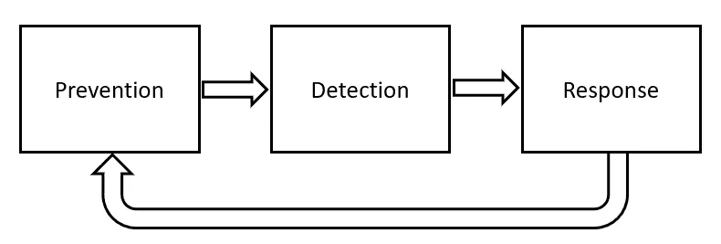

# 人工智能促进网络安全

> 原文：<https://towardsdatascience.com/artificial-intelligence-for-cybersecurity-cc2c53e02679>

## 通过人工智能的一些关键应用来增强网络安全系统的指南。

照片由 [Unsplash](https://unsplash.com?utm_source=medium&utm_medium=referral) 上的 [Flex Point Security](https://unsplash.com/@flexpointsecurity?utm_source=medium&utm_medium=referral) 拍摄

# 介绍

人工智能(AI)最有前途的应用之一是网络安全。事实上，考虑到敌对实体可能试图利用现有安全基础设施的所有可能的不同场景，管理大型分布式系统的安全性很容易成为一项指数级复杂的任务。另一方面，人工智能系统在试图识别大量数据日志中的异常模式(例如，异常检测、欺诈分类等)时特别有用。).

根据所需的自动化程度，有 3 种主要方式可以将人工智能模型添加到安全系统中:

*   **洞察生成:**分析数据以发现隐藏的模式，决策者可以使用这些模式对异常情况做出反应。
*   **建议:**该模型发现数据中的模式，并向安全专家提供最佳建议。
*   **自主缓解:**模型发现模式并尝试自动解决问题，无需人工授权。

这些类型的模型可以在安全生命周期的三个关键阶段中的任何一个阶段使用(**预防- >检测- >响应**)。例如，为了从一开始就防止安全漏洞，人工智能可以用来扫描组织源代码中的潜在错误，模拟潜在威胁，或解决数据丢失问题。

图 1:网络安全系统生命周期(图片由作者提供)。

使用人工智能安全系统的一个关键优势是，随着新日志的存储，模型可以自动安排重新训练，从而更容易识别新的威胁，而不是依赖工程师来识别和解决每个可能的未来边缘情况。此外，使用自主缓解方法还可以导致对潜在攻击的更快响应(尽管，这将导致人类对系统的控制更少，这在错误的肯定/否定预测的情况下可能是有问题的)。

安全系统通常被设计为最大化 3 个不同的标准:**机密性、完整性和可用性(CIA)** 。虽然通常需要进行权衡，以便同时最大化这三个目标中的一个以上(例如，为了升级 integrity 系统，可能需要使服务不可用几个小时，因此降低了可用性)。然后，不同的组织可以对这三个目标中的哪一个优先以及为什么应该嵌入人工智能有不同的优先级(例如，规模、速度、提高准确性)。

# 技术

## 监督学习

当处理监督学习问题时，我们得到了一个已经标记的数据集(我们有一些关于现象及其结果的过去数据)。在这种情况下，我们可以有兴趣了解如何预测一个新的数据点可能属于哪一类(**分类**)，或者从连续谱中给它分配一个数值(**回归**)。

回归问题可用于网络安全，例如，试图预测有多少设备可能已被网络安全攻击破坏，或量化安全攻击造成的损害程度。分类问题的一个例子可以是试图预测登录尝试是否真实(基于诸如位置、时间、机器等因素)。).

处理分类问题时，确保每个可能的输出类都有平衡数量的示例是非常重要的。例如，在对登录尝试进行分类时，我们可能会看到更多真实登录的例子，而不是欺诈性登录。为了达到良好的准确性，人工智能模型可以自动偏向预测登录尝试总是真实的。为了尽量避免这类问题，通常使用诸如**过采样/欠采样**和**惩罚多数类**的技术。此外，在不平衡分类问题中，诸如**接收器操作特性(ROC)** 曲线和**精度/召回**之类的指标通常优于准确度之类的指标，因为它们自动考虑了不同类别之间的不平衡情况。

## 无监督学习

在处理无监督学习问题时，我们会得到一个数据集，但没有相应的标签。如何在网络安全系统中使用无监督学习的三个示例应用是:**单词嵌入**、**异常检测**和**合成数据生成**。

通常使用单词嵌入来将文本数据转换成适于由 AI 模型处理的数字格式。在网络安全中，这可以例如用于创建**数据丢失预防**模型。数据丢失预防解决方案被设计为检查是否有任何机密信息正与未授权方共享(例如，未经许可共享护照号码),并因此使用大量嵌入的训练文本数据。

诸如**隔离森林**和**可变自动编码器**之类的异常检测技术可用于安全系统，以识别日志中任何形式的可疑活动(例如欺诈交易)并立即向系统发出警报。

最后，合成数据生成技术，如**生成对抗网络(GANs)** 通常用于生成统计上不可区分的新数据，如果我们没有大量可用的数据，这些数据可用于训练/测试 AI 模型。

# 结论

总的来说，在网络安全系统中使用人工智能可以提供许多不同的好处，尽管应该明确考虑以下几点:

*   试图危害你系统的人可能也在使用基于人工智能的技术。
*   实施得不好的人工智能系统可能会比传统的网络安全方法表现得更差。
*   一段时间后，恶意代理可以设法理解什么样的输入可能触发或不触发你的人工智能模型，然后设计一个策略来利用它。

例如，一个恶意代理可以通过试图改变人工智能模型的行为来试图利用基于人工智能的系统。例如，这可以通过在模型中输入一系列精心设计的数据点来实现，以尝试理解分类器决策边界，然后利用获得的信息让一些恶意输入通过，而不提醒系统。或者，恶意代理也可以尝试直接修改首先用于准备模型的训练数据，以影响其准确性(**数据中毒攻击**)。

# 联系人

如果你想了解我最新的文章和项目[，请在媒体](https://pierpaoloippolito28.medium.com/subscribe)上关注我，并订阅我的[邮件列表](http://eepurl.com/gwO-Dr?source=post_page---------------------------)。以下是我的一些联系人详细信息:

*   [领英](https://uk.linkedin.com/in/pier-paolo-ippolito-202917146?source=post_page---------------------------)
*   [个人网站](https://pierpaolo28.github.io/?source=post_page---------------------------)
*   [中型简介](https://towardsdatascience.com/@pierpaoloippolito28?source=post_page---------------------------)
*   [GitHub](https://github.com/pierpaolo28?source=post_page---------------------------)
*   [卡格尔](https://www.kaggle.com/pierpaolo28?source=post_page---------------------------)