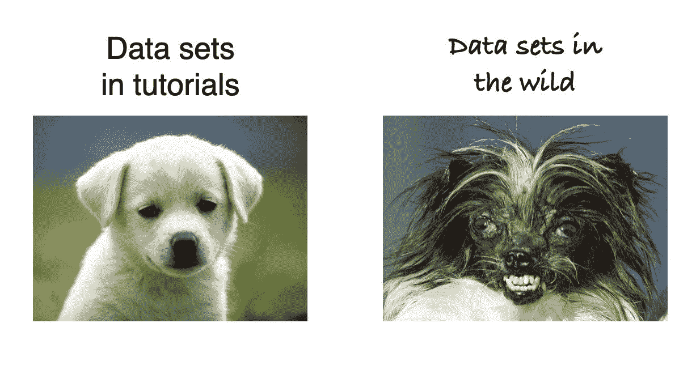
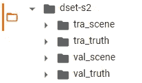
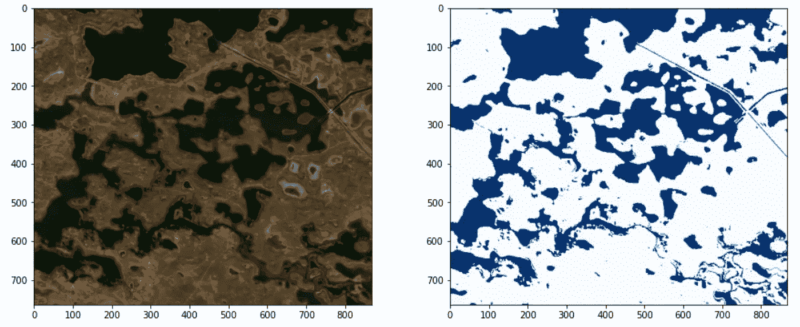
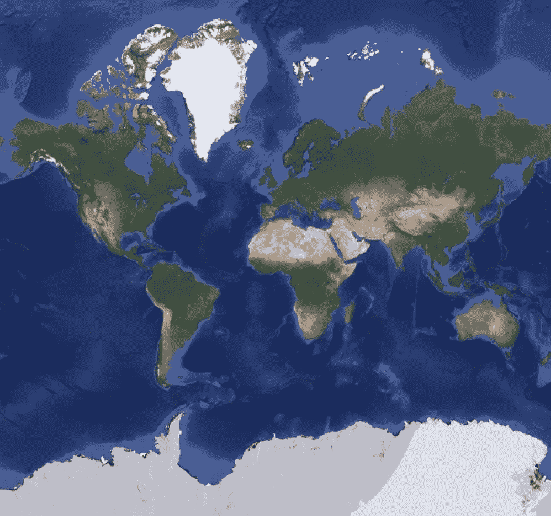
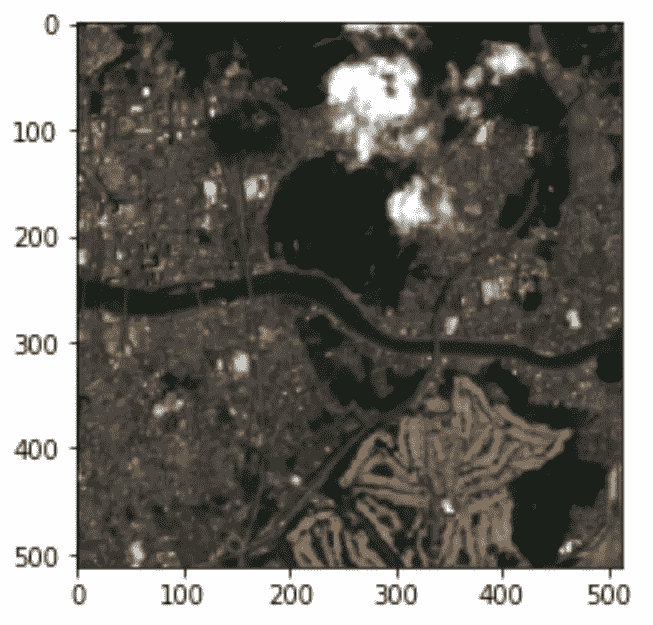

# 使用 Pytorch 的 TorchGeo 进行地理空间分析的人工智能(第 1 部分)

> 原文：<https://towardsdatascience.com/artificial-intelligence-for-geospatial-analysis-with-pytorchs-torchgeo-part-1-52d17e409f09>

## 使用 Pytorch 和 TorchGeo 包的端到端深度学习地理空间分割项目


美国宇航局在 [Unsplash](https://unsplash.com?utm_source=medium&utm_medium=referral) 拍摄的照片

# 介绍

根据其文档，TorchGeo 是一个*“py torch 域库，提供特定于地理空间数据的数据集、采样器、转换和预训练模型”*。这项事业是崇高的。让从业者更容易在地理空间数据上使用深度学习模型。为什么这是一笔好交易？

在去年 Dan Morris(微软人工智能地球计划的前首席科学家)向 IEEE-GRSS(地球科学和遥感学会)提交的一份报告中，他强调了一些与地理空间分析相关的挑战(该报告的链接是[此处](https://www.youtube.com/watch?v=OGbCCTiE2HA)):

*   处理地理空间数据是一件痛苦的事，除非你有遥感博士学位；
*   处理非常大的数据是一件痛苦的事情，除非你有分布式计算的博士学位；和
*   站在保护第一线的人们通常不具备以上两种条件。

最重要的是，使用人工智能进行地理空间分析的人有一个额外的复杂性，因为大多数框架都是为 RGB 图片开发的，没有考虑地理空间数据的特殊性:

*   由于体积而没有通过神经网络的巨大图像；
*   尺度不同；
*   不同的预测和 CRS
*   时间成分；和其他人。

因此，在目前，对于没有这些不同主题的知识的人来说，将深度学习模型应用于地理空间任务确实是一个挑战。



资料来源:走向 AI([https://twitter.com/towards_ai/status/1332567246011555840](https://twitter.com/towards_ai/status/1332567246011555840))

在这种背景下，火炬图书馆于 2021 年 11 月启动，以应对其中的一些挑战。一年多过去了，仍然只有非常有限的文档(视频、教程等)。)可供其使用。这就是为什么我决定跳进去，在我的专业领域(地表水分析)使用 TorchGeo 库做一个完整的项目。

考虑到这个项目的规模，我将在 Medium 和我的 YouTube 频道(这里有:【https://www.youtube.com/watch?v=WZdw7uxUCOM】T2)上发表一系列更详细的解释。该视频是巴西葡萄牙语，但有英语字幕。所以，如果你对这个主题感兴趣，你可以跟我一起踏上这段旅程。

# 内容

我们的想法是在整个系列中涵盖以下主题:

*   数据集；
*   为图像和遮罩创建光栅数据集、数据加载器和采样器；
*   交集数据集；
*   标准化数据；
*   创建光谱指数；
*   创建细分模型(U-Net)；
*   损失函数和度量；和
*   训练循环。

# 环境

首先，我们将准备环境。为了简单起见，我们将使用 google Colab ( [这里是](https://colab.research.google.com/))，因为它预装了基本模块，并提供免费的 GPU 来训练最终模型。它也可以在个人电脑上完成，但是你需要安装所有的依赖项，比如 Pytorch，GDAL 等等。，也有 GPU 配合 CUDA 驱动工作。普通

一旦我们在 Colab 中创建了一个用户帐户和一个新的 Jupyter 笔记本，我们就可以安装项目中需要的缺失模块。

我们将使用 Pip 命令安装库`rasterio` 和`torchgeo` 。然后，我们将消除来自 rasterio 的警告，因为原始数据集中的颜色通道有问题(但这不会影响我们的目标)。

# 资料组

我们将使用的数据集是[地球地表水数据集](https://zenodo.org/record/5205674) [1】(在知识共享署名 4.0 国际公共许可证下许可)，其中有来自世界不同地区的补丁(图 1)及其相应的水掩膜。该数据集使用空间分辨率为 10 米的 Sentinel-2 卫星的光学图像。

该数据集的另一个优势是，我们有性能基准来比较我们的结果，因为它已在同行评审出版物中使用:

> 罗，童小华，胡。基于多光谱图像的地表水体自动制图方法。国际应用地球观测和地理信息杂志，2021，103，102472。[ [链接](https://www.sciencedirect.com/science/article/pii/S0303243421001793) ]


图 1:地球地表水数据集-来源:[https://github.com/xinluo2018/WatNet](https://github.com/xinluo2018/WatNet)

我们将使用`wget` 命令将数据集直接下载到 Colab，解压缩它。一旦解压缩，数据将具有如图 2 所示的结构，其中`**tra**` 代表训练集，`**val**` 代表验证集。后缀`**scene**` 和`**truth**` 意在分隔原始补丁和相应的遮罩(地面真相)。



图 2:地球表面水数据集的文件夹结构:作者图片。

为了打开一个样本，我们将在列表中加载训练图像(tra_scene)和训练遮罩(tra_truth ),然后使用`XArray`打开一个索引。然后，在`matplotlib` 的帮助下，我们将显示结果，如下面的截图所述。



代码输出。图片作者。

# 为图像创建栅格数据集

现在，我们已经在 Colab 的环境中解压缩了原始数据集，我们可以准备将它加载到神经网络中。为此，我们将创建一个由 TorchGeo 提供的`RasterDataset` 类的实例，并指向特定的目录，使用下面的命令(`unbind_samples` 和`stack_samples` 将在序列中使用):

```
from torchgeo.datasets import RasterDataset, unbind_samples, stack_samples

train_ds = RasterDataset(root=(root/’tra_scene’).as_posix(), crs='epsg:3395', res=10) 
```

注意，我们将 CRS(坐标参考系统)指定给`**EPSG:3395**`。TorchGeo 要求所有图像都加载到同一个 CRS 中。但是，数据集中的面片位于不同的 UTM 投影中，TorchGeo 的默认行为是使用找到的第一个 CRS 作为其默认值。在这种情况下，我们必须通知能够应对全球不同地区的 CRS。为了最大限度地减少由于补丁内纬度的巨大差异(我可以为此创建一个特定的历史)而导致的变形，我选择了世界墨卡托作为该项目的主要 CRS。图 3 显示了世界墨卡托 CRS 中投影的世界。



图 3:世界墨卡托(EPSG:3395)投影所看到的世界。图片作者。

## 取样器

为了创建可以从我们的数据集中输入到神经网络的训练片，我们需要选择固定大小的样本。TorchGeo 有很多采样器，但是这里我们将使用`RandomGeoSampler`类。基本上，采样器选择属于原始图像的固定大小的随机边界框。然后，在`RasterDataset` 中使用这些边界框来查询我们想要的图像部分。要创建采样器，我们只需要输入下面一行

```
from torchgeo.samplers import RandomGeoSampler
sampler = RandomGeoSampler(train, size=(512, 512), length=100)
```

大小是我们想要的训练面片的形状，长度是采样器在一个时期内提供的面片数量。

为了从数据集中随机抽取一个项目，我们可以调用一个边界框的采样器，然后将这个边界框传递给数据集。结果将是一个包含以下条目的字典:image、crs 和 bbox。

```
import torch 

# this is to get the same result in every pass
torch.manual_seed(0)

bbox = next(iter(sampler))
sample = train_ds[bbox]
print(sample.keys())
print(sample['image'].shape)
```

```
output:
dict_keys(['image', 'crs', 'bbox'])
torch.Size([6, 512, 512])
```

请注意，我们的图像有形状(6，512，512)。这意味着我们有 6 个光谱通道，大小为 512 行和 512 列，正如我们为采样器指定的那样。为了完成第一部分，我们将再次使用 matplotlib 显示这个示例，但是要注意通道以正确显示 RGB。根据数据集描述，这 6 个通道是(按此顺序):蓝色、绿色、红色、Nir、Swir1、Swir2。Matplotlib 需要一个 shape(高度、宽度、通道)数组，其中通道是 R、G 和 B(按此顺序)。我们将使用 transpose 命令改变尺寸(轴)的顺序。

除此之外，我们需要将我们的值从整数转换为浮点数，并按 1/10000 (Sentinel-2 规范)进行缩放。

```
import torch
import matplotlib.pyplot as plt

arr = torch.clamp(sample['image']/10000, min=0, max=1).numpy()
rgb = arr.transpose(2, 1, 0)[:, :, [2, 1 , 0]]

plt.imshow(rgb*3)
```



代码输出。图片作者。

# 结论

在第一部分中，我们已经看到了如何在 TorchGeo 中创建一个 RasterDataset，以及如何使用采样器从中抽取固定大小的样本。这是我们工作流程的第一步。在下一部分中，我们将了解如何为掩膜创建数据集，并将两者组合成一个 IntersectionDataset。然后，使用数据加载器抽取批量样本。但这是下一个故事的主题。

# 进一步阅读

第 2 部分已在此处提供:

</artificial-intelligence-for-geospatial-analysis-with-pytorchs-torchgeo-part-2-ec3785fae284>  

# 保持联系

*如果你喜欢这篇文章，想支持我当作家，可以考虑成为* [*中等会员*](https://cordmaur.medium.com/membership) *。每月只需 5 美元，我会从你的会员费中收取一小笔佣金，不需要你额外付费。或者你可以随时给我买杯咖啡。*

# 参考

[1]新罗。(2021).地球表面水数据集。芝诺多。[https://doi.org/10.5281/zenodo.5205674](https://doi.org/10.5281/zenodo.5205674)

<https://cordmaur.medium.com/membership> 