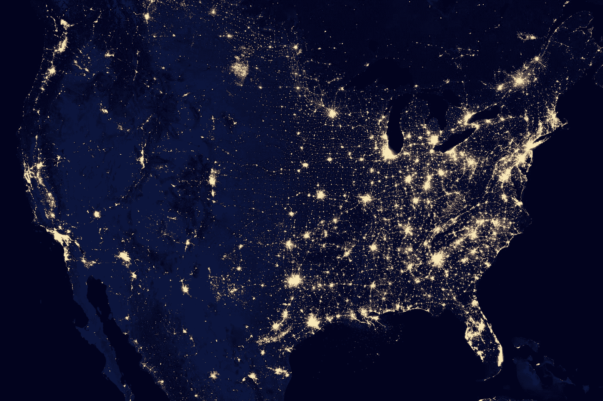
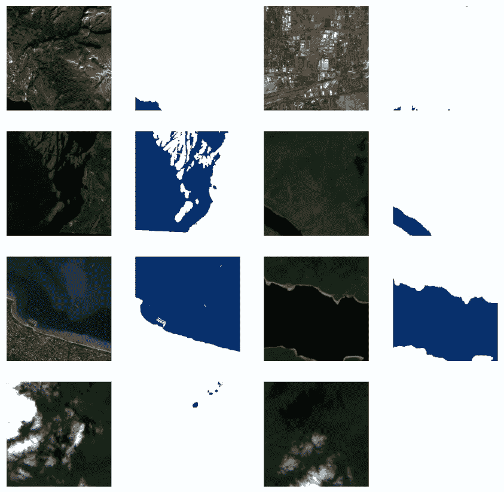

# 使用 Pytorch 的 TorchGeo 进行地理空间分析的人工智能(第 3 部分)

> 原文：<https://towardsdatascience.com/artificial-intelligence-for-geospatial-analysis-with-pytorchs-torchgeo-part-3-7521131f30b1>

## 使用 Pytorch 和 TorchGeo 包的端到端深度学习地理空间分割项目



照片由 [NASA](https://unsplash.com/@nasa?utm_source=medium&utm_medium=referral) 在 [Unsplash](https://unsplash.com?utm_source=medium&utm_medium=referral) 拍摄

# 介绍

在之前的故事([第 1 部分](https://medium.com/towards-data-science/artificial-intelligence-for-geospatial-analysis-with-pytorchs-torchgeo-part-1-52d17e409f09)和[第 2 部分](/artificial-intelligence-for-geospatial-analysis-with-pytorchs-torchgeo-part-2-ec3785fae284))中，我们看到了如何准备一个光栅(多光谱)图像数据集，并使用 TorchGeo 提供的`IntersectionDataset` 将它们与相应的标签(地面真实遮罩)结合起来。为了从中抽取样本(训练所需的较小的固定大小的补丁)，将`RandomGeoSampler`与`DataLoader`对象一起使用(负责向训练过程提供批次——样本组)。

此外，我们使用`nn.Sequential`类为每个批次添加了光谱指数和归一化。现在，在这最后一部分，我们将看到如何创建一个能够“学习”正确分割我们的图像的模型，以及如何将所有东西放在一起形成一个训练循环。

所以让我们开始吧！

# 基线

首先，我们需要从停下来的地方赶上来，为任务准备数据集和数据加载器。基本上，我们需要创建两个数据加载器，一个用于训练，一个用于验证，遵循与前面相同的步骤，如下所示。

## 数据集和数据加载器

```
train_imgs = RasterDataset(root=(root/'tra_scene').as_posix(), crs='epsg:3395', res=10, transforms=scale)
train_msks = RasterDataset(root=(root/'tra_truth').as_posix(), crs='epsg:3395', res=10)

valid_imgs = RasterDataset(root=(root/'val_scene').as_posix(), crs='epsg:3395', res=10, transforms=scale)
valid_msks = RasterDataset(root=(root/'val_truth').as_posix(), crs='epsg:3395', res=10)

# IMPORTANT
train_msks.is_image = False
valid_msks.is_image = False

train_dset = train_imgs & train_msks
valid_dset = valid_imgs & valid_msks

train_sampler = RandomGeoSampler(train_imgs, size=512, length=260, units=Units.PIXELS)
valid_sampler = RandomGeoSampler(valid_imgs, size=512, length=128, units=Units.PIXELS)
```

采样器中指定的长度是一次“通过”(也称为一个时期)中提供的样本数。这通常是数据集中的面片数，一个历元应该遍历所有样本。然而，由于我们使用的是随机抽样，我们不能保证覆盖所有地区。在这种情况下，我将长度定义为每个数据集中图像数量的四倍(训练和验证)。

现在，让我们创建数据加载器并检查它们是否按预期工作。

```
train_dataloader = DataLoader(train_dset, sampler=train_sampler, batch_size=8, collate_fn=stack_samples)
valid_dataloader = DataLoader(valid_dset, sampler=valid_sampler, batch_size=8, collate_fn=stack_samples)

train_batch = next(iter(train_dataloader))
valid_batch = next(iter(valid_dataloader))
train_batch.keys(), valid_batch.keys()

code output: 
(dict_keys(['image', 'crs', 'bbox', 'mask']),
 dict_keys(['image', 'crs', 'bbox', 'mask']))
```

## 标准化和光谱指数

对于标准化和光谱指数，程序与第 1 部分和第 2 部分已经介绍过的相同。可视化例程也是如此。以下笔记本中的所有内容都已更新至正确的批次创建。

最后一个单元格显示了一个验证数据集批次的样本和带有 9 个通道(6 个通道+ 3 个索引)的验证图像的形状，如预期的那样。



图 1:代码输出。图片作者。

# 细分模型

对于语义分割模型，我们将使用 Pytorch 中提供的预定义架构。查看官方文档([https://py torch . org/vision/stable/models . html # semantic-segmentation](https://pytorch.org/vision/stable/models.html#semantic-segmentation))可能会注意到 3 种模型可用于语义分割，但其中一种(LRASPP)是针对移动应用的。在我们的教程中，我们将使用 DeepLabV3 模型。

所以，让我们为 2 个类创建一个 DeepLabV3 模型。在这种情况下，我将跳过预训练的权重，因为权重代表另一个域(不是多光谱影像中的水体分割)。

```
from torchvision.models.segmentation import deeplabv3_resnet50
model = deeplabv3_resnet50(weights=None, num_classes=2)

model

code output: 
DeepLabV3(
  (backbone): IntermediateLayerGetter(
    (conv1): Conv2d(3, 64, kernel_size=(7, 7), stride=(2, 2), padding=(3, 3), bias=False)
    (bn1): BatchNorm2d(64, eps=1e-05, momentum=0.1, affine=True, track_running_stats=True)
    (relu): ReLU(inplace=True)
    (maxpool): MaxPool2d(kernel_size=3, stride=2, padding=1, dilation=1, ceil_mode=False)
...
```

在模型架构中，我们首先要注意的是第一次卷积(Conv2d)中预期的通道数，定义为 3。这是因为该模型已准备好处理 RGB 图像。在第一次卷积之后，3 个通道将以较低的分辨率产生 64 个通道，依此类推。由于我们现在有 9 个通道，我们将改变这个第一处理层，以正确适应我们的模型。我们可以按照命令，用新的卷积层替换第一个卷积层。最后，我们检查模拟批处理是否可以通过模型，并根据需要提供带有 2 个通道(水/无水)的输出。

```
backbone = model.get_submodule('backbone')

conv = nn.modules.conv.Conv2d(
    in_channels=9, 
    out_channels=64, 
    kernel_size=(7, 7),
    stride=(2, 2),
    padding=(3, 3),
    bias=False
)
backbone.register_module('conv1', conv)

pred = model(torch.randn(3, 9, 512, 512))
pred['out'].shape

code output: 
torch.Size([3, 2, 512, 512])
```

我们的架构似乎在按预期工作。下一步是训练它。所以让我们为它创建一个训练循环。

# 训练循环

训练函数应该接收历元数、模型、数据加载器、损失函数(待优化)、精度函数(评估结果)、优化器(将在正确的方向上调整模型的参数)以及要应用于每批的变换。

```
def train_loop(
    epochs: int, 
    train_dl: DataLoader, 
    val_dl: Optional[DataLoader], 
    model: nn.Module, 
    loss_fn: Callable, 
    optimizer: torch.optim.Optimizer, 
    acc_fns: Optional[List]=None, 
    batch_tfms: Optional[Callable]=None
):
    # size = len(dataloader.dataset)
    cuda_model = model.cuda()

    for epoch in range(epochs):
        accum_loss = 0
        for batch in train_dl:

            if batch_tfms is not None:
                batch = batch_tfms(batch)

            X = batch['image'].cuda()
            y = batch['mask'].type(torch.long).cuda()
            pred = cuda_model(X)['out']
            loss = loss_fn(pred, y)

            # BackProp
            optimizer.zero_grad()
            loss.backward()
            optimizer.step()

            # update the accum loss
            accum_loss += float(loss) / len(train_dl)

        # Testing against the validation dataset
        if acc_fns is not None and val_dl is not None:
            # reset the accuracies metrics
            acc = [0.] * len(acc_fns)

            with torch.no_grad():
                for batch in val_dl:

                    if batch_tfms is not None:
                        batch = batch_tfms(batch)                    

                    X = batch['image'].type(torch.float32).cuda()
                    y = batch['mask'].type(torch.long).cuda()

                    pred = cuda_model(X)['out']

                    for i, acc_fn in enumerate(acc_fns):
                        acc[i] = float(acc[i] + acc_fn(pred, y)/len(val_dl))

            # at the end of the epoch, print the errors, etc.
            print(f'Epoch {epoch}: Train Loss={accum_loss:.5f} - Accs={[round(a, 3) for a in acc]}')
        else:

            print(f'Epoch {epoch}: Train Loss={accum_loss:.5f}')
```

# 损失和精度函数

在调用训练函数之前，让我们创建损失函数和准确度函数。在我们的具体例子中，我们将有形状为(N，C，d1，d2)的预测，并且我们有形状为(N，1，d1，d2)的掩码。对于损失函数，通常交叉熵损失应该起作用，但是它要求掩模具有形状(N，d1，d2)。在这种情况下，我们将需要手动挤压我们的第二维。

此外，我们将创建两个精度函数。总精度，用于原始论文和交集并集。通常当我们在每个类中有不平衡数量像素的遮罩时，就像水遮罩的情况一样(有时我们有只有陆地和很少水体的场景)，整体精度将导致不切实际的值。在这种情况下，应该避免 OA，但它留在这里是为了与原始论文进行比较。

通过将所有匹配相加并除以批次中的元素数量，手动计算整体精度。IoU 也称为 Jaccard Index，在 Sklearn 包中提供。Pytorch 的交叉熵用于损失，对目标的形状做了微小的调整。经过所有必要的调整后，功能定义如下:

```
from sklearn.metrics import jaccard_score

def oa(pred, y):
    flat_y = y.squeeze()
    flat_pred = pred.argmax(dim=1)
    acc = torch.count_nonzero(flat_y == flat_pred) / torch.numel(flat_y)
    return acc

def iou(pred, y):
    flat_y = y.cpu().numpy().squeeze()
    flat_pred = pred.argmax(dim=1).detach().cpu().numpy()
    return jaccard_score(flat_y.reshape(-1), flat_pred.reshape(-1), zero_division=1.)

def loss(p, t):    
    return torch.nn.functional.cross_entropy(p, t.squeeze())
```

# 培养

训练函数现在可以这样调用:

```
optimizer = torch.optim.Adam(model.parameters(), lr=0.001, weight_decay=0.01)
train_loop(5, train_dataloader, valid_dataloader, model, loss, optimizer, 
           acc_fns=[oa, iou], batch_tfms=tfms)

code output: 
Epoch 0: Train Loss=0.37275 - Accs=[0.921, 0.631]
Epoch 1: Train Loss=0.22578 - Accs=[0.94, 0.689]
Epoch 2: Train Loss=0.22280 - Accs=[0.906, 0.576]
Epoch 3: Train Loss=0.19370 - Accs=[0.944, 0.706]
Epoch 4: Train Loss=0.18241 - Accs=[0.92, 0.619]
Epoch 5: Train Loss=0.21393 - Accs=[0.956, 0.748]
```

从结果可以看出，损耗在下降，精度在提高。所以我们的训练正在如预期的那样进行。第一个精度是总精度，第二个是 IoU。将 10 个时期后的结果与研究论文(Luo 等人，2021 年)中测试的 DeepLabV3 的结果进行比较，我们分别得到 OA=95.6%和 OA = 95.7%(从论文中考虑的 3 个不同区域获得的平均值)。考虑到我们从任意权重开始，并且没有对超参数进行任何微调，例如正则化或学习率等。，我们可以说我们的结果非常好。将该数据集与其他水分割算法进行比较将是令人感兴趣的，例如单指标阈值化(MNDWI、AWEI 等。)不提供最佳结果，尽管它们很简单(Cordeiro 等人，2021)。

# 笔记本

这里有完整的笔记本，可以直接在 google Colab 打开。

# 结论

在第 3 部分中，我们已经完成了我们的项目，提供了一个训练循环来优化 DL 模型(DeepLab V3 ),以便使用卫星图像进行水体分割。结果很有希望，但可以通过一些微调来改善。除了超参数和更多的训练之外，数据增强也可以用于提高准确性，以及不同的架构，如 U-Net。直观地检查输出的质量，了解模型在哪里表现良好，在哪里没有达到目标，这也是很有趣的。这些话题并没有包含在这个故事中，但是如果你想看到更多这样的故事，不要犹豫，在评论中留下你的要求(和想法)。

# 保持联系

*如果你喜欢这篇文章，想支持我当作家，可以考虑成为* [*中等会员*](https://cordmaur.medium.com/membership) *。每月只需 5 美元，我会从你的会员费中收取一小笔佣金，不需要你额外付费。或者你可以随时给我买杯咖啡。*

[](https://cordmaur.medium.com/membership)  

# 以前的零件

[](/artificial-intelligence-for-geospatial-analysis-with-pytorchs-torchgeo-part-1-52d17e409f09)  [](/artificial-intelligence-for-geospatial-analysis-with-pytorchs-torchgeo-part-2-ec3785fae284)  

# 参考资料:

Cordeiro，M.C.R .，Martinez，j-m .，pea-Luque，s .，2021。Sentinel-2 图像多维分级聚类的自动水探测和与水平 2A 处理器的比较。环境遥感 253，112209。[https://doi.org/10.1016/j.rse.2020.112209](https://doi.org/10.1016/j.rse.2020.112209)

罗，童小华，胡。基于多光谱图像的地表水体自动制图方法。国际应用地球观测和地理信息杂志，2021，103，102472。【[链接](https://www.sciencedirect.com/science/article/pii/S0303243421001793)