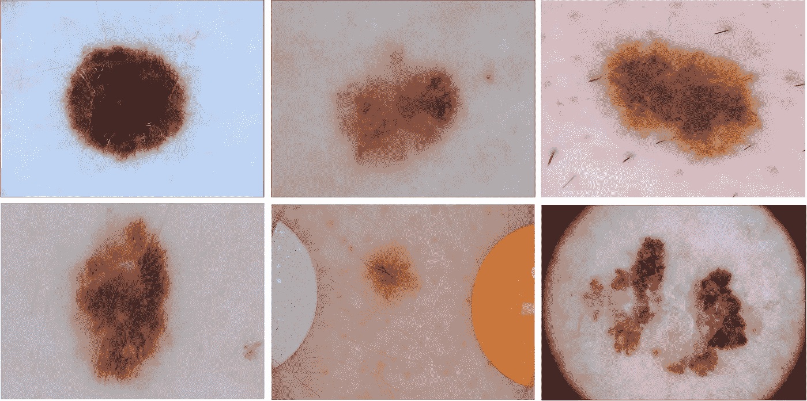
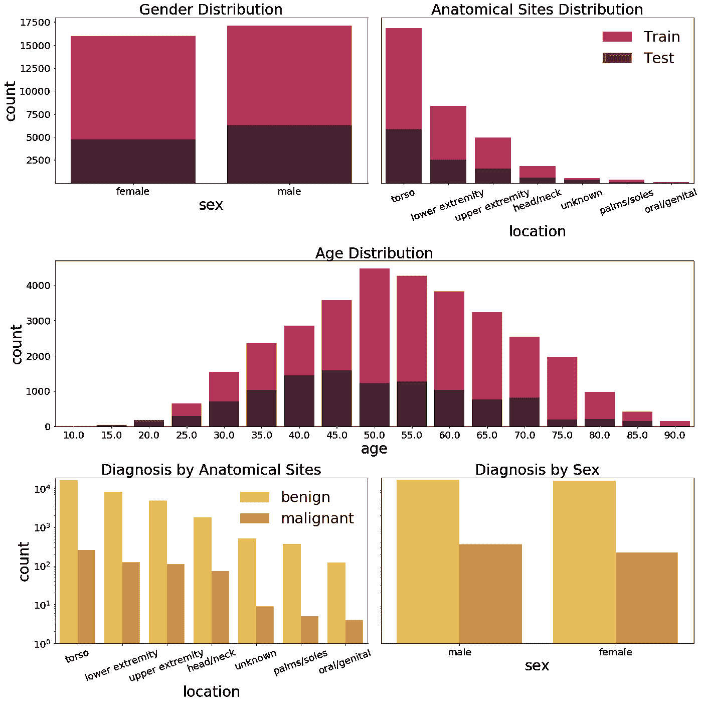

# 医疗保健中的人工智能:合成数据是改善医疗诊断的未来吗？

> 原文：<https://towardsdatascience.com/artificial-intelligence-in-healthcare-is-synthetic-data-the-future-for-improving-medical-diagnosis-a74076ea3d7b>

*作者* [*西尔维娅*](https://sylwia-majchrowska.medium.com/) *和* [*桑德拉·卡拉斯*](https://medium.com/@sandra.carrasco) *o*

[国家癌症研究所](https://unsplash.com/@nci?utm_source=medium&utm_medium=referral)在 [Unsplash](https://unsplash.com?utm_source=medium&utm_medium=referral) 上拍摄的照片

根据世界卫生组织的数据，皮肤癌约占所有已诊断癌症的三分之一，全世界每年超过 300 万例[1]。然而，与其他类型的癌症类似，**早期诊断是良好结果的关键**，计算机辅助诊断在识别黑色素瘤方面显示出巨大的前景。**神经网络**可以应用于在几秒钟内区分黑色素瘤和非黑色素瘤病例，这对诊断医生来说是一个**巨大的帮助。但是基于深度学习(DL)的方法需要大量带注释的数据才能表现良好。此外，在 DL 模型的开发中使用医疗保健数据会带来与个人数据和监管问题相关的挑战。患者数据不能自由共享，因此在创建人工智能解决方案方面的用处有限。所有这些问题都可以使用不同的方法来解决，显示了人工数据**对于此类用例的**潜力。**

由[克里斯多佛·高尔](https://unsplash.com/@cgower?utm_source=medium&utm_medium=referral)在 [Unsplash](https://unsplash.com?utm_source=medium&utm_medium=referral) 拍摄的照片

# 医疗保健中合成数据的潜力

为了挖掘人工智能在健康方面的潜力，我们需要解决诸如**数据保密性**和**数据访问等挑战。合成数据和生成模型可以帮助研究界应对这些挑战，同时推进人工智能在医疗保健中的应用。通过这种方式，我们还可以共享数据，以便与其他机构合作，促进不同模型和研究项目的可重复性，从而加快不同医院之间人工智能的应用。**

另一个潜在的好处是，数据科学家可以**增加**数据量和**平衡**数据集，以提高分类网络的**鲁棒性**和**准确性**，这些分类网络旨在帮助医生进行诊断。这对于研究罕见疾病来说特别有趣，因为病例有限，收集数据更加困难。通过这种方式，研究人员还可以为**代表性不足的患者亚组生成数据。**这有助于减少数据集中的**偏差**，这些偏差会使算法偏向特定类型的患者，从而降低鲁棒性。不幸的是，对于医疗保健用例来说，拥有一个足够大(并且容易访问)的数据集并不是一种常见的做法。但是仍然存在一些足够好的数据集。

# 国际皮肤成像合作组织

我们的实验始于**开源**(因此，之前是匿名和合法共享的)国际皮肤成像协作(ISIC) 2020 数据库[2]。该数据集由来自 2000 多名患者的独特良性和恶性皮肤病变的超过 **33，000 张皮肤镜训练图像**组成。该数据集是为 2020 年夏天在卡格尔举办的 [SIIM-ISIC 黑色素瘤分类挑战赛](https://www.kaggle.com/c/siim-isic-melanoma-classification)而创建的[2]。

在你开始新数据之旅的时候，了解它的统计数据是非常重要的。这在评估结果的过程中非常有用，这样你就可以得出最合适的结论。有时由于**不平衡或者甚至错误的注释**会导致错误分类或者其他错误。在 ISIC 2020 的情况下，我们可以访问**两类图像**(黑色素瘤和非黑色素瘤)和**表格数据**，其特征包括性别、年龄、解剖部位以及图像和痣本身的宽度/高度。让我们试着检查一下它的主要统计数据。

来自 ISIC 2016 数据集的恶性和良性黑色素瘤示例。观察到的痣可以有不同的大小和颜色。有些是有点 ***长毛*** 。图片来自 [ISIC 挑战数据集](https://challenge.isic-archive.com/data/)。

# 了解建模挑战

谈到图像，ISIC 2020 有不同颜色和大小的图片，在患者身上画有或没有刻度，通过皮肤镜的镜头可以看到一些痣。这可能会对模型的结果产生有意义的影响，特别是当我们想要训练一个神经网络来产生额外的皮肤样本以产生更多的图像时。对数据集的训练和测试子集的调查可以帮助我们衡量是否可以在两个子集中进行**相似的观察。这将使我们能够确保我们在具有相同特征的数据上训练和测试模型，这将有助于**防止未来的误诊**。**

另一方面，检查所提供的元数据有助于了解数据来源的人群:例如，数据集中患者的年龄分布是什么，以及目标人群的患病率是否存在性别差异(即患有黑色素瘤)。我们可以预期元数据中会有一些**缺失值，应该首先用一些固定的或最频繁的值来填充。**

关于 ISIC2020 数据集分布的基本统计数据。请注意，下方直方图中显示的比例是对数比例——由于恶性黑色素瘤样本数量非常少，以线性比例显示数据会使条形几乎不可见。作者图片。

正如我们所观察到的，即使数据集相当大，它也有几个缺点。主要原因是**高度不平衡**，即整个数据集中只有大约 2%的黑色素瘤，此外，恶性图像主要是男性。这些图像有不同的分辨率，不同的质量，而且几乎都属于皮肤白皙的人。在这种情况下，如上所述，**合成数据可以派上用场**。

# 瑞典的信息驱动型医疗保健

在我们在 Sahlgrenska 大学医院的特定项目中，我们专注于皮肤损伤和疾病的合成数据集的生成，例如黑色素瘤。使用合成数据可以极大地促进工作，因为我们不必担心在不同医院之间共享数据的隐私问题——部分原因是数据泄露的可能性仍然存在。

另一个用例是 Sahlgrenska 大学医院、 [AI 瑞典](https://www.ai.se/en)和地区 Halland 参与的 [**分散式 AI 项目**](https://www.ai.se/en/projects-9/decentralized-ai) 。借助分散式人工智能，我们旨在实现医院和机构之间的协作和协调，同时保护患者数据的机密性。这可以通过使用**联合学习**或**群体学习/对等学习**【3，4】来完成。本质上，这意味着在每个机构中训练人工智能模型，然后共享见解(模型参数)，而不是数据，以便共同建立一个更准确的模型。有了生成的合成数据，我们可以更轻松地进行首次实施，作为概念证明(PoC)或价值证明(PoV)。

此外，这里给出的皮肤癌诊断的例子只是在医疗保健中使用人工智能的一个玩具例子(事实上是 PoC)。这项研究可以很容易地转移到其他用例，如罕见疾病，如脑瘤。在这种情况下，数据很难获取，生成人工的真实样本有助于良好的诊断。由于机器学习模型是使用大量数据训练的，因此合成模型可能是实现数据共享和确保医学研究可重复性的好选择。

在我们的下一篇文章中，我们将提出生成模型来应对上述挑战，并展示已取得的成果。敬请期待！

# 文学

1.  世界卫生组织，帮助人们降低患皮肤癌和白内障的风险，于 2021 年 12 月 28 日从
    [https://www . who . int/news/item/22-07-2002-帮助人们降低患皮肤癌和白内障的风险](https://www.who.int/news/item/22-07-2002-helping-people-reduce-their-risks-of-skin-cancer-and-cataract) (2002)。
2.  Rotemberg，v .，Kurtansky，n .，Betz-Stablein，b .，Caffery，l .，Chousakos，e .，Codella，n .，Combalia，m .，Dusza，s .，Guitera，p .，Gutman，d .，Halpern，A .，Helba，b .，Kittler，h .，美谛高丝，k .，Langer，s .，Lioprys，k .，Malvehy，j .，Musthaq，s .，Nanda，j .，Reiter，o .，Shih，g .，Stratigos，A .，TschandlSci 数据 8，34 (2021)。
3.  Brendan McMahan 等人，联邦学习:没有集中训练数据的协作机器学习，[谷歌 AI 博客](https://ai.googleblog.com/2017/04/federated-learning-collaborative.html) (2017)。
4.  李等，联合学习系统综述:数据隐私与保护的愿景、炒作与现实，IEEE 知识与数据工程汇刊，(2021)。