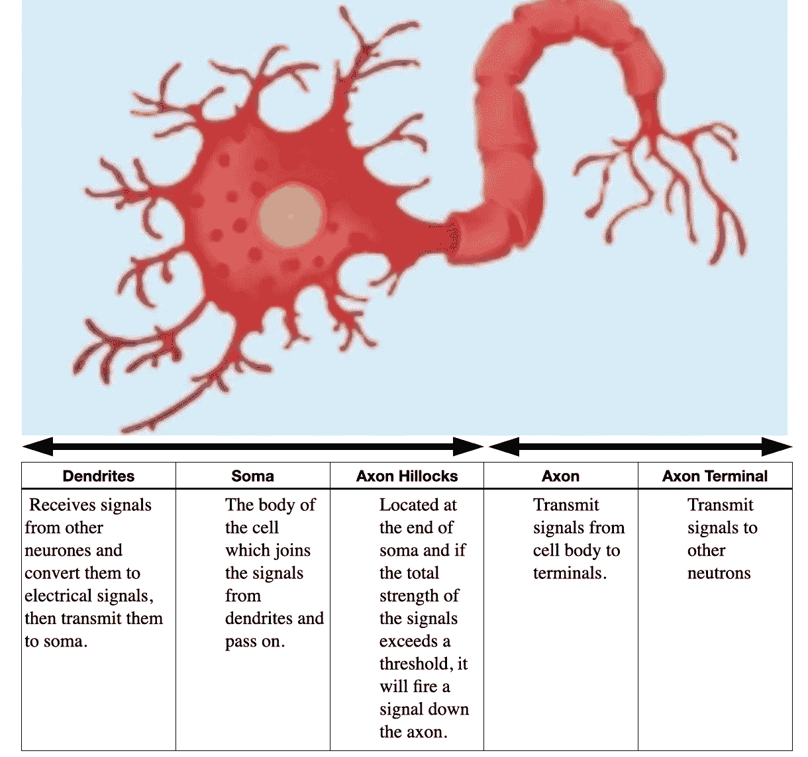
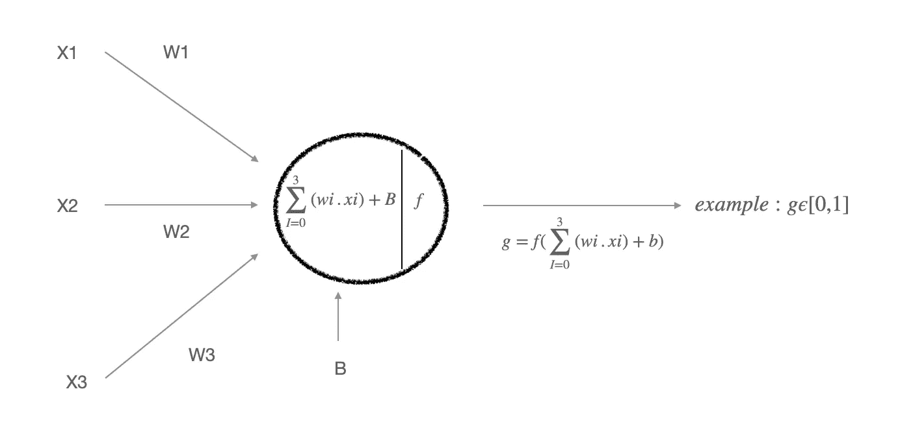
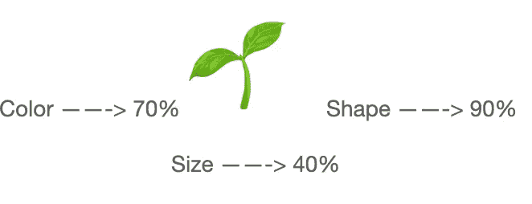
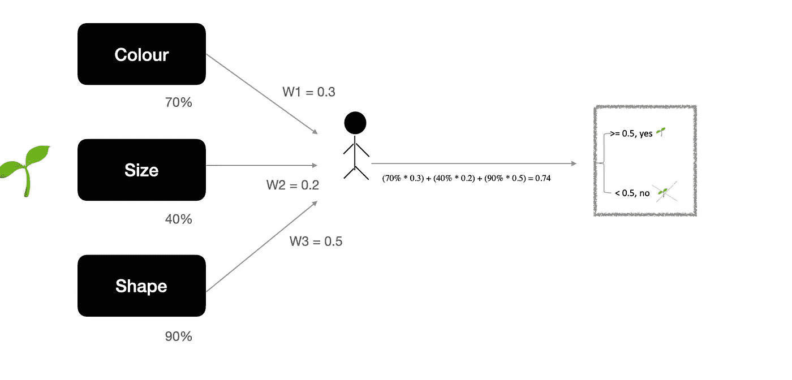
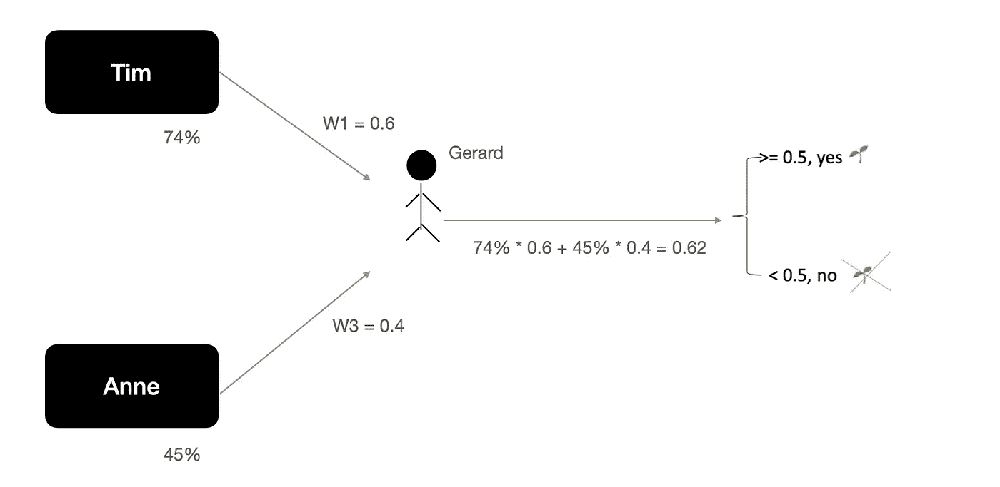
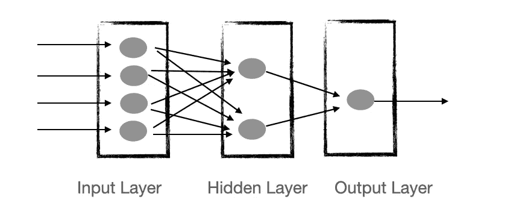

# 人工神经网络通俗地说

> 原文：<https://towardsdatascience.com/artificial-neural-network-in-laymans-terms-20fe6c5f4e9>

## 为初学者解开神经网络的复杂性

图片来源:Pixabay

你只是从左向右移动你的眼睛，你怎么知道你必须这样做。你没有对着你的眼睛大声说出来，但这要感谢你大脑中的神经元通过电脉冲和化学信号将信息发送到你的眼睛。体内有数十亿个这样的神经元，它们共同充当着遍布全身的信息高速公路。

## 生物神经元

这些神经元具有树突、轴突和其他有助于信息流的特征，如下图所示。换句话说，树突从其他神经元接收信号，在神经元内处理它们，然后将输出信号传递给下一个神经元。

神经元的图像，由 Freepik 设计；[www.freepik.com](http://www.freepik.com/)

这种自然信息流，像历史上许多其他基于自然灵感的伟大突破一样，被人类模仿，并导致了一种被称为人工神经网络(ANN)的数据科学模型的形成。

## 人工神经网络

如果你听说过深度学习，ANN 可以被认为是它背后的大脑。由于其解决复杂问题的能力，它已被用于各种应用，包括手写字母分类、人脸识别、图像分类、预测问题，以及化学和物理等领域。

像真正的神经元一样，人工神经网络由许多人工神经元组成，这些人工神经元接收来自前一个神经元的信息，对其进行处理，并将其传递给下一个神经元。下图描述了人工神经元的基本操作。

它将 X1、X2 和 X3 等加权输入聚合在一起，类似于不同的脉冲通过树突的方式。然后，它们将在神经元中使用称为激活函数的函数进行调整，该函数将非线性添加到整个方程中，并传递到下一个神经元，就像真正的神经元一样。

图片作者:人工神经元

这实际上是单个神经元的工作方式。但是我确信你们大多数人不知道这将如何完成复杂的操作，比如人脸识别、手写字母识别等等。

事实上，这需要彻底理解一些复杂的数学。然而，对于一个新手来说，有另一种方式来理解这一点。也就是用一个现实生活中的例子来理解它。

## Tim 如何对照片进行分类？

假设蒂姆是一名草药医生，他可以根据植物叶子的颜色、形状和大小来识别植物。他收到一种草药，并试图验证它是否是草药 x。

作者图片

根据他的分析，他认为叶子的颜色看起来 70%像草药 x，叶子的大小看起来 40%像草药 x，叶子的形状看起来 90%像草药 x。因此，草药的三个输入是 0.7、0.4 和 0.9。

凭借多年的专业知识，他明白了主要通过观察叶子的形状来鉴别草药；因此，如果他要优先考虑识别草药的重要性，形状应该被给予最高的优先权。因此，如果颜色、大小和形状的权重分别为 0.3、0.2 和 0.5，则整组结果的加权平均值将为 0.74。

用科学的方式，他用一个阈值来确定草药是不是 x。如果阈值设置为 0.5，Tim 将确定正在研究的草药确实是草药 x。

作者图片

神经元也以同样的方式活动。在这个例子中，Tim 是神经元。让我们想象药草是一种植物的形象。Neuron 以给定权重的矢量格式获取输入，并通过生成输入的加权聚合来产生结果，类似于 0.74，但增加了一个偏差因子。之后，在通过激活函数时，它将生成结果，该结果将作为输入被“发射”到下一个神经元。

## 草药医生团队如何对照片进行分类？

现在，让我们想象一下，Tim 有一个可以通过根系探测草药的同事 Anne 和一个做最后决定的主管 Gerard。

按照与 Tim 类似的过程，Anne 生成的输出为 0.45。杰勒德凭他多年的经验知道，通过叶子获得的信息应该比根系更重要。因此，他会给叶子 0.6 分，给根系 0.4 分。如果 Gerard 也基于一个阈值来做决定，在这个例子中是 0.5，那么，他将把这个植物标记为 herb x。

作者图片

这是两层人工神经网络的一个例子。Tim 和 Anne 是第 1 层的神经元，他们的输出将成为第 2 层 Gerard 的输入。人工神经网络神经元以同样的方式分组，一层的输出作为下一层的输入，形成一个网络。因此，一个神经网络可以用更多的神经元和层来构建，以回答更复杂的问题。在大多数情况下，将包括一个输入层、一个或多个隐藏层以及一个输出层。

如你所见，信息向前传播，这就是为什么这些网络也被称为**前馈神经网络**的原因。

作者图片:人工神经网络层

## 安是如何学习的？

新模型中的神经元可能没有经过训练。好像蒂姆、安妮和杰拉德不再是专家了，他们不知道如何给这些草药贴标签。

人工神经网络像人一样从错误中学习。如果我们使用相同的例子，如果 Gerard 在生成输出后发现植物 x 不是药草，他会告诉 Tim 和 Anne 这不是真正的药草 x，他们需要修改他们的分数。

所以错误的交流是逆向发生的。这被称为通过**反向比例**学习，因为误差被反向比例化，权重随后被更新以最小化损失。

如果对大量草药进行这种类型的实验，并调整每一层的权重以给出最佳答案，人工神经网络最终将能够概括结果并识别任何草药。因为它从特征中学习，所以模型会逐日改进以提供更好的答案。

## 结论

如上所述，人工神经网络是一种由多层神经元组成的模型，这些神经元相互连接，以允许信息在处理过程中流动。它将从错误中学习，并可以进行微调以获得极其精确的结果。由于激活函数引入的非线性，神经网络可以处理更复杂的问题。

这些只是安的一些基本事实。当你有了这种核心理解，就更容易进入数学的底层。