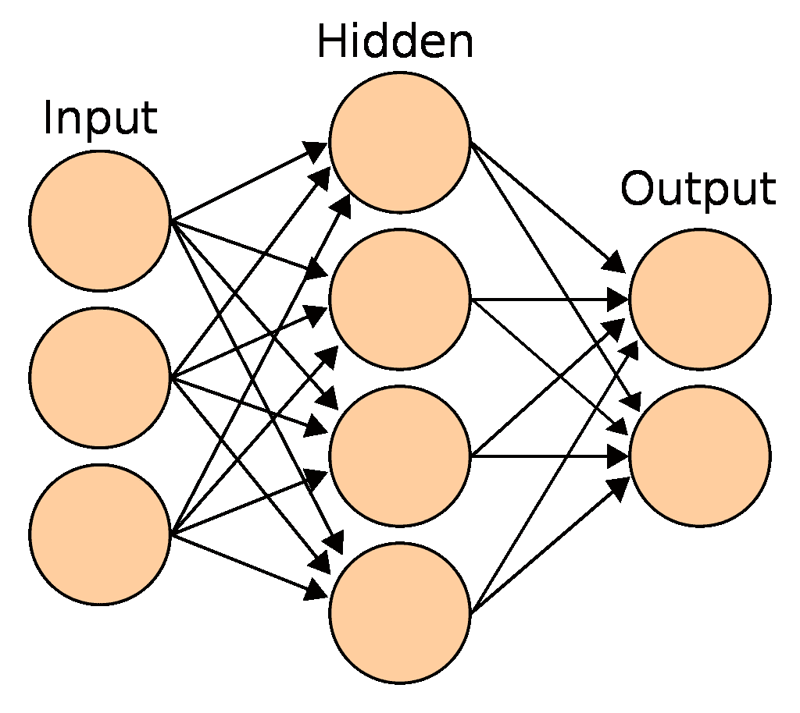
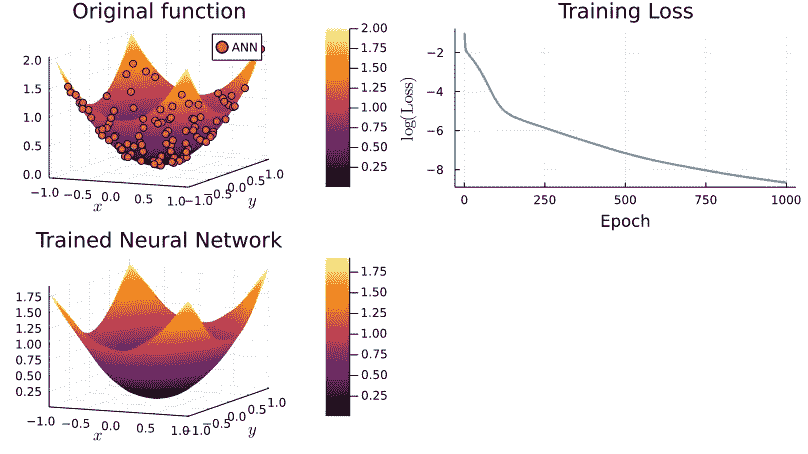
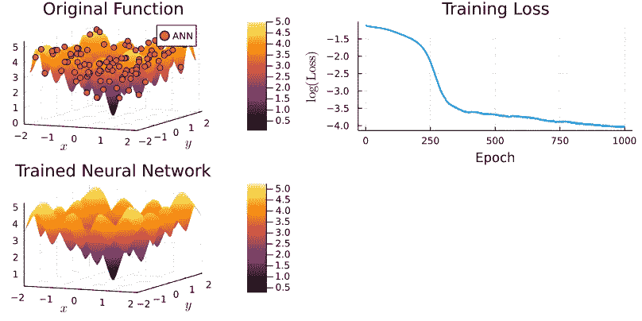
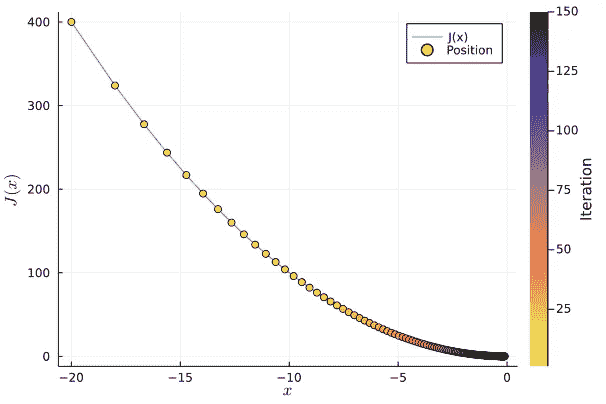

# 作为通用函数逼近器的人工神经网络

> 原文：<https://towardsdatascience.com/artificial-neural-networks-as-universal-function-approximators-a6ac6547a35f>

## 人工神经网络目前非常流行，这是理所当然的。

大型科技公司到处都在使用它们。例如，当你使用谷歌翻译时，或者当推荐出现在你的网飞 feed 上时，复杂的人工神经网络正在幕后使用。在[阿尔法围棋](https://en.wikipedia.org/wiki/AlphaGo)在[围棋对抗李塞多尔](https://www.washingtonpost.com/news/innovations/wp/2016/03/15/what-alphagos-sly-move-says-about-machine-creativity/)的比赛中取得成功的背后，安被用来确定下一步的最佳走法。

在本文中，我将讨论神经网络流行背后的原因

**剧透警告:**这与 ANN 是**通用函数逼近器有关。**

我包含了 Julia 代码来说明实际中事情是如何工作的。我选择的工具是 [Julia](https://julialang.org/) ，因为它真的很快，而且是一种越来越流行的编程语言(如果你已经使用 Python，学习起来并不难)。对于机器学习任务来说， [Flux.jl](https://github.com/FluxML/Flux.jl) 是一个非常好的选择，所以我们也来使用它。你可以在这里下载代码。

# 一.一些理论

# 体系结构

如果你在这里结束，你可能已经有一些关于什么是人工神经网络的知识。所以我会很简短。简而言之，神经网络由几个相互连接的层组成。每一层都由节点组成。相邻层之间的节点相互交换信息。节点之间相互通信的方式由与每个节点相关联的参数值捕获。

请参见下图:



来源:[https://en . Wikipedia . org/wiki/Artificial _ neural _ network #/media/File:Artificial _ neural _ network . SVG](https://en.wikipedia.org/wiki/Artificial_neural_network#/media/File:Artificial_neural_network.svg)

人工神经网络在高层次上模仿大脑的行为。大脑由神经元组成，神经元通过突触相互连接。我们的大脑非常擅长识别模式，所以人们可能希望人工神经网络可以成为一个很好的模式识别机器。

实际情况就是这样。更好的是，我们有一些定理告诉我们，人工神经网络非常非常好。

# 通用逼近定理

让我描述两篇重要的论文。下面，我复制了他们摘要的一些精选部分:

霍尼克·斯廷奇科姆和怀特(1989 年)

“本文严格证明了使用任意压缩函数**的具有少至一个隐藏层**的**标准多层前馈网络能够以任意期望的精度**逼近从一个有限维空间到另一个有限维空间的任何 Borel 可测函数，只要有足够多的隐藏单元可用。从这个意义上说，**多层前馈网络是一类通用逼近器。**”

[巴伦(1993)](http://www.stat.yale.edu/~arb4/publications_files/UniversalApproximationBoundsForSuperpositionsOfASigmoidalFunction.pdf)

**表明具有一层 s 形非线性的前馈网络实现 O(1/n)阶的积分平方误差，其中 n 是节点的数量。** […]对于本文研究的函数类，网络参数化的近似率和简约性在高维设置中具有惊人的优势**。**

Hornik Stinchcombe 和 White (1989) 的论文告诉我们，一个非常大的函数类可以由具有上述结构的人工神经网络来近似。我们旨在逼近的基础函数只需要是“Borel 可测的”(从一个有限维空间到另一个空间)，它包含了几乎所有你在经济学中使用的有用函数(从一个有限维空间到另一个有限维空间的连续函数是 Borel 可测函数)。

Barron (1993) 的论文告诉我们，当处理多维数据时，人工神经网络是特别好的近似器。换句话说，ANN 可以帮助减轻维度诅咒。理解维数灾难的一种方法是，逼近一个函数所需的点数随着维数呈指数增长，而不是线性增长。我们想解释复杂的现象，有许多方面和相互作用，但传统的近似方法通常在这种情况下表现不佳。

总之，这些结果告诉我们，人工神经网络是非常好的函数逼近器，即使当维数很高时。

# 二。应用

现在我们来看两个应用。为了热身，我们将从一个平滑的函数开始。然后我们将转向一个更复杂的函数。

# 二。a .简单功能

让我们加载一些有用的包，并定义我们想要近似的函数

```
# Dependencies
using Flux
using Plots
using LinearAlgebra
using ProgressMeter
using Statistics
using LaTeXStrings
using Surrogates
gr()# Define function that we would like to learn with our neural network
f(x) = x[1].^2 + x[2].^2f (generic function with 1 method)
```

函数是无限维的对象。但是我们需要有限数量的值来训练我们的神经网络。为此，让我们从一个区间中创建一个样本点(我使用 [Sobol 采样](https://en.wikipedia.org/wiki/Sobol_sequence))，然后评估这些点的真实函数值。

```
n_samples = 100
lower_bound = [-1.0, -1.0]
upper_bound = [1.0, 1.0]xys = Surrogates.sample(n_samples, lower_bound, upper_bound, SobolSample())
rawInputs = xys
rawOutputs = [[f(xy)] for xy in xys] # Compute outputs for each input
trainingData = zip(rawInputs, rawOutputs);
```

现在是决定我们的人工神经网络的架构的有趣部分。我选择两个隐藏层。第一层的节点数由输入的维度(2d 向量)以及最终节点的维度(标量)决定。我们仍然需要选择中间节点的数量。对于第一个隐藏层，我选择 784 个节点，第二个隐藏层选择 50 个节点。平心而论，这些选择有点随意(我是受了这里 [Flux.jl 教程](https://fluxml.ai/Flux.jl/stable/training/training/)的影响)。随意尝试不同的价值观。

```
# Define the neural network layers (this defines a function called model(x))
# Specify our model
dim_input = 2
dim_ouptut = 1
Q1 = 784;
Q2 = 50;# Two inputs, one output
model = Chain(Dense(2,Q1,relu),
            Dense(Q1,Q2,relu),
            Dense(Q2,1,identity));
```

接下来我们定义一个**损失函数**，它测量近似的精确度。损失越小越好。我们使用[均方误差](https://en.wikipedia.org/wiki/Mean_squared_error)损失函数。游戏的名字是寻找最小化损失函数的参数值。最小化损失函数的一种方法是使用**梯度下降算法**。

下面是梯度下降的直观解释。想象一下，你在一座山顶上，那里有很多雾，让你看不到远处。你真的想下去。你该怎么办？

一个策略是看看你站在哪里，评估你所在位置附近**最陡下降的方向(你看不到很远)。然后朝那个方向迈出一步。然后重复这个过程。如果山是“行为良好的”(它没有局部最小值)，你将设法下山，即使你只是在每一步使用局部信息。(在这篇博文的最底部可以看到一个非常简单的问题的梯度下降图)。**

```
# Define loss function and weights
loss(x, y) = Flux.Losses.mse(model(collect(x)), y)lr = 0.001 # learning rate# V1\. Gradient descent
opt = Descent(lr)# V2\. ADAM
#decay = 0.9
#momentum =0.999
#opt = ADAM(lr, (decay, momentum))epochs = 1000 # Define the number of epochs
trainingLosses = zeros(epochs);# Initialize a vector to keep track of the training progress
```

接下来是最有收获的一步:**训练部分**。下面的代码块执行梯度下降。函数`Flux.train!`一次性使用样本中的所有观察值。因为一次迭代不足以达到最小值，所以我们重复这个过程几次`epochs`。在每个时期之后，我们计算均方误差来看模型做得有多好。

```
ps = Flux.params(model) #initialize weigths
p = Progress(epochs; desc = "Training in progress"); # Creates a progress bar
showProgress = true# Training loop
@time for ii in 1:epochs Flux.train!(loss, ps, trainingData, opt) # Update progress indicator
    if showProgress
        trainingLosses[ii] = mean([loss(x,y) for (x,y) in trainingData])
        next!(p; showvalues = [(:loss, trainingLosses[ii]), (:logloss, log10.(trainingLosses[ii]))], valuecolor = :grey)
    endend 24.753884 seconds (41.00 M allocations: 37.606 GiB, 6.56% gc time, 0.48% compilation time)
```

下一个图显示了原始函数和人工神经网络返回值(点)的曲面图。效果相当不错。右上图显示了训练进行时损失函数的值。梯度下降似乎工作得很好，因为损失函数以良好的单调方式降低。底部图显示了经过训练的人工神经网络的表面图。



# 更具挑战性的职能

好了，我们的人工神经网络使用一个简单的函数，这是令人放心的。现在让我们转向一个更具挑战性的函数。例如，我们可以尝试逼近[阿克利函数](https://en.wikipedia.org/wiki/Ackley_function)，这是一个有点疯狂的函数，通常用于测试最小化算法(它在原点有一个全局最小值)。

即使是更复杂的函数，我们的人工神经网络也能很好地逼近真实函数，如下图所示。

```
function ackley(x; e = exp(1), a = 10.0, b = -0.2, c=2.0*π)
    #a, b, c = 10.0, -0.2, 2.0*π
    len_recip = inv(length(x))
    sum_sqrs = zero(eltype(x))
    sum_cos = sum_sqrs
    for i in x
        sum_cos += cos(c*i)
        sum_sqrs += i^2
    end
    return -a * exp(b * sqrt(len_recip*sum_sqrs)) - exp(len_recip*sum_cos) + a + e
endn_samples = 1000
lower_bound = [-2.0, -2.0]
upper_bound = [2.0, 2.0]
xys = Surrogates.sample(n_samples, lower_bound, upper_bound, SobolSample())
rawInputs = xysrawOutputs = [[ackley(xy)] for xy in xys] # Compute outputs for each input
trainingData = zip(rawInputs, rawOutputs);# Define the neural network layers (this defines a function called model(x))
# Specify our model
Q1 = 784;
Q2 = 50;
Q3 = 10;# Two inputs, one output
model = Chain(Dense(2,Q1,relu),
            Dense(Q1,Q2,relu),
            Dense(Q2,1,identity));# Define loss function and weights
loss(x, y) = Flux.Losses.mse(model(collect(x)), y)
ps = Flux.params(model)# Train the neural network
epochs = 1000
showProgress = true
lr = 0.001 # learning rate# Gradient descent
opt = Descent(lr)trainingLosses = zeros(epochs) # Initialize vectors to keep track of training
p = Progress(epochs; desc = "Training in progress") # Creates a progress bar@time for ii in 1:epochs Flux.train!(loss, ps, trainingData, opt) # Update progress indicator
    if showProgress
        trainingLosses[ii] = mean([loss(x,y) for (x,y) in trainingData])
        next!(p; showvalues = [(:loss, trainingLosses[ii]), (:logloss, log10.(trainingLosses[ii]))], valuecolor = :grey)
    endend242.064635 seconds (407.63 M allocations: 375.931 GiB, 6.81% gc time, 0.04% compilation time)
```



# 结论

人工神经网络是**通用函数逼近器。这篇博文解释了这意味着什么，并展示了如何开始使用人工神经网络来逼近相对简单的函数。**

这篇博文最初发布在我的网站上:

[https://julienpascal.github.io/post/ann_1/](https://julienpascal.github.io/post/ann_1/)

# 额外:视觉梯度下降

下面是梯度下降的图解。我们想找到函数`J(x)=x^2`的最小值，我们从点`-20`开始。

该算法迭代进行:

1.  在当前值下计算**梯度**。这给了我们函数`J`最大变化的方向。
2.  因为我们在寻找一个最小值，而不是最大值，所以向最大变化的相反方向迈出一步
3.  重复步骤 1–2

```
using GradDescent
#Code from here: https://jacobcvt12.github.io/GradDescent.jl/stable/
#I made only slight modifications to the original code# objective function and gradient of objective function
J(x) = x^2
dJ(x) = 2*x# number of epochs
epochs = 150# instantiation of Adagrad optimizer with learning rate of 2
opt = Adagrad(η=2.0)# initial value for x (usually initialized with a random value)
x = -20.0 #initial position on the function
values_x = zeros(epochs) #initialization
value_y = zeros(epochs) #initialization
iter_x = zeros(epochs) #initializationfor i in 1:epochs
    # Save values for plotting
    values_x[i] = x
    value_y[i] = J(x)
    iter_x[i] = i # calculate the gradient wrt to the current x
    g = dJ(x) # change to the current x
    δ = update(opt, g)
    x -= δ
end
```

正如你在下图中看到的，我们从左手边开始，然后向右做了一些很大的移动。久而久之，这些点从黄色变成了深色。大约 150 次迭代后，我们非常接近 0 处的真实最小值。

```
plot(values_x, value_y, label="J(x)")
scatter!(values_x, value_y, marker_z = iter_x, color = cgrad(:thermal, rev = true), label="Position", colorbar_title="Iteration")
xlabel!(L"x")
ylabel!(L"J(x)")
```

