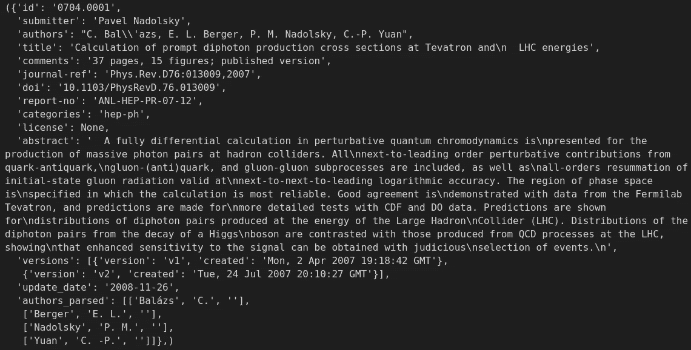
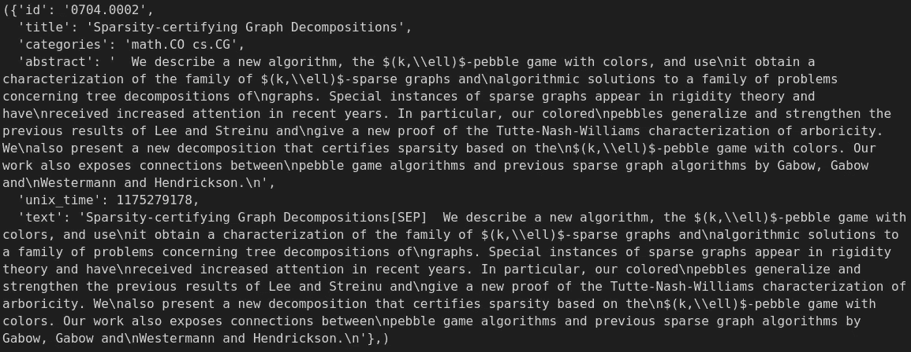
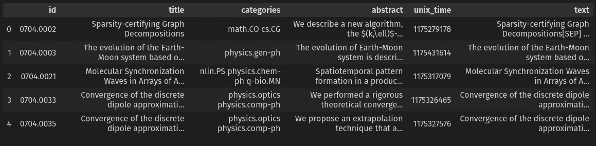
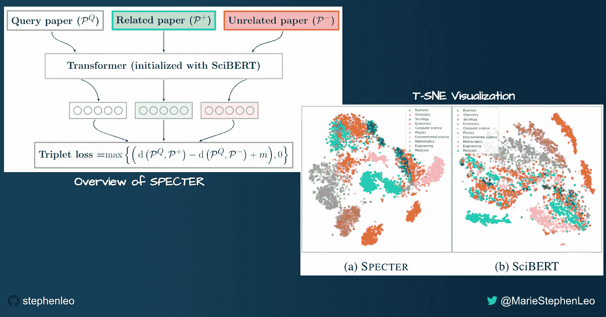
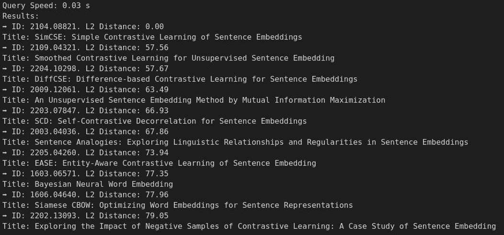

# ArXiv 科学论文向量相似性搜索

> 原文：<https://towardsdatascience.com/arxiv-scientific-papers-vector-similarity-search-15059970a73a>

## 在 [Unsplash](https://unsplash.com?utm_source=medium&utm_medium=referral) 的<50ms using Dask, SBERT SPECTRE, and Milvus Vector database

Photo by [Ross Sneddon](https://unsplash.com/@rosssneddon?utm_source=medium&utm_medium=referral) 上对大约 64 万篇论文进行语义搜索查询

# 介绍

了解任何最新数据科学主题的最佳方式之一是阅读关于 arxiv.org[的开源研究论文。然而，即使对于最有经验的研究人员来说，大量的研究论文也可能让人不知所措。像](https://arxiv.org/) [connected papers](https://www.connectedpapers.com/) 这样的工具可以有所帮助，但它们基于论文之间共享的[引文和参考书目](https://www.connectedpapers.com/about)来衡量相似性，而不是这些文档中文本的语义。

在这篇文章中，我开始构建一个语义相似性搜索引擎，它以单个“查询”论文作为输入，并使用最先进的 NLP 从 arxiv 语料库中大约 64 万篇计算机科学论文中找到前 K 篇最相似的论文！搜索运行时使用<50ms latency on a single laptop! Specifically, in this post, I’ll cover

1.  [设置环境并从 Kaggle](https://medium.com/p/15059970a73a/#1955) 下载 arXiv 数据
2.  [使用 Dask](https://medium.com/p/15059970a73a/#93a7) 将数据加载到 Python 中
3.  [使用 Milvus 矢量数据库实现科学论文语义相似性搜索应用](https://medium.com/p/15059970a73a/#ac96)

这篇文章中使用的技术可以作为模板来构建任何 NLP 语义相似性搜索引擎，而不仅仅是科学论文。唯一的区别是所使用的预训练模型。

在这篇文章中，我们将使用来自 Kaggle 的 [arXiv 数据集，它是作者在](https://www.kaggle.com/datasets/Cornell-University/arxiv) [CC0: Public Domain](https://creativecommons.org/publicdomain/zero/1.0/) 许可下发布的。

我在下面的上一篇文章中概述了生产规模的向量相似性搜索的注意事项。所有这些考虑也适用于这个项目。Milvus vector database 设计得非常好，许多步骤都完全相同，这里重复只是为了完整。

<https://medium.com/unstructured-data-service/supercharged-semantic-similarity-search-in-production-f2a3c35c4e00>  

# 设置环境并从 Kaggle 下载 arxiv 数据。

康奈尔大学已经将整个 arXiv 语料库上传到一个 [Kaggle 数据集](https://www.kaggle.com/datasets/Cornell-University/arxiv)，并根据 [CC0:公共领域](https://creativecommons.org/publicdomain/zero/1.0/)许可对其进行许可。我们可以使用 Kaggle API 直接下载数据集。如果您还没有这样做，请按照这些说明[在您的系统上设置 ka ggle API](/powering-semantic-similarity-search-in-computer-vision-with-state-of-the-art-embeddings-f6c183fff134#072e)。

我们将在这篇文章中使用一个名为 semantic_similarity 的 conda 环境。如果你的系统上没有安装 conda，你可以从[这里](https://github.com/conda-forge/miniforge)安装开源的 mini forge。下面的步骤创建必要的目录和 conda 环境，安装所需的 Python 库，并从 Kaggle 下载 [arxiv 数据集。](https://www.kaggle.com/datasets/Cornell-University/arxiv)

作者代码

# 使用 Dask 将数据加载到 Python

我们从 Kaggle 下载的数据是一个 3.3GB 的 JSON 文件，包含大约 200 万篇论文！为了有效地处理如此大的数据集，使用 pandas 将整个数据集加载到内存中并不是一个好主意。相反，我们可以使用 Dask 将数据分成多个分区，并且在任何给定时间只将几个分区加载到内存中。

## 达斯克

[Dask](https://dask.org/) 是一个开源库，它允许我们使用类似于熊猫的 API 轻松应用并行计算。在本地机器上运行`"pip install dask[complete]"`进行设置很简单，如设置部分所示。让我们首先导入必要的库。

作者代码

我们将使用 Dask 的两个组件来高效地处理大型 arxiv JSON 文件。

1.  [Dask Bag](https://docs.dask.org/en/latest/bag.html) :它让我们以固定大小的块加载 JSON 文件，并对每行数据运行一些预处理函数。
2.  dask 数据框架:我们可以将 dask 包转换成 Dask 数据框架来访问类似熊猫的 API

## 步骤 1:将 JSON 文件装入 Dask 包中

让我们将 JSON 文件加载到一个 dask 包中，其中每个块的大小为 10MB。您可以调整`blocksize`参数来控制每个块的大小。然后我们将`json.loads`函数应用到 dask 包的每一行，使用`.map()`函数将 JSON 字符串解析到 Python 字典中。

作者代码

作者图片

## 步骤 2:编写预处理助手函数

从打印输出中，我们看到每一行都包含几个与论文相关的元数据。让我们编写三个助手函数来帮助我们预处理数据集。

1.  v1_date():这个函数用于提取作者将论文的第一个版本上传到 arXiv 的日期。我们将把日期转换为 UNIX 时间，并将其作为一个新字段存储在该行中。
2.  text_col():这个函数使用一个“[SEP]”标记来组合“title”和“abstract”字段，这样我们就可以将这些文本输入到 [SPECTRE 嵌入模型](https://arxiv.org/abs/2004.07180)中。我们将在下一节详细讨论 SPECTRE。
3.  filters():这个函数只保留满足某些条件的行，比如各列中的最大文本长度和计算机科学类别中的论文。

作者代码

## 步骤 3:在 Dask 包上运行预处理助手函数

我们可以很容易地使用`.map()`和`.filter()`函数在 Dask 包的每一行上运行助手函数，如下所示。因为 Dask 支持方法链接，所以我们利用这个机会只保留 Dask 包中的几个重要列，而丢弃其余的。

作者代码

作者图片

## 步骤 4:将 Dask 包转换为 Dask 数据帧

数据加载的最后一步是将 Dask 包转换成 Dask 数据帧，以便在数据的每个块或分区上使用类似熊猫的 API。

作者代码

作者图片

# 使用 Milvus 向量数据库实现科技论文语义相似性搜索应用

Milvus 是最受欢迎的开源矢量数据库之一，为高度可伸缩和极快的矢量相似性搜索而构建。因为我们只在本地机器上运行 Milvus，所以在这篇文章中我们将使用独立的 Milvus。

## 步骤 1:在本地安装 Milvus vector 数据库

使用 Docker 安装 Milvus 矢量数据库轻而易举，因此我们首先需要安装 [Docker](https://docs.docker.com/engine/install/) 和 [Docker Compose](https://docs.docker.com/compose/install/) 。然后，我们需要做的就是下载一个`docker-compose.yml`并启动 docker 容器，如下面的代码片段所示！milvus.io 网站提供了许多其他选项来安装 milvus 单机版和 Milvus 集群；如果您需要将其安装在 [Kubernetes 集群上](https://milvus.io/docs/v2.1.x/install_cluster-docker.md)或[离线安装](https://milvus.io/docs/v2.1.x/install_offline-docker.md)，请查看。

作者代码

## 步骤 2:创建 Milvus 系列

现在我们已经在本地机器上运行了 Milvus vector 数据库服务器，我们可以使用`pymilvus`库与它进行交互。首先，让我们导入必要的模块并连接到运行在`localhost`上的 Milvus 服务器。随意更改`alias`和`collection_name`参数。我们用来将文本转换成嵌入的模型决定了`emb_dim`参数的值。在 SPECTRE 的情况下，嵌入是 768d。

作者代码

或者，您可以检查由`collection_name`指定的集合是否已经存在于您的 Milvus 服务器上。对于这个例子，如果集合已经可用，我就删除它。但是在生产服务器中，您不会这样做，而是会跳过下面的集合创建代码。

Milvus 集合类似于传统数据库中的表。为了创建一个集合来存储数据，我们首先需要指定集合的`schema`。在本例中，我们利用 [Milvus 2.1 存储字符串索引和字段](https://milvus.io/blog/2022-06-23-How-Short-video-Platform-Likee-Removes-Duplicate-Videos-with-Milvus.md#String-and-scalar-index-support)的能力来存储与每篇论文相关的所有必要元数据。主键`idx`和其他字段`categories, title, abstract`具有合理最大长度的`VARCHAR`数据类型，而`embedding`是包含`emb_dim`维度嵌入的`FLOAT_VECTOR` 字段。Milvus 支持多种数据类型，如这里的[所示](https://milvus.io/docs/v2.0.x/field_schema.md#Supported-data-type)。

作者代码

一旦创建了一个集合，我们现在就可以上传我们的文本和向量到其中了。

## 步骤 3:迭代我们的 Dask dataframe 的分区，使用 SPECTER 嵌入文本，并将它们上传到 Milvus 矢量数据库。

首先，我们需要将 Dask 数据帧中的文本转换成嵌入向量，以运行语义相似性搜索。我下面的帖子分享了我们如何将文本转换成嵌入。特别是，我们将使用名为 SPECTRE 的 SBERT 双编码器模型将科学论文转换为嵌入内容。

</semantic-textual-similarity-83b3ca4a840e>  

**SPECTER**[[Paper](http://arxiv.org/abs/2004.07180)][[Github](https://github.com/allenai/specter)]:使用引文通知转换器的科学论文嵌入是将科学论文转换为嵌入的模型。

*   每篇论文的标题和摘要文本都用[SEP]标记连接起来，并使用预训练的 Transformer 模型(SciBERT)的[CLS]标记转换为嵌入内容。
*   使用引文作为文档间相关性的代理信号。如果一篇论文引用了另一篇，我们可以推断它们是相关的。
*   三重损失训练目标:我们训练变压器模型，因此具有共享引用的论文在嵌入空间中更接近。
*   换句话说，正面论文是被查询论文引用的论文，负面论文是未被查询论文引用的论文。随机抽样的底片是“容易”底片。
*   为了提高性能，我们使用未被查询论文引用但被肯定论文引用的论文来创建“硬”否定。
*   推理时我们只需要标题和摘要。不需要引用，因此 SPECTER 甚至可以为没有任何引用的新论文生成嵌入！
*   SPECTER 在主题分类、引用预测和科学论文推荐方面提供了出色的性能(优于 SciBERT)。

图片由作者使用来自开源 [SPECTER 论文](https://arxiv.org/abs/2004.07180)的截图制作

通过句子转换器库，使用预先训练的 SPECTRE 模型很简单。我们只需一行代码就可以下载预先训练好的模型，如下所示。我们还编写了一个简单的助手函数，将 Dask dataframe 分区中的一整列文本转换成嵌入文本。

作者代码

我们需要遍历 Dask dataframe 的分区，将数据上传到我们的 Milvus 集合中。在每次迭代中，我们只将该分区中的行加载到内存中，并将元数据列中的数据添加到变量`data`中。我们可以使用 dask `.map_partitions()` API 将嵌入生成应用于分区中的每一行，并将结果追加回同一个`data`变量。最后，我们可以用`collection.insert`将数据上传到 Milvus。

作者代码

请注意，添加到`data`变量中的列的顺序必须与我们在模式创建期间定义的`fields`变量的顺序相同！

## 步骤 4:在上传的数据上创建近似最近邻(ANN)索引

在我们将所有的嵌入插入 Milvus 向量数据库之后，我们需要创建一个 ANN 索引来加速搜索。在本例中，我使用的是`HNSW`索引类型，[是最快、最准确的人工神经网络索引](https://pub.towardsai.net/knn-k-nearest-neighbors-is-dead-fc16507eb3e)之一。查看 [Milvus 文档](https://milvus.io/docs/v2.1.x/index.md#HNSW)了解更多关于`HNSW`索引及其参数的信息。

作者代码

## 第五步:运行你的向量相似性搜索查询！

最后，我们的 Milvus 集合中的数据已经可以进行查询了。首先，我们必须将集合加载到内存中，以便对其运行查询。

作者代码

接下来，我创建了一个简单的助手函数，它接收一个 query_text，将其转换为 SPECTRE 嵌入，在 Milvus 集合中执行 ANN 搜索，并打印出结果。我们可以使用这里描述的 search _ params[来控制搜索质量和速度。](https://milvus.io/docs/v2.1.x/index.md#HNSW)

作者代码

现在，我们只需一行代码就可以使用 helper 函数对存储在我们的 Milvus 收藏中的大约 64 万篇计算机科学论文进行语义 arXiv 论文搜索。例如，我正在搜索一些类似于我在[上一篇文章](/semantic-textual-similarity-83b3ca4a840e#373c)中详细讨论的 [SimCSE 论文](https://arxiv.org/abs/2104.08821)的论文。前 10 个结果与我的搜索查询非常相关，因为它们大多与句子嵌入的对比学习有关！更令人印象深刻的是，整个搜索仅在我的笔记本电脑上运行了 30 毫秒，这完全符合大多数应用程序的典型使用要求！

作者代码

作者图片

如果我们不需要运行更多的查询，我们可以释放集合来释放我们机器的内存。从内存中删除收藏不会导致数据丢失，因为它仍然存储在我们的磁盘上，并可以在需要时再次加载。

作者代码

如果你想停止 Milvus 服务器并删除磁盘上的所有数据，你可以按照这里的说明[操作](https://milvus.io/docs/v2.1.x/install_standalone-docker.md#Stop-Milvus)。当心！此操作不可逆，将删除 Milvus 群集中的所有数据。

# 结论

在这篇文章中，我们通过几个简单的步骤，使用 SPECTRE embeddings 和 Milvus vector database 实现了一个超可扩展的科学论文语义搜索服务。这种方法在生产中可扩展到数亿甚至数十亿个载体。我们使用一个简单的纸质查询测试了这个搜索，仅用了 30 毫秒就返回了前 10 个结果！Milvus 作为一个高度可扩展和高速矢量相似性搜索数据库的声誉是当之无愧的！

要获得更多关于 Milvus 应用的灵感，请前往 [Milvus](https://milvus.io/milvus-demos/) 矢量数据库[演示](https://milvus.io/milvus-demos/)和 [Bootcamp](https://github.com/milvus-io/bootcamp/tree/master/solutions/reverse_image_search) 。

*最初发表于*[*zilliz.com*](https://zilliz.com/blog/Arxiv-scientific-papers-vector-similarity-search)