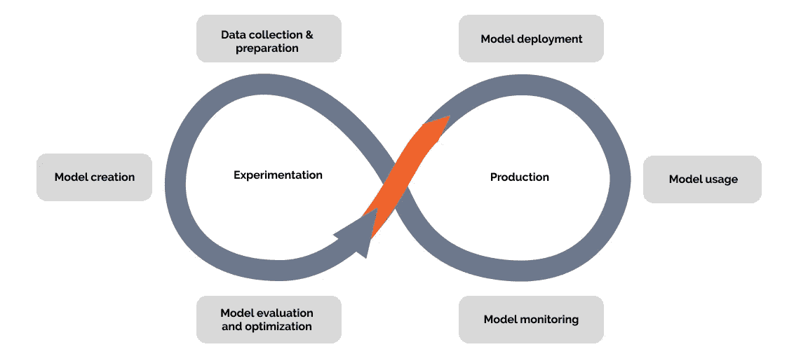
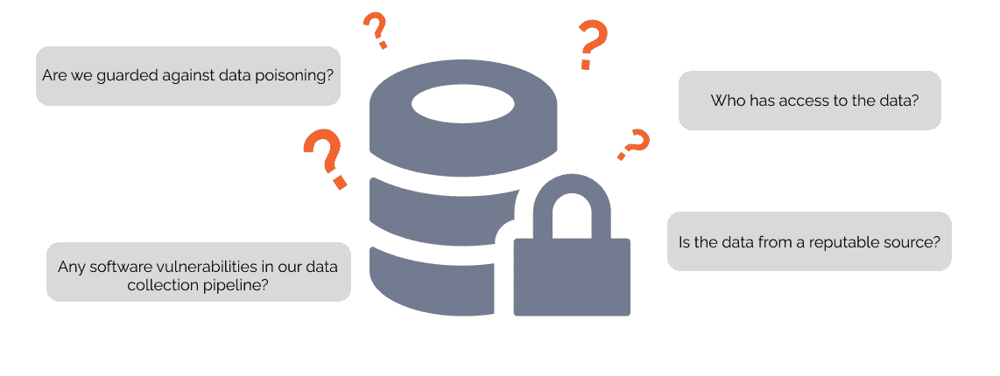
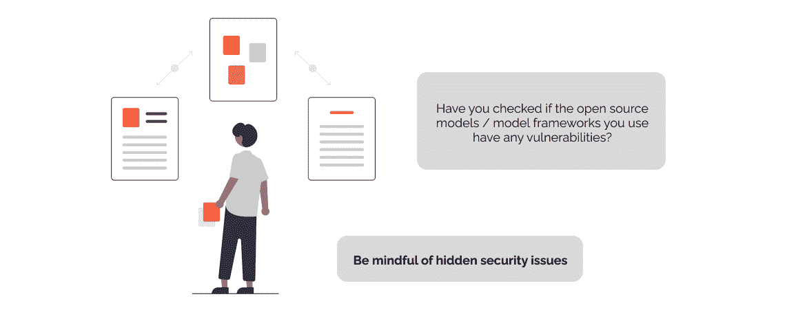
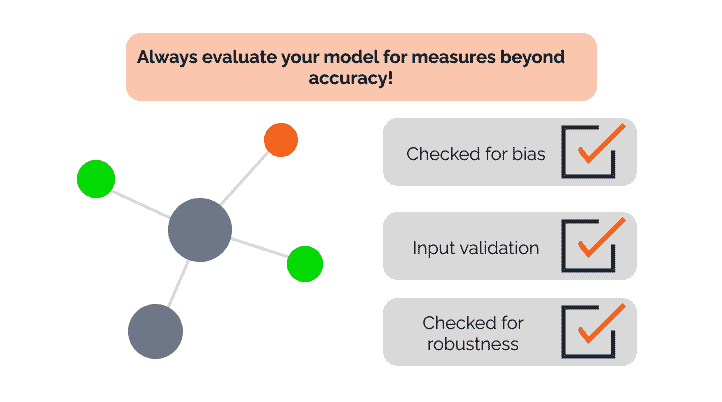
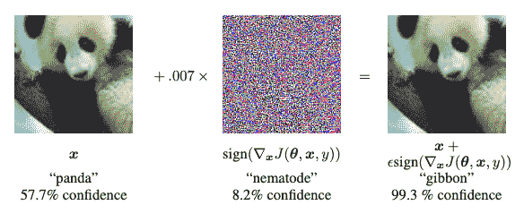
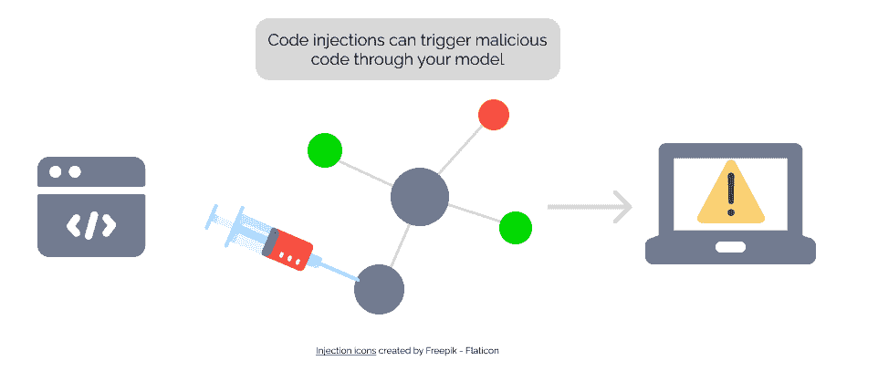
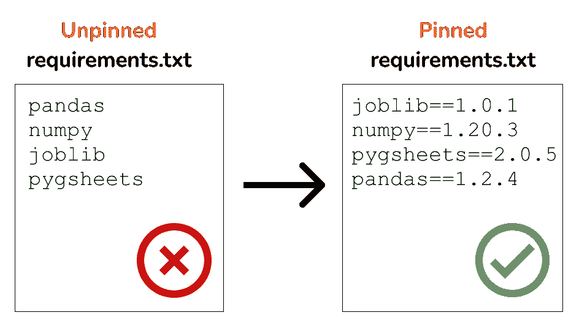
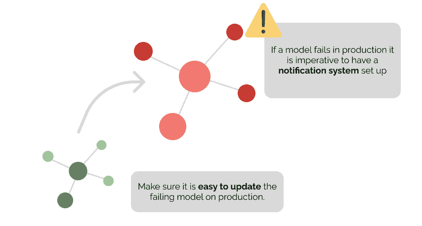

# 随着 MLOps 走向成熟，是时候考虑网络安全了

> 原文：<https://towardsdatascience.com/as-mlops-hits-maturity-its-time-to-consider-cybersecurity-ebd45e350532>

照片由[弗兰克](https://unsplash.com/es/@franckinjapan?utm_source=medium&utm_medium=referral)在 [Unsplash](https://unsplash.com?utm_source=medium&utm_medium=referral) 上拍摄

## 将你的 ML 项目推向生产？以下是需要注意的事项

*与詹姆斯·斯图尔特合作写自* [*TrojAI*](https://troj.ai/)

在过去的几年里，MLOps 领域有了很大的发展。支持 MLOps 生命周期的各种操作任务的新工具已经出现，并且更多的 ML 项目开始进入生产。随着运营方面的这些进步走向成熟，现在的重点转移到确保您的 MLOps 项目也安全可靠。这是任何技术的自然发展，并且需要创造更多的动力，因为模型信任是部署任务关键型系统的首要考虑。

在传统的软件开发领域，网络安全是一个经过充分研究和讨论的话题。然而，从 MLOps 的角度来看，这个话题在学术界之外似乎很少被讨论。我个人认为，网络安全在模型开发生命周期中更值得关注。在过去的几个月里，通过我在 UbiOps 的工作，以及它与荷兰国家网络安全中心的合作，我学到了很多关于网络安全的知识。在接下来的章节中，我将分享我所了解到的漏洞是如何引入 MLOps 的，以及可以做些什么来减轻它们。

为了确保我没有遗漏任何要点，我和詹姆斯·斯图尔特一起撰写了这篇文章。詹姆斯在 TrojAI 工作，这是一个面向 MLOps 的健壮和安全平台，所以他总是处于最新网络安全趋势的顶端！

# 目录

[为什么网络安全在 MLOps 中很重要？](#1f63)

[军事行动生命周期不同阶段的网络安全](#5cd6)

[数据收集和准备](#97b7)

[模型创建](#9d36)

[模型评估和优化](#a127)

—模型输入故障缓解

—偏差和系统性能

—鲁棒性故障缓解

[模型部署和模型使用](#8987)

—规避攻击

—模型盗窃

—隐私攻击

—代码注入

—损坏的包

[模式监控](#672a)

[结论](#454b)

[参考文献](#99e5)

# 为什么网络安全在 MLOps 中很重要？

每一项新功能都会带来新的漏洞。随着越来越多的项目投入生产，**对抗性机器学习** (ML 的恶意软件版本)已经开始快速增长。NCC group 最近的一项研究强调，组织越来越多地在应用程序中使用 ML 模型，而不考虑安全需求[1]。黑客似乎更乐于利用这种缺乏安全性的问题，这导致[特斯拉被骗入错误的车道](https://www.technologyreview.com/2019/04/01/65915/hackers-trick-teslas-autopilot-into-veering-towards-oncoming-traffic/)【2】[微软的聊天机器人在部署后仅几个小时就变得种族主义](https://spectrum.ieee.org/in-2016-microsofts-racist-chatbot-revealed-the-dangers-of-online-conversation)【3】[cy lance 的反病毒软件通过 ML 漏洞](https://techbeacon.com/security/when-machine-learning-hacked-4-lessons-cylance)【4】被击败，等等。事实上，现在有专门的资源跟踪对 ML 的攻击，包括 [MITRE ATLAS](https://atlas.mitre.org/studies/) 和 [AI 事件数据库](https://incidentdatabase.ai/)。

最近关于对抗性机器学习主题的研究提供了一些令人不安的见解:

*   使用敏感数据训练一个 ML 系统从根本上来说似乎是有风险的。用于训练系统的数据通常可以被攻击者用各种技术恢复[5，6，7]
*   神经网络可以很容易地被迫与对立的例子[8，9]错误分类。对策确实存在[10]，但是容易在系统中引入其他漏洞[11]。
*   通过训练模型并观察结果，有可能提取训练模型的高保真副本[12，13，14]

幸运的是，这些风险可以通过适当的安全措施来降低，尽管没有抵御所有可能的漏洞的灵丹妙药。如果您正在将 ML 模型转移到生产中，那么调查您的安全实践并检查哪种攻击对于您的用例或业务来说是最需要防范的无疑是值得的。

# MLOps 生命周期不同阶段的网络安全

如果您在 MLOps 工作，我假设您熟悉 MLOps(或数据科学)生命周期。我们将使用这个生命周期向您介绍最佳实践，这些实践有助于减少每个步骤中可能出现的各种漏洞。

作者图片

# 数据收集和准备

除了在传统模型开发过程中收集、清理、处理和存储数据时通常遵循的常规做法之外，还有几个关于安全性的额外注意事项应放在首位，以避免出现漏洞，例如:

*   数据中毒(外部/内部/后门)
*   保护敏感信息时的注释问题
*   确保正确维护数据处理软件堆栈

人们普遍认为数据和注释必须是高质量的，模型才能成功，但是我们还需要确保这些数据是可信的。

作者图片

有几个问题需要考虑，以确保数据和注释的安全性，并减少供应链漏洞。例如，我们应该考虑数据是如何收集的，以及它是来自内部还是外部来源。如果是外部，来源是否可信？不管声誉如何，是否有适当的机制来确保来自这些来源的数据已经安全地**传输？**在内部，一旦获得数据，如何存储？如何管理对数据存储的访问**？**

对于可公开获取的数据，是否有任何使用许可，是否满足许可要求？随着数据和团队的发展，注释管道有什么过程？新人是如何入职的，他们的工作质量如何在早期得到保证？

最后，有什么工具可以确保数据中没有恶意攻击，无论是自然发生的还是恶意的？

安全风险承担者在此阶段的角色:

*   提供和管理对数据、注释和其他元数据存储的适当访问控制。
*   确保外部数据收集和传输机制到位(例如校验和、来源信誉、许可证)。
*   识别任何自动数据收集管道的潜在软件漏洞。

# 模型创建

许多机器学习模型架构的基础已经存在，大多数公司将使用现有的预训练模型或数据挖掘算法作为起点，并针对其应用/用例进行微调，而不是重新发明轮子。模型创建期间的最佳实践应包括仅使用作者或学术文献来源机构拥有的算法和模型的官方 GitHub 存储库，或由所述组织验证的白名单存储库。

在此阶段，预计关于某些模型的用途和候选资格的足够信息已经固化，但重新审视安全方面和先前所做的任何设计决策的含义是很重要的。在选择候选模型作为解决方案之前，从安全角度严格评估潜在的解决方案是至关重要的。这是一个迭代过程，可能会发现需要重新评估设计阶段所做的一些假设的信息。

作者图片

安全风险承担者在此阶段的角色:

*   使用外部公开的预训练模型识别潜在漏洞。
*   对于任何外部模型，只使用白名单中的官方公共存储库。
*   支持正式测试，定义模型使用的风险分值，并强制执行可接受的风险级别。
*   通过强调对模型和数据完整性、可解释性和稳健性的洞察，确定工具和审计流程，以降低使用候选模型的风险。

# 模型评估和优化

大多数机器学习模型的黑盒性质强调了在这个阶段对鲁棒性和可解释性的需求，以帮助减少使用模型的风险和潜在漏洞。这个阶段的目标应该是在模型被部署到产品之前，给涉众模型风险管理所需的可见性。

传统的模型开发依赖于性能指标，如总准确度、精确度、召回率和 F1 分数，作为评估要部署的模型的候选性的手段。不幸的是，这些不能提供模型保证、稳健性或风险管理的全貌，例如:

*   准确性度量没有以足够的粒度捕获模型行为。
*   该过程假设模型总是以某种可预测的方式被查询。
*   这些指标不能提供对潜在系统级安全漏洞的必要洞察。
*   一般来说，它们不能捕获极限情况，也不能控制生产中预期会出现的噪音或敌对数据(自然发生的和恶意的)。

安全团队应该与质量保证团队合作，对模型运行一系列测试，以便为模型的健壮性和其他洞察力提供某种程度的保证。这些见解应该为与可能部署到生产环境中的任何候选模型相关的风险描述提供信息。

## 模型输入故障缓解

测试应该检查模型输入失败，因为标准 ML 包不提供在返回结果之前检查数据是否有效的现成功能。这可能导致模型产生错误输出的无声故障。此类测试可能包括:

*   确定数值是否在可接受的范围内。
*   确保模型对于数据类型转换是不变的。
*   检测输入中是否缺少特征。
*   识别模型中的可行输入，并干扰它们的行为效应。

作者图片

## 偏差和系统性能

创建测试来检查系统性能的技术验证，尤其是随着时间的推移或在不同环境中的偏差。这可以识别潜在的有害问题，如偏差，并为必要的缓解策略提供见解，从而提高模型的可信度。这些测试可能包括:

*   识别和量化绩效偏差，如对受保护特征(如种族或性别)或其他相关替代特征的歧视。
*   检测隐藏的长期效应，如分布随时间的漂移。
*   探索数据子集之间意外差异的可能性。

## 鲁棒性故障缓解

创建鲁棒性故障测试。这些类型的失败不仅仅在敌对的环境中是有问题的；更广泛地说，它们表明你的模型可能不能很好地概括新的或看不见的数据。有各种模型合规性、评估和稳健性工具可用于在该领域提供一些基础，但是组织可能需要建立具有适当主题和领域专业知识的能力，以支持一些更复杂的开放式测试。

主动的模型评估和评价对于防止未来产生更大的成本至关重要。此时，确保跟踪已识别问题或其他风险的机制到位并记录在案。

安全风险承担者在此阶段的角色:

*   倡导并领导一个跨职能委员会评估任务和模型特定的测试，以了解模型评估和健壮性。
*   支持这些指标的 QA 评估，并提供关于结果如何通知模型推理安全性的见解。
*   对自动评估部署和 MLOps 管道应用一定级别的应用安全。
*   为候选生产模型的推理管道的审计跟踪定义流程。

# 模型部署和模型使用

模型部署是将模型引入生产环境的第一步。这通常需要访问更多的数据，访问新的数据，有时还需要访问组织外部的人。例如，当你在你的 web 应用程序后面放置一个推荐系统时，就是后一种情况。这些变化意味着模型的攻击面突然增大。训练数据集的质量是可以控制的，但来自外部用户的数据就很难清理了。这为以下方面打开了大门:

*   **闪避攻击**
*   **模特失窃**
*   **隐私攻击**
*   **代码注入**
*   **损坏的软件包**

仅举几个例子。然后，我们甚至没有提到大多数 ML 应用程序作为一个整体可能遭受的一般问题，如传统的基础设施问题，web 应用程序错误和 DDoS 攻击。

## 规避攻击(也称为“对抗性例子”)

在这些攻击中，模型被灌输了一个所谓的“对抗性例子”。一个对立的例子看起来像正常的人眼输入，但可以完全摆脱模型。

该图描述了针对规避攻击的快速对抗性示例生成。增加的噪音使得分类器将熊猫视为长臂猿。图片由 Goodfellow 等人提供[8]

视频从隐形 t 恤在 DEFCON。一个对抗性的例子被用来摆脱智能相机中的对象检测模型，使得个体不被模型检测到。来自 AdvBox 的视频[15]

逃避攻击是一种非常广泛的攻击，因此很难讨论具体的缓解措施。我们建议您考虑以下几点:

*   某些**训练技术**可以使模型在对抗对立的例子时更加健壮。
*   如果你的模型对互联网开放，考虑添加**认证**以使在线攻击可追踪

## 模型盗窃

黑客可以通过向 API 发出足够多的请求来“窃取”API 背后经过训练的模型。各种出版物已经强调了这是如何令人惊讶地容易实现的[12，13，14]。

幸运的是，通常需要大量的请求才能逆向工程或窃取训练好的模型。这可以通过实施**速率限制**来阻止，限制用户一次可以发出的请求数量。要考虑的其他事情是确保存储您的训练模型的文件系统是安全的，并且**考虑为模型的异常大量使用配置警报**。

## 隐私攻击

用于训练系统的数据通常可以被攻击者通过各种技术恢复，如成员推断、模型反演和训练数据提取[5，6，7]。因此，在准备您的培训数据时，必须尝试删除尽可能多的敏感数据。当然，对于一个足够好的模型需要多少数据，以及为了降低隐私风险还可以删除多少数据，这里有一个平衡。

**差分隐私**可以证明有助于减轻隐私攻击，但通常是以难以实施为代价的[16]。你也可以考虑**改变你的模型训练方法**到那些已知更能抵抗隐私攻击的方法。请务必仔细检查这些方法是否真的仍然具有耐药性，因为新的论文将会使一些已建立的方法失效。

我们知道我们已经提到了**速率限制和认证**，但这也有助于防止隐私攻击！大多数攻击都始于模型的异常流量。

## 代码注入

图片由作者提供，注射图标由 free pik-flat icon 创建

精心制作的模型输入可能会触发外部(恶意)代码。这是一般软件应用程序也面临的问题，通常通过输入净化来缓解。然而，在机器学习中，有一种额外的代码注入情况需要特别注意:**被破坏的模型产物**。

现在互联网上有很多模型库，有预先训练好的模型，人们可以下载使用。这对于与否则无法使用人工智能的公司共享人工智能能力来说非常棒。另一方面，它为黑客创造了一个很大的机会来发布被破坏的模型，这些模型可以在最终用户的系统中注入代码。在 NCC group 的白皮书中，他们展示了通过利用 sci kit-Learn pickle、python pickle 文件、PyTorch PT 格式等创建的模型工件中混入恶意代码是多么容易[1]。

为了减少这种风险，下载的模型应该像其他下载的代码一样对待；**检查供应链，如有可能，扫描模型中的恶意软件。**

## 损坏的包

对于损坏的包，我们指的是包含损坏代码并可能在使用时触发有害行为的包和依赖项。机器学习代码通常使用几个 python 包，这些包可能会像任何其他软件一样被破坏。就在几个月前，多个 Python 库被发现泄露 AWS 凭证，例如[17]。

这方面的缓解策略与前面提到的代码注入基本相同。此外，**留意监控腐败包**的新闻媒体也是一个好主意，比如黑客网站。在荷兰，国家网络安全中心和“[荷兰网络安全中心](https://www.cyberveilignederland.nl/)”也有关于此类安全风险的[时事通讯](https://magazines.ncsc.nl/ncscmagazine)，这有助于保持对其的掌控。你们国家的网络安全组织可能也有一个。

最后:在部署之前，一定要确保**锁定依赖项！这样你只需要检查你正在使用的确切版本，任何被劫持的新版本都不会影响到你。当锁定版本时，关注更新是很重要的，尤其是如果有已知安全问题的补丁。**

作者图片

# 模型监控

随着机器学习的不可预测性而来的是这样一个事实，即模型一旦进入预测，就可能意外失败。这与你是多么优秀的数据科学家或 ML 工程师无关，这只是过程的一部分。失败可能是由很多原因造成的，比如太多的数据分布漂移、无法预测的不可预见的边缘情况，或者前面几节提到的任何安全问题。

作者图片

这里最重要的事情是，当失败的模型出现时，您有一个适当的过程来处理它们。这意味着既能够**快速检测出故障模型**，又能够**快速修补或拆除它们**。不同的组织应该有不同的看法，但是我可以给你一些我们在 UbiOps 内部使用的建议:

*   当一个模型失败时，应该可以得到一个通知
*   部署新版本应该很快。如果您的部署过程是膨胀的，那么在问题被识别之后修补模型将是困难的。
*   保持对所有模型在生产中的表现的概述应该是容易的。监控数据流量、CPU 使用率(峰值可能意味着代码注入)和数据漂移。

# 结论

在模型开发生命周期的每一步，都可能引入新的漏洞。虽然 ML 系统面临的网络安全威胁的数量正在快速增长，但可能的缓解策略的数量也在增加。防止黑客攻击您的 ML 系统将永远是一场猫捉老鼠的游戏，但这里有一些可以带回家的提示:

*   如果您通过 API 或 web 服务向互联网开放您的模型:考虑添加速率限制和认证。虽然这看起来微不足道，但这使得黑客执行我们提到的大多数攻击变得更加困难。
*   密切关注黑客和网络安全时事通讯，以便您能够掌握已知的威胁
*   仔细检查你从网上下载的软件包和预先训练好的模型。
*   仔细检查您想要使用的任何第三方工具的安全性！寻找像 ISO 认证和经常更新的东西

如果安全性对您的业务至关重要，并且您想知道您的 MLOps 实践是否足够安全，请不要犹豫，联系[詹姆斯·斯图尔特](https://medium.com/u/3979b888b2be?source=post_page-----ebd45e350532--------------------------------)或我本人！我们都喜欢谈论这个话题，也很乐意和你一起思考。

# 参考

[1] C. Anley，[对机器学习系统的实际攻击](https://research.nccgroup.com/2022/07/06/whitepaper-practical-attacks-on-machine-learning-systems/) (2022)，NCC 集团的白皮书

[2] K .郝，[黑客诱骗一辆特斯拉转向错误的车道](https://www.technologyreview.com/2019/04/01/65915/hackers-trick-teslas-autopilot-into-veering-towards-oncoming-traffic/) (2019)，《麻省理工技术评论》

[3] O. Schwartz，(2016)，[微软的种族主义聊天机器人揭示了在线交谈的危险](https://spectrum.ieee.org/in-2016-microsofts-racist-chatbot-revealed-the-dangers-of-online-conversation)，IEEE Spectrum。

[4]j . p . Mello Jr .(2022)[机器学习被黑的时候:Cylance](https://techbeacon.com/security/when-machine-learning-hacked-4-lessons-cylance) 的 4 个教训，TechBeacon。

[5] R. Shokri，M. Stronati 和 V. Shmatikov。[针对机器学习模型的成员推理攻击](https://ieeexplore.ieee.org/document/7958568) (2017)。在 IEEE 安全和隐私研讨会上。

[6] Yeom，s .，贾科姆利，I .，弗雷德里克松，m .等人，[机器学习中的隐私风险:分析与过度拟合的联系](https://arxiv.org/abs/1709.01604) (2018)，IEEE 第 31 届计算机安全基础研讨会(CSF)。电气电子工程师学会

[7] N .卡利尼、f .特拉默、e .华莱士、m .贾格尔斯基等。艾尔。，[从大型语言模型中提取训练数据](https://www.usenix.org/system/files/sec21-carlini-extracting.pdf) (2021)，第 30 届 USENIX 安全研讨会

[8] I. Goodfellow，J. Shlens，C. Szegedy，[解释和利用对抗性例子](https://arxiv.org/abs/1412.6572) (2014 年)，arXiv 预印本

[9] N. Narodytska，S. Kasiviswanathan，[对深度神经网络的简单黑盒对抗性攻击](https://openaccess.thecvf.com/content_cvpr_2017_workshops/w16/papers/Kasiviswanathan_Simple_Black-Box_Adversarial_CVPR_2017_paper.pdf) (2017)，CVPR 研讨会。第二卷。

[10] A. Madry，A. Makelov，L. Schmidt，et al. [迈向抗对抗性攻击的深度学习模型](https://arxiv.org/pdf/1706.06083.pdf%E4%B8%AD%E6%9C%89%E4%BD%93%E7%8E%B0%EF%BC%8C%E4%BB%A5%E5%90%8E%E8%AF%B4%E5%88%B0CW%E6%94%BB%E5%87%BB%E5%86%8D%E7%BB%86%E8%AF%B4%E3%80%82) (2017)，arXiv 预印本

[11] L. Song，R. Shokri，P. Mittal，[保护机器学习模型对抗对抗对抗实例的隐私风险](https://dl.acm.org/doi/abs/10.1145/3319535.3354211) (2019)，2019 年 ACM SIGSAC 计算机与通信安全会议论文集

[12]朱，程，周等，[赫尔墨斯攻击:窃取无损推理精度的模型](https://www.usenix.org/conference/usenixsecurity21/presentation/zhu) (2020)，在第 30 届安全研讨会上(安全 21)

[13] Y. Zhang，R. Jia，H. Pei 等，[秘密揭示者:针对深度神经网络的生成模型反演攻击](http://openaccess.thecvf.com/content_CVPR_2020/html/Zhang_The_Secret_Revealer_Generative_Model-Inversion_Attacks_Against_Deep_Neural_Networks_CVPR_2020_paper.html) (2020)，IEEE/CVF 计算机视觉与模式识别会议论文集

[14] F. Tramer，F. Zhang，A. Juels，M. K. Reiter 和 T. Ristenpart，[通过预测 API](https://www.usenix.org/conference/usenixsecurity16/technical-sessions/presentation/tramer)窃取机器学习模型(2016)，在 USENIX 安全研讨会上

[15] D. Goodman，X. Hao，Y. Wang 等人， [Advbox:生成欺骗神经网络的对抗示例的工具箱](https://github.com/advboxes/AdvBox) (2020)，arXiv

[16] S. Truex，L. Liu，M. Gursoy 等人，[差分隐私和数据偏斜对成员推理脆弱性的影响](https://ieeexplore.ieee.org/abstract/document/9014384) (2019)。2019 年首届 IEEE 智能系统和应用中的信任、隐私和安全国际会议

[17] R. Lakshmanan，[多个后门 Python 库被抓窃取 AWS 机密和密钥](https://thehackernews.com/2022/06/multiple-backdoored-python-libraries.html) (2022)，《黑客新闻》