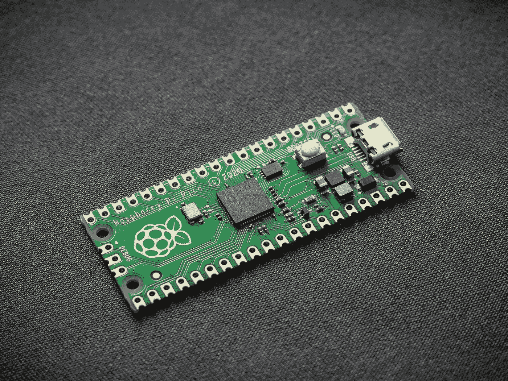

# 汇编、编译器和 x86 指令集

> 原文：<https://towardsdatascience.com/assembly-compilers-and-the-x86-instruction-set-9a945c72d136>

## 介绍汇编语言及其在 x86 微处理器系列中的使用



Vishnu Mohanan 在 [Unsplash](https://unsplash.com?utm_source=medium&utm_medium=referral) 上的照片

在我的[上一篇](/back-to-bit-sics-bits-pointers-and-memory-8c0eb125a0b7)文章中，我讨论了我目前是如何通过斯坦福大学的 [**计算机组织与系统(CS107)**](https://web.stanford.edu/class/archive/cs/cs107/cs107.1222/) **。本课程旨在揭开硬件和软件之间交互的神秘面纱，让你更好地欣赏和理解你的代码实际上在做什么。在本文中，我们将解释课程后半部分的一些概念，我认为每个数据科学家都应该了解这些概念！**

# 机器码和编译器

作为数据科学家，我们普遍使用 Python、R 或者 Julia，但是大多数是用 Python。Python 语言被普遍认为是一种解释型语言**。这意味着当你运行你的脚本时，它被转换成**字节码**，然后由虚拟机**上的 **Python 解释器执行。这意味着只要你安装了 Python 解释器，你就可以在任何计算机上使用 Python。最常见的解释器是 **CPython** 。**

而其他语言如 **C、C++和 FORTRAN** 则被称为**编译语言**。要运行你的脚本，你必须使用**编译器编译程序，该编译器将你的“高级”可理解的人类代码翻译成机器代码**。编译器的需要使得计算机只能读取二进制指令。**中央处理器(CPU)** 不理解命令***printf(" Hello World ")***但却理解类似 **10111010101011 等。因此，要执行你的代码，它需要被翻译成机器语言，一堆 0 和 1，因为那是它唯一能理解的语言。**

为什么我们不用机器语言来写呢？

这个问题半频繁地被问到，答案是这个问题太难了。想象一下试图编写一串 0 和 1 的代码，或者更糟的是，读取别人的 0 和 1 的字符串。因此，我们用人类可以理解的**‘高级’**语言编写，并编译(翻译)成机器代码。

# 装配

目前，世界上大约有 700 种编程语言。这确实包括那些有着非常特殊用途的晦涩难懂的语言，但其数量仍然令人印象深刻。这些语言从计算机物理硬件的实际运行中抽象出**。例如，C 被认为比 Python 更**【低级】**，主要是因为它的手动**内存管理**规范。然而，也许人类最容易理解的语言是汇编语言。**

****汇编语言**可以被认为是从机器码中删除了一次，它用**助记符**代替了二进制数，使其更具可读性。汇编代码仍然只是字节，**没有数据类型，没有类型检查**但是一些二进制指令是字/符号。它是机器代码的精确缩写。**

**助记符的例子包括:**

*   ****MOV**——将字节(数据)从内存的一个区域移到另一个区域**
*   ****加法**——将内存中的值加在一起**
*   ****CMP** -比较内存中的两个值**

**这些命令中有很多是由叫做**寄存器的东西执行的。**寄存器是 CPU 中保存变量值的**快速读/写内存槽**。**

**汇编与机器码有一一对应的关系，可以用**汇编器**转换成机器语言。汇编器是继编译器和解释器之后的第三种翻译器，只为汇编语言工作。有趣的是，编译器如 **GCC** 首先编译成汇编，然后再编译成机器码。**

**汇编和机器码是迄今为止最快的语言，因为它们是计算机的语言。然而，由于计算机的配置不同，汇编和机器语言**在计算机**之间有所不同，因为它们**绑定到特定的 CPU** 。然而，像 Python 和 C 这样的语言是 T42 可移植的，可以在任何机器上运行，但结果是牺牲了速度。**

# **x86 指令集**

**众所周知，计算机以二进制工作，例如，这些 0 和 1 的特定组合告诉计算机进行加减运算。让计算机做事情的所有众多二进制组合的总集合被称为**指令集**。使用最广泛的指令集是**英特尔的 x86 家族**。这套系统源自于 1978 年的**英特尔 8086 微处理器，然而经过几十年的发展，它已经**扩展和发展**以适应**更高的位架构**和**更强大的微处理器**。为了简单起见，英特尔没有对基于 1978 年的原始处理器的后续处理器进行重命名，而是将整个家族称为 x86。****

**相似指令集的使用使得**更容易维护**和**随着计算机的进步和不同制造商之间的兼容性**。比如我的 2014 款 Macbook Air 用的是**x86–64**指令集。如果您的设备是基于 unix 的，您可以通过在终端/shell 中运行以下命令来检查计算机的指令集:**

```
uname -m
```

**[2021 年最后一个季度，60.5%的 x86 计算机处理器来自英特尔处理器，39.3%来自 AMD 处理器。](https://www.statista.com/statistics/735904/worldwide-x86-intel-amd-market-share/)因此，到目前为止，x86 系列指令集架构是市场上最具优势的产品。**

**在过去的一年里，苹果已经脱离了 x86 指令集，推出了新的 **M1 芯片。**这会见证 x86 的衰落吗？我们会看到…**

# **摘要**

**我希望你喜欢这篇关于编译器、汇编和指令集的文章。作为数据科学家，我们可能永远不会那么频繁地用汇编或 C 之类的低级语言编码。然而，这里涵盖的概念可以提高您对计算和数据科学的总体理解。**

# **和我联系！**

*   **要在媒体上阅读无限的故事，请务必在这里注册！ 💜**
*   **[T31*😀*](/subscribe/@egorhowell)**
*   **[*LinkedIn*](https://www.linkedin.com/in/egor-howell-092a721b3/)*👔***
*   ***[*推特*](https://twitter.com/EgorHowell) 🖊***
*   ***[*GitHub*](https://github.com/egorhowell) 🖥***
*   ***<https://www.kaggle.com/egorphysics>**🏅*****

> *****(所有表情符号都是由 [OpenMoji](https://openmoji.org/) 设计的——开源的表情符号和图标项目。许可证: [CC BY-SA 4.0](https://creativecommons.org/licenses/by-sa/4.0/#)*****