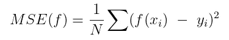
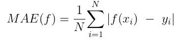
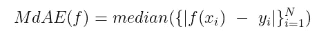
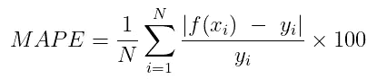
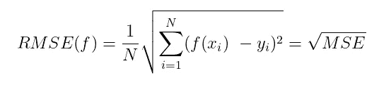

# 评估回归模型性能

> 原文：<https://towardsdatascience.com/assessing-model-performance-for-regression-7568db6b2da0>

# 评估回归模型性能

## *用于评估回归模型质量的一些方法概述*

本·穆林斯在 [Unsplash](https://unsplash.com/s/photos/test?utm_source=unsplash&utm_medium=referral&utm_content=creditCopyText) 上的照片

当我们创建由学习算法在训练期间没有看到的示例组成的维持集时，模型评估阶段开始。如果我们的模型在维持集**上表现良好，我们可以说我们的模型概括得很好**，并且质量很好。

评估一个模型好坏的最常见的方法是对维持数据计算一个**性能指标。**

本文将关注回归模型的性能指标。这是值得详细说明的，因为分类任务具有完全不同的可跟踪性能指标。

# 回归的性能指标

我们将涵盖均方误差(MSE)、平均绝对误差(MAE)、中值绝对误差(MdAE)、几乎正确预测误差率(ACPER)、平均绝对百分比误差(MAPE)和均方根误差(RMSE)。就我而言，这些是回归模型最有用的指标。

我们将从 MSE 开始，它相当容易理解。

## 均方误差

最常见的度量是**回归的成本函数:均方误差(MSE)** 。它被定义为

其中 *f* 是将特征向量 *x* 作为输入并输出预测的模型，范围从 1 到 N 的*I*表示来自数据集中的示例的索引。在 *N* 上预测值减去实际值的总和表示平均值。通过平方，我们去除了负号，并对较大的差异给予更大的权重。

回归模型试图通过绘制一条线**来拟合数据，该线使真实数据点与同一条线上的点**的距离最小化。数值越接近直线，模型在该点的表现越好。所以 MSE 越低越好。

**MSE 指标通常与平均基线模型**相比较，后者是一种基于平均值的回归模型。此模型总是预测训练数据标签的平均值。如果我们的回归模型 MSE 大于基线 MSE，那么我们的回归模型就有问题。

**MSE 受异常值**的影响，即数据值异常远离真实回归线。根据定义，如此远的点的平方误差将非常高。在这些情况下，最好应用 MdAE，它代表**中值绝对误差**(更多信息见下文)。

下面是如何用 Python 实现它

用 Python 实现 MSE

## 平均绝对误差

MAE 类似于 MSE，因为它采用残差的绝对值 *f(x) - y* 而没有平方因子。它不考虑误差的方向，这意味着我们不会知道负误差或正误差在总体均值中的权重更大。也就是说， **MAE 对异常值更稳健，因为它不平方遥远预测的误差值。**

下面是如何用 Python 实现它

用 Python 实现 MAE

## 中位数绝对误差

正如我们从统计学的基础知识中所知，中值不受异常值的影响，比如平均值是 T5。MdAE 表示预测与中值回归线的绝对距离。

这里 *{|f(x_i) — y_i|}* 表示对其执行模型评估的所有示例的绝对误差值的集合。

如果存在异常值且未进行处理，则使用 MdAE 代替 MSE 或 MAE，因为它可以更好地表示距离回归线不远的点的误差。

下面是如何用 Python 实现它

MdAE 在 Python 中的实现

## 几乎正确的预测误差率

ACPER 是预测值与真实值的百分比。这是关于设置一个你的价值观的任意范围。所有这些值都有助于计算 ACPER。

以下是计算 ACPER 的简单算法:

1.  定义一个你认为可接受的百分比误差阈值(比如 2%)
2.  对于目标值 *y* 的每个真值，期望的预测应该在 *y_i-0.02*y_i 和 y_i+0.02*y_i* 之间
3.  通过使用所有样本，计算符合上述规则的预测值的百分比。这将为我们的模型提供 ACPER。

下面是如何用 Python 实现它

用 Python 实现 ACPER

结果:【*假，假，真，假*】。我们可以简单地计算真值的个数，然后除以列表的长度。

## 平均绝对百分比误差(MAPE)

**平均绝对百分比误差** (MAPE)以百分比形式测量误差，可通过对 MAE 稍加修改并乘以 100 获得百分比分数来计算。**它是回归模型评估中最有用和最常用的指标之一。**

假设我们的模型的 MAPE 是 5% —这将表明预测值和观察值之间的平均差异是 5%。方便又可解读，对吧？

和 MAE 一样，它也存在异常值，所以一定要正确对待它们。

下面是如何用 Python 实现它

MAPE 在 Python 中的实现

## 均方根误差(RMSE)

均方根误差(RMSE)是一种绝对误差的度量，其中误差被平方以防止正值和负值相互抵消(就像 MSE 一样)。**表示残差的标准差。**换句话说，残差是预测点和观察点之间的距离。作为标准差，**，它表示残差在我们的回归线**周围如何分布。

我在这里借用并引用一位[的同行作家](/what-does-rmse-really-mean-806b65f2e48e)

> 这启发性地告诉我们，RMSE 可以被认为是预测值向量和观测值向量之间的某种(归一化)距离。

实现非常简单，因为它只是将 *np.sqrt* 应用于我们上面看到的 MSE 计算。

# 结论

请随意使用本文中的代码来实现您的性能指标。请记住，Scikit-Learn 有一个专用的 [API，它让我们的生活变得简单。用它！](https://scikit-learn.org/stable/modules/classes.html#module-sklearn.metrics)