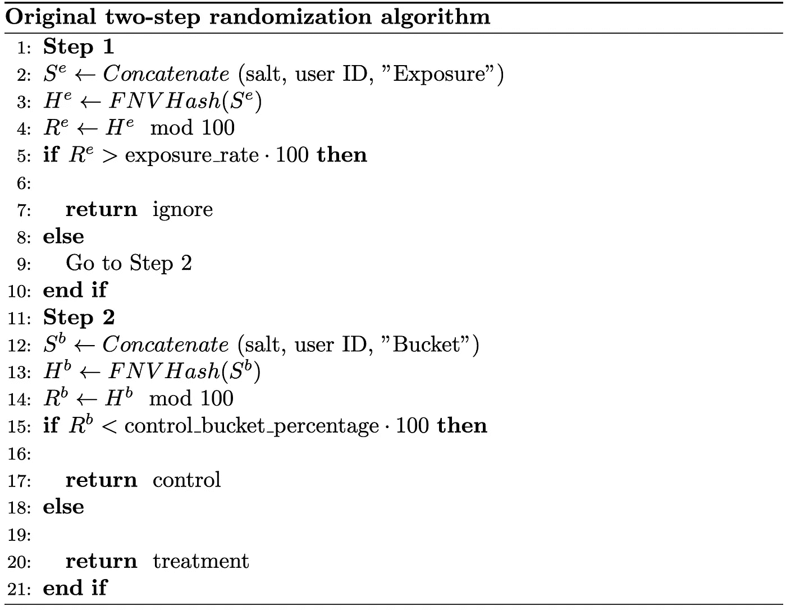
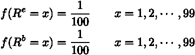
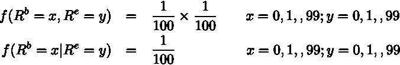
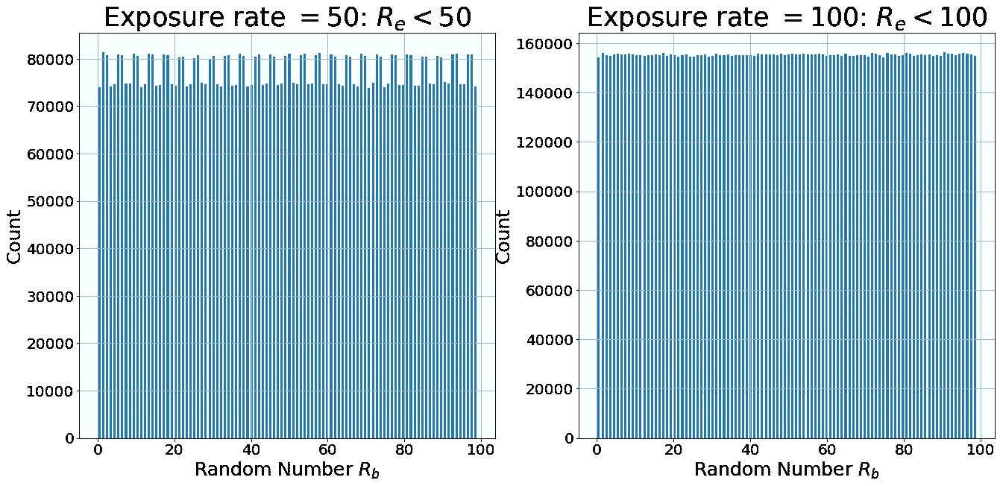
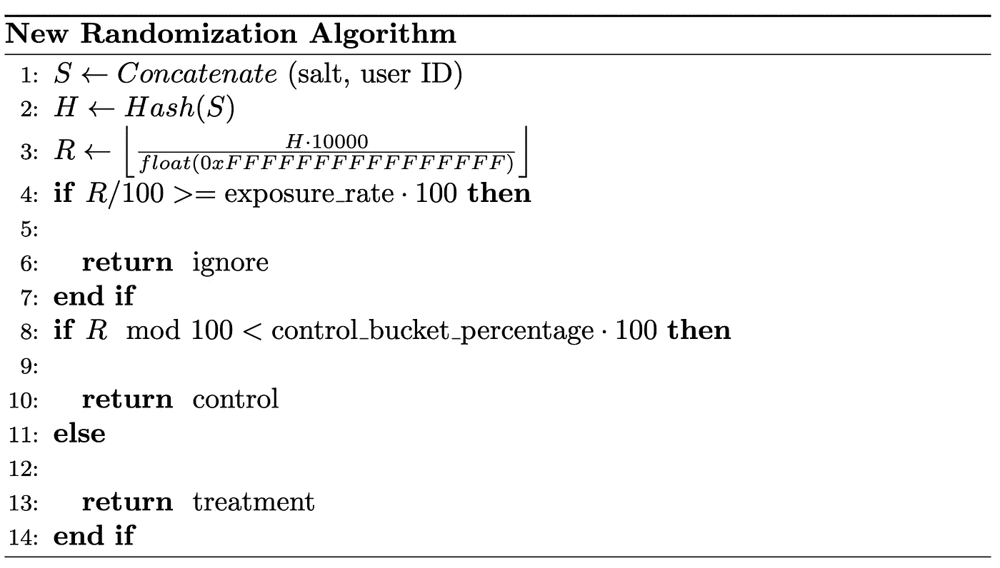
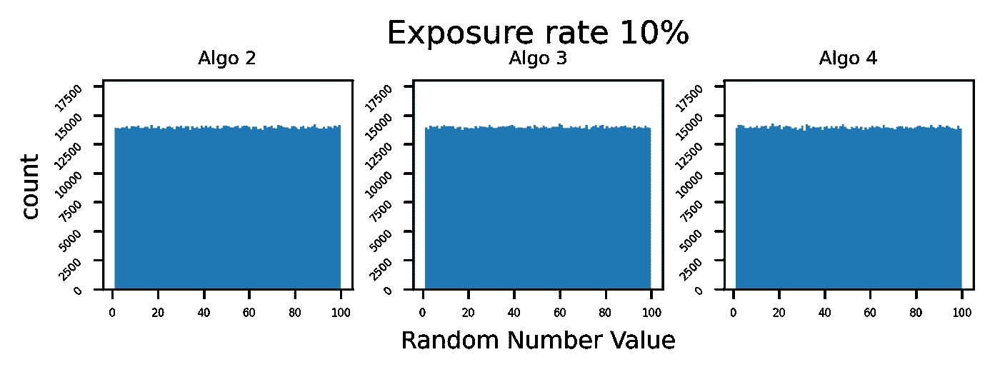
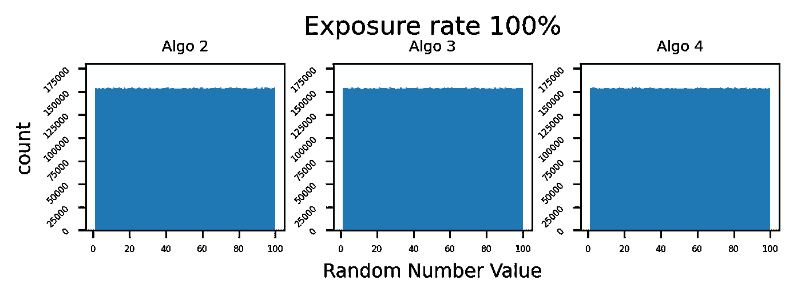
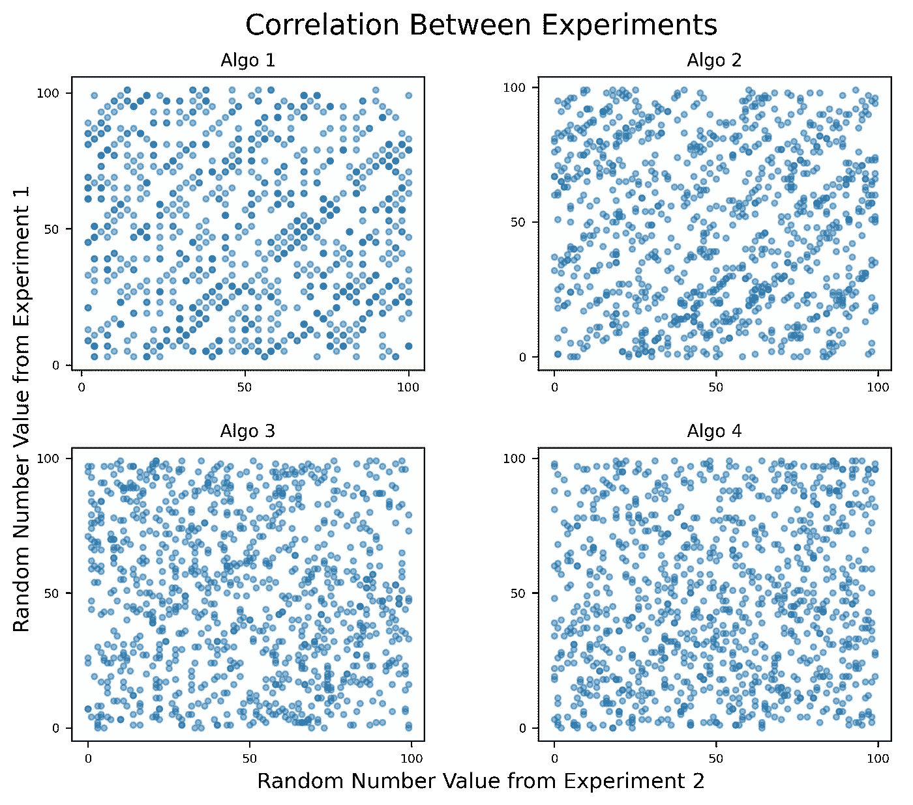

# 在 A/B 测试中按比例分配实验变量

> 原文：<https://towardsdatascience.com/assign-experiment-variants-at-scale-in-a-b-tests-e80fedb2779d>

## 我们如何改进 Wish 在线实验的随机分配算法

供稿人:[奇克(Max)李](https://medium.com/@qike_max_li)，[萨米尔·詹汉德](https://www.linkedin.com/in/samirjamkhande/)


照片由 [Edge2Edge 媒体](https://unsplash.com/@edge2edgemedia?utm_source=medium&utm_medium=referral)在 [Unsplash](https://unsplash.com?utm_source=medium&utm_medium=referral) 上拍摄

最近在 Wish，我们在一个 [A/A 测试](https://www.optimizely.com/optimization-glossary/aa-testing/)中发现了一个[采样比不匹配](https://www.microsoft.com/en-us/research/group/experimentation-platform-exp/articles/diagnosing-sample-ratio-mismatch-in-a-b-testing/) (SRM)。SRM 是指实验者设定的采样比与观察到的采样比不匹配。SRM 指出了改变实验结果的潜在数据质量问题[1]。微软分享了[一个例子](https://www.microsoft.com/en-us/research/group/experimentation-platform-exp/articles/diagnosing-sample-ratio-mismatch-in-a-b-testing/)，其中 A/B 测试结果在解析 SRM 后翻转。但是，SRM 怎么可能出现在 A/A 测试中呢？

经过数周的调查，我们找到了原因，根源在于我们的随机化算法。随机化算法将最终用户映射到实验变量，随机化被广泛视为建立因果关系的黄金标准。

很难想象像掷骰子这样简单的事情会在网上实验中出错。随着我们在 Wish 不断改进我们的实验平台，现在越来越多的人意识到细节决定成败。在这篇文章中，我们分享了我们如何识别随机化算法中的缺陷的经验，一个好的随机化算法的要求是什么，我们如何改进该算法，以及我们如何评估它。

我们最近在 [RE 上发表了这项研究。工作深度学习峰会](https://www.re-work.co/summits/deep-learning-summit-2022/speakers)。

# 随机化导致 SRM

SRM 的出现是因为我们的随机化不是完全随机的。在本节中，我们将介绍我们最初的两步算法是如何工作的，以及它是如何导致 SRM 的。

我们最初的算法有两个步骤。第一步是确定用户是否应该参与实验。比如我们设置曝光率为 10%的时候，10%的流量会被纳入实验。第二步为用户分配一个实验区(例如，控制区、治疗区)。具体来说，算法如下:

*   在步骤 1 中，我们首先使用[fowler–noll–VO](https://en.wikipedia.org/wiki/Fowler%E2%80%93Noll%E2%80%93Vo_hash_function)(fnv)散列函数将(实验 [salt](https://en.wikipedia.org/wiki/Salt_%28cryptography%29) ，用户 ID，‘exposure’)的串联字符串映射到散列值 Hᵉ。实验盐是一个特定于每个实验的 20 个字符的随机字符串，字符串“Exposure”是一个常量后缀。给定散列值的[均匀性属性](https://en.wikipedia.org/wiki/Hash_function#Uniformity)，散列值 Hᵉ遵循均匀分布。然后，我们将 Hᵉ修改 100，以获得范围从 0 到 99 的均匀随机整数 Rᵉ。如果 Rᵉ大于暴露率乘以 100，则该用户被排除在实验之外。
*   类似地，在第二步中，我们将一个串接的字符串(实验[盐](https://en.wikipedia.org/wiki/Salt_%28cryptography%29)，用户 ID，‘桶’)映射到另一个范围从 0 到 99 的均匀随机整数 Rᵇ。如果 Rᵇ在 0 到 49 之间，我们指定用户进行控制；如果 Rᵇ在 50 到 99 之间，我们指定用户进行治疗。



原始算法

对于每个用户，我们生成两个统一的随机数 Rᵉ和 Rᵇ，用于确定暴露和分配桶。



这两个串联的字符串有不同的后缀:第一步是“Exposure”，第二步是“Bucket”。因此，Rᵉ和 Rᵇ这两个随机数应该是**独立的**。此外，这种独立保证了 Rᵇ对任何给定 Rᵉ的统一分配，即:



不幸的是，事实证明 Rᵇ|Rᵉ并不统一。换句话说，这个两步算法在 Rᵉ和 Rᵇ.之间创建了一个**依赖关系**例如，对于 Rᵉ <为 10 的用户(即曝光率= 10%)，图 1 中**的左面显示了 Rᵇ|Rᵉ < 50 的分布。这种依赖性与 FNV 散列函数和 mod 操作有关。在评估部分，我们演示了当我们更改哈希函数并删除 mod 操作时，依赖性消失。导致依赖性的潜在机制超出了本研究的范围。**



**图一。**Rᵇ|rᵉ的分布< 50(左)和 rᵇ的边缘分布

显然，Rᵇ|Rᵉ <50 (left panel in **图 1** 并不是均匀的，而是有一个周期性的模式。假设我们将 1%的流量分配给控制，如果他/她的 Rᵉ < 50 和 Rᵇ =1，我们会将“控制”分配给用户，这对应于图 1 中**左侧面板的最左边的条。由于最左边的条明显更短(Rᵇ =1 的用户更少)，分配给控制的实际流量将小于 1%。此外，我们检查了 Rᵇ|Rᵉ在其他暴露率下的分布，这些分布是不均匀的(数据未显示)。**

Rᵇ|Rᵉ的分布<100(exposure rate 100%) is uniform (the right panel in **图一**。当曝光率为 100%时，我们基于 Rᵇ为用户分配一个实验桶，而不考虑用户的 Rᵉ值。即当曝光率为 100%时，Rᵇ|Rᵉ < 100 的分布与 Rᵇ.的[边际分布](https://en.wikipedia.org/wiki/Marginal_distribution)相同同样，Rᵉ的边际分布也是均匀的(数据未显示)。

总之，Rᵇ和 Rᵉ的边际分布都是均匀的，但当暴露率小于 100%时，Rᵇ|Rᵉ<exposure_rate></exposure_rate>

# 什么是好的随机化算法？

随机化算法对于确保有效的实验结果至关重要。随机样本是 A/B 检验中统计检验的一个基本假设。随机化平衡了实验桶之间观察到的和未观察到的用户特征，因此，在实验下的产品特征和实验结果中的任何结果差异之间建立了因果关系。微软[2]推荐了决定一个好的随机化算法的四个要求:

> 1.用户必须同样有可能看到实验的每个变体(假设 50-50 的比例)。不应该偏向任何特定的变体。
> 
> 2.单个用户的重复分配必须一致；用户在每次连续访问该网站时，应被分配到相同的变体。
> 
> 3.当多个实验同时运行时，实验之间必须没有相关性。一个用户在一个实验中被分配到一个变体，必须对在任何其他实验中被分配到一个变体的概率没有影响。
> 
> 4.该算法应该支持单调上升，这意味着可以缓慢增加接受治疗的用户的百分比，而不改变之前已经被分配到该治疗的用户的分配。

除了微软推荐的四个要求之外，快速的计算速度也是必不可少的，因为我们不缓存赋值，这是内存密集型的。微软在其论文[2]的第 4.1.1 节讨论了缓存赋值的缺点。

# 我们重新设计了算法来满足要求

考虑到这些要求，我们设计了新的算法。具体来说，我们遵循以下步骤:

1.  连接 salt 和用户 ID。
2.  应用散列函数将串接的字符串 S 映射到散列值 H。注意，由于散列值的[一致性属性](https://en.wikipedia.org/wiki/Hash_function#Uniformity)，H 遵循均匀分布。
3.  假设哈希函数为 64 位，则 H 除以 float(0xFFFFFFFFFFFFFFFF)并乘以 10，000，得到范围为 0 到 9，999 的统一随机数整数 R。
4.  将 R 除以 100。如果 R/100 >= exposure_rate(例如 10%)乘以 100，我们将忽略该用户，并且该用户将被排除在该实验的任何计算中。
5.  r 模 100。假设有两个实验桶:控制，处理。如果提醒是 R (R/100 ≥ exposure_rate ⋅ 100)的前两位< control bucket percentage (e.g. 50%) time 100, assign control. Otherwise, assign treatment.



The New Algorithm

In essence, we map the concatenated string of experiment salt and user ID (can also be cookie ID, session ID, etc.) to a uniform random integer R ranging from 0 to 9,999\. Then we group these 10,000 integers into 100 subsets according to the **。曝光率每增加 1%，我们就在实验中增加一个用户子集。在实验中包括的每个子集内(即分配不是“忽略”)，我们根据 r 的最后两位数**(r mod 100<control _ bucket _ percentage⋅100)将用户划分为控制或处理。

在该算法中，我们生成一个随机数 R。R 的前两位用于确定曝光，后两位用于分配存储桶。R 的前两位和后两位是独立的。换句话说，知道 R 的前两位数并不能提供关于 R 的后两位数的线索。尽管确定暴露和分配桶在设计上是独立的，但我们仍然需要一个好的哈希函数来确保实验之间桶分配的相关性。

有数百个散列函数，并且不是每个散列函数都保证期望的随机化特性[2]，[3]。在下一节中，我们将比较以下四种算法

*   **Algo 1** :独创的两步算法。
*   **Algo 2** :带 FNV 哈希函数的新算法。
*   **Algo 3** :带 [MD5](https://en.wikipedia.org/wiki/MD5) 哈希函数的新算法。
*   **Algo 4** :带有 [SpookyHash](https://en.wikipedia.org/wiki/Jenkins_hash_function#SpookyHash) 功能的新算法。

# 算法评估

我们根据一个好的随机化算法的四个要求评估了这四个算法，并测试了它们的速度。简而言之，用 SpookyHash 函数实现的新算法满足四个要求，并且比我们原来的随机化算法快大约四倍。

所有四种算法都满足第二和第四个要求。它们都满足第二个要求(一致性赋值)，因为所有的计算都是确定性的，包括散列函数。此外，通过设计，所有四种算法都满足第四个要求。

# 均匀性测试

第一个要求需要随机数的均匀分布(例如，我们最初的两步算法中的 rᵇ；新算法中的 R mod 100)用于桶分配。给定任何暴露率，用于分配存储桶的随机数应均匀分布。在均匀分布的情况下，用户看到实验的任何变化的机会与桶比率成比例。我们通过可视化随机数的分布和[卡方检验](https://en.wikipedia.org/wiki/Chi-squared_test)来评估均匀性，并假设随机数遵循均匀分布。

**图 2** 展示了算法 2、3、4 在 10%和 100%暴露率下的均匀分布。在**图 1** 中，我们展示了曝光率为 10%时原始两步算法(Algo 1)的非均匀分布(左图)和曝光率为 100%时的均匀分布(右图)。



**图二。**算法 2、3 和 4 在暴露率为 10%和 100%时产生均匀分布

卡方测试的结果与可视化结果一致，只有曝光率为 10%的 Algo 1 未通过均匀性测试。当卡方的 p 值低于 5%时，我们拒绝分布均匀的零假设。Algo 1 在 100%以外的其他曝光率下未通过均匀性测试(数据未显示)。

**表 1** 四种算法的一致性测试

# 独立性检验

为了验证第三个要求，实验之间的独立性，我们将用于桶分配的随机数可视化(例如，两步算法中的 rᵇ；R mod 100)并应用[卡方检验](https://en.wikipedia.org/wiki/Chi-squared_test)来检验桶分配在实验之间独立的零假设。

**图 3** 绘制了从两个不同实验中随机选择的相同 1000 个用户的随机数。算法 1 和算法 2 都呈现出清晰的模式，这表明了来自两个实验的实验桶分配之间的相关性。2016 年，雅虎[4]也报道了关于 FNV 引入相关性的相同问题。他们报告说，FNV 产生均匀分布，但没有通过独立性测试，这与我们的发现一致。



**图三。**用于分配两个实验的实验桶的随机数

我们进一步应用卡方检验来检验假设 50%的用户处于控制状态而 50%的用户处于治疗状态的两个实验之间没有相关性的零假设。与图 3 所示相同，只有算法 3 和 4 通过了独立性测试。当我们在各种场景(例如，不同的曝光率，不同的实验桶比率)中测试四种算法时，我们得到了相似的结果

**表 2** 四种算法的独立性测试

虽然 Algo 2(具有 FNV 散列函数的新算法)通过了一致性测试，但是 Algo 2 引入了实验之间的相关性。如果用户在实验 2 中处于控制桶中，则实验之间的相关性使得她比预期更有可能被分配到实验 1 中的控制桶，反之亦然。

# 计算速度

wish 的实验服务每秒有数十万次查询(QPS)，QPS 在一家超高速增长的公司中快速增长。因此，实验桶评估延迟至关重要。高 QPS 是为每个用户评估大量并发实验的结果。实验桶评估引入的延迟会增加整体用户请求-响应延迟，并会对用户体验产生负面影响。在我们的延迟测试中，我们发现 Algo 3 比 Algo 4 慢大约 50%。所以我们最终在生产中实现了算法 4

# 生产测试部署

我们在生产中使用新的随机化算法执行了 A/A 测试，并测试了 SRM、实验的相互依赖性等。从延迟角度来看，我们发现新的随机化比原始随机化快大约 4 倍。A/A 测试的结果也表明新的随机化满足上面讨论的良好随机化的四个要求。

部署分阶段进行。我们只在新的实验中引入了新的随机化算法。现有的实验运行旧的随机化算法，直到它们的结束日期。使用这种方法，我们不需要重置正在运行的实验。

# 结论

虽然受控实验已经得到了很好的研究，但在大规模应用在线受控实验(也称为 A/B 测试)时，存在独特的挑战。看似简单的随机化可能很难正确。然而，良好的随机化对于建立因果结论是至关重要的。我们改进的随机化算法不仅满足统计要求，而且速度更快。

# 感谢

感谢齐超对这个项目的贡献。我们还要感谢 Pai Liu 和 Shawn Song 的支持，以及 Pavel Kochetkov、Lance Deng、Caroline Davey、Gus Silva、Iryna Shvydchenko 和 Delia Mitchell 的反馈。

Wish 的数据科学家热衷于构建一个值得信赖的实验平台。如果你对解决这一领域的挑战性问题感兴趣，我们正在为数据科学团队[招聘](https://smrtr.io/6VnPr)。

```
References 
1\. Fabijan, A., Gupchup, J., Gupta, S., Omhover, J., Qin, W., Vermeer, L., & Dmitriev, P. (2019, July). Diagnosing sample ratio mismatch in online controlled experiments: a taxonomy and rules of thumb for practitioners. In *Proceedings of the 25th ACM SIGKDD International Conference on Knowledge Discovery & Data Mining* (pp. 2156-2164).
2\. Kohavi, R., Henne, R. M., & Sommerfield, D. (2007, August). Practical guide to controlled experiments on the web: listen to your customers not to the hippo. In *Proceedings of the 13th ACM SIGKDD international conference on Knowledge discovery and data mining* (pp. 959-967).
3\. Xu, Y., Chen, N., Fernandez, A., Sinno, O., & Bhasin, A. (2015, August). From infrastructure to culture: A/B testing challenges in large scale social networks. In *Proceedings of the 21th ACM SIGKDD International Conference on Knowledge Discovery and Data Mining* (pp. 2227-2236).
4\. Zhao, Z., Chen, M., Matheson, D., & Stone, M. (2016, October). Online experimentation diagnosis and troubleshooting beyond aa validation. In *2016 IEEE International Conference on Data Science and Advanced Analytics (DSAA)* (pp. 498-507). IEEE.
```