# 关联规则与 Apriori 算法

> 原文：<https://towardsdatascience.com/association-rules-with-apriori-algorithm-574593e35223>

## 了解如何查找频繁项集并计算置信度和支持度

照片由[西格蒙德](https://unsplash.com/@sigmund?utm_source=medium&utm_medium=referral)在 [Unsplash](https://unsplash.com?utm_source=medium&utm_medium=referral) 上拍摄

Apriori 算法试图从[数据库](https://databasecamp.de/en/data/database)的交易中学习关联规则，即逻辑关系。目标是找到频繁出现的项目集，例如数据库中频繁出现的产品。

# 关联规则搜索的一个例子

在日常生活中，我们经常会遇到可以在捆绑中买到更便宜的产品组合。例如，在许多快餐店里，主菜与配菜和饮料一起打折出售。这背后的原理总是一样的:经常一起购买的产品，如果直接捆绑购买，价格会更低。这不仅在快餐店流行。它现在也可以在超市和时尚网上商店找到，因为它使顾客购物更容易，并为卖家带来更高的销售额。

照片由 [Unsplash](https://unsplash.com?utm_source=medium&utm_medium=referral) 上的 [CardMapr.nl](https://unsplash.com/@cardmapr?utm_source=medium&utm_medium=referral) 拍摄

为了能够找到这样的包，使用了 Apriori 算法。为此，搜索供应商的订单数据库，并尝试建立关联规则。在我们能够继续该算法的确切过程之前，我们必须澄清在这种情况下使用的几个术语。

# 术语解释

Apriori 算法使用了一些在我们的语言使用中并不常见的概念和规则。因此，在我们能够致力于算法的流程之前，我们在这里简要地解释最重要的几个。

## 什么是项目集？

一组元素称为一个项目集。包含 k 个元素的集合也称为 k-项集。项集必须至少由两个元素组成，并且可以表示购物过程中的购物车。例如，在超市购物的项目集包括面包、黄油、牛奶和鸡蛋。

## 支持和信心有什么关系？

在我们可以寻找频繁出现的包之前，我们需要度量特定项目集被一起购买的频率的指标。为此，我们使用信心和支持。

支持衡量产品的相对购买频率:

支持公式|来源:作者

另一方面，置信度度量对包含元素 A 和 B 的所有事务的支持，并将它们除以对 A 的支持:

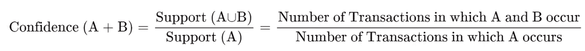

信心公式|来源:作者

对于超市，这些比率的计算如下:

假设数据库总共包括 500 次购买。在 300 个案例中，购买包括一个巧克力棒。所以对巧克力的支持是:

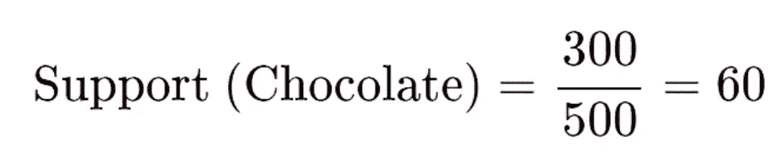

支持巧克力|来源:作者

反过来，在购买巧克力的 100 次购买中，也购买了牛奶。因此，对牛奶和巧克力的信心源于:

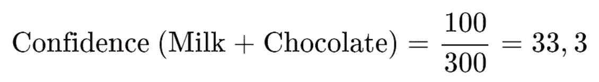

自信牛奶和巧克力|来源:作者

这意味着 60%的交易都是购买巧克力。同样，在三分之一的“巧克力交易”中，牛奶也被购买。

## 什么是关联规则？

关联规则试图在达到给定支持度和置信度的两个或多个元素之间找到某种规律性。

## 什么是频繁项集？

频繁项目集是一组经常一起出现并达到预定义的支持度和置信度的项目。使用关联规则可以发现频繁项集。

# Apriori 算法是如何工作的？

Apriori 算法是发现数据集中频繁项目集的方法之一。它分两步工作，即“连接”和“修剪”，这两步迭代执行，即连续执行几次。

**Join** :这一步形成集合 K 的项目集。k 代表重复步骤。

**剪枝**:在这一步中，所有没有达到预定义的支持阈值并因此被认为是稀有的项目集都被删除。

Apriori 算法利用了所谓的**反质子特性**。简而言之，这意味着如果由几个元素组成的项目集没有达到最小支持度，那么所有超集(由项目集的元素组成的所有集)也没有达到最小支持度。在我们的例子中，这意味着如果牛奶和饼干项集没有达到最小支持度，那么牛奶、饼干和巧克力项集不能超过最小支持度。

在每一次新的迭代中，项集被扩展一个元素，并再次执行“连接”和“修剪”步骤。如果在迭代中没有找到新的项集，则该算法终止，但只保留上一步中的项集。

# 通过例子先验地

对于我们的例子，让我们回到我们的超市。其数据库中总共有六笔交易。

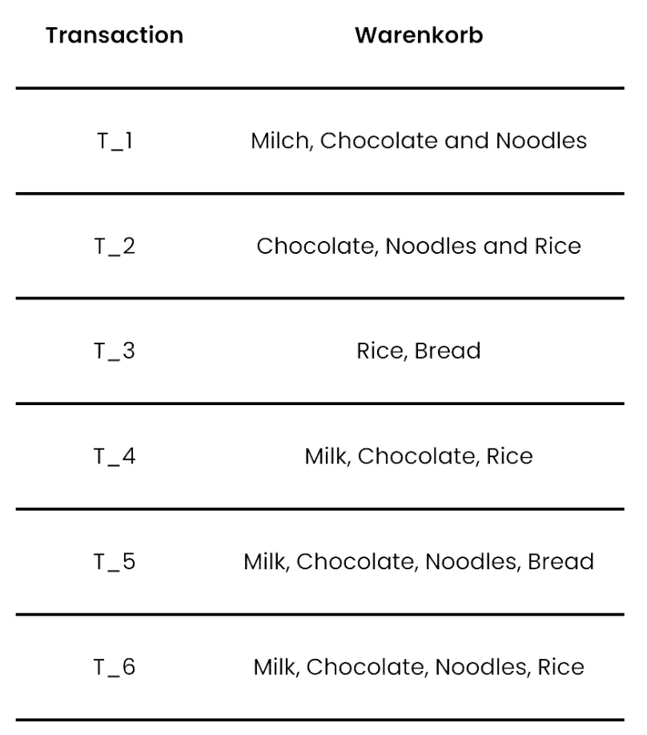

超市交易|来源:作者

对于我们的关联规则，我们希望达到 50%的支持度和 70%的置信度。这些值完全是任意的。

**第一步(K=1):** 在第一步中，我们搜索数量为 1 的项目集，也就是说，我们计算单个产品总共被购买的频率。这对应于第一阶段中的加入步骤。

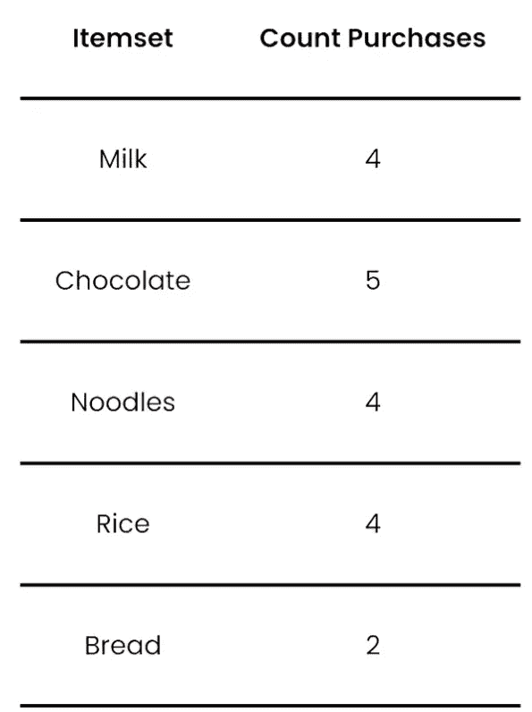

第一级中的项目集|来源:作者

**步骤 2 (K=1):** 连接步骤之后是修剪步骤，在该步骤中，我们移除未达到最小支持度的所有项目集。我们选择了 50%的支持度。由于计算支持度的形式，这意味着在六个事务中，项集必须至少出现三次才能满足支持度。所有其他项目集都可以删除:

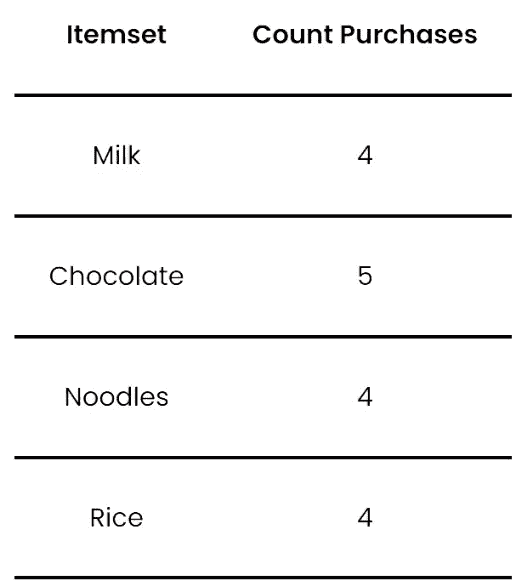

修剪后第一层中的项目集|来源:作者

因此，产品/项目集“Bread”会掉出，因为它只出现两次。

**步骤 3 (K=2):** 完成连接和修剪步骤后，我们进入第二阶段。这里，项集大小现在是 2。可能的项目集是来自前一个阶段**的所有剩余产品的组合。**

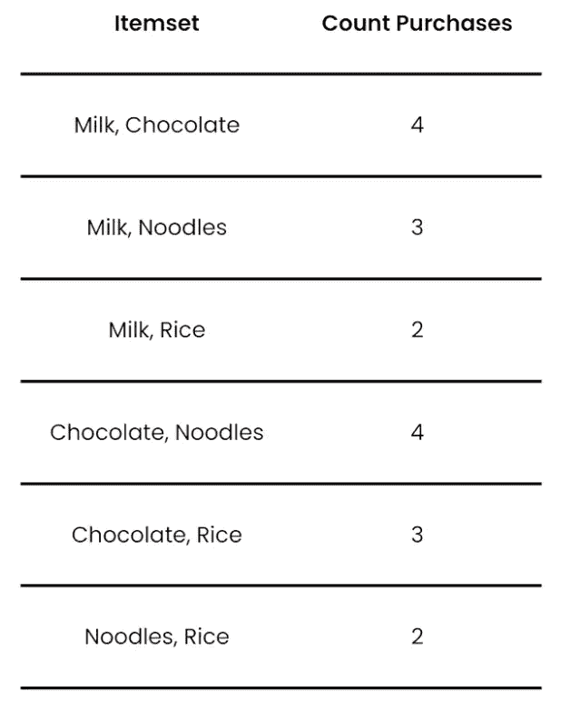

第二级项目集|来源:作者

**步骤 4 (K=2):** 在剪枝步骤中，未达到最小支持度三的项目集被再次移除。因此，组合(牛奶、米饭)和(面条、米饭)被丢弃:

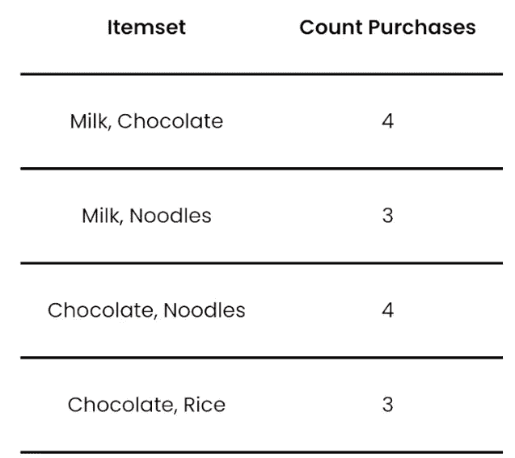

剪枝后第二层的项集|来源:作者

**第 5 步(K=3):** 在这一步中，我们形成数量为 3 的项目集，这是可以由剩余乘积形成的数量:

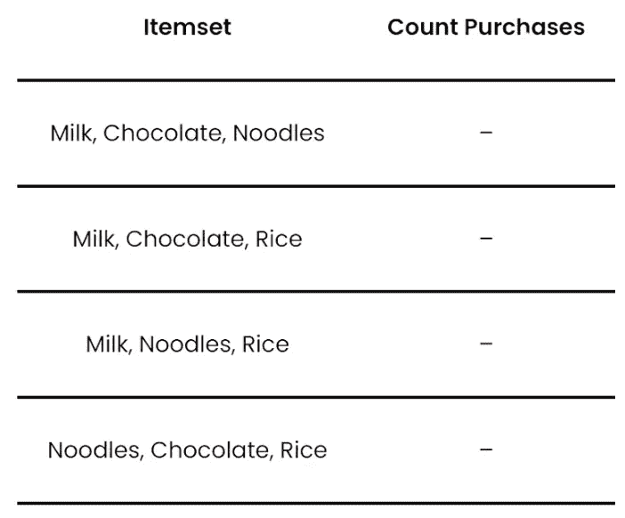

第三级中的项目集|来源:作者

我们没有购买这些项目集，但是您仍然可以检查这些项目集是否会得到支持。为了这个目的，我们利用了锑的性质。这里我们注意到项目集(牛奶，巧克力，大米)由子集(牛奶，巧克力)，(巧克力，大米)和(牛奶，大米)组成。然而，项集(牛奶，大米)无法达到支持度，因此较大的项集(牛奶，巧克力，大米)也不能是频繁的，即使它没有数字。

按照同样的推理，项目集(牛奶，面条，米饭)和(面条，巧克力，米饭)也会被删除，因为项目集(面条，米饭)出现的频率不够高。最后剩余的项目集现在可以用于使用置信度导出关联规则。

**第六步:**我们可以检查以下关联规则:

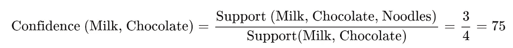

(牛奶、巧克力)→(面条)|来源:作者

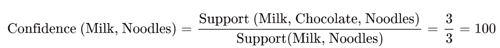

(牛奶、面条)→(巧克力)|来源:作者

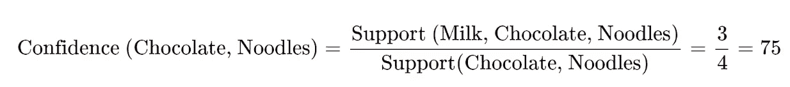

(巧克力、面条)→(牛奶)|来源:作者

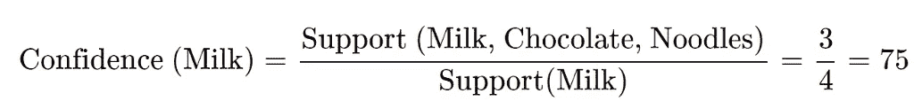

(牛奶)→(巧克力、面条)|来源:作者

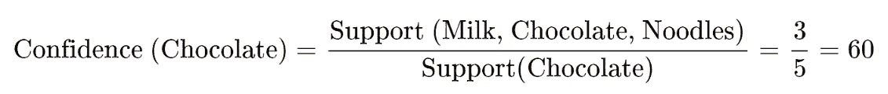

(巧克力)→(牛奶、面条)|来源:作者

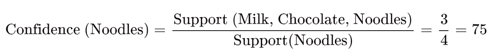

(面条)→(牛奶、巧克力)|来源:作者

在运行 Apriori 算法之后，总共出现了五个关联规则，它们经受住了我们 70%的置信度。这些包括规则“(牛奶，巧克力)->(面条)”。这意味着，如果已经购买了牛奶和巧克力，那么购买面条也很有可能。

# 使用 Apriori 算法的优缺点是什么？

Apriori 算法是在具有许多事务的大型数据库中发现关联规则的好方法。此外，join 和 prune 步骤在编程语言中相对容易开发，例如 [Python](https://databasecamp.de/en/python-coding) 。此外，还有一些模块可以进一步简化 Apriori 算法的导入。

然而，对于大型数据库，该算法的计算量非常大。正如在我们的例子中已经变得清楚的，必须计算许多组合和步骤，即使在我们的简单例子中，这也占用了大量的时间和资源。因此，在实施之前，必须确保努力是值得的。

# 什么应用使用这种算法？

有几个应用程序需要搜索关联规则，因此需要使用 Apriori 算法。以下是在其中搜索关联的一些主题:

*   **教育**:在教育中，人们寻求联想，例如，当试图找出为什么一些学生在某些科目上比其他人做得更好的时候。
*   **医学**:在新药开发中，研究关联规则，以确定新药如何与物理特征相互作用。为此，对测试药物的样本进行了更详细的研究。
*   生物学:在世界各地，森林火灾变得越来越频繁。因此，我们目前正在调查哪些预警因素，如极端干旱或高温，与森林火灾有关，以便能够尽早发现和预防火灾。
*   **电商&推荐**:我们在本文中了解到了 Apriori 算法的经典例子:购物车分析。基于以前客户的购买行为，它试图识别产品之间的关联，然后使用这些进行产品推荐。

照片由[rupixen.com](https://unsplash.com/@rupixen?utm_source=medium&utm_medium=referral)在 [Unsplash](https://unsplash.com?utm_source=medium&utm_medium=referral) 上拍摄

# Apriori 算法如何改进？

对于大型数据库，Apriori 算法可能效率非常低，而且会花费大量时间。因此，目前有一些方法有助于使算法更有效和更快。其中包括:

1.  **基于散列的项目集计数**:该方法试图加速项目集的创建。为此，使用了所谓的散列表，该散列表给每个产品或交易一个唯一的号码。这意味着不必包含和处理占用大量内存的字符串，而是包含和处理更高效的散列。
2.  **事务减少**:在执行 Apriori 算法之前，在数据库中搜索重复的事务，然后将其排除。同样，罕见的事务在早期阶段被过滤掉，因为它们在算法的计算中不起作用。
3.  **分区**:对于这种方法，数据库扫描的次数显著减少。这里的基本思想是，一个项集只有在两个数据库分区中的至少一个分区中出现时才能是频繁的。这意味着整个数据库只需扫描两次，效率会高得多。
4.  **采样**:这种方法不是在整个数据库中搜索频繁项集，而是只取数据库中的一个检查单元进行检查。但是，存在丢失实际上频繁的项集的风险。为了避免这种风险，应该使用相对较低的支撑。
5.  **动态项集计数**:使用这种方法，在扫描数据库的同时，已经可以发现新的潜在项集。

# 这是你应该带走的东西

*   Apriori 算法试图从数据库的事务中学习关联规则，即逻辑关系。目标是找到频繁出现的项目集，例如数据库中频繁出现的产品。
*   Apriori 算法分两步工作(“Join”和“Prune”)，依次迭代执行。
*   在每一步中，都会创建一个项集，该项集比前一步大一个乘积(“联接”)。然后，检查这些项目集的哪一个满足先前定义的支持，从而保留下来。
*   虽然 Apriori 算法相对容易理解和实现，但对于大型数据库来说，它的效率非常低，并且需要大量的计算能力。因此，已经有一些方法来提高算法的性能。
*   在实践中，每当寻找关联规则时，就使用 Apriori 算法。例如，这包括医药、生物或电子商务。

*如果你喜欢我的作品，请在这里订阅***或者查看我的网站* [*数据大本营*](http://www.databasecamp.de/en/homepage) *！还有，medium 允许你每月免费阅读* ***3 篇*** *。如果你希望有****无限制的*** *访问我的文章和数以千计的精彩文章，不要犹豫，点击我的推荐链接:*[【https://medium.com/@niklas_lang/membership】](https://medium.com/@niklas_lang/membership)每月花$***5****获得会员资格**

* [## Apache Hadoop 分布式文件系统简介

### 关于这个 Hadoop 组件，您需要了解的一切

towardsdatascience.com](/introduction-to-apache-hadoop-distributed-file-system-99cb98d175c)  [## 编程中的数据类型和类型系统介绍

### 了解 Python 中的一般类型系统

towardsdatascience.com](/introduction-to-data-types-and-type-systems-in-programming-3e8aec6da7f2)  [## 使用 MongoDB 介绍 NoSQL 数据库

### NoSQL 数据库实用指南

towardsdatascience.com](/introducing-nosql-databases-with-mongodb-d46c976da5bf)*