# OLS 回归中的假设——它们为什么重要？

> 原文：<https://towardsdatascience.com/assumptions-in-ols-regression-why-do-they-matter-9501c800787d>

# OLS 回归中的假设——它们为什么重要？

## 为什么你应该关心他们，他们是如何建立或破坏你的回归模型的

作者图片

当然，你知道线性回归！

很有可能，你已经用 R 和 Python 运行了数百个线性回归模型。你只需要从 R/Python 库中调用一个函数，瞧！

这还不是全部。对于如何运行回归诊断，您也有一个合理的想法(或者可能是您的数据管道为您做的！).

那么，为什么回归最基本的东西并理解“假设”有那么重要呢？

# 为什么？

事实证明，对这些假设的合理理解似乎过于“理论化”，最重要的是，可以接受的是，对于大多数数据科学初学者(包括我自己)来说，*有点无聊*，他们希望投入建模并测试他们的模型的预测能力。

然而，模型得出的结果可能从“无效”到“无用”，这取决于这些假设是否得到满足(模型仍然会给出那些结果！).大量的 ML 和统计建模尝试失败的原因只有一个——缺乏正确的问题定义，没有关注模型的基本理论。

在数据科学中，更常见的是在计量经济学中，通常最重要的不是简单的预测，而是建立可靠的因果联系，使人们能够操纵自变量以实现因变量的预期结果。如果一个计算模型的参数由于理论上的不一致而被直接拒绝，我们就不能这样做！

虽然许多讨论这一主题的教科书需要耐心地浏览所有的方程和符号，但许多关于这一主题的在线文章完全跳过了数学，解释也变得过于肤浅。目前的文章介于两个极端之间，主要目的是容易地提供正确的直觉；同时为感兴趣的读者提供了一个对数学的初步了解。

总结一下——这篇文章用简单的英语(以及一些对大脑友好的例子)解释了以下内容

1.  OLS 回归的假设到底是什么？有些教科书说有 5 个，有些说有 6 个，有些说有 10 个…让我们永远解决这个困惑吧！
2.  最重要的是，每个假设在数学上有什么贡献？
3.  什么会真的( ***真的！*** )发生，如果其中任何一条被违反了呢？

# 在我们开始之前你必须知道的。

在我们开始之前你需要一些大脑纹身。

1.  ‘线性回归’是一个**模型**。“普通最小二乘法”，缩写为 OLS，是模型参数的**估计器**(在许多其他可用的估计器中，例如*最大似然*)。了解模型和它的估算者之间的区别是至关重要的。
2.  当我们讨论假设时，需要注意的是，所有这些假设都是对***【OLS 估计量】*** 的*假设(而**不是对线性回归模型本身的**)。*
3.  正如我们将看到的，这些假设中的一些是模型的基本有效性所需要的，另一些是任何估计量的一些特定的“期望的”统计特性所需要的。当最有意义的时候，我们会介绍它们(例如高斯马尔可夫定理的大脑友好版本)。
4.  虽然不同教材和文章中假设的数量和顺序有所不同；从概念上讲，为了更好地理解，我们可以把几个假设放在一个标题下。这给了我们总共**七个** **假设**，这将在下面讨论。
5.  为了符号的方便，我们坚持线性回归的经典矩阵符号

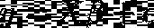

作者图片

其中 ***y*** 为响应变量向量， **ϵ** 为随机扰动向量， **X** 为自变量数值矩阵(其中 **n** 行数据点， **k** 列回归变量 **xᵢ** *包括截距)。*第一列 **x₁** 仅包含 1，以说明截距参数β₁的系数)

现在来看假设，让我们直接开始吧！

# 1.线性

虽然这看起来是最基本的，但我向你保证它不是。

这是唯一可能同时适用于 OLS **估计器**和 LR **模型**本身**、**的假设，原因略有不同。

## 首先，线性对于“模型”意味着什么？

嗯，线性回归是很容易理解的，“线性”。

当您选择线性回归作为备选模型时，您打算拟合一条**线**，或者更一般地说，拟合一个**超平面**来解释回归量 y 和回归量 X(x₁、x₂,…,xₖ).之间的关系

您选择使用 LR 一定是基于对数据的某种预先探索。例如，你可能在 **Y** 和每个 **xᵢ** 之间画了一个老式的散点图，并注意到一个没有任何明显曲率的相当线性的图案。

但是如果你注意到 y 和某个 xᵢ的曲线有明显的弯曲呢？还能用 LR 吗？

不。用一条线(超平面)来拟合一个明显的非线性关系是没有意义的。这不是一个很好的契合，也违背了建模的目的。那你是做什么的？

这就是 ***变量转换*** 的用武之地。LR 不需要 y 总是与 x 线性相关。它需要的是 y 的函数，比如说 *f(y)* 与 x 的函数线性相关，比如说 *g(x)* 这样我们就可以将关系建模为

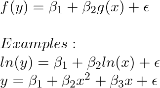

作者图片

尽管 y 和 x 之间的关系不完全是线性的，但以上所有都是有效的线性回归模型。

警告:虽然变量转换可以模拟回归变量和回归变量之间的非线性关系，但它可能会使系数的解释有点棘手。

## 第二，线性对于“OLS 估计量”意味着什么？

*真实*形式 OLS 假设不是关于“变量的线性”，而是“参数的线性”。

事情是这样的，一般来说，这不是你需要确保的事情。这是一个理论上的假设，OLS 推导真的

OLS 估计量分两步导出:

1.  得到“误差平方和”表达式相对于每个βᵢ.的偏导数这会给你 k 个表情。使这些都等于零(对于最小的表达式，一阶导数应该为零)。所以现在你有 k 个未知量的 k 个方程。
2.  当你求解β系数估计向量的这些方程时，你得到如下的封闭形式的解(用矩阵符号)

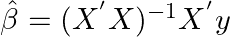

作者图片

这样找到的上述解依赖于我们在上述步骤 1 中获得的方程。**如果βᵢ的模型不是线性的**，这些方程看起来会完全不同，上面第 2 点的解决方案也是如此。

因此，参数的线性是 OLS 回归的基本假设。然而，每当我们选择进行 OLS 回归时，我们只需要确保**‘y’**和**‘x’**(或变换后的’**y’**和变换后的’**x’**)是线性相关的。在 OLS 估计过程本身中假设β的线性。虽然我们不需要太担心，但理解它是很重要的。

# 2.满秩

这个假设本身包含三个假设。

1.  任何回归变量之间都不应该有任何完美的多重共线性。
2.  观察值的数量(矩阵 X 的 **n** 行)应该大于回归量的数量(矩阵 X 的 **k** 列)。
3.  对于简单线性回归的情况，回归量 x 的所有值不应该相同。

虽然许多教科书分别提到了这些假设，但这些假设可以被准确地理解为一个假设，即回归矩阵 X 应该是“满秩”的。

矩阵“满秩”是什么意思？简单地说，你不能将矩阵中任何一列的值表示为其他列的线性组合。换句话说，所有列应该彼此线性独立。如果一个列可以用其他列来线性表示，那么这个列就是多余的，矩阵就变得“秩亏”了。

当一个矩阵秩亏(非满秩)时，它的行列式为零，因此它的逆矩阵不存在。因此，确定β系数的 OLS“公式”不起作用

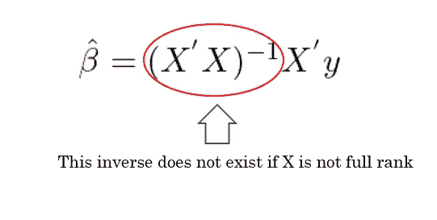

作者图片

那么，为什么上述 3 个假设都归结为一个单一的假设“满秩”？

让我们再仔细看看这三个假设。

1.  如果任意两个或多个回归量之间存在完美的多重共线性，矩阵 X 没有“k”个线性无关列。因此，**不是满秩**。
2.  如果 n <k then="" the="" rank="" of="" matrix="" is="" less="" than="" k="" class="kx ir">它没有全列排名。因此，当我们有 **k** 个回归变量时，我们至少应该有 **k** 个观测值，以便能够通过 OLS 估计β。</k>
3.  对于**简单线性回归，**如果自变量 X 的所有值都相同，则矩阵 X 中有两列，一列全为 1(截距项的系数)，另一列全为 ***c*** (回归变量的常数值) ***、*** ，如下所示。显然，在这种情况下，矩阵也是**非满秩的，**逆不存在， **β无法确定。**

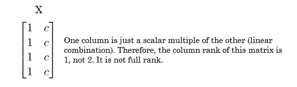

作者图片

# 3.扰动的零条件均值

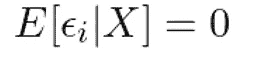

作者图片

扰动项ϵᵢ应该独立于回归量 xᵢ.它的期望值应该为零。

让我们用两个问题来解开上述问题:

***首先，为什么不同观测值之间扰动项的均值应该为零？***

嗯，*误差或干扰*很小(希望如此！)与模型预测的估计值的随机偏差。如果模型预测精确到小数点后一位，那就奇怪了！因此，偏差是很正常的。

然而，虽然干扰是可预期的，但我们不期望这些干扰总是**正的(这意味着模型**总是**低估实际值)或**总是**负的(这意味着我们的模型**总是**高估实际值)。**

相反，扰动不应该有任何固定的模式。换句话说，我们希望我们的错误是随机的——有时是正的，有时是负的。大致来说，所有这些单个误差的**和**将相互抵消，变得等于零，从而使误差项的平均值(或期望值)也等于零。

***其次，为什么误差项的均值要独立于回归变量？***

假设你想预测你办公室里的员工的年收入，仅仅使用他们的工作经验。你有三组人——第一组有不到 3 年经验的员工，第二组有 3 到 7 年的经验，第三组有 7 到 10 年的经验。

您创建了一个 LR 模型，并预测了每个组中每个成员的估计收入。接下来，为了查看您的模型的真实表现，您计算了所有三组成员的平均误差(称之为 E(ϵᵢ)。此外，您想知道您的模型在预测特定群体的收入方面是否特别好，因此您还分别计算了 3 个群体(E(ϵᵢ|group1、E(ϵᵢ|group2 和 E(ϵᵢ|group3)).)的平均预测误差

现在的问题是，你是否希望你对一组 ***的预测比对另外两组*** 的预测更错误？

当然不是！您希望公正地评估每一组，并且对每一组都同样正确(或不正确)!因此，理想情况下，单个组的平均误差应该与总平均误差相同。

e(ϵᵢ)= e(ϵᵢ|group1)= e(ϵᵢ|group2)= e(ϵᵢ|group3)

因此,“经验年数”这个变量的值不应该在决定你的估计有多错误上起任何作用。

概括地说，在一个好的模型中，回归量 xᵢ本身应该不包含关于误差ϵᵢ的有用信息——它们应该与误差项“无关”(回归量应该是“外生的”)。

现在只要结合以上两个问题的答案，你就得到我们的第三个假设零条件均值，如下所示。

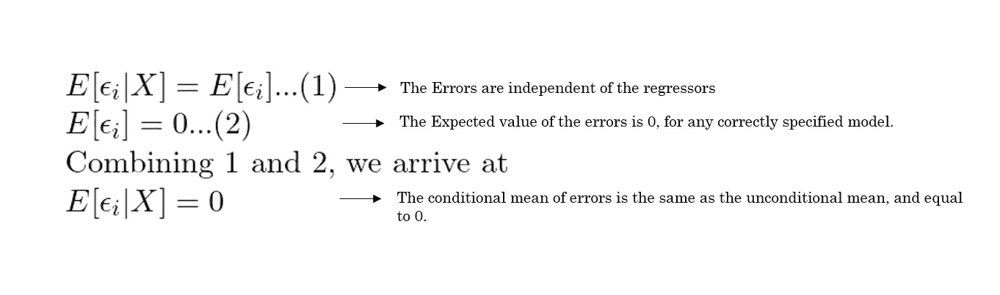

作者图片

# 实现了无偏性！

现在让我们喘口气。三个假设已经完成，那么我们目前取得了什么成果？

好了，我们已经实现了线性回归模型参数的线性**无偏**估计量。

> 无偏性是估计量的一个理想的统计特性。它说，平均而言，估计量不会系统地低估或高估实际总体参数。

对于一个无偏的估计量，我们只需要证明它的期望值等于真实的总体参数。虽然我们很难知道人口参数的真实值来验证这一点，但可以通过分析来证明这一点(但前提是满足上述 3 个假设)。

有兴趣的，下面给出证明。对于那些不是的人，至少注意一下，这三个假设是如何被纳入证明的。

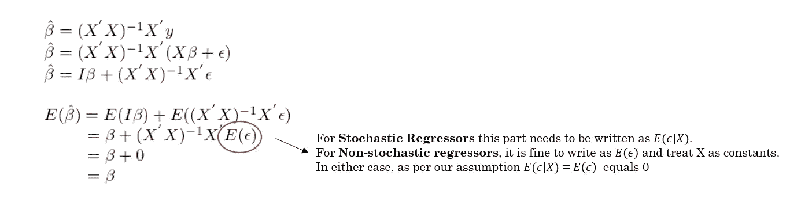

作者图片

上面所示的第一个等式与假设 1 所示的β系数估计值的闭合解相同。在接下来的步骤中，我们只需展开 y 并分配乘积，最后，对两边都取期望值。我们需要注意的是这三个假设是如何实现的-

a.如前所述，在没有线性和满秩假设的情况下，证明的第一行中所示的β-hat 的表达式是无效的。

b.请注意用红色圈出的部分。由于零误差期望值(或零条件均值)的第三个假设，被圈起来的部分变为零，从而使得β-hat 的期望值等于β。

最终结果——前三个假设足以说明 OLS 估计量是一个 ***无偏*** 线性估计量。

然而，这就是我们所需要的吗？

> 估计量的另一个理想特性是“低方差”。估计量在样本间变化越大，它对总体参数的估计就越不可靠。在所有的线性无偏估计量中，**方差**最小的是称为“最佳线性无偏估计量”(蓝色)。

那么我们能证明 OLS 估计量是蓝色的吗？

是的，但前提是另外两个假设成立。让我们看看它们是什么。

# 4.同方差性

我们刚刚讨论了误差项的**条件*意味着*独立**的假设。现在我们来谈谈误差项的**条件*方差*独立性**假设(也叫‘同方差’)。

希望我们已经清楚了一件事——我们不希望回归者携带任何关于错误的有用信息。

这意味着，它是否是误差的均值(期望值);或者误差的方差，它不应该基于不同的回归 xᵢ.值而不同

回想一下假设 3 中提到的基于多年经验的收入预测的同一个例子。您希望第一组(少于 3 年的经验)的误差比两组的误差“更分散”(或更少分散)吗？

不会。如果一个或多个组的误差比其他组更分散(误差方差更大)，这基本上意味着你对这些组的预测不太可靠。

同方差性表示，无论回归函数值是多少，误差项ϵᵢ的方差都应该等于一个常数。数学表述如下。

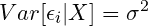

作者图片

# 5.非自相关

让我们继续我们的探索，使误差尽可能随机和独立于其他因素。

我们已经讨论了两个假设——一个是关于误差的平均值独立于**回归变量**，另一个是关于误差的方差独立于**回归变量**。

均值独立性和同方差性确保**误差** *与* ***回归量*** 无关。

非自相关确保**错误** *与* ***其他错误*** 无关。

从数学上来说，观测误差的协方差应该为零。

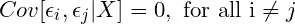

作者图片

虽然这听起来有点不直观，但有时，对于以某种方式排序的数据观察(例如，时间序列数据)，在连续观察中观察到具有“惯性”的误差值是很常见的，即正误差后跟着正误差或负误差后跟着负误差(称为正自相关)。误差也可能在观测值之间具有交替模式——正误差跟随负误差，反之亦然(称为负自相关)。

有几种技术可以处理和转换 LR 模型，以便自相关不会造成问题，尽管它自然存在于数据中。

# 达到的最小方差(蓝色)！

在前三个假设的基础上增加假设 4 和假设 5，借助于 ***高斯-马尔可夫定理*** *，可以证明 OLS 估计量是蓝色的。*

高斯马尔可夫定理的证明表明，所有线性无偏估计量的方差都将大于 OLS 估计量的方差。

为了使事情变得简单，让我们如下象征性地理解高斯马尔可夫定理的最终输出。根据证据，可以证明

**Var(任意线性无偏估计量)= X +一个正量**

上面的等式清楚地表明 X 小于 LHS。

重要的是，利用同方差(Var(ϵᵢ)=σ)和非自相关(对所有 i ≠ j 的 Cov(ϵᵢ,ϵⱼ)=0)条件，我们可以证明**x = ols 估计量的方差**。

为了简单起见，我们直观地理解了高斯马尔可夫定理。感兴趣的读者可以在网上[这里](https://en.wikipedia.org/wiki/Gauss%E2%80%93Markov_theorem)或者任何标准教科书中找到更多关于证明的信息。

虽然上面讨论的五个假设足以使 OLS 估计量变得令人沮丧(如果没有这五个假设，一个估计量就不会真正达到它应有的水平！)，还有两个假设值得一提。

# 6.随机或非随机回归变量

这个假设可能是你唯一可以忘记的(一旦你明白了！).

我把这个包括在内，这样当你在每本教科书中看到它时，你就知道它的意思了。

非随机回归器是指你固定了某些**【x】**值(独立变量值)，只收集了这些 x 值对应的**【y】**上的数据，但是收集了多个样本。

回到我们之前的例子，假设你想根据多年的经验预测年收入。你的经理给了你三份员工名单和他们的年收入。每个列表都对应一个特定的经验水平——比如分别是 3 年、6 年和 10 年的经验。每个列表包含 50 名员工的数据。如您所见，x 值是固定的(3，6，10)，但有重复的样本(每个样本 50 个数据点)。这就是所谓的**非随机回归变量**(理论上，遵循这一点的模型也被称为**经典线性回归模型**或 **CLRM** )。

你的经理可能会给你一份 150 名员工的年收入清单，而不是给你三份单独的清单。该列表可能包含具有随机变化的工作年限的员工(例如，1 年、2 年、3 年、7 年、10 年)。这里的 x 值不是固定的，而是可以根据多年的经验取任何(现实的)值。在这种情况下，我们使用**随机(random)回归变量**(理论上，遵循这一点的模型被称为**新古典线性回归模型**或 **NLRM** )。

在创建回归模型之前，您使用哪种数据生成过程并不重要，只要前面陈述的 5 个假设成立，所有的统计特性和 OLS 估计器的优点仍然成立(这就是为什么您可以忘记这一点！).

数学上，唯一的区别是——如果你使用非随机回归，你会得到一个数学上的便利——删除所有假设表达式中“给定的 X”部分，使它们成为无条件的(因为我们将 X 视为已知常数，而不是随机变量本身)。

E(ϵᵢ|X) = 0 就会变成，E(ϵᵢ) = 0

Var(ϵᵢ|X) = σ会变成 Var(ϵᵢ)= σ

在大多数数据科学研究中，对回归变量的数据收集通常是随机的，所以我们通常坚持使用条件表达式。在计量经济分析的一些实验设置中，有时以非随机方式设置回归变量，然后收集这些回归变量值的响应数据。

# 7.常态

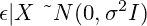

作者图片

这个假设非常简单。它只是说误差**应该是正态分布的。**这种分布应该具有均值零(假设 3)和恒定方差σ(假设 4 ),这已经在前面展示过了。

然而，请注意，这一假设并不是获得良好的统计特性(如 OLS 估计量的“无偏性”和“最小方差”)的必要条件。只要满足前 5 个假设，即使误差不是正态分布，OLS 估计量也将是蓝色的(最佳线性无偏估计量)。

那我们到底为什么需要这个假设呢？

首先，如果我们需要的只是一个蓝色估计量，我们就不需要它。事实上，对于足够大的样本，通常满足正态性条件，而不需要我们为它担心(渐近正态性)。对于随机收集的最具代表性的数据样本，预期正态误差是合理的。

然而，把这作为一个明确的假设，会使两件有趣的事情成为可能-

1.  当所有其他假设都符合正态假设时，OLS 估计与**最大似然**估计相一致(这在估计者中是一个很大的问题！)，为我们提供了一些有用的属性。在以后的文章中会有更多的介绍！
2.  βᵢ的系数估计值可以显示为误差ϵᵢ.的线性函数要记住一个非常酷的特性——正态分布随机变量的线性函数也是正态分布的。因此，假设 **ϵᵢ** 为正态分布，我们得到 **βᵢ估计值也为正态分布。**这使我们更容易计算置信区间和估算β系数的 p 值(常见于 R 和 Python 模型总结中)。如果不满足误差正态条件，那么β系数的各个 t 检验的所有置信区间和 p 值都是不可靠的。

# 总结一下！

如果你只对线性**无偏**估计量感兴趣，你只需要—

1.  *线性度*
2.  *满级*
3.  *扰动的零条件均值(外生回归量)*

如果除了无偏的线性估计量之外，您还想要最佳(或最小方差)估计量，那么您还需要

*4。同质性*

*5。非自相关*

除了蓝色的估计量之外，如果您还想要单个β系数的可靠置信区间和 p 值，并且估计量与 MLE(最大似然)估计量一致，那么除了上述五个假设之外，您还需要确保—

7。常态

最后，如果你想写下一篇关于这个主题的研究论文，并且想要数学上正确的方程，不要忘记假设 6(非随机和随机回归)。

# 结论

既然你已经看到了每一个 OLS 假设的实际应用，那么就该由你来决定应该验证哪些假设，以确保你的模型能够正确工作。

虽然这些假设中的一些是证明理论的数学便利，但大多数是创建具体和稳健模型的必要基础。

对这些假设的良好理解使我作为一名数据从业者能够掌握统计建模和机器学习中更难的概念。希望对你也有帮助！

# 加入我的旅程

*如果您喜欢这篇文章，我邀请您关注我的* [*Medium*](https://medium.com/@ghoshayan6666) *页面，了解更多关于数据科学有趣话题的更新，并通过*[*LinkedIn*](http://www.linkedin.com/in/ayanghosh-001)*与我联系。*

# 教科书参考

1.  William H. Greene — *计量经济学分析*第七版，第 2 章，第 51–65 页。
2.  Jeffrey M. Woolridge — *计量经济学导论*第七版，第 2 章，第 40–57 页。