# 多元线性回归的假设

> 原文：<https://towardsdatascience.com/assumptions-of-multiple-linear-regression-d16f2eb8a2e7>

## python 中假设的实现

图片来自 [Unsplash](https://unsplash.com/photos/OlxJVn9fxz4)

> **简介**

线性回归是各种预测分析的核心过程。根据定义，线性回归是指拟合两个感兴趣的连续变量。不是所有的数据集都可以用线性方式拟合。在开始回归分析之前，有几个假设必须满足。其中一些对于模型的评估非常重要。

1.  线性
2.  多重共线性
3.  同方差性
4.  多元正态性
5.  自相关

> **用数据弄脏手**

出于演示的目的，我将利用开源数据集进行线性回归。[“鱼”数据集](https://www.kaggle.com/aungpyaeap/fish-market)受 GPL 2.0 许可。我们将通过各种需求来建立对这个数据集的线性回归分析。

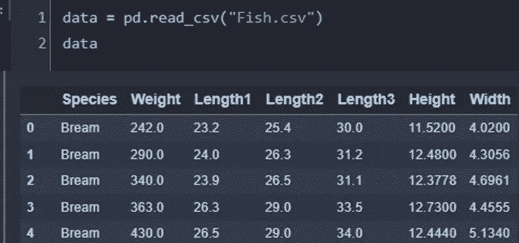

> **线性度**

第一个假设非常明显和简单。我们试图拟合的变量应该保持线性关系。如果没有线性关系，可以对数据进行转换，使其成为线性关系。这些类型的转换包括对响应数据取对数或对响应数据求平方根。检查散点图是检查线性最好也是最简单的方法。
让我们做一个体重和身高变量之间的线性检查。散点图显示这两个变量之间几乎没有线性关系，因此我们需要转换变量。我们可以对两者进行对数运算，并获得更线性的散点图。

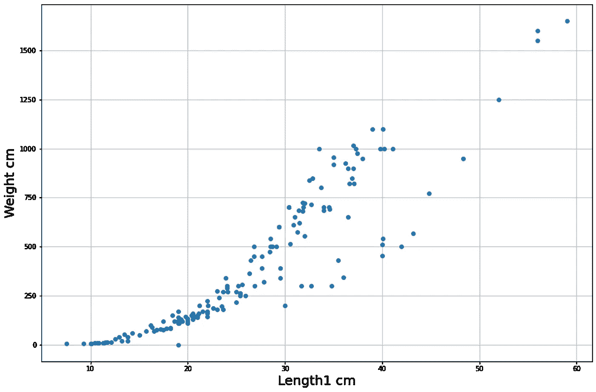

变量之间观察到非线性(图片由作者提供)

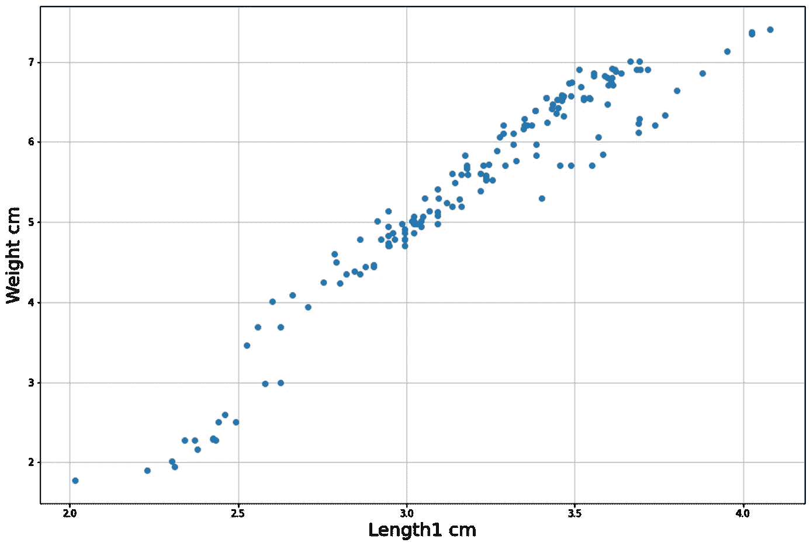

对数变换后线性增加(图片由作者提供)

很明显，即使在对数变换之后，数据仍然显示出某种双峰。一些数据位于重量分布的上半部分，而剩余的数据点独立于前一个分布。在这种情况下，我们可能需要收集 2.5 到 3.56 厘米之间的更多数据，最终我们可以获得更正态的分布。

## **外卖 1**

→对照所有独立变量检查响应变量的散点图。

→如果没有观察到线性，转换数据。

> **多重共线性**

当两个或两个以上的独立变量相互关联时，就会出现多重共线性。如果是这样的话，模型对系数的估计将是系统性错误的。人们可以检查方差膨胀因子(VIF)来确定高度相关的变量，并可能从模型中删除这些变量。R 是变量相关程度的量度，VIF 由这个 R 值确定。如果变量之间有很高的相关性，VIF 值就会飙升。通常，VIF 值大于 5 表示存在多重共线性。VIF 的最小值为 1，这对于方程来说是显而易见的，这表明不存在多重共线性。

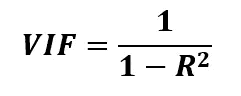

VIF 公式

VIF 价值观

观察 VIF 值，很明显所有的变量都是高度相关的。如果我们的响应变量是“权重”，我们可以保留其余五个变量中的任意一个作为我们的自变量。由于各种原因，数据集中可能会出现多重共线性。它可能是由于数据收集过程而出现的。一些变量可能会重复，而另一些可能会转换，这可能会导致多重共线性。

皮尔逊多重共线性系数是这种情况下的另一个度量。它可以用矩阵的形式表现出来，这很好。

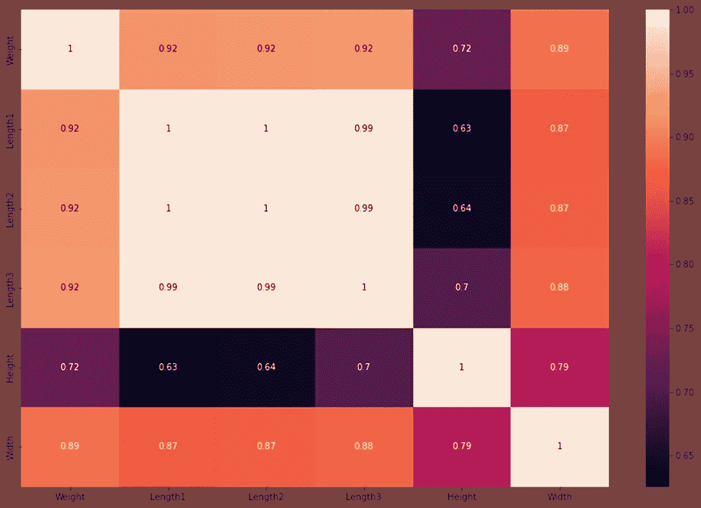

皮尔逊多重共线性系数(图片由作者提供)

## **外卖 2**

→检查散点图或 R 值，以确定是否存在多重共线性。

→同时检查 VIF 值以筛选出变量。

> **同方差**

同方差是多元线性回归建模的另一个假设。它要求线性拟合两侧的数据点之间的方差相等。如果不是这样，数据就是异方差的。通常，数据质量会导致这种异方差行为。如果响应变量呈现圆锥形分布，我们可以说方差不可能在模型的每一点都相等，而不是线性增加或减少。

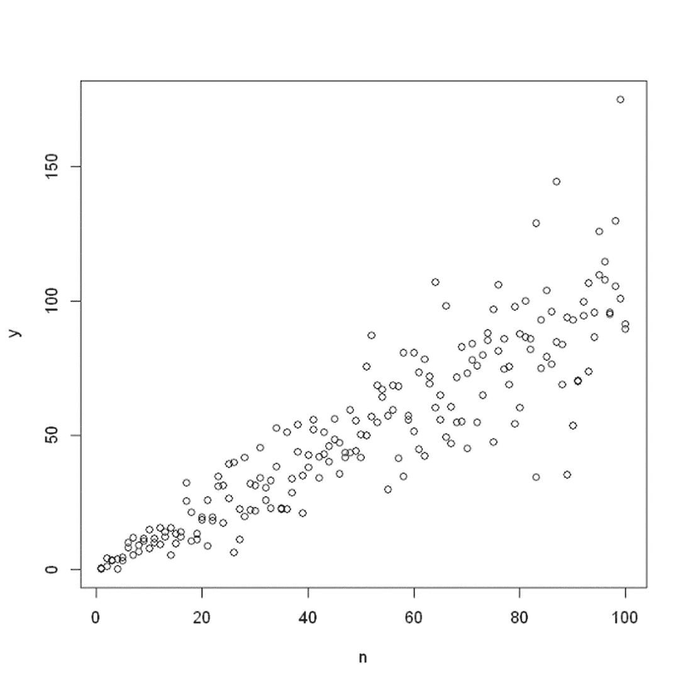

异方差数据的锥形分布(图片由作者提供)

我有另一篇文章是关于数据的这个特性的。读者可能会觉得有用。

 [## 回归模型中的异方差性

### 使用统计模型检查异方差性

towardsdatascience.com](/heteroscedasticity-in-regression-model-21d9f5a93e59) 

在我们的“鱼”数据集中，变量“重量”在散点图中显示了类似的行为。

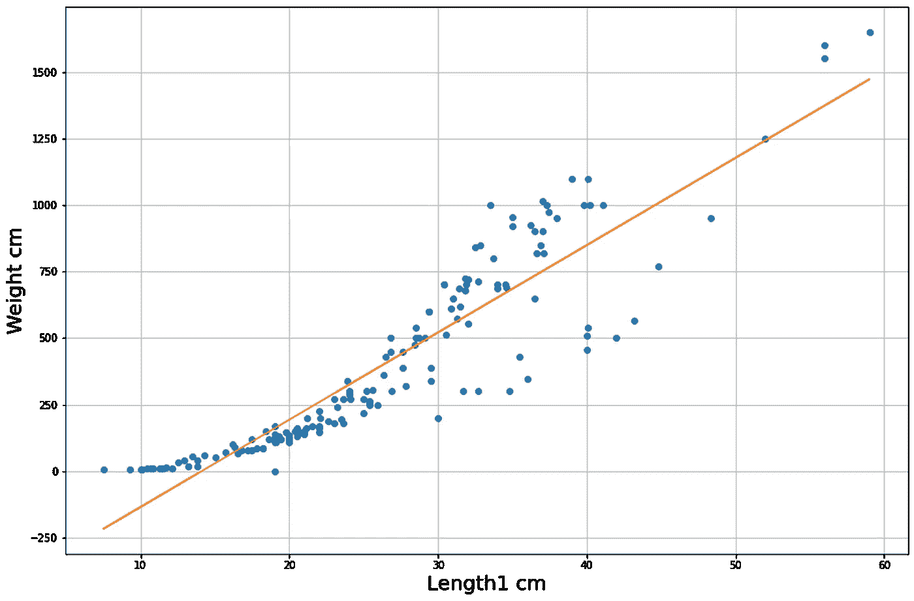

拟合线周围的不等方差(图片由作者提供)

当残差相对于预测值作图时，它也提供了这种异方差的指示。下图显示了残差的某种模式。在这种情况下，响应变量的转换可能是最小化异方差的好步骤。

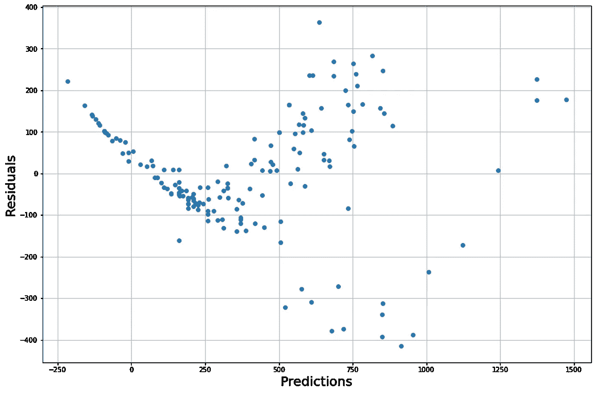

剩余散点图(图片由作者提供)

## **外卖 3**

→检查响应变量的散点图，如果方差是可变的(非常数)或任何锥形图。

→转换变量以最小化异方差。

> **多元常态**

这种假设表明模型的残差是正态分布的。确定模型参数后，最好检查残差的分布。除了直观的分布，人们应该检查 Q-Q 图以更好地理解分布。鼓励读者仔细阅读下面文章中概述的 Q-Q 情节的基础和实现。

 [## 使用简单的 python 理解 Q-Q 图

### 可视化数据的有效方法

towardsdatascience.com](/understand-q-q-plot-using-simple-python-4f83d5b89f8f) 

在我们的数据集中，我们可以可视化分布以及 Q-Q 图，但为了更好地理解，让我们生成一些合成数据。

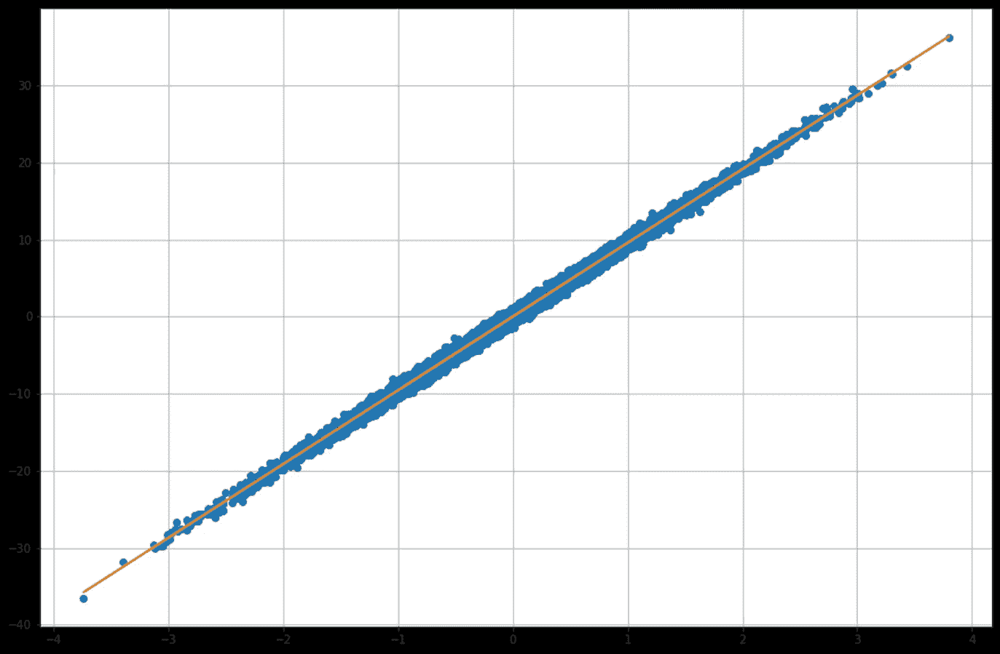

用拟合线生成的数据(图片由作者提供)

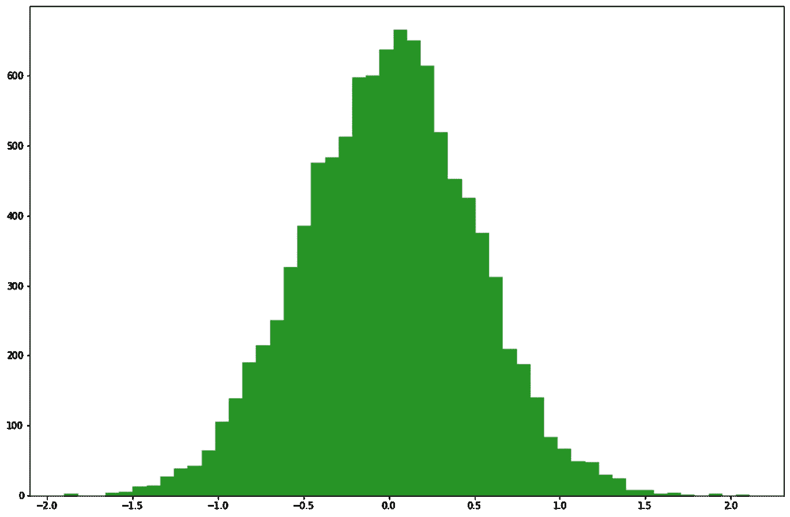

残差分布(图片由作者提供)

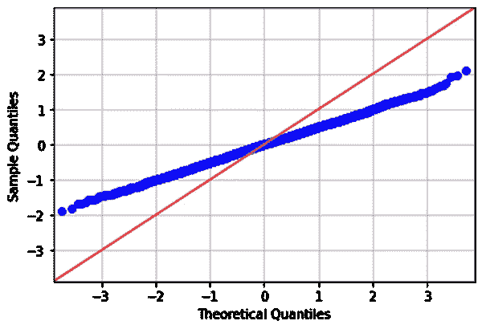

Q_Q 图(图片作者提供)

Q-Q 图偏离了 45⁰线，后者似乎代表了一个分散不足的数据集，其尾部比正态分布更细。在这种情况下，非线性变换也有助于建立多元正态性。

## **外卖 4**

→检查残差分布和 Q_Q 图，以确定正态性

→如果缺乏正态性，则执行非线性转换

除了这些情况之外，还有一个“无自相关”假设，它基本上告诉我们，在残差散点图中应该没有特定的模式。特定位置的一个残差不应依赖于其周围的残差。恒定方差假设与此有些关系。

> **结论**

我们已经展示了多元线性回归假设检验的实现。线性和多重共线性比其他假设更重要。在各种机器学习或统计问题中，线性回归是最简单的解决方案。然而，用户应同样小心这里概述的假设，并采取必要措施将非线性引起的影响降至最低。

[Github 页面](https://mdsohelmahmood.github.io/2022/03/09/Assumptions-of-Multiple-Linear-Regression.html)