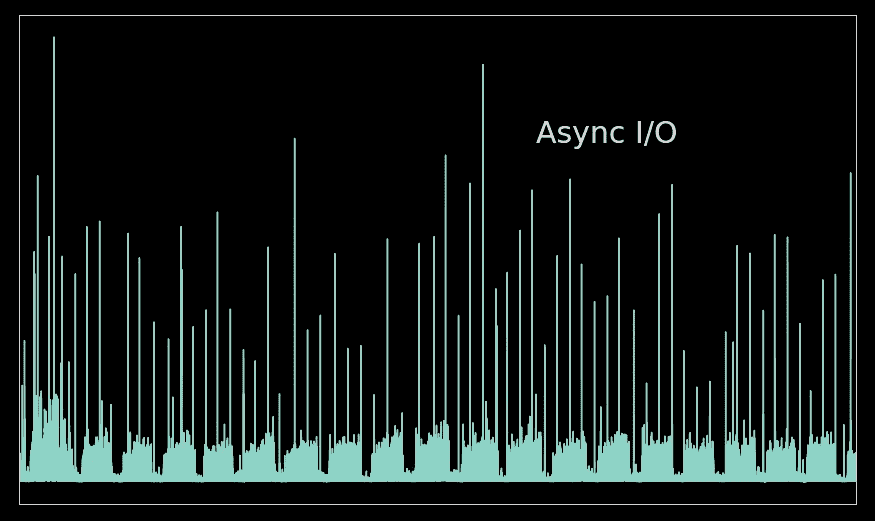
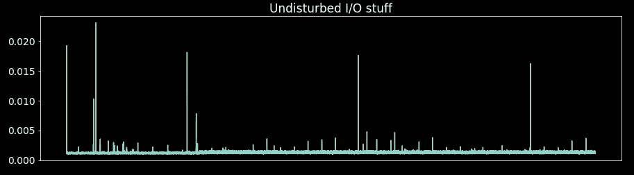
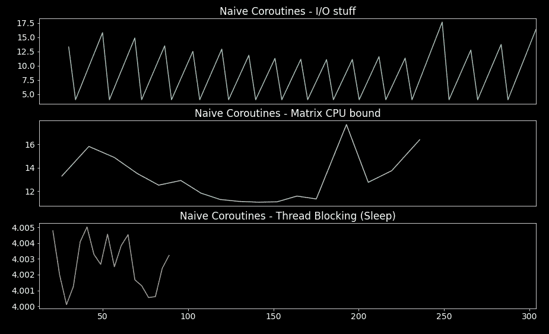
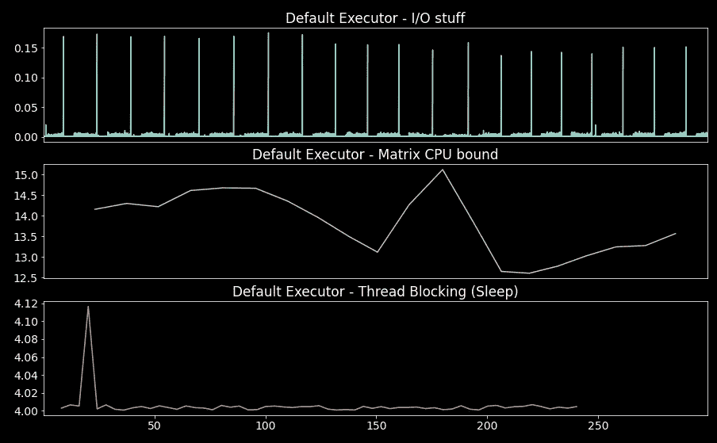
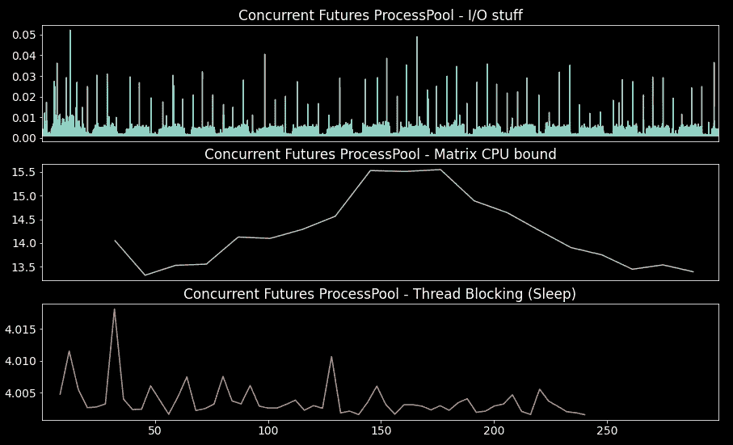
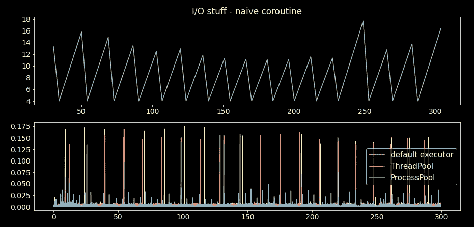
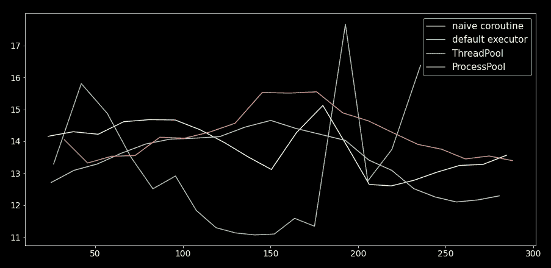

# 面向数据科学家的异步—不要阻塞事件循环

> 原文：<https://towardsdatascience.com/async-for-data-scientists-dont-block-the-event-loop-ab245e28ee01>

## CPU 密集型任务或非异步 I/O 库可能会阻塞程序的事件循环。了解如何在 Python 中避免这种情况。

图片作者。

异步编程已经成为 API 设计和大多数服务的标准范例。数据科学家的技能范围也发生了变化。今天不足以创建好的模型或可视化；在大多数情况下，通过 API 或其他服务部署它们也是必要的。如果您还没有在部署中处理过异步编程，那么您很快就会了。

明确一下，这个故事不是另一个异步教程。相反，一些关于数据科学家在将工具与异步框架接口时可能面临的常见障碍的见解。也就是说，用 CPU 密集型任务或非异步 I/O 库阻塞事件循环。

这个故事将探讨事件循环是如何被阻塞的，以及我们有哪些资源来防止它。

Python 中有许多处理异步编程的好库，但是 *Asyncio* 必须是 Python 中包含的标准库；例如，看看三重奏。因此，在这个故事中，我们将关注 Asyncio。

## 故事结构

*   事件循环
*   测试设置
*   天真地调用阻塞函数
*   Asyncio 默认执行者
*   并发.未来线程池
*   并发.未来进程池
*   受 I/O 限制的基准测试
*   受 CPU 限制的基准测试
*   这个故事的寓意

## 事件循环

无论您使用的是 *Asyncio* 模块还是任何其他异步库，它们都使用底层的事件循环。事件循环是一个调度器，负责在程序的生命周期内执行所有的协同程序(异步函数)。

这种并发模型本质上是一个单独的`while`(循环),它采用协程并巧妙地运行它们。一旦一个协同程序正在执行，`await` ( `yield`)关键字将控制权交还给事件循环，以运行其他协同程序。因此，当事件循环等待一个 I/O 响应，一个*未来*完成，或者只是一个异步睡眠时，它可以运行其他协程。事件循环跟踪应该返回给每个协程的内容，并在循环的未来迭代中将其返回给相应的协程。

现在我们知道了事件循环是如何工作的，让我们想想当我们在事件循环中运行 CPU 密集型任务时会发生什么。这正是讨论与数据科学家相关的地方。如果我们在事件循环中运行一个受 CPU 限制的任务，这个循环将运行这个任务直到它完成，就像你曾经使用过的任何顺序的和普通的`while`循环一样。这在异步编程中是一个大问题，因为所有其他任务都必须等到我们的 CPU 密集型任务完成之后。

对于事件循环，有三条规则:

*   您不能阻止事件循环
*   您不能阻止事件循环
*   您不能阻止事件循环

乍一看，阻塞事件循环听起来可能没那么糟糕。但是想想这个场景。您负责编写一个模块，该模块将在一个公开 API 的大型应用程序(服务)中提供数据分析。API 是在异步框架中编写的。如果您将 CPU 绑定的函数包装在协程中，您可能会导致整个应用程序瘫痪。所有其他任务，如客户端处理，都将停止，直到 CPU 密集型任务完成。

以下部分将回顾运行事件循环阻塞任务的方法，并研究它们的性能。

## 测试设置

我们从两个函数开始事件循环阻塞测试:

*   执行 CPU 相关任务的函数:使用 NumPy 的矩阵乘法
*   休眠线程的函数，即一些非异步 I/O(例如，非异步数据库库)；是的，`time.sleep`将阻塞事件循环

让我们用一个每边有 7，000 个元素的正方形矩阵来计时(在事件循环之外)我们的 CPU 限制函数，这样我们就知道会发生什么:

> 每圈 9.97 秒±2.07 秒(平均标准偏差。戴夫。7 次运行，每次 1 个循环)

然后我们创建一个模拟周期性 I/O 任务的函数。这个函数为`durarion_secs`运行一个循环，并在任务开始前(`asyncio.sleep`为`sleep_secs`)和任务完成后将当前时间戳附加到一个列表(`time_log`)中:

这个函数的时间日志将是我们评估其他进程是否阻塞事件循环的数据。此外，我们格式化时间日志，以便只保留任务执行前和执行后的时间差。

使用 1 毫秒的睡眠，这是没有任何其他函数在事件循环中运行时`time_log`的样子:

轴尺寸以秒为单位[图片由作者提供]。

## 天真地调用阻塞函数

天真地说，创建异步库的第一种方法是将我们的阻塞函数包装在一个协程中:

为了测试这种方法，我们将我们的函数、CPU 绑定函数和线程阻塞函数(`time.sleep`)封装在一个循环中，该循环定期执行函数并追加到一个`time_log`:

现在我们同时运行所有任务，即`dummy_io_stuff`，CPU 密集型和线程休眠功能:

**注意**:在这段代码中，我在协程外部运行`await coroutine`，因为我使用的是 Jupyter 笔记本，但是规则是`await`只能在协程内部使用(`async def`)。

以下是格式化时间日志的结果:

轴尺寸以秒为单位[图片由作者提供]。

从 I/O 时间日志(第一个子图)中可以看出，事件循环被阻塞了。我们期望平均一毫秒，并且在大多数迭代中花费的时间超过 5 秒。

另外两个图显示，在测试过程中，其他任务并没有一直执行，而是竞争资源并相互阻塞。

## Asyncio 默认执行者

避免事件循环阻塞的解决方案是在别处执行阻塞代码。我们可以使用线程或其他进程来实现这一点。 *Asyncio* 有一个非常方便的循环方法，`run_in_executor`。这个方法使用了`concurrent.futures`线程和多重处理接口。运行阻塞函数的默认方式如下:

`run_in_executor`的第一个参数设置为`None`(默认执行程序)，第二个参数是我们要在执行程序中运行的函数，后面的参数是函数的参数。这个默认的执行者是来自`concurrent.futures`的`ThreadPoolExecutor`。

包装我们的函数，类似于上一节，并同时运行任务:

格式化时间日志的结果是:

轴尺寸以秒为单位[图片由作者提供]。

我们可以看到，在事件循环中仍然有一些小故障(第一个图)，但是 I/O 时间日志显示了接近 1 毫秒的时间差。根据阻塞任务本身，它们确实是并发执行的。

## 并发.未来线程池

我们可以通过显式定义并将其传递给`run_in_executor`方法来自定义上一节中的`ThreadPoolExecutor`:

使用只有一个工人的`ThreadPoolExecutor`,我们包装我们的阻塞函数来周期性地执行它们并保持时间日志，类似于前面的部分:

同时运行我们的任务并绘制格式化的时间日志:

轴尺寸以秒为单位[图片由作者提供]。

我们看到的结果类似于上一节中获得的结果；当然，这是意料之中的；都用`ThreadPoolExecutor`。

根据需要调整线程池中的线程数量。测试最佳数量是多少。对于某些用例来说，线程数量越多并不总是越好，因为它会带来一些开销。

线程池执行器在处理非异步编写的 I/O 库时大放异彩。Python 中的许多数据库库还不支持异步。在异步程序中使用它们会阻塞事件循环；相反，使用线程池执行器来包装它们。

## 并发.未来进程池

最后，我们可以使用一个单独的进程来运行我们的阻塞代码。我们通过将一个来自`concurrent futures`的`ProcessPoolExecutor`实例传递给`run_in_executor`方法来实现这一点:

我们再次为测试创建周期性包装器，现在使用单独的过程:

运行测试并绘制结果:

轴尺寸以秒为单位[图片由作者提供]。

我们看到 I/O 中的故障

时间日志不像前面的案例那样重要。阻塞进程也同时执行。

在某些情况下，多处理可能是一个很好的解决方案，特别是对于 CPU 受限的任务(不是线程休眠任务)来说，这需要更长的时间。创建多个新流程和移动数据成本高昂。也就是说，确定你愿意为多重处理付出代价。

## 受 I/O 限制的基准测试

下图显示了 I/O 虚拟协程(任务完成之前和之后)的时间日志时间差(越少越好),使用了前面章节中概述的四种方法:

轴尺寸以秒为单位[图片由作者提供]。

在所有情况下，我们希望这些差异接近 1 毫秒，因为这是理论值。有些不一致是可以接受的，但超过 4 秒的差异是不可接受的，就像我们阻塞事件循环一样。线程池的结果(默认的执行器和只有一个工作线程的线程池)没有明显的不同。然而，ProcessPool 的结果清楚地表明，这个执行器对事件循环的破坏最小。

## 受 CPU 限制的基准测试

下图显示了对于前面讨论的所有方法，完成 CPU 限制的任务所花费的时间(越少越好):

轴尺寸以秒为单位[图片由作者提供]。

我们可以看到，天真地调用我们的阻塞函数会产生最好的结果。有道理；执行 CPU 密集型任务的代价是阻塞所有其他任务。关于其他三个执行人，他们的结果不相上下；进程池花费的时间稍长。将数据从主进程移动到分支进程需要一些时间。

在任何情况下，我们都可以说使用一个执行器不会导致严重的性能损失，并且事件循环不会被严重阻塞。进行性能测试以选择正确的执行器(和配置)。但是，从默认的执行程序开始并将其作为基准并不是一个坏主意。

## 这个故事的寓意

到目前为止，我们已经知道，阻塞事件循环是我们在进行异步编程时必须避免的关键事情。如果你设法保持事件循环没有障碍，一切都会好的；你的 MLOps 和 DevOps 队友会感谢你的。

这个故事的三个关键要点是:

*   不要盲目地从协程(异步定义)中调用常规函数，因为它们可能会阻塞事件循环
*   将线程池执行器用于非异步 I/O(非异步数据库库)或少量 CPU 限制的计算
*   使用 ProcesPool 执行程序执行密集的 CPU 密集型任务；请记住，创建流程和移动数据是非常昂贵的，因此必须物有所值