# 变压器模型

> 原文：<https://towardsdatascience.com/attention-is-all-you-need-e498378552f9>

## 变压器编码器-解码器架构的逐步分解

[来源](https://unsplash.com/photos/x22UAIdif_k)

# 介绍

2017 年，谷歌的研究人员和开发人员发布了一篇论文“[A*ttention is All You Need*](https://arxiv.org/pdf/1706.03762.pdf)”，该论文强调了 Transformer 模型的兴起。在他们的论文中，transformer 在翻译任务方面达到了超越以前的自然语言处理(NLP)模型架构的新水平。鉴于它们目前在 NLP 领域的主导地位，本文深入探讨了 transformer 架构的细节，目的是强调是什么使它成为如此强大的模型。

# 总体架构

transformer 模型的体系结构从 RNNs 中的编码器-解码器体系结构中使用的注意机制中得到启发，以处理序列到序列(seq2seq)任务，但通过消除顺序性的因素；这意味着，与 RNNs 不同，transformer 不按顺序处理数据，这允许更多的并行化并减少训练时间。

图 1 展示了变压器的整体架构。变压器由两个主要部件组成:

1.  编码器堆栈— Nx 层相同的编码器(在原始论文中 Nx = 6)
2.  解码器堆栈— Nx 层相同的解码器(在原始论文中 Nx =6)

由于该模型不包含任何递归或卷积，因此它在编码器和解码器堆栈的底部添加了一个位置编码层，以利用序列的顺序。

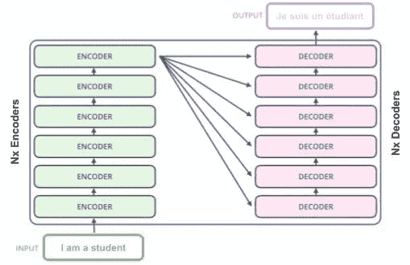

图 1:变压器架构的总体概述—左边的图像是简化的形式([来源](http://jalammar.github.io/illustrated-transformer/))，右边的图像是详细的架构([来源](https://arxiv.org/pdf/1706.03762.pdf))

# 深入了解变压器

本节通过解释输入产生输出的步骤，详细介绍变压器的不同组件。

> 在本文中，我们考虑了使用 transformer 将英语翻译成法语的经典示例。输入句子是这样的“我是学生”，预期输出是“我是学生”。

## 编码器

我们将从仔细观察编码器开始，并发现每一步都发生了什么。

***输入*** 原始数据是一个英文文本，然而，与任何其他模型一样，转换器不理解英语，因此，文本被处理以将每个单词转换成唯一的数字 ID。这是通过使用特定的词汇表来完成的，该词汇表可以从训练数据中生成，并将每个单词映射到一个数字索引。

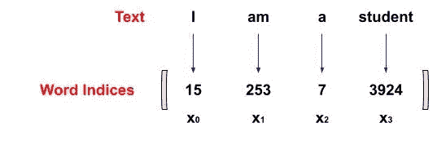

图 2:原始文本的数字表示(图片由作者提供)

***嵌入层***

如同在其他模型中一样，转换器使用学习的嵌入将输入令牌转换成 d = 512 维的向量。在训练期间，模型更新向量中的数字，以更好地表示输入令牌。

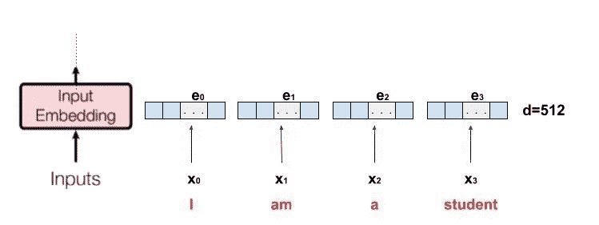

图 3:嵌入层对 d=512 的嵌入(图片由作者提供)

***位置编码***

将转换器与以前的序列模型区别开来的一个方面是，它不按顺序接受输入嵌入；相反，它一次接受所有的嵌入。这允许并行化并显著减少培训时间。然而，缺点是它丢失了与单词顺序相关的重要信息。为了使模型保持单词顺序的优势，位置编码被添加到输入嵌入中。由于位置编码和嵌入是相加的，所以它们都具有相同的维数 d = 512。有不同的方法来选择位置编码；转换器的创建者使用正弦和余弦函数来获得位置编码。在偶数维指数上应用正弦公式，在奇数维指数上应用余弦公式。图 4 显示了用于获得位置编码的公式。

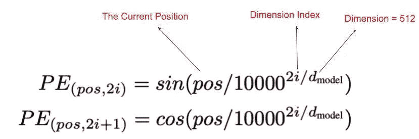

图 4:位置编码公式([来源](https://arxiv.org/pdf/1706.03762.pdf))

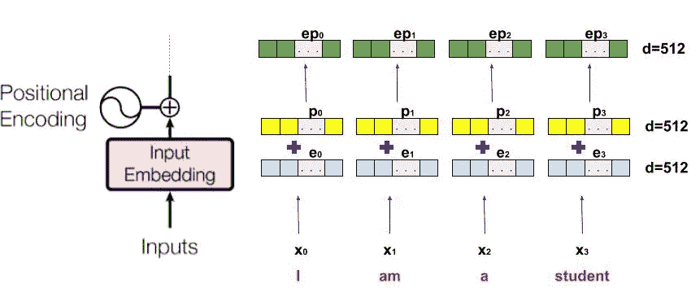

图 5:将位置编码添加到嵌入中以生成位置嵌入(ep)

***多头关注层——自我关注***

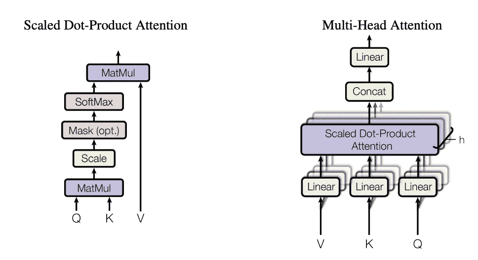

图 6:多头关注层([来源](https://arxiv.org/pdf/1706.03762.pdf))

在本节中有两个术语需要说明，*自我关注*和*多头。*

*自我关注:*

我们将从什么是自我关注以及如何应用自我关注开始。自我注意的目标是通过创建每个输入单词的基于注意的向量来捕捉句子中单词之间的上下文关系。基于注意力的向量有助于理解输入句子中的每个单词与句子中的其他单词(以及单词本身)的相关程度。

应用图 6 左侧所示的标度点积注意力来计算基于注意力的向量。下面是如何从位置嵌入创建这些向量的详细解释。

第一步是获得查询(Q)、键(K)和值(V)。这是通过将位置嵌入的相同副本传递给三个不同的线性图层来实现的，如下图所示。

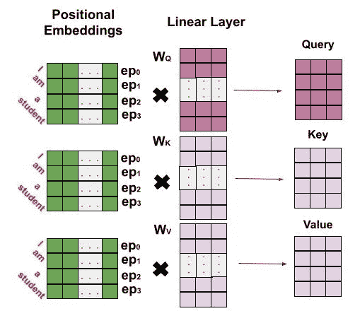

图 7:生成查询、键和值(作者图片)

第二步是从查询(Q)和键(K)中创建一个注意力过滤器。注意力过滤器将指示每个单词在每个位置被关注的程度。它是通过应用图 8 中的公式创建的。

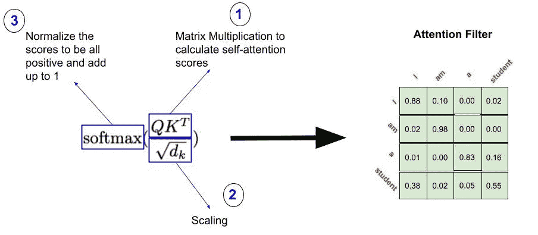

图 8:从查询(Q)和键(K)生成关注过滤器(图片由作者提供)

最后，为了获得基于注意力的矩阵(自我注意力层的最终输出)，在注意力过滤器和先前生成的值(V)矩阵之间进行矩阵到矩阵乘法(matmul)。产生下面的最终公式:

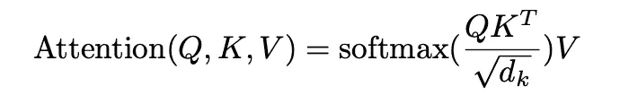

图 9:比例点产品关注度([来源](https://arxiv.org/pdf/1706.03762.pdf)

*多头注意:*

如图 6 的右侧所示，比例点积注意(即自我注意)不仅应用一次，而且应用多次(在原始论文中应用了 8 次)。目标是为同一个单词生成几个基于注意力的向量。这有助于模型在一个句子中有不同的单词关系表示。

从不同的头部生成的不同的基于注意力的矩阵被连接在一起，并通过线性层以将大小缩回到单个矩阵的大小。

***残差连接，添加&范数和*前馈网络**

从图 1 中可以看出，该架构包括剩余连接(RC)。剩余连接的目标是通过允许旧信息绕过多头关注层来避免这些信息丢失。因此，位置嵌入被添加到多头注意力的输出，然后在将其传递到常规前馈网络之前被归一化(Add & Norm)。

## 解码器

解码器端与编码器端有许多共享组件。因此，本节不会像上一节那样详细。解码器和编码器的主要区别在于，解码器接受两个输入，并两次应用多头注意力，其中一个被“屏蔽”。此外，解码器中的最终线性层的大小(即，单元的数量)等于目标字典(在这种情况下是法语字典)中的单词数量。每个单元将被分配一个分数；softmax 用于将这些分数转换为概率，表示每个单词出现在输出中的概率。

***输入***

解码器接受两个输入:

1.  编码器的输出—这些是解码器执行多头关注(图 1 中的第二个多头关注)的键(K)和值(V)。在这个多头注意力层中，查询(Q)是被掩蔽的多头注意力的输出。
2.  输出文本向右移动—这是为了确保特定位置“I”处的预测只能依赖于小于 I 的位置(参见图 10)。因此，解码器将在位置 I 处要预测的实际字之前接收所有已经预测的字(位置 0 到 i-1)。注意，传递到解码器的第一个生成的字是令牌<start>，预测过程继续，直到解码器生成特殊的结束令牌<eos>。</eos></start>

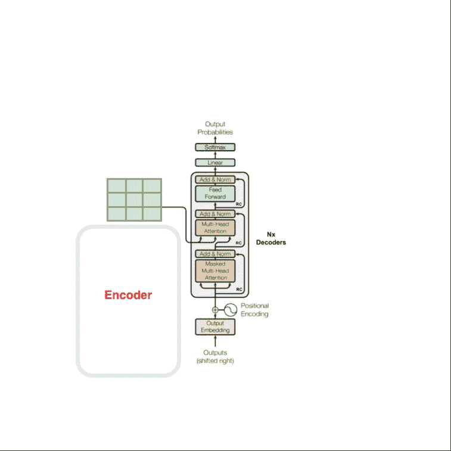

图 10:在推理阶段，输出右移作为解码器的输入(图片由作者提供)

***蒙面多头注意***

掩蔽的多头注意的过程类似于常规的多头注意。唯一的区别是，在将矩阵 Q 和 K 相乘并对它们进行缩放之后，在应用 softmax 之前，会在生成的矩阵上应用一个特殊的遮罩(参见图 6 左图-遮罩选项)。).目标是使文本中特定位置“I”处的每个单词只关注文本中的每一个其他位置，直到包括其当前位置(位置 0 直到位置 I)。这在训练阶段很重要，因为当预测位置 i+1 处的单词时，模型将只关注该位置之前的所有单词。因此，I 之后的所有位置都会被屏蔽，并在传递给 softmax 运算之前设置为负无穷大，从而导致注意力滤波器中出现 0(见图 11)。

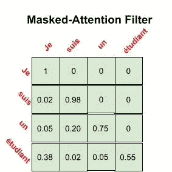

图 11:屏蔽注意力过滤器(作者图片)

# 结论

Transformer 模型是一种深度学习模型，已经在该领域存在了五年，并且已经产生了几个顶级性能和最先进的模型，如 BERT 模型。鉴于它在自然语言处理领域的主导地位及其在计算机视觉等其他领域的不断扩大的用途，理解它的体系结构是很重要的。本文涵盖了转换器的不同组件，并强调了它们的功能。

# 重要资源

[注意力是你所需要的全部(A. Vaswani 等人，2017)](https://arxiv.org/pdf/1706.03762.pdf)

[《图解变压器》(J. Alammar，2018)](http://jalammar.github.io/illustrated-transformer/)