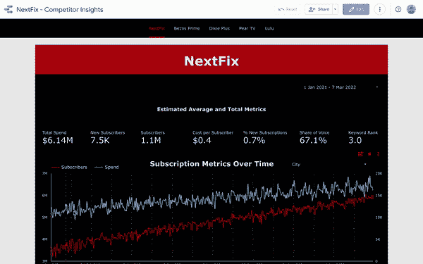
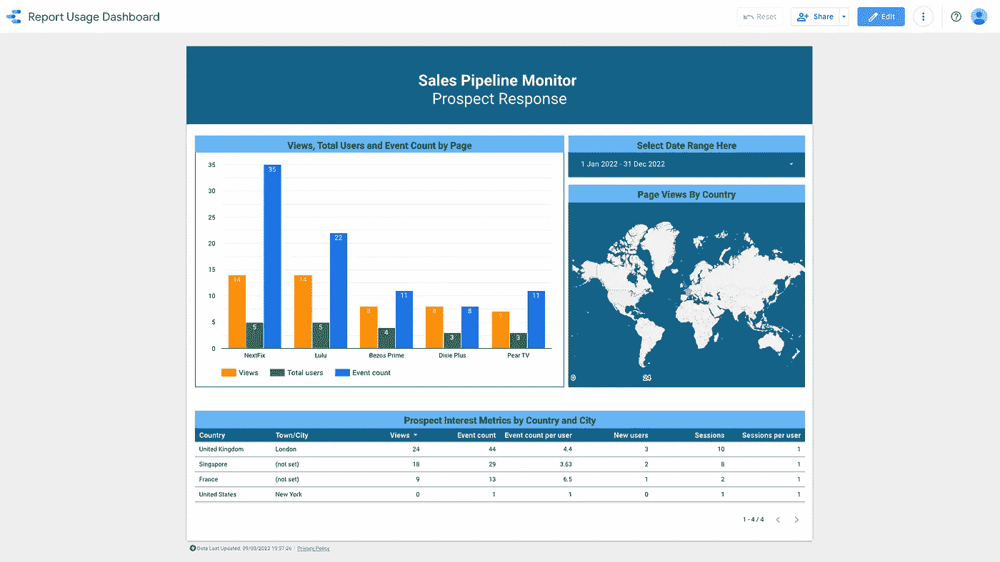

# 通过 Google Analytics 和 Data Studio 扩大销售渠道

> 原文：<https://towardsdatascience.com/augmenting-a-sales-pipeline-with-google-analytics-and-data-studio-c19e484c43fc>

## 找出你的潜在客户感兴趣的东西

照片由 [Pexels](https://www.pexels.com/photo/person-writing-on-notebook-669615/?utm_content=attributionCopyText&utm_medium=referral&utm_source=pexels) 的 [Lukas](https://www.pexels.com/@goumbik?utm_content=attributionCopyText&utm_medium=referral&utm_source=pexels) 拍摄

T 他的文章概述了一个将谷歌分析标签嵌入数据工作室仪表板的过程，并以这样一种方式构建所述仪表板，以帮助销售渠道/推销/提案请求。这一过程适用于任何使用数据作为向潜在客户推销的一部分的企业，只要这些数据至少有一个有意义的类别，可以根据这个类别进行细分。

到本文结束时，你将有一个清晰的方法来量化你的潜在客户对你所提供的产品的主要喜欢/不喜欢——然后你可以将它融入到你对他们的推销中。

> **一种清晰的方法，用于量化潜在客户对你所提供产品的主要喜好/厌恶**

**先决条件:**

*   谷歌账户/访问 Data Studio 的方式
*   谷歌分析/通用分析属性
*   可以按照某种有意义的类别/维度进行划分的数据，以及潜在客户感兴趣的数据

这个过程最好用一个例子来解释。我创造了一个假想的场景，我们是一家数字广告公司，正试图赢得一家大型流媒体服务公司 NextFix 的业务。在这种情况下，我们有关于他们的业务以及他们的 4 个竞争对手的数据。我们的销售团队想知道他们最关心 4 个竞争对手中的哪一个，以及他们是否特别担心自己的品牌表现。我们将发送给他们的仪表盘是我们最初推介的一部分，如下所示。

*我们对数据进行分类的类别是流媒体服务——尽管它很容易被归类为国家或关键词等。*

流媒体服务与主要竞争对手—按作者划分的仪表板

在我们构建了想要与 NextFix 共享的仪表板之后，我们只需要在其中设置 Google Analytics 标签，这样我们就可以看到 NextFix 客户端是如何使用它的。

> 谷歌分析标签可以在管理>属性>数据流中找到，更多指导可以在[这里](https://support.google.com/analytics/answer/9539598)找到。

一旦有了标签，只需要将它粘贴到报告中，如下面的 GIF 所示。

> 文件>报告设置>谷歌分析测量 id。

但是请记住，仪表盘中的数据可能需要 24 小时才能显示在您的 Google Analytics 中。检查一切工作正常的一个简单的解决方案是在一个窗口中查看报告，然后在另一个窗口中查看 Google Analytics 的实时报告——希望您能看到自己！

向 Data Studio 报告添加 g a 标签 GIF by Author

现在一切都设置好了，我们只需要将仪表板发送给 NextFix 客户端，我们将能够在 Google Analytics 中看到他们感兴趣的部分。

我们甚至可以将该报告的使用数据导入到另一个 Data Studio 仪表板中(您可以在这里使用[和](https://datastudio.google.com/reporting/7b1c8c55-c758-4219-aab4-2d133c3f316e))，这在您开始扩展流程并希望跟踪多个潜在客户的兴趣时特别有用。

从下面的图片中我们可以看到，NextFix 查看了他们自己的页面，并与 Lulu 页面进行了最多的交互。我们的销售团队可以看到这一点，并认为宣传贝佐斯 Prime、Dixie Plus 或 Pear TV 的威胁不会像宣传 Lulu 的威胁那样有效。我们还可以看到，伦敦办事处比纽约办事处更加积极。

***我们已经找出了客户最担心的主要竞争对手，以及与我们的推介最密切相关的 NextFix office。***

销售渠道监视器—按作者分类的图片

# **最终想法**

将 GA 标签嵌入 Data Studio 仪表板的过程非常通用，可以进行调整以适应各种业务的销售宣传。你所需要的只是一些你认为你的潜在客户会感兴趣的数据，一个有意义的分解数据的维度，以及一个谷歌分析属性。

它实现起来既快速又轻松，而且易于扩展。因此，如果你想知道你的潜在客户对你的商业产品有什么样的看法，试一试吧！

**临时演员**

*   如果你不希望内部流量污染你的谷歌分析数据(即只看到来自你的潜在客户的数据)，那么你可以很容易地设置一个内部 IP 过滤器按照步骤概述[这里](https://support.google.com/analytics/answer/1034840?hl=en)。
*   您可能会发现 Google Analytics 的默认页面标题维度在 Data Studio 中使用起来有点笨拙。我更喜欢在 Data Studio 的页面标题维度上使用本地 REGEXP_EXTRACT 函数来创建定制维度。
    这使您的页面标题尺寸更加简洁，如果您将页面扩展到多个类别，也可以让您以不同的粒度级别查看页面，例如，不仅仅是品牌、竞争对手 1、竞争对手 2，还包括品牌美国、竞争对手 1 美国等。您可以自定义维度，按国家或品牌/竞争对手类别查看使用情况。
*   本文的所有数据都是模拟的。流媒体服务业务数据是根据美国 25 个最大城市的人口规模和各种虚拟数据生成过程组成的。Google Analytics 查看数据是使用匿名 windows 创建的，并在不同位置设置了 VPN。