# 增强深度学习的图像

> 原文：<https://towardsdatascience.com/augmenting-images-for-deep-learning-3f1ea92a891c>

## 使用 Python 通过翻转、调整亮度、颜色抖动和随机噪声来增加数据

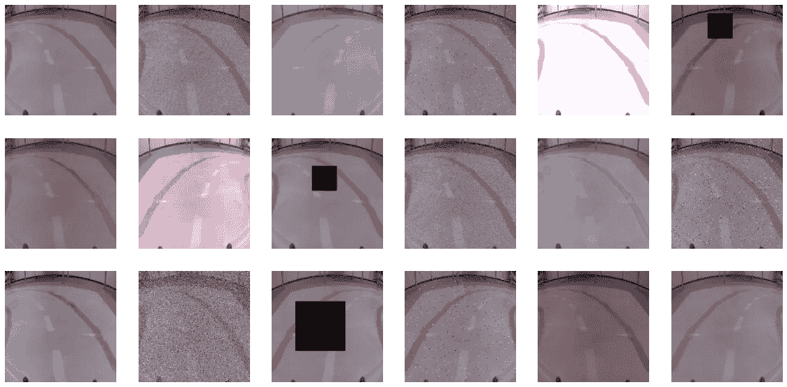

(来源:作者)

数据收集既费时又费钱，说实话还很无聊。当我们收集数据的能力有限时，数据扩充可以发挥重要作用。它可以帮助我们建立一个更强大的数据集，减少过度拟合，增加训练数据量。

我们将讨论数据扩充及其好处。我们也将保持实事求是。那就是通过遍历用于增强图像的 Python 代码。具体来说，我们将讨论如何进行这些扩充:

*   翻转图像
*   调节亮度
*   随机颜色抖动
*   随机噪声(高斯、椒盐和删除)

最后，我们将讨论增强图像的最佳实践。特别是，如何最好地验证我们的模型并在生产中测试它。

## 用例—自动化汽车

为了保持有趣，我们将为自动驾驶汽车增加图像。你可以在**图 1** 中看到我们的意思。汽车前面有一个摄像头，一个模型使用这些图像进行预测。这些预测然后被用来指导汽车。

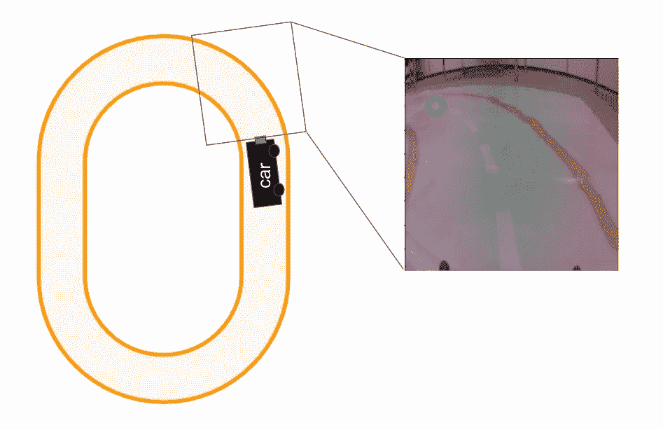

图 1:装有摄像头传感器自动汽车(来源:作者)

我们的目标是让赛车绕着赛道行驶，同时保持在橙色线内。在这个过程中，我们将讨论哪些增强对于这个特定的应用程序有意义。这是为了强调围绕数据扩充的选择需要一些批判性思维。

# 收集可靠的数据集

在我们开始之前，有必要讨论一下数据收集。这是因为数据扩充是收集可靠数据集的替代或补充方法。

## 什么是稳健数据集？

稳健数据集是反映模型预期运行的所有条件的数据集。这些条件由照明条件、摄像机角度、房间颜色或背景中的物体等变量决定。在这样的数据集上训练将产生一个对这些变量的变化有弹性的模型。

> 稳健数据集=稳健模型

一个很好的例子来自我们对自动汽车的体验。我们收集数据，训练模型，并部署它。它完美地工作了！直到我们打开百叶窗…

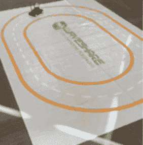

图 2:在不同条件下努力表现的模型

阳光从轨道上反射回来，把模型“弄糊涂了”。在这种情况下，它无法做出准确的预测。换句话说，该模型对光照条件的变化并不鲁棒。

## 如何收集可靠的数据集

构建强大的数据集始于良好的数据收集策略。你需要考虑所有会影响条件的变量。然后你需要收集数据来捕捉这些变量的变化。例如，对于不同的照明条件，我们可以:

*   开灯和关灯
*   打开和关闭百叶窗
*   在一天的不同时间收集数据

其他变量是图像背景的不同方面。这包括墙壁和地毯的颜色以及背景中不同的物体。为了说明这些，我们可以:

*   在不同的房间收集数据
*   将不同的对象移到背景中

随着这些变化，我们正在做的是向我们的数据集添加噪声。希望模型将学会忽略这种噪音，只使用轨道进行预测。换句话说，我们希望模型使用真正的原因，而不是关联。

# 数据扩充的好处

数据扩充是指我们使用代码系统地或随机地改变图像。这允许我们人为地引入噪声并增加数据集的大小。实际上，目标与数据收集是一样的，因此好处是相似的。

## 构建强大的数据集

通常我们会受到可以收集多少数据的限制。在这种情况下，数据扩充有助于提高数据集的稳健性。即使您已经设法收集了大量数据，增强也可以提供额外的一层健壮性。

不过，要做到这一点，我们需要批判性地思考扩增的类型。也就是说，它们应该模拟我们期望在真实世界中看到的条件。例如，稍后我们将看到如何调整图像的亮度来模拟不同的照明条件。

## 减少对一组条件的过度拟合

通过良好的扩充，我们可以减少过度拟合。需要明确的是，这不同于过度适应训练集。以**图 3** 为例。假设，我们只在一个房间里收集数据。因此，该模型将背景中的对象与左转的预测相关联。

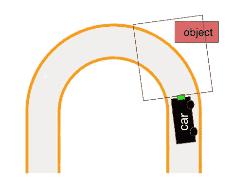

图 3:过度适应房间中的对象(来源:作者)

这个物体会出现在我们收集的所有图像中。这意味着它将出现在训练、验证甚至测试集中。该模型可以在所有这些集合上执行得很好，但是在生产中仍然执行得很差。例如，如果我们移走物体，它可能会变得“混乱”,不能左转。换句话说，模型过度适应了我们数据集中反映的条件。

数据扩充有助于这种类型的过度拟合。稍后，我们将看到删除像素对上面的例子有什么帮助。也就是说，我们可以人为地从背景中去除物体。

## 模型收敛

我们可以用多种不同的方式来增强同一个图像。这可能会人为地扩大数据集的规模。考虑到深度学习需要大型数据集，这可以帮助模型参数的收敛。

# 用 Python 扩充数据

好了，记住所有这些，让我们继续实际增加数据。我们会检查代码，你也可以在 [GitHub](https://github.com/conorosully/medium-articles/blob/master/src/image_tools/image_augmentation.ipynb) 上找到这个项目。

首先，我们将使用下面的导入。我们有一些标准包装(第 2-3 行)。 **Glob** 用于处理文件路径(第 5 行)。我们还有一些用来处理图像的包(第 8-11 行)。

```
#Imports 
import numpy as np
import matplotlib.pyplot as plt

import glob
import random

import torchvision.transforms as transforms
import matplotlib.image as mpimg
from PIL import Image, ImageEnhance
import cv2
```

如前所述，我们将增强用于自动驾驶汽车的图像。你可以在 [Kaggle](https://www.kaggle.com/datasets/conorsully1/jatracer-images?select=object_detection) 上找到这些例子。这些图像都是 224 x 224 像素。我们用下面的代码显示其中的一个。

记下图像名称(第 3 行)。前两个数字是 224 x 224 帧内的 x 和 y 坐标。在**图 4** 中，你可以看到我们用绿色圆圈显示了这些坐标(第 11 行)。

```
read_path = "../../data/images/"

name = "32_50_c78164b4-40d2-11ed-a47b-a46bb6070c92.jpg"

#Get x,y coordinates from name
x = int(name.split("_")[0])
y = int(name.split("_")[1])

#Load image and add circle for coordinates
img = mpimg.imread(read_path + name)
cv2.circle(img, (x, y), 8, (0, 255, 0), 3)

plt.imshow(img)
```

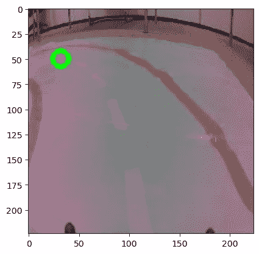

图 4:示例图片(来源:作者)

这些坐标是目标变量。该模型使用这些图像来尝试预测它们。这个预测然后被用来指导汽车。在这种情况下，你可以看到汽车即将左转。理想的方向是朝着绿圈给出的坐标走。

## 翻转图像

假设我们在逆时针方向上收集了一堆图像(即仅左转)。如果我们想让汽车右转，我们必须收集更多的数据。或者，由于我们的轨道是对称的，我们可以在 x 轴上翻转图像。

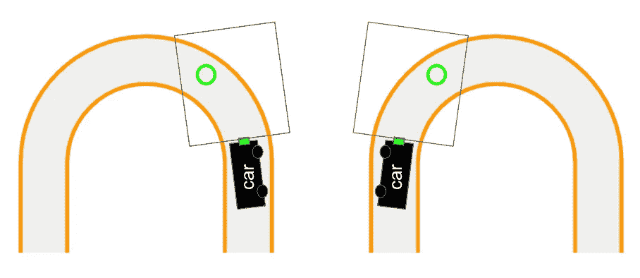

图 5:翻转对称轨道(来源:作者)

我们使用 **flip_img** 函数来实现这一点。请记住，在水平轴上翻转时，x 坐标也需要调整。我们在第 9 行从 224(图像宽度)中减去当前坐标。你可以在**图 6** 中看到这个函数的结果。

```
def flip_img(name,img):
    """Invert image and target on x axis"""

    # flip image
    img = cv2.flip(img,1)

    # flip target variable
    s = name.split("_")
    s[0] = str(224 - int(s[0]))
    name = "_".join(s)

    return name, img 
```

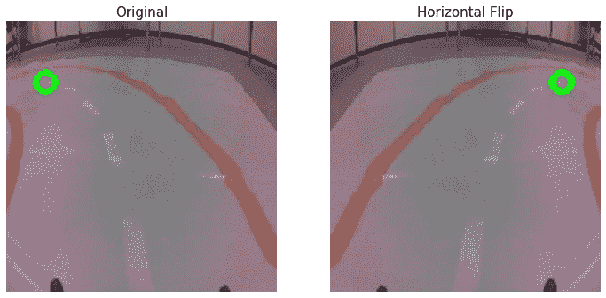

图 6:水平翻转(来源:作者)

即使你已经收集了两个方向的数据，翻转图像也是有意义的。这允许我们将数据集的大小加倍。但是垂直翻转呢？

对于某些应用，这可能是有意义的。对于我们的自动驾驶汽车来说……没那么多。看一下**图 7** 。垂直翻转意味着汽车将在天花板上行驶。除非我们在太空中驾驶，否则这不是我们在生产中预期的情况。

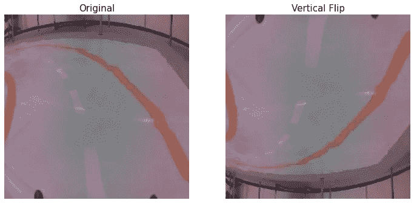

图 7:垂直翻转(来源:作者)

## 调整亮度

通过 **adjust_brightness** ，我们可以使用 **factor** 参数来改变图像的亮度。查看**图 8** ，如果我们增加因子(1.5)，图像会更亮。类似地，当系数小于 1 时，图像会变暗。

```
def adjust_brightness(img,factor=1):
    """
    Invert image on x axis
        factor: <1 will decrease brightness and >1 will increase brightness
    """
    img = Image.fromarray(img)

    enhancer = ImageEnhance.Brightness(img)
    img = enhancer.enhance(factor)

    return img
```

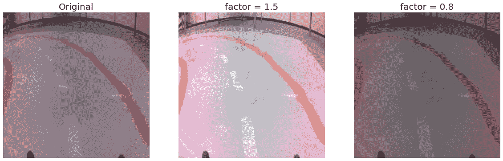

图 8:调整亮度(来源:作者)

这个功能可以帮助我们模拟不同的光照条件。我们可以看到，如果我们在数据收集期间开灯和关灯，我们会得到类似的结果。

## 颜色抖动

我们可以使用**抖动**功能进一步扩大这些类型。这将随机改变图像的亮度、对比度、饱和度和色调。使用这些参数，我们可以定义这些方面的变化程度。你可以在**图 9** 中看到一些例子。这些是使用默认参数值创建的。

```
def jitter(img, b=0.2, c=0.2, s=0.2, h=0.1):
    """
    Randomly alter brightness, contrast, saturation, hue within given range
    """

    img = Image.fromarray(img)

    transform = transforms.ColorJitter(
    brightness=b, contrast=c, saturation=s, hue=h)

    # apply transform
    img = transform(img)

    return img
```

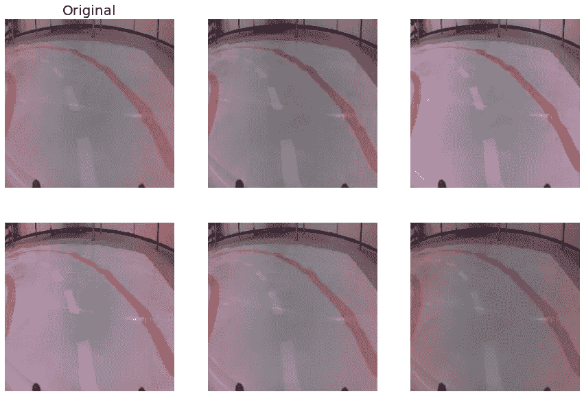

图 9:抖动增强(来源:作者)

同样，您需要考虑这些扩充对您的应用程序是否有意义。你可以看到，默认情况下，我们将色调因子设置为 0.1(即 h=0.1)。如图**图 10** 所示，较高的色调因子会返回具有不同色彩轨迹的图像。然而，在生产中，我们的轨道将始终是橙色的。

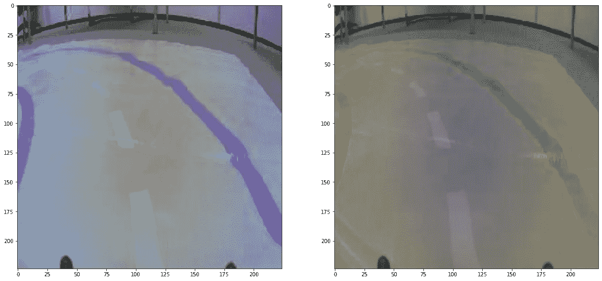

图 10:色调=0.5 时的抖动(来源:作者)

我们还应该考虑这些类型的转换的局限性。他们调整整个图像的颜色。现实中，光照条件更复杂。阳光可以从不同的角度反射出赛道。轨道的某些部分可能比其他部分更暗。如果你真的想捕捉这种噪音，你必须做好数据收集工作。

## 输入噪声

一种不太系统的方法是随机引入噪声。你可以在图 11 中看到一些例子。在每种情况下，我们都能够调整引入的噪声量。

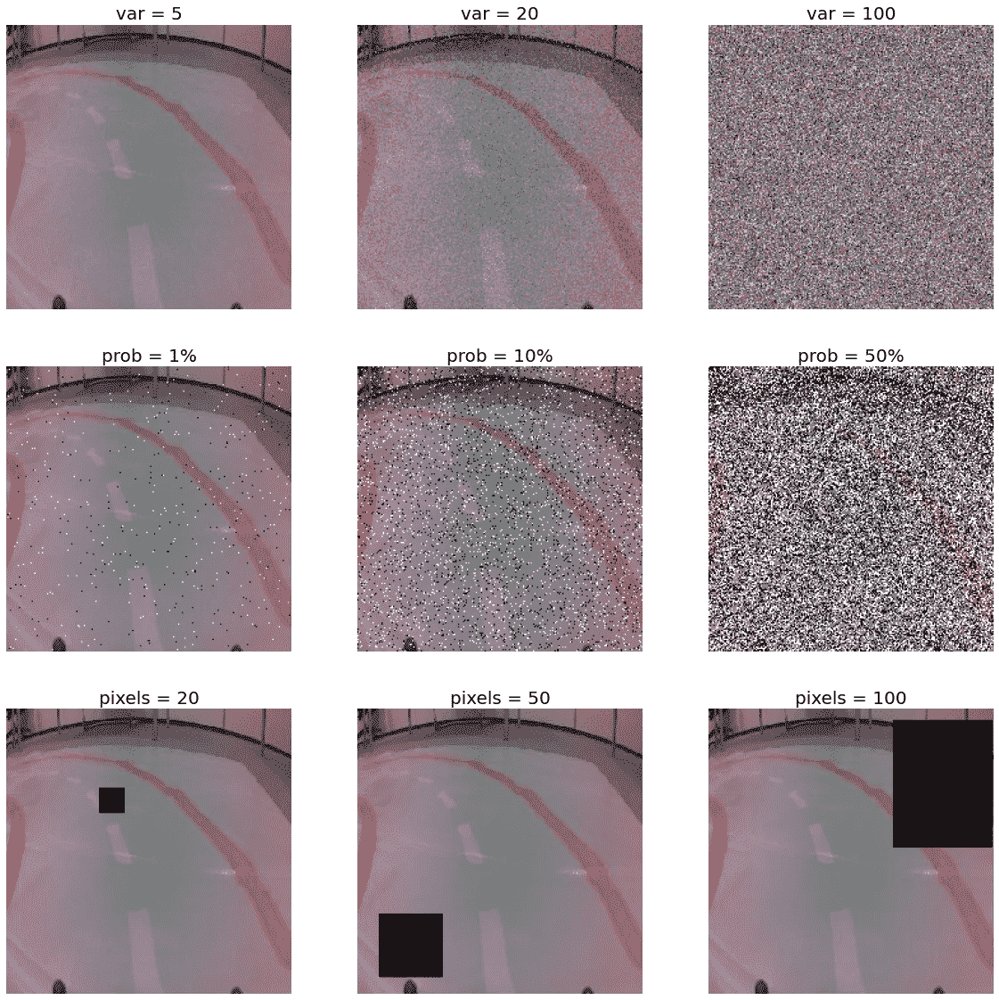

图 11:噪音(来源:作者)

在进行这些放大时，请记住，我们 224 x 224 图像中的每个像素都有 3 个通道——R、G、b。每个通道可以取 0 到 255 之间的值。这些决定了像素的颜色。

图 11 中的第一行是使用 **gaussian_noise** 函数创建的。我们创建一个与图像(第 4-5 行)具有相同尺寸(224 x 224 x 3)的随机噪声阵列。这个数组中的每个元素将从均值为 0 的正态分布和给定的方差( **var** )中采样。将此添加到图像中会随机调整 R、G、B 通道。

```
def gaussian_noise(img,var=5):
    """Add guassian noise to image"""

    dims = np.shape(img)
    noise = np.random.normal(0,var,size=dims).astype("uint8")

    img = img + noise

    return img
```

**sp_noise** 功能的工作方式类似。除了现在我们以给定的概率( **prob** )随机改变像素为黑色或白色。您可以在图 11 中的第二排看到这一点。

```
def sp_noise(img,prob=0.1):
    """Add salt and pepper noise to image"""

    height,width,channels = np.shape(img)
    img = np.array(img)

    #Iterate over all pixels
    for i in range(height):
        for j in range(width):
            #Randomly change pixel values
            if random.random()<prob:
                if random.random() < 0.5:
                    img[i][j] = np.array([255,255,255]) #white
                else:
                    img[i][j] = np.array([0,0,0]) #black

    img = Image.fromarray(img)

    return img
```

高斯和椒盐噪声具有降低图像质量的效果。在生产中，模型可以使用不同质量的图像进行预测。这些扩充有助于创建一个对这些变化具有鲁棒性的模型。

delete_square 函数是添加噪声的另一种方法。它的工作原理是删除大块的图像。更具体地说，它将一个给定尺寸的随机正方形(**像素**)变成黑色。图 11 的最后一行给出了示例。

```
def delete_square(img,pixels=20):
    """Delete random square from image"""

    img = np.array(img)
    h,w,channels = np.shape(img)

    #Random starting pixel
    rh = random.randint(0,h)
    rw = random.randint(0,w)

    sub = round(pixels/2)
    add = pixels-sub

    #Boundries for square
    hmin = max(rh-sub,0)
    hmax = min(rh+add,h-1)
    vmin = max(rw-sub,0)
    vmax = min(rw+add,w-1)

    # Turn pixel within range black
    img[hmin:hmax,vmin:vmax] = np.array([0,0,0])

    img = Image.fromarray(img)
    return img
```

删除也有助于建立一个更健壮的模型。在进行预测时，模型可能会关注某个特定的特征。例如，我们的模型可能只使用外部橙色车道。删除部分图像将强制模型使用多个特征。因此，如果某个特征发生了变化，模型仍然能够做出准确的预测。

虽然耗时，与删除，你可能要采取更系统的方法。即排除图像的特定部分。你可以在**图 12** 中看到这一点。这里我们已经从背景中删除了椅子。这是因为模型不会将其与右转相关联。

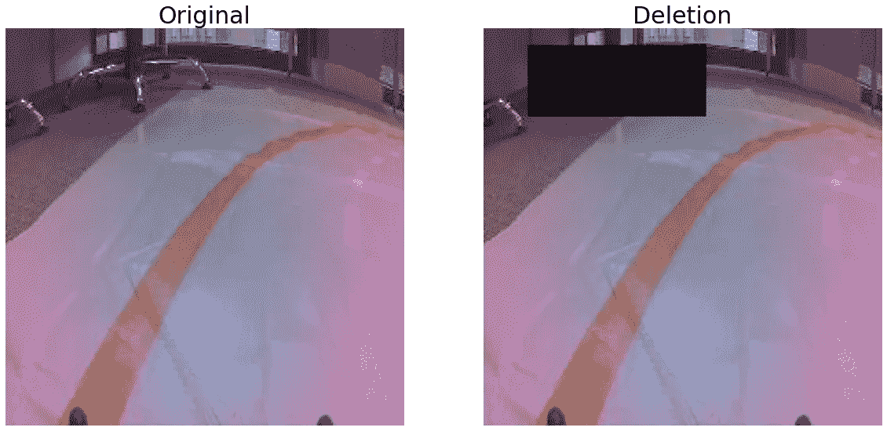

图 12:系统删除(来源:作者)

# 测量增强的效果

所以我们已经看到了不同类型的增强。我们也看到了如何改变其中一些的水平。实际上，类型和级别可以被视为一个超参数。当调谐这些是重要的是要记住一些事情。

## 不要扩充测试集

假设我们扩充整个数据集，并进行训练和测试分割。这可能会导致高估模型的性能。这是因为过度适应训练集不一定会导致测试集的性能不佳。

以我们在**图 8** 中看到的亮度增强为例。其中一些可能在训练中结束，而另一些可能在测试集中结束。现在考虑同样的事情会发生在其他的增强上。您可以看到测试集看起来与训练集非常相似。


图 8:调整亮度(来源:作者)

事实上，最好不要增加测试集。这是因为测试集用于评估模型在生产中的性能。这里，不期望模型对扩充数据进行预测。

## 测试集中没有反映所有条件

同时，您需要考虑到您的测试集并不健壮。因此，良好的测试性能并不意味着生产中的良好性能。这是因为您的模型可能会面临测试集中没有捕捉到的情况。因此，为了真正理解增强的影响，我们需要在生产中测试它们。

这让我们陷入了一个棘手的境地。生产环境中的测试非常耗时，并且您无法在所有环境中进行测试。这意味着不可能测量扩增的效果。最终，您将需要批判性地思考什么样的增强适合您的应用程序。领域知识和经验可能更好地表明什么会起作用。

我希望你喜欢这篇文章！你可以成为我的 [**推荐会员**](https://conorosullyds.medium.com/membership) **:)** 来支持我

[](https://conorosullyds.medium.com/membership)  

| [推特](https://twitter.com/conorosullyDS) | [YouTube](https://www.youtube.com/channel/UChsoWqJbEjBwrn00Zvghi4w) | [时事通讯](https://mailchi.mp/aa82a5ce1dc0/signup) —注册免费参加 [Python SHAP 课程](https://adataodyssey.com/courses/shap-with-python/)

## 资料组

**JatRacer 图片** (CC0:公共领域)[https://www.kaggle.com/datasets/conorsully1/jatracer-images](https://www.kaggle.com/datasets/conorsully1/jatracer-images)

## 参考

H.Naveed，**调查:用于数据扩充的图像混合和删除**(2021)[https://arxiv.org/abs/2106.07085](https://arxiv.org/abs/2106.07085)

Gaudenz Boesch，**2022 年计算机视觉的图像数据增强** **【指南】**[https://viso . ai/Computer-Vision/Image-Data-Augmentation-for-Computer-Vision](https://viso.ai/computer-vision/image-data-augmentation-for-computer-vision/#:~:text=Image%20augmentation%20algorithms%20include%20geometric,learning%2C%20and%20neural%20style%20transferring)

**如何在 PyTorch 中随机更改图像的亮度、对比度、饱和度和色调**(2022)[https://www . geeks forgeeks . org/How-to-random-change-the-brightness-contrast-saturation-and-hue-of-an-image-in-py torch/](https://www.geeksforgeeks.org/how-to-randomly-change-the-brightness-contrast-saturation-and-hue-of-an-image-in-pytorch/)

C.Shorten & T.M. Khoshgoftaar，**深度学习的图像数据增强调查**(2019)[https://journalofbigdata . springer open . com/articles/10.1186/s 40537-019-0197-0](https://journalofbigdata.springeropen.com/articles/10.1186/s40537-019-0197-0)

Jason Brownlee，**用噪声训练神经网络以减少过拟合**(2019)[https://machine learning mastery . com/Train-Neural-Networks-With-Noise-to-Reduce-over fitting/](https://machinelearningmastery.com/train-neural-networks-with-noise-to-reduce-overfitting/)