# Python 中的自动 MLBox 包概述

> 原文：<https://towardsdatascience.com/auto-ml-in-python-an-overview-of-the-mlbox-package-66668c6b1bfb>

## 了解 MLBox，针对 python 中的分类问题快速高效地训练自动化机器学习管道

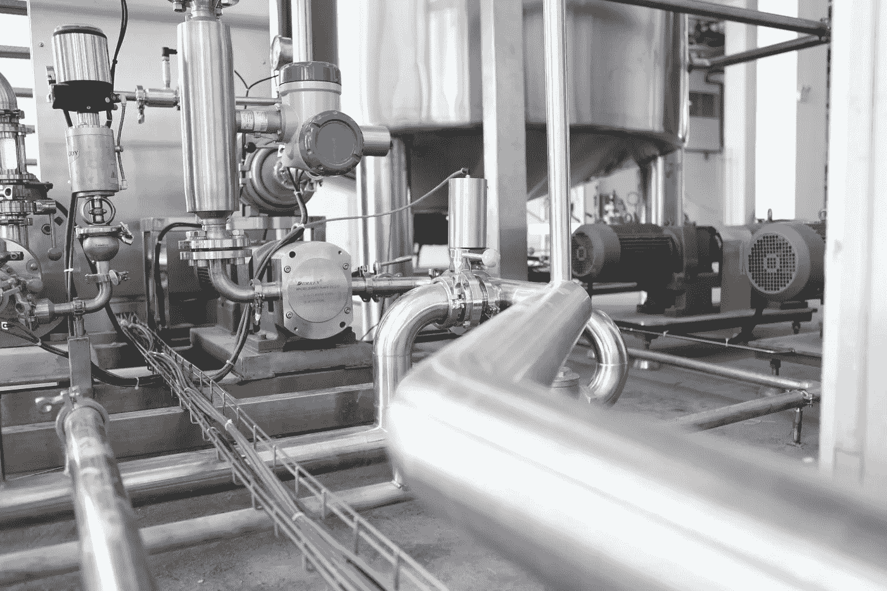

[郭锦恩](https://unsplash.com/@spacexuan?utm_source=unsplash&utm_medium=referral&utm_content=creditCopyText)在 [Unsplash](https://unsplash.com/?utm_source=unsplash&utm_medium=referral&utm_content=creditCopyText) 上拍照

今天的帖子很特别。它是与 Axel De Romblay 合作编写的，他是 MLBox Auto-ML 软件包的作者，该软件包在过去几年中广受欢迎。

如果你还没有听说过这个库，那就去 Github 上看看吧:它包含了一些有趣的特性，正在变得越来越成熟，现在正在积极开发中。

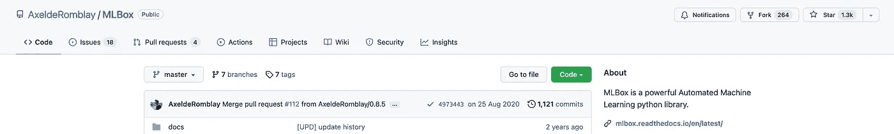

MLBox

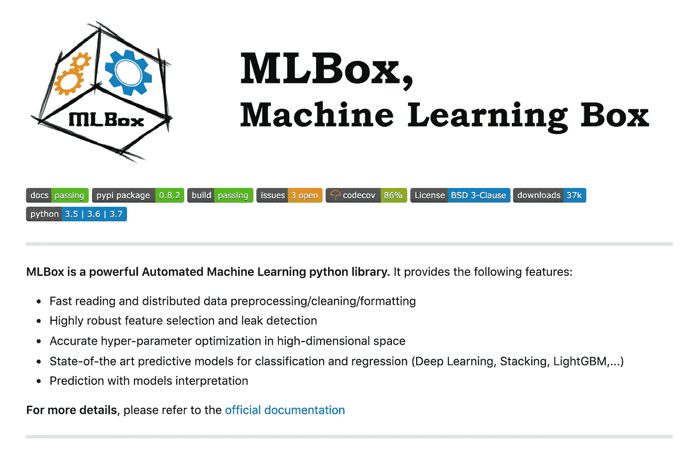

回购

在本帖中，我们将向您展示如何轻松地使用它来训练自动机器学习管道来解决分类问题。它将首先加载和清理数据，消除漂移，启动一个强大的加速优化管道，并生成预测。

我们开始吧！🚀

# MLBox 简介

MLBox 已经在许多机器学习会议上展示过。你可以在这里查看其中一张幻灯片。这是一个很好的开始，让我们对更一般的 AutoML 概念的库有一个总体的了解。

MLBox 的幻灯片分享[演示](https://www.slideshare.net/AxeldeRomblay/mlbox)

# 2 —下载训练和测试数据集

在这本笔记本中，我们将解决著名的泰坦尼克号卡格尔[挑战](https://www.kaggle.com/c/titanic/)，其中包括根据乘客的属性(性别、年龄、姓名等)预测他们的存活率。

如果你不熟悉这个比赛，你可以查看这篇文章。

现在让我们下载数据:

## 如果你有账户的话

如果您有一个 Kaggle 帐户，您可以在您的个人资料页面上生成一个 API 令牌:

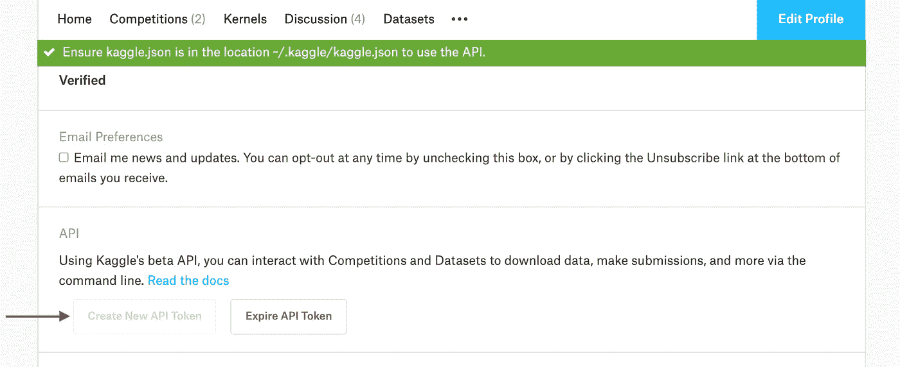

[卡格尔](https://www.kaggle.com/)

一旦生成了 API 令牌，您的系统上就会下载一个 kaggle.json，其中包含您的用户名和密钥。

*   如果您使用的是基于 Unix 的操作系统，请将该文件放在~/中。kaggle/然后

```
chmod 600 ~/.kaggle/kaggle.json
```

*   如果您在 Windows 机器上:

```
export KAGGLE_USERNAME=<your-username>
export KAGGLE_KEY=<your-key>
```

## 来自互联网:

确保您安装了 wget:`pip install wget`

然后将 train.csv 和 test.csv 放在项目根目录下的`data`文件夹中。

# 3 —环境设置和从 PyPI 安装 MLBox

建议创建一个 conda 虚拟环境，因为 MLBox 包含几个依赖项，可能会与您当前的库混淆。拥有一个干净的虚拟环境是正确的解决方案，如果出现任何问题，您可以在不影响系统的情况下将其删除。

```
conda create -n automl python=3.7
```

这就创建了一个名为 **automl** 的环境，其中预配置了 python 3.7。

如果你像我一样在 OSX 上，你必须通过 brew 安装 **OpenMP** (开放式多处理)，这是多线程的有效实现:

```
(base) brew install libomp
```

现在激活 automl 并直接从 PyPI 安装 MLBox:

```
(base) source activate automl
(automl) pip install mlbox
```

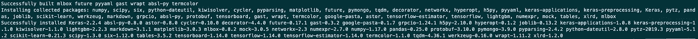

原创[博文](https://www.ahmedbesbes.com/blog/introduction-to-mlbox)

如你所见，MLBox 有相当多的依赖项，如 scikit-learn、pandas 等。这就是为什么我们创建了一个空的虚拟环境。

## [可选]:从 Jupyter 访问 automl 内核。

如果你想在这种环境下使用 jupyter notebook，而不是激活它，而是从基本的 jupyter 下拉列表中选择内核；你必须安装 **ipykernel** :

```
(automl) conda install ipykernel
```


图片由作者修改

现在你可以走了！

# 4 —测试 MLBox:从数据摄取到模型构建

现在我们将测试并运行 MLBox，快速构建一个模型来解决 Kaggle Titanic 挑战。

有关软件包和 API 文档的更多信息，请访问以下链接:

*   官方知识库:[https://github.com/AxeldeRomblay/MLBox](https://github.com/AxeldeRomblay/MLBox)
*   官方文件:[https://mlbox.readthedocs.io/en/latest/](https://mlbox.readthedocs.io/en/latest/)

## 正在导入 MLBox

```
Using TensorFlow backend. CPU times: user 2.42 s, sys: 740 ms, total: 3.16 s
Wall time: 4.04 s
```

## MLBox 的输入

如果你有一个 train 和一个测试集，就像在任何 Kaggle 比赛中一样，你可以将这两个路径直接提供给 MLBox 以及目标名称。

否则，如果只输入一个训练集，MLBox 将创建一个测试集。

## 读取和预处理

MLBox 的 Reader 类负责准备数据。

它提供方法和实用程序来:

1.  使用正确的分隔符(CSV、XLS、JSON 和 h5)读入数据并加载
2.  通过以下方式清理数据:

*   删除未命名的列
*   推断列类型(float，int，list)
*   处理日期并从中提取相关信息:年、月、日、星期、小时等。
*   删除重复项
*   准备列车和测试分离

更多信息请点击:[https://ml box . readthe docs . io/en/latest/features . html # ml box . preprocessing . reader](https://mlbox.readthedocs.io/en/latest/features.html#mlbox.preprocessing.Reader)

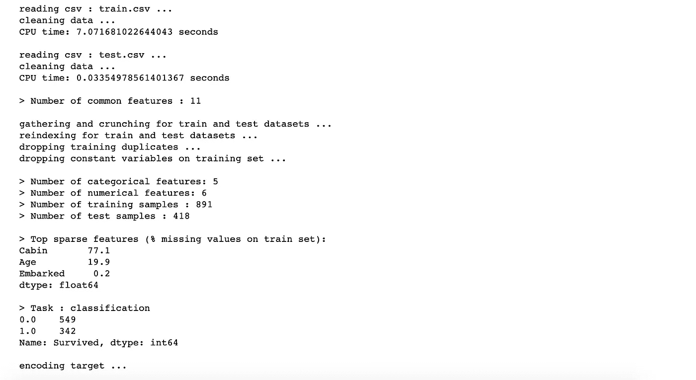

原创[博文](https://www.ahmedbesbes.com/blog/introduction-to-mlbox)

当这个函数完成运行时，它创建一个名为`save`的文件夹，将目标编码器转储到这个文件夹中以备后用。

```
df["train"].head()
```

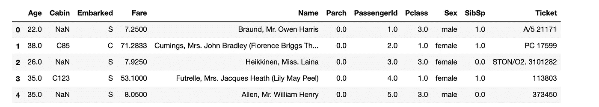

原创[博文](https://www.ahmedbesbes.com/blog/introduction-to-mlbox)

## 消除漂移

这是我在其他包里没遇到过的创新功能。主要思想是自动检测和移除在训练集和测试集之间具有显著不同分布的变量。

这种情况经常发生，我们通常会谈到有偏差的数据。例如，您可能会遇到这样的情况:列车组中有年轻人，而测试组中只有老年人。这表明年龄特征不是健壮的，并且可能导致模型在测试时的不良性能。所以它必须被丢弃。

更多信息:

*   关于算法:[https://github . com/AxeldeRomblay/ml box/blob/master/docs/webinars/features . pdf](https://github.com/AxeldeRomblay/MLBox/blob/master/docs/webinars/features.pdf)
*   关于 MLBox 实现:[https://ml box . readthe docs . io/en/latest/features . html # ml box . preprocessing . drift _ thresholder](https://mlbox.readthedocs.io/en/latest/features.html#mlbox.preprocessing.Drift_thresholder)

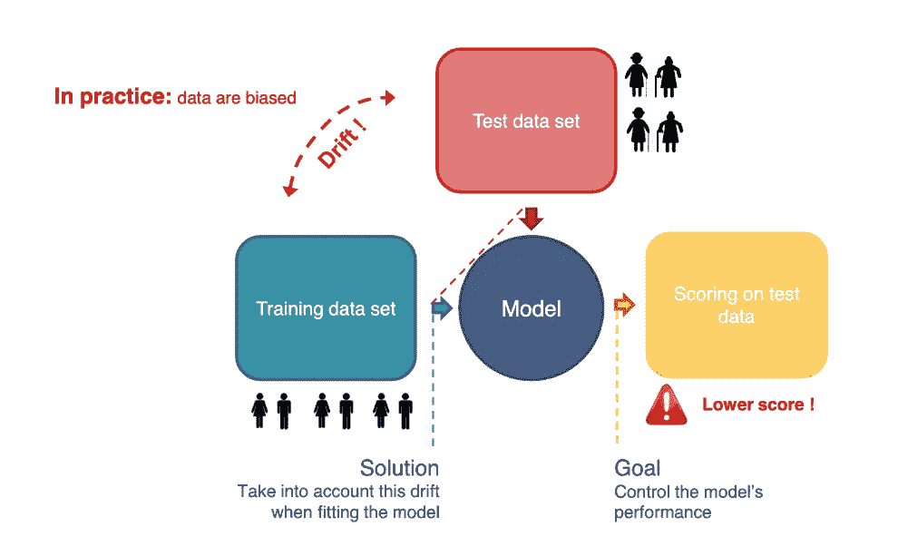

图片由作者修改

## MLBox 如何计算单个变量的漂移

MLBox 构建了一个分类器，将训练与测试数据分开。然后，它使用与该分类器相关的 ROC 分数作为漂移的度量。

这是有道理的:

*   如果漂移分数高(即 ROC 分数高)，则从测试数据中辨别训练数据的能力很容易，这意味着两种分布非常不同。
*   否则，如果漂移分数低(即 ROC 分数低)，则分类器不能正确地分离两种分布。

MLBox 提供了一个名为 Drift_thresholder 的类，它将训练集和测试集以及目标作为输入，并计算每个变量的漂移分数。

Drift_thresholder 然后删除漂移分数高于阈值(默认为 0.6)的变量。

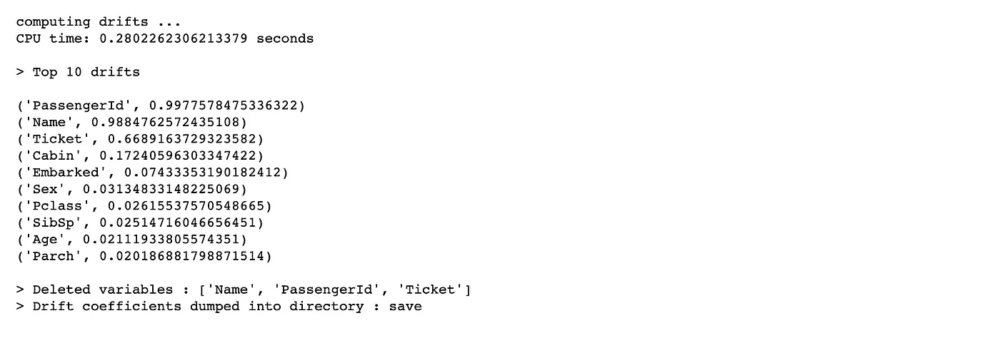

原[博文](https://www.ahmedbesbes.com/blog/introduction-to-mlbox)

正如你在这里看到的，`Name`、`PassengerId`和`Ticket`因为他们各自的漂移分数而被移除。如果你仔细想想，这一点也不奇怪，因为这些变量，鉴于它们的性质，可以有任何随机值，从而导致它们的训练和测试分布之间的似是而非的漂移。

## 重担:优化

此部分执行管道的优化，并尝试不同的参数配置:

*   NA 编码器(缺失值编码器)
*   CA 编码器(分类特征编码器)
*   功能选择器(可选)
*   堆叠估计器—特征工程师(可选)
*   估计器(分类器或回归器)

更多详情请点击:[https://ml box . readthe docs . io/en/latest/features . html # ml box . optimization . optimizer](https://mlbox.readthedocs.io/en/latest/features.html#mlbox.optimisation.Optimiser)

我们首先实例化优化器类:

```
opt = Optimiser()
```

然后，我们可以使用默认的模型配置来运行它，而不需要任何 autoML 或复杂的网格搜索。

这应该是第一个基线

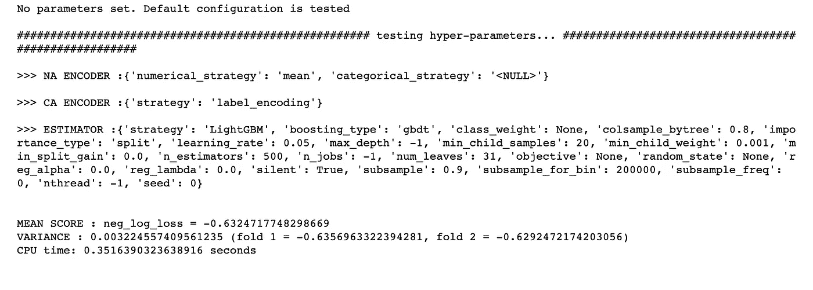

原创[博文](https://www.ahmedbesbes.com/blog/introduction-to-mlbox)

负*对数*损失= -0.6325 作为第一基线。

现在让我们定义一个多种配置的空间:

*   ne__numerical_strategy:如何处理数字特征中的缺失数据
*   ce__strategy:如何处理分类变量编码
*   fs:功能选择
*   堆叠:元功能堆叠器
*   估计值:最终估计值

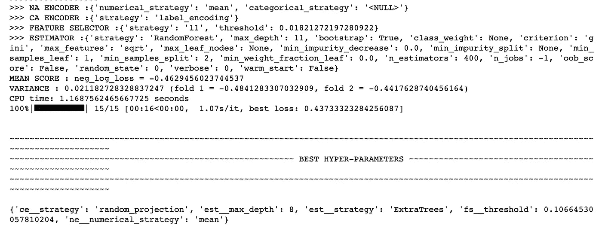

现在让我们来评估这个模型:

```
opt.evaluate(params, df)
```

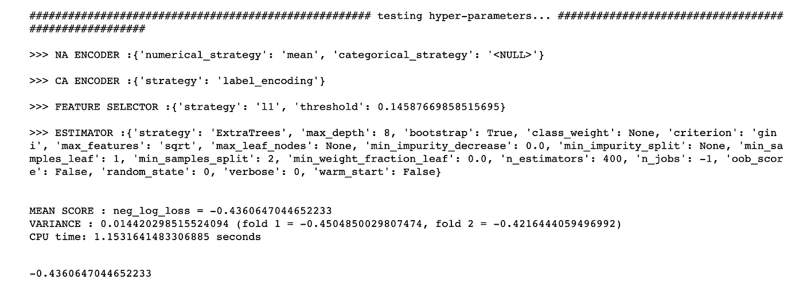

原创[博文](https://www.ahmedbesbes.com/blog/introduction-to-mlbox)

运行此管道导致了更高的 neg 损失，这是更好的。

如果我们定义一个更好的搜索或堆叠操作空间，也许还有其他的特征选择技术，就有很大的潜力可以进一步改进。

# 5-运行预测

现在，我们拟合最佳管道并预测我们的测试数据集。

更多详情请点击:[https://ml box . readthe docs . io/en/latest/features . html # ml box . prediction . predictor](https://mlbox.readthedocs.io/en/latest/features.html#mlbox.prediction.Predictor)

# 6 —结论

运行自动化 AutoML 管道从未如此简单。使用 MLBox，您可以快速高效地完成这项工作，以便在解决业务问题时可以专注于重要的事情。

*   理解问题
*   获取和整合正确的数据
*   形式化性能指标以达到和计算

让我们希望这三个第一步不会很快自动化:)

我们希望你喜欢这个图书馆。不要犹豫，在 G [ithub](https://github.com/AxeldeRomblay/MLBox) 上给它一颗星，或者向它的贡献者报告一个[问题](https://github.com/AxeldeRomblay/MLBox/issues)。

## 新到中？你可以每月订阅 5 美元，并解锁各种主题的无限文章(技术、设计、创业……)你可以通过点击我的推荐链接[来支持我](https://ahmedbesbes.medium.com/membership)

[](https://ahmedbesbes.medium.com/membership)  

由 [Unsplash](https://unsplash.com?utm_source=medium&utm_medium=referral) 上的 [Karsten Winegeart](https://unsplash.com/@karsten116?utm_source=medium&utm_medium=referral) 拍摄