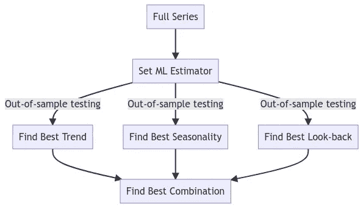
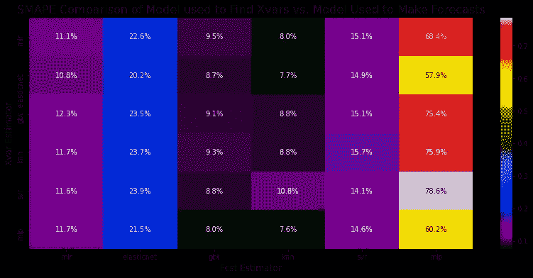

# 基于 ML 技术的时间序列自动模型描述

> 原文：<https://towardsdatascience.com/auto-model-specification-with-ml-techniques-for-time-series-e7b9a90ae9d7>

## 如何使用 Python 库 scalecast 自动选择时间序列的最佳趋势、季节和自回归表示


照片由[杰克·希尔斯](https://unsplash.com/@jakehills?utm_source=medium&utm_medium=referral)在 [Unsplash](https://unsplash.com?utm_source=medium&utm_medium=referral) 拍摄

根据所采用的模型，有几种方法可以找到时间序列的最佳模型规格。对于 arIMA 模型，一种流行的方法是在搜索不同的 AR、I 和 MA 订单时监控信息标准。这已经被证明是一种有效的技术，流行的库 [R](https://www.rdocumentation.org/packages/forecast/versions/8.5/topics/auto.arima) 和 [Python](https://alkaline-ml.com/pmdarima/modules/generated/pmdarima.arima.auto_arima.html) 提供了自动 ARIMA 模型供用户试验。类似的方法可以用于其他经典的统计时间序列方法，如霍尔特-温特斯指数平滑和 TBATS。

对于机器学习模型来说，它可以稍微复杂一些，除了复杂的深度学习模型(如 [N-Beats](https://unit8co.github.io/darts/examples/07-NBEATS-examples.html) 、 [N-HiTS](https://unit8co.github.io/darts/generated_api/darts.models.forecasting.nhits.html?highlight=n%20hits) 和其他几个)，没有多少自动化的纯 ML 方法持续优于经典模型(Makridakis 等人，2020)。

Python 库 [scalecast](https://github.com/mikekeith52/scalecast) 提供了一个名为 `[auto_Xvar_select()](https://scalecast.readthedocs.io/en/latest/Forecaster/Forecaster.html#src.scalecast.Forecaster.Forecaster.auto_Xvar_select)`的[函数，可以使用来自](https://scalecast.readthedocs.io/en/latest/Forecaster/Forecaster.html#src.scalecast.Forecaster.Forecaster.auto_Xvar_select) [scikit-learn](http://scikit-learn.org) 的模型自动选择任何给定系列的最佳趋势、季节性和回望表示(或滞后)。

```
pip install --upgrade scalecast
```

该函数的工作方式是首先搜索时间序列给定趋势的理想表示，然后是季节性，然后是回望，所有这些都是分别进行的。“理想”在这种情况下意味着使用选定的模型(默认为多元线性回归，或 MLR)最小化一些样本外误差(或最大化 R2)。在分别找到这些中的每一个之后，搜索所有上述表示的理想组合，并选择考虑不规则周期和用户认为合适的其他回归量。



按作者分类的图片 scalecast 如何使用 auto_Xvar_select()函数为预测模型自动选择回归量

这是一个有趣的功能。当应用于 M4 竞赛的 100，000 系列时，它返回具有不同准确度的结果，这取决于系列的频率。对于每小时频率组，使用 KNN、LightGBM 和 XGBoost 模型均可获得低于 0.6 的 OWA，其中使用默认 MLR 模型搜索这些模型的表示。就背景而言，这意味着这些模型的表现有望超过一个简单的模型，其季节性调整平均超过 40%(1–0.6)。这是一个非常可靠的结果，与 sktime 在同一系列中使用纯 ML 方法发布的结果相当(Loning 等人，2019)。

```
**# evaluate the hourly series
for** i **in** tqdm(Hourly**.**index):
    y **=** Hourly**.**loc[i]**.**dropna()
    sd **=** info**.**loc[i,'StartingDate']
    fcst_horizon **=** info**.**loc[i,'Horizon']
    cd **=** pd**.**date_range(
        start **=** sd,
        freq **=** 'H',
        periods **=** len(y),
    )
    f **=** Forecaster(
        y **=** y,
        current_dates **=** cd,
        future_dates **=** fcst_horizon,
    )

    f**.**set_test_length(fcst_horizon)
    f**.**integrate(critical_pval**=**.99,max_integration**=**1)
    f**.**set_validation_length(fcst_horizon)
    f**.**set_validation_metric('mae')
    **if** len(f**.**y) **>** 300:
        f**.**auto_Xvar_select(
            monitor**=**'LevelTestSetMAE',
            max_ar **=** 48,
            exclude_seasonalities **=** [
              'quarter',
              'month',
              'week',
              'day',
            ]
        )
        f**.**determine_best_series_length(
            monitor**=**'LevelTestSetMAE',
            step**=**50,
            min_obs **=** 300,
        )
    **else**:
        f**.**auto_Xvar_select(
            monitor**=**'LevelTestSetMAE',
            irr_cycles **=** [168], *# weekly*
            exclude_seasonalities **=** [
              'quarter',
              'month',
              'week',
              'day',
              'dayofweek',
            ],
            max_ar **=** 24,
        )
    f**.**tune_test_forecast(
        models,
        error**=**'ignore',
    )
```

查看用于在 M4 系列[此处](https://github.com/mikekeith52/scalecast-examples/blob/main/m4/01%20-%20evaluate_models.ipynb)运行所有带有 scalecast 的模型的笔记本，以及用于在相同过程中评估每个模型性能的笔记本[此处](https://github.com/mikekeith52/scalecast-examples/blob/main/m4/02%20-%20evaluate_accuracy.ipynb)。

我的问题是，在`auto_Xvar_select()`函数中使用不同于缺省值的估计量是否能导致持续更好的结果。以这种方式搜索模型规格可能很耗时，但使用 MLR 来做通常不会使事情变慢太多，这就是为什么它是该功能的默认设置。

不幸的是，这是一个漫长的过程来充分研究。为了简化流程，我将模型限制为:

*   多元线性回归
*   弹性网
*   梯度增强树(GBT)
*   k-最近邻(KNN)
*   支持向量机
*   多级感知器(MLP)

这些模型中的每一个都被用来寻找代表和预测，尝试了所有的组合。我也只对每个模型使用默认参数，尽管我相信用网格搜索来调整它们可以显著提高性能。最后，我只使用了从小时组的 414 个系列中随机选择的 50 个样本。即使做了这些修改，这个过程在我的 Windows 电脑上运行了 17 个多小时。由此产生的预测通过各自的平均[对称平均绝对百分比误差(SMAPE)](https://scalecast.readthedocs.io/en/latest/Forecaster/Util.html#src.scalecast.util.metrics.smape) 性能进行评估，这是 M4 竞赛中用于评估模型的指标之一。在这里找到完整的笔记本。

```
for i in tqdm(Hourly.index):
    y = Hourly.loc[i].dropna()
    sd = info.loc[i,'StartingDate']
    fcst_horizon = info.loc[i,'Horizon']
    cd = pd.date_range(
        start = sd,
        freq = 'H',
        periods = len(y),
    )
    f = Forecaster(
        y = y,
        current_dates = cd,
        future_dates = fcst_horizon,
    )
    f.set_test_length(fcst_horizon)
    f.integrate(critical_pval=.99,max_integration=1)
    for xvm in models:
        for fcstm in models:
            f2 = f.deepcopy()
            f2.auto_Xvar_select(
                estimator = xvm,
                monitor='LevelTestSetMAE',
                max_ar = 48,
                exclude_seasonalities = [
                  'quarter',
                  'month',
                  'week',
                  'day'
                ],
            )
            f2.set_estimator(fcstm)
            f2.proba_forecast(dynamic_testing=False) if fcstm in (
                'mlp','gbt','xgboost','lightgbm','rf'
            ) else f2.manual_forecast(dynamic_testing=False)
            point_fcst = f2.export('lvl_fcsts')[fcstm]
            results.loc[xvm,fcstm] += metrics.smape(
                Hourly_test.loc[i].dropna().to_list(),
                point_fcst.to_list(),
            )
```

这引出了几个值得观察的有趣观点:

*   在衡量实际预测准确性时，KNN 和 GBT 模型始终优于其他模型，无论哪个模型用于搜索最佳序列表示。这并不奇怪，因为这些是整个 M4 每小时系列中表现最好的车型。
*   表现最差的模型是 SVR、ElasticNet 和 MLP，最好的模型和最差的模型平均相差 60.8(！！)个百分点。
*   在寻找理想的系列表现方面最好的模型是 ElasticNet 和 MLP，在这方面最好的和最差的模型之间只有 4 个百分点的差距。
*   平均而言，表现最好的模型组合是 KNN 模型和 MLP 模型。



作者图片

因此，从该实验中可以看出，用于进行预测的模型比用于寻找理想表示的模型对获得高精度更重要。不过，这两方面的最佳模式似乎也是相互颠倒的。寻找表征的最佳模型在预测方面表现不佳，反之亦然。弱估计量可能更依赖于找到理想的趋势、季节性和回顾性，甚至有机会做出好的预测，因此将弱估计量与强估计量结合起来找到最佳表示以实际做出预测是一个好主意。但是，这只是一个想法，还需要更多的研究来证实。

# 结论

很难找到一种完全自动化的机器学习技术来预测持续优于经典统计方法的情况。很多时候，最好的结果来自于不同的最大似然估计的组合。在这种情况下，我发现使用较弱的模型来寻找给定序列的理想趋势、季节性和回望表示，并将该表示与较强的模型相结合来进行预测，通常会在我测试的小时序列样本上获得最佳结果。所有这些方法都用样本外数据进行了测试，scalecast 软件包提供了一个非常简单的界面来执行这种分析。

# 链接

*   Scalecast: [Github](https://github.com/mikekeith52/scalecast) / [阅读文档](https://scalecast.readthedocs.io/en/latest/)
*   带 scalecast 的 M4 车型: [GitHub](https://github.com/mikekeith52/scalecast-examples/blob/main/m4/01%20-%20evaluate_models.ipynb)
*   用 scalecast 评估 M4 模型: [GitHub](https://github.com/mikekeith52/scalecast-examples/blob/main/m4/02%20-%20evaluate_accuracy.ipynb)
*   使用 scalecast 对 50 系列进行 Auto Xvar 实验: [GitHub](https://github.com/mikekeith52/scalecast-examples/blob/main/misc/auto_Xvar/auto_Xvar.ipynb) / [阅读文档](https://scalecast-examples.readthedocs.io/en/latest/misc/auto_Xvar/auto_Xvar.html)

# **作品引用**

马库斯·洛宁、安东尼·巴格纳尔、萨贾苏亚·加内什、维克多·卡萨科夫、杰森·莱恩斯和弗朗兹·基拉里。sktime:时间序列机器学习的统一接口。更正，abs/1909.07872，2019。网址[http://arxiv.org/abs/1909.07872.](http://arxiv.org/abs/1909.07872.)

斯皮罗斯·马克里达基斯、伊万杰洛斯·斯皮里奥蒂斯和瓦西里奥斯·阿西马科普洛斯。M4 竞赛:100，000 个时间序列和 61 种预测方法。国际预测杂志，36(1):54–74，2020。doi:10.1016/j . ijforecast . 2019 . URL[https://ideas.repec.org/](https://ideas.repec.org/)a/eee/int for/v36y 2020 i1p 54–74 . html